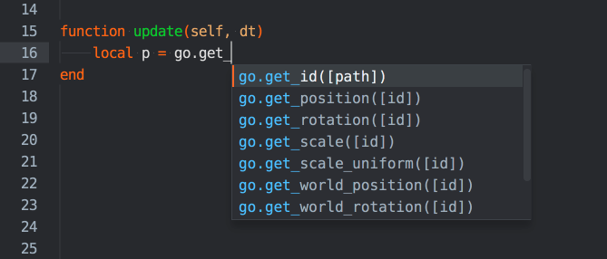

# Scripts

Script components allows you to create game logic using the [Lua programming language](/manuals/lua).


## Script types

There are three types of Lua script in Defold, each has different Defold libraries available.

Game Object scripts
: Extension _.script_. These scripts are added to game objects exactly like any other [component](/manuals/components) and Defold will execute the Lua code as part of the engine lifecycle functions. Game Object scripts are usually used to control game objects and the logic that binds the game together with level loading, game rules and so forth. Game Object scripts have access to the [GO](/ref/go) functions and all Defold library functions except the [GUI](/ref/gui) and [Render](/ref/render) functions.


GUI scripts
: Extension _.gui_script_. Run by GUI components and usually containing the logic required to display GUI elements like heads up displays, menus etc. Defold will execute the Lua code as part of the engine lifecycle functions. GUI scripts have access to the [GUI](/ref/gui) functions and all Defold library functions except the [GO](/ref/go) and [Render](/ref/render) functions.


Render scripts
: Extension _.render_script_. Run by the rendering pipeline and containing the logic required to render all app/game graphics each frame. The render script has a special place in the lifecycle of your game. Details can be found in the [Application lifecycle documentation](/manuals/application-lifecycle). Render scripts have access to the [Render](/ref/render) functions and all Defold library functions except the [GO](/ref/go) and [GUI](/ref/gui) functions.


## Script execution, callbacks and self

Defold executes Lua scripts as part of the engine lifecycle and exposes the lifecycle through a set of predefined callback functions. When you add a script component to a game object the script becomes part of the game object's and its component(s) lifecycle. The script is evaluated in the Lua context when it is loaded, then the engine executes the following functions and passes a reference to the current script component instance as parameter. You can use this `self` reference to store state in the component instance.

::: important
`self` is a userdata object that acts like a Lua table but you can't iterate over it with `pairs()` or `ipairs()` and you can't print it using `pprint()`.
:::

#### `init(self)`
Called when the component is initialized.

```lua
function init(self)
  -- These variables are available through the lifetime of the component instance
  self.my_var = "something"
  self.age = 0
end
```

#### `final(self)`
Called when the component is deleted. This is useful for cleaning up purposes, for instance if you have spawned game objects that should be deleted when the component is deleted.

```lua
function final(self)
  if self.my_var == "something" then
      -- do some cleanup
  end
end
```

#### `fixed_update(self, dt)`
Frame-rate independent update. Parameter `dt` contains the delta time since the last update. This function is called `0-N` times depending on a frame timing and the fixed update frequency. It is called only when `Physics`-->`Use Fixed Timestep` is enabled, and `Engine`-->`Fixed Update Frequency` is larger than 0 in *game.project*. Useful when you wish to manipulate physics objects at regular intervals to achieve a stable physics simulation.

```lua
function fixed_update(self, dt)
  msg.post("#co", "apply_force", {force = vmath.vector3(1, 0, 0), position = go.get_world_position()})
end
```

#### `update(self, dt)`
Called once each frame after `fixed_update` callback of all scripts (if Fixed Timestep is enabled). Parameter `dt` contains the delta time since the last frame.

```luadifferent
function update(self, dt)
  self.age = self.age + dt -- increase age with the timestep
end
```

#### `late_update(self, dt)`
Called once each frame after `update` callback of all scripts, but just before render. Parameter `dt` contains the delta time since the last frame.

```lua
function late_update(self, dt)
  go.set_position("/camera", self.final_camera_position)
end
```

#### on_message(self, message_id, message, sender)
When messages are sent to the script component through [`msg.post()`](/ref/msg#msg.post) the engine calls this function of the receiver component. Learn [more about message passing](/manuals/message-passing).

```lua
function on_message(self, message_id, message, sender)
    if message_id == hash("increase_score") then
        self.total_score = self.total_score + message.score
    end
end
```

#### `on_input(self, action_id, action)`
If this component has acquired input focus (see [`acquire_input_focus`](/ref/go/#acquire_input_focus)) the engine calls this function when input is registered. Learn [more about input handling](/manuals/input).

```lua
function on_input(self, action_id, action)
    if action_id == hash("touch") and action.pressed then
        print("Touch", action.x, action.y)
    end
end
```

#### `on_reload(self)`
This function is called when the script is reloaded through the hot reload editor function (<kbd>Edit ▸ Reload Resource</kbd>). It is very useful for debugging, testing and tweaking purposes. Learn [more about hot-reload](/manuals/hot-reload).

```lua
function on_reload(self)
  print(self.age) -- print the age of this game object
end
```


## Reactive logic

A game object with a script component implements some logic. Often, that logic is dependent on some external factor. An enemy AI might react to the player being within a certain radius from the AI; a door might unlock and open as a result of player interaction, etc, etc.

The `update()` function allows you to implement complex behaviors defined as a state machine running each frame---sometimes that is the adequate approach. But there is a cost associated with each call to `update()`. Unless you really need the function you should delete it and instead try to build your logic _reactively_. It is cheaper to passively wait for some message to trigger a response than it is to actively probe the game world for data to respond to. Furthermore, solving a design problem reactively also often leads to cleaner and more stable design and implementation.

Let's look at a concrete example. Suppose that you want a script component to send a message 2 seconds after it has been initiated. It should then wait for a certain response message and after receiving the response, it should send another message 5 seconds later. The non reactive code for that would look something like this:

```lua
function init(self)
    -- Counter to keep track of time.
    self.counter = 0
    -- We need this to keep track of our state.
    self.state = "first"
end

function update(self, dt)
    self.counter = self.counter + dt
    if self.counter >= 2.0 and self.state == "first" then
        -- send message after 2 seconds
        msg.post("some_object", "some_message")
        self.state = "waiting"
    end
    if self.counter >= 5.0 and self.state == "second" then
        -- send message 5 seconds after we received "response"
        msg.post("another_object", "another_message")
        -- Nil the state so we don’t reach this state block again.
        self.state = nil
    end
end

function on_message(self, message_id, message, sender)
    if message_id == hash("response") then
        -- “first” state done. enter next
        self.state = "second"
        -- zero the counter
        self.counter = 0
    end
end
```

Even in this quite simple case we get fairly tangled up logic. It's possible to make this look better with the help of coroutines in a module (see below), but let's instead try to make this reactive and use a built-in timing mechanism.

```lua
local function send_first()
	msg.post("some_object", "some_message")
end

function init(self)
	-- Wait 2s then call send_first()
	timer.delay(2, false, send_first)
end

local function send_second()
	msg.post("another_object", "another_message")
end

function on_message(self, message_id, message, sender)
	if message_id == hash("response") then
		-- Wait 5s then call send_second()
		timer.delay(5, false, send_second)
	end
end
```

This is cleaner and easier to follow. We get rid of internal state variables that are often hard to follow through the logic---and which might lead to subtle bugs. We also dispose of the `update()` function completely. That relieves the engine from calling our script 60 times a second, even if it's just idling.


## Preprocessing

It is possible to use a Lua preprocessor and special markup to conditionally include code based on the build variant. Example:

```lua
-- Use one of the following keywords: RELEASE, DEBUG or HEADLESS
--#IF DEBUG
local lives_num = 999
--#ELSE 
local lives_num = 3
--#ENDIF
```

The preprocessor is available as a build extension. Learn more about how to install and use it on the [extension page on GitHub](https://github.com/defold/extension-lua-preprocessor).


## Editor support

The Defold editor supports Lua script editing with syntax coloring and auto-completion. To fill out Defold function names, press *Ctrl+Space* to bring up a list of the functions matching what you are typing.


