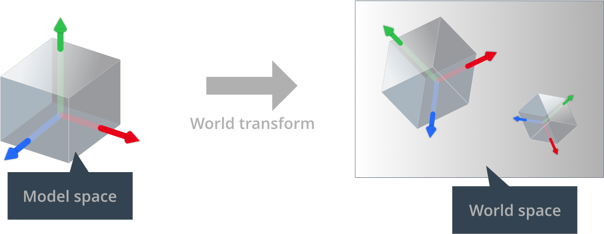
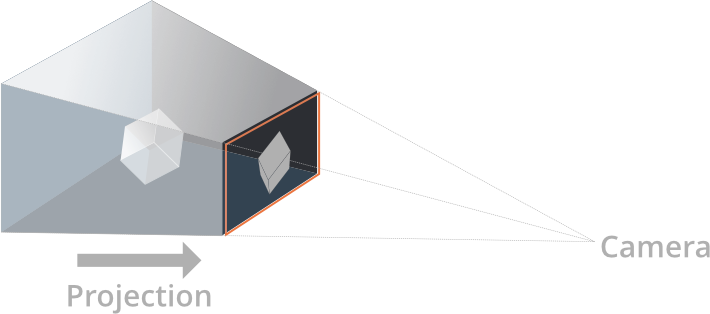
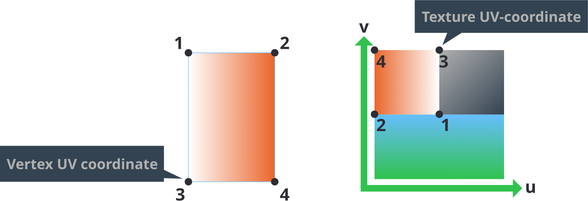
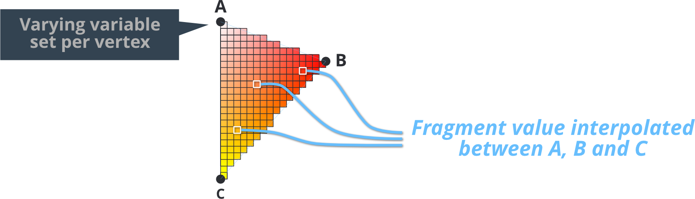
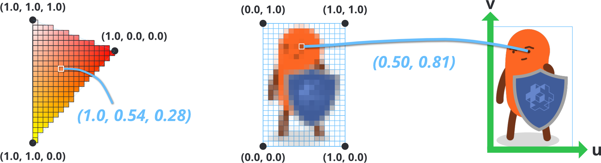
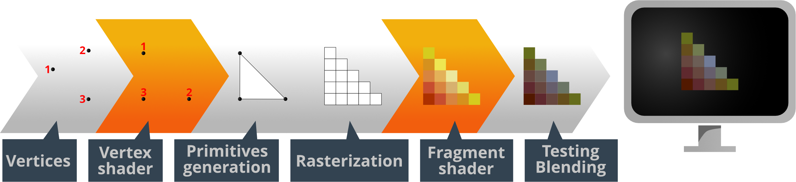
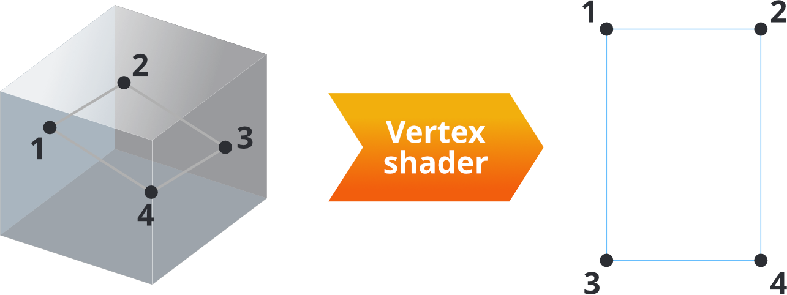
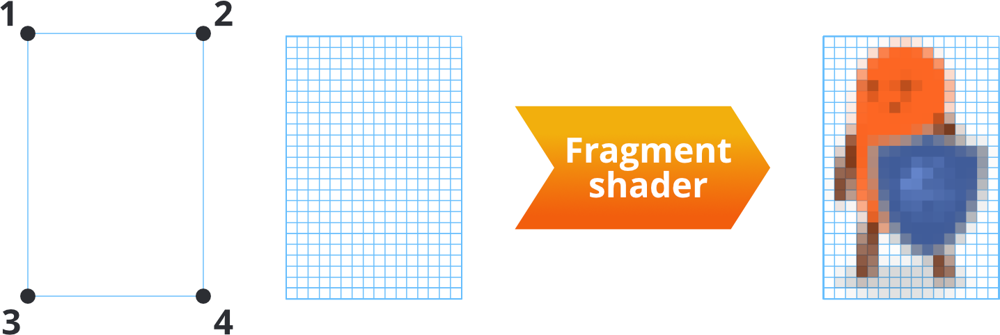

# Shaders

Shader programs are at the core of graphics rendering. They are programs written in a C-like language called GLSL (GL Shading Language) that the graphics hardware run to perform operations on either the underlying 3D data (the vertices) or the pixels that end up on the screen (the "fragments"). Shaders are used for drawing sprites, lighting 3D models, creating full screen post effects and much, much more.

This manual describes how Defold's rendering pipeline interfaces with GPU shaders. In order to create shaders for your content, you also need to understand the concept of materials, as well as how the render pipeline works.

* See the [Render manual](/manuals/render) for details on the render pipeline.
* See the [Material manual](/manuals/material) for details on materials.
* See the [Compute manual](/manuals/compute) for details on compute programs.

Specifications of OpenGL ES 2.0 (OpenGL for Embedded Systems) and OpenGL ES Shading Language can be found at [Khronos OpenGL Registry](https://www.khronos.org/registry/gles/).

Observe that on desktop computers it is possible to write shaders using features not available on OpenGL ES 2.0. Your graphics card driver may happily compile and run shader code that will not work on mobile devices.


## Concepts

Vertex shader
: A vertex shader cannot create or delete vertices, only change the position of a vertex. Vertex shaders are commonly used to transform the positions of vertices from the 3D world space into 2D screen space.

  The input of a vertex shader is vertex data (in the form of `attributes`) and constants (`uniforms`). Common constants are the matrices necessary to transform and project the position of a vertex to screen space.

  The output of the vertex shader is the computed screen position of the vertex (`gl_Position`). It is also possible to pass data from the vertex shader to the fragment shader through `varying` variables.

Fragment shader
: After the vertex shader is done, it is the job of the fragment shader to decide the coloring of each fragment (or pixel) of the resulting primitives.

  The input of a fragment shader is constants (`uniforms`) as well as any `varying` variables that has been set by the vertex shader.

  The output of the fragment shader is the color value for the particular fragment (`gl_FragColor`).

Compute shader
: A compute shader is a general purpose shader that can be used to perform any type of work on a GPU. It is not part of the graphics pipeline at all, compute shaders run in a separate execution context and is not dependent on input from any other shader.

  The input of a compute shader is constant buffers (`uniforms`), texture images (`image2D`), samplers (`sampler2D`) and storage buffers (`buffer`).

  The output of the compute shader is not explicitly defined, there is no specific output that needs to be produced as opposed to the vertex and the fragment shaders. As compute shaders are generic, it is up to the programmer to define what type of result the compute shader should produce.

World matrix
: The vertex positions of a model's shape are stored relative to the model's origin. This is called "model space". The game world, however, is a "world space" where the position, orientation and scale of each vertex is expressed relative to the world origin. By keeping these separate the game engine is able to move, rotate and scale each model without destroying the original vertex values stored in the model component.

  When a model is placed in the game world the model's local vertex coordinates must be translated to world coordinates. This translation is done by a *world transform matrix*, which tells what  translation (movement), rotation and scale should be applied to a model's vertices to be correctly placed in the game world's coordinate system.

  

View and projection matrix
: In order to put the vertices of the game world onto the screen, each matrix' 3D coordinates is first translated into coordinates relative to the camera. This is done with a _view matrix_. Secondly, the vertices are projected onto the 2D screen space with a _projection matrix_:

  

Attributes
: A value associated with an individual vertex. Attributes are passed to the shader by the engine and if you want to access an attribute you just declare it in your shader program. Different component types have a different set of attributes:
  - Sprite has `position` and `texcoord0`.
  - Tilegrid has `position` and `texcoord0`.
  - GUI node has `position`, `textcoord0` and `color`.
  - ParticleFX has `position`, `texcoord0` and `color`.
  - Model has `position`, `texcoord0` and `normal`.
  - Font has `position`, `texcoord0`, `face_color`, `outline_color` and `shadow_color`.

Constants
: Shader constants remain constant for the duration of the render draw call. Constants are added to the material file *Constants* sections and then declared as `uniform` in the shader program. Sampler uniforms are added to the *Samplers* section of the material and then declared as `uniform` in the shader program. The matrices necessary to perform vertex transformations in a vertex shader are available as constants:

  - `CONSTANT_TYPE_WORLD` is the *world matrix* that maps from an object’s local coordinate space into world space.
  - `CONSTANT_TYPE_VIEW` is the *view matrix* that maps from world space to camera space.
  - `CONSTANT_TYPE_PROJECTION` is the *projection matrix* that maps from camera to screen space.
  - Premultiplied $world * view$, $view * projection$ and $world * view$ matrices are also available.
  - `CONSTANT_TYPE_USER` is a `vec4` type constant that you can use as you wish.

  The [Material manual](/manuals/material) explains how to specify constants.

Samplers
: Shaders can declare *sampler* type uniform variables. Samplers are used to read values from an image source:

  - `sampler2D` samples from a 2D image texture.
  - `sampler2DArray` samples from a 2D image array texture. This is mostly used for paged atlases.
  - `samplerCube` samples from a 6 image cubemap texture.
  - `image2D` loads (and potentially stores) texture data to an image object. This is mostly used for compute shaders for storage.

  You can use a sampler only in the GLSL standard library's texture lookup functions. The [Material manual](/manuals/material) explains how to specify sampler settings.

UV coordinates
: A 2D coordinate is associated with a vertex and it maps to a point on a 2D texture. A portion, or the whole, of the texture can therefore be painted onto the shape described by a set of vertices.

  

  A UV-map is typically generated in the 3D modeling program and stored in the mesh. The texture coordinates for each vertex are provided to the vertex shader as an attribute. A varying variable is then used to find the UV coordinate for each fragment as interpolated from the vertex values.

Varying variables
: Varying types of variables are used to pass information between the vertex stage and the fragment stage.

  1. A varying variable is set in the vertex shader for each vertex.
  2. During rasterization this value is interpolated for each fragment on the primitive being rendered. The distance of the fragment to the shape's vertices dictates the interpolated value.
  3. The variable is set for each call to the fragment shader and can be used for fragment calculations.

  

  For instance, setting a varying to a `vec3` RGB color value on each corners of a triangle will interpolate the colors across the whole shape. Similarly, setting texture map lookup coordinates (or *UV-coordinates*) on each vertex in a rectangle allows the fragment shader to look up texture color values for the whole area of the shape.

  

## Writing modern GLSL shaders

Since the Defold engine supports multiple platforms and graphics APIs, it must be simple for developers to write shaders that works everywhere. The asset pipeline achieves this in mainly two ways (denoted as `shader pipelines` from now on):

1. The legacy pipeline, where shaders are written in ES2 compatible GLSL code.
2. The modern pipeline, where shaders are written in SPIR-v compatible GLSL code.

Starting with Defold 1.9.2, it is encouraged to write shaders that utilize the new pipeline, and to achieve this most shaders need to be migrated into shaders written in at least version 140 (OpenGL 3.1). To migrate a shader, make sure these requirements are met:

### Version declaration
Put at least #version 140 at the top of the shader:

```glsl
#version 140
```

This is how the shader pipeline is picked in the build process, which is why you can still use the old shaders. If no version preprocessor was found, Defold will fallback to the legacy pipeline.

### Attributes
In vertex shaders, replace the `attribute` keyword with `in`:

```glsl
// instead of:
// attribute vec4 position;
// do:
in vec4 position;
```

Note: Fragment shaders (and compute shaders) does not take any vertex inputs.

### Varyings
In vertex shaders, varyings should be prefixed with `out`. In fragment shaders, varyings becomes `in`:

```glsl
// In a vertex shader, instead of:
// varying vec4 var_color;
// do:
out vec4 var_color;

// In a fragment shader, instead of:
// varying vec4 var_color;
// do:
in vec4 var_color;
```

### Uniforms (called constants in Defold)

Opaque uniform types (samplers, images, atomics, SSBOs) does not need any migration, you can use them as you do today:

```glsl
uniform sampler2D my_texture;
uniform image2D my_image;
```

For non-opaque uniform types, you need to put them in a `uniform block`. A uniform block is simply a collection of uniform variables, and is declared with the `uniform` keyword:

```glsl
uniform vertex_inputs
{
    mat4 mtx_world;
    mat4 mtx_proj;
    mat4 mtx_view;
    mat4 mtx_normal;
    ...
};

void main()
{
    // Individual members of the uniform block can be used as-is
    gl_Position = mtx_proj * mtx_view * mtx_world * vec4(position, 1.0);
}
```

All members in the uniform block is exposed to materials and components as individual constants. No migration is needed for using render constant buffers, or `go.set` and `go.get`.

### Built-in Variables

In fragment shaders, `gl_FragColor` is deprecated starting with version 140. Use `out` instead:

```glsl
// instead of:
// gl_FragColor = vec4(1.0, 0.0, 0.0, 1.0);
// do:
out vec4 color_out;

void main()
{
    color_out = vec4(1.0, 0.0, 0.0, 1.0);
}
```

### Texture functions

Specific texture sampling functions such as `texture2D` and `texture2DArray` doesn't exist anymore. Instead, just use the `texture` function:

```glsl
uniform sampler2D my_texture;
uniform sampler2DArray my_texture_array;

// instead of:
// vec4 sampler_2d = texture2D(my_texture, uv);
// vec4 sampler_2d_array = texture2DArray(my_texture_array, vec3(uv, slice));
// do:
vec4 sampler_2d = texture(my_texture, uv);
vec4 sampler_2d_array = texture(my_texture_array, vec3(uv, slice));
```

### Precision

Setting explicit precision for variables, inputs, outputs and so forth was previously required in order to be compliant with OpenGL ES contexts. This is not required anymore, precision is now set automatically for platforms that support it.

### Putting it together

As a final example where all of these rules are applied, here is the builtin sprite shaders converted into the new format:

```glsl
#version 140

uniform vx_uniforms
{
    mat4 view_proj;
};

// positions are in world space
in vec4 position;
in vec2 texcoord0;

out vec2 var_texcoord0;

void main()
{
    gl_Position = view_proj * vec4(position.xyz, 1.0);
    var_texcoord0 = texcoord0;
}
```

```glsl
#version 140

in vec2 var_texcoord0;

out vec4 color_out;

uniform sampler2D texture_sampler;

uniform fs_uniforms
{
    vec4 tint;
};

void main()
{
    // Premultiply alpha since all runtime textures already are
    vec4 tint_pm = vec4(tint.xyz * tint.w, tint.w);
    color_out = texture(texture_sampler, var_texcoord0.xy) * tint_pm;
}

```

## Including snippets into shaders

Shaders in Defold support including source code from files within the project that have have the `.glsl` extension. To include a glsl file from a shader, use the `#include` pragma either with double quotations or brackets. Includes must have either project relative paths or a path that is relative from the file that is including it:

```glsl
// In file /main/my-shader.fp

// Absolute path
#include "/main/my-snippet.glsl"
// The file is in the same folder
#include "my-snippet.glsl"
// The file is in a sub-folder on the same level as 'my-shader'
#include "sub-folder/my-snippet.glsl"
// The file is in a sub-folder on the parent directory, i.e /some-other-folder/my-snippet.glsl
#include "../some-other-folder/my-snippet.glsl"
// The file is on the parent directory, i.e /root-level-snippet.glsl
#include "../root-level-snippet.glsl"
```

::: sidenote
Shader includes are available starting from version 1.4.2
:::

There are some caveats to how includes are picked up:

  - Files must be project relative, meaning that you can only include files that are located within the project. Any absolute path must be specified with a leading `/`
  - You can include code anywhere in the file, but you cannot include a file inline in a statement. E.g `const float #include "my-float-name.glsl" = 1.0` will not work

### Header guards

Snippets can themselves include other `.glsl` files, which means that the final produced shader can potentially include the same code several times, and depending on the contents of the files you can end up with compile issues due to having the same symbols stated more than once. To avoid this, you can use *header guards*, which is a common concept in several programming languages. Example:

```glsl
// In my-shader.vs
#include "math-functions.glsl"
#include "pi.glsl"

// In math-functions.glsl
#include "pi.glsl"

// In pi.glsl
const float PI = 3.14159265359;
```

In this example, the `PI` constant will be defined twice, which will cause compiler errors when running the project. You should instead protect the contents with header guards:

```glsl
// In pi.glsl
#ifndef PI_GLSL_H
#define PI_GLSL_H

const float PI = 3.14159265359;

#endif // PI_GLSL_H
```

The code from `pi.glsl` will be expanded twice in `my-shader.vs`, but since you have wrapped it in header guards the PI symbol will only be defined once and the shader will compile successfully.

However, this is not always strict necessary depending of use-case. If instead you want to reuse code locally in a function or elsewhere where you don't need the values to be globally available in the shader code, you should probably not use header guards. Example:

```glsl
// In red-color.glsl
vec3 my_red_color = vec3(1.0, 0.0, 0.0);

// In my-shader.fp
vec3 get_red_color()
{
  #include "red-color.glsl"
  return my_red_color;
}

vec3 get_red_color_inverted()
{
  #include "red-color.glsl"
  return 1.0 - my_red_color;
}
```

## The rendering process

Before ending up on the screen, the data that you create for your game goes through a series of steps:



All visual components (sprites, GUI nodes, particle effects or models) consists of vertices, points in 3D world that describe the shape of the component. The good thing by this is that it is possible to view the shape from any angle and distance. The job of the vertex shader program is to take a single vertex and translate it into a position in the viewport so the shape can end up on screen. For a shape with 4 vertices, the vertex shader program runs 4 times, each in parallel.



The input of the program is the vertex position (and other attribute data associated with the vertex) and the output is a new vertex position (`gl_Position`) as well as any `varying` variables that should be interpolated for each fragment.

The most simple vertex shader program just sets the position of the output to a zero vertex (which is not very useful):

```glsl
void main()
{
    gl_Position = vec4(0.0,0.0,0.0,1.0);
}
```

A more complete example is the built-in sprite vertex shader:

```glsl
-- sprite.vp
uniform mediump mat4 view_proj;             // [1]

attribute mediump vec4 position;            // [2]
attribute mediump vec2 texcoord0;

varying mediump vec2 var_texcoord0;         // [3]

void main()
{
  gl_Position = view_proj * vec4(position.xyz, 1.0);    // [4]
  var_texcoord0 = texcoord0;                            // [5]
}
```
1. A uniform (constant) containing the view and projection matrices multiplied.
2. Attributes for the sprite vertex. `position` is already transformed into world space. `texcoord0` contains the UV coordinate for the vertex.
3. Declare a varying output variable. This variable will be interpolated for each fragment between the values set for each vertex and sent to the fragment shader.
4. `gl_Position` is set to the output position of the current vertex in projection space. This value has 4 components: `x`, `y`, `z` and `w`. The `w` component is used to calculate perspective-correct interpolation. This value is normally 1.0 for each vertex before any transformation matrix is applied.
5. Set the varying UV coordinate for this vertex position. After rasterization it will be interpolated for each fragment and sent to the fragment shader.


After vertex shading, the on screen shape of the component is decided: primitive shapes are generated and rasterized, meaning that the graphics hardware splits each shape into *fragments*, or pixels. It then runs the fragment shader program, once for each of the fragments. For an on screen image 16x24 pixels in size, the program runs 384 times, each in parallel.



The input of the program is whatever the rendering pipeline and the vertex shader sends, usually the *uv-coordinates* of the fragment, tint colors etc. The output is the final color of the pixel (`gl_FragColor`).

The most simple fragment shader program just sets the color of each pixel to black (again, not a very useful program):

```glsl
void main()
{
    gl_FragColor = vec4(0.0,0.0,0.0,1.0);
}
```

Again, a more complete example is the built-in sprite fragment shader:

```glsl
// sprite.fp
varying mediump vec2 var_texcoord0;             // [1]

uniform lowp sampler2D DIFFUSE_TEXTURE;         // [2]
uniform lowp vec4 tint;                         // [3]

void main()
{
  lowp vec4 tint_pm = vec4(tint.xyz * tint.w, tint.w);          // [4]
  lowp vec4 diff = texture2D(DIFFUSE_TEXTURE, var_texcoord0.xy);// [5]
  gl_FragColor = diff * tint_pm;                                // [6]
}
```
1. The varying texture coordinate variable is declared. The value of this variable will be interpolated for each fragment between the values set for each vertex in the shape.
2. A `sampler2D` uniform variable is declared. The sampler, together with the interpolated texture coordinates, is used to perform texture lookup so the sprite can be textured properly. Since this is a sprite, the engine will assign this sampler to the image set in the sprite's *Image* property.
3. A constant of type `CONSTANT_TYPE_USER` is defined in the material and declared as a `uniform`. Its value is used to allow color tinting of the sprite. The default is pure white.
4. The color value of the tint gets premultiplied with its alpha value since all runtime textures already contain premultiplied alpha.
5. Sample the texture at the interpolated coordinate and return the sampled value.
6. `gl_FragColor` is set to the output color for the fragment: the diffuse color from the texture multiplied with the tint value.

The resulting fragment value then goes through tests. A common test is the *depth test* in where the fragment's depth value is compared against the depth buffer value for the pixel that is being tested. Depending on the test, the fragment can be discarded or a new value is written to the depth buffer. A common use of this test is to allow graphics that is closer to the camera to block graphics further back.

If the test concluded that the fragment is to be written to the frame buffer, it will be *blended* with the pixel data already present in the buffer. Blending parameters that are set in the render script allow the source color (the value written by the fragment shader) and the destination color (the color from the image in the framebuffer) to be combined in various ways. A common use of blending is to enable rendering transparent objects.

## Further study

- [Shadertoy](https://www.shadertoy.com) contains a massive number of user contributed shaders. It is a great source of inspiration where you can learn about various shading techniques. Many of the shaders showcased on the site can be ported to Defold with very little work. The [Shadertoy tutorial](https://www.defold.com/tutorials/shadertoy/) goes through the steps of converting an existing shader to Defold.

- The [Grading tutorial](https://www.defold.com/tutorials/grading/) shows how to create a full screen color grading effect using color lookup table textures for the grading.

- [The Book of Shaders](https://thebookofshaders.com/00/) will teach you how to use and integrate shaders into your projects, improving their performance and graphical quality.
