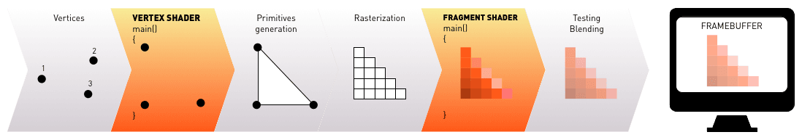
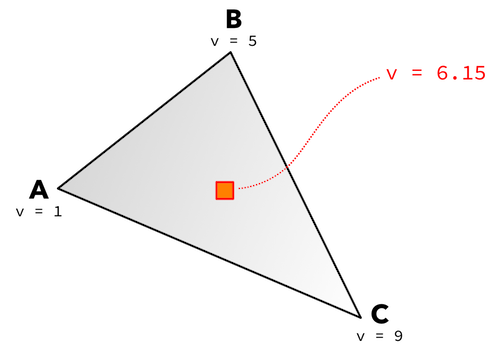
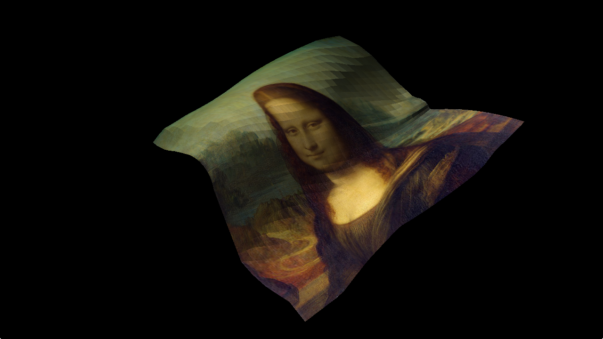

# Shaders

Shaders are at the core of graphics rendering. They are programs written in a C-like language called GLSL (GL Shading Language) that are run on the graphics hardware and perform operations on either the underlying 3D data (vertices) or the pixels that are rendered to the screen (the "fragments"). Shaders are general programs that can be used for an unlimited array of things, for instance:

* Simulation and rendering of water waves.
* Bone animation.
* Cartoon-style character rendering.
* Realistic lighting.
* Deformation of 3D models.
* Full screen post effects.
* and much, much more.

This manual describes vertex and fragment shaders in detail. In order to create shaders for your content, you need to also understand the concept of materials in Defold, as well as how the render pipeline works.

* See the [Render manual](/manuals/render) for details on the render pipeline.
* See the [Material manual](/manuals/material) for details on materials.

Specifications of OpenGL ES 2.0 (OpenGL for Embedded Systems) and OpenGL ES Shading Language can be found at https://www.khronos.org/registry/gles/

Note that on desktop computers it is possible to write and compile shaders using features not available on OpenGL ES 2.0. Doing so will break cross compatibility.

::: sidenote
The site Shadertoy (https://www.shadertoy.com) contains a massive number of user contributed shaders. It is a great source of techniques and inspiration. Many of the shaders showcased on the site can be ported to Defold with very little work.
:::

## Overview

The _vertex shader_ computes the screen geometry of a component's primitive polygon shapes. For any type of visual component, be it a sprite, spine model or model, the shape is represented by a set of polygon vertex positions. We use model components in the following discussion since their geometry often extends to full 3D.

In the engine, the vertex positions of a model's shape are stored relative to a model-local origo, i.e. in a coordinate system that is unique to the particular model. The game world, however, uses the same coordinate system for all objects that are part of the world. When a model is placed in the game world the model's local vertex coordinates must be translated to world coordinates. This translation is done by a world transform matrix.


The world transform matrix includes information about what translation (movement), rotation and scale should be applied to the model's vertices for them to be correctly placed in the game world's coordinate system. By separating these pieces of information the game engine is able to manipulate the position, rotation and scale of each model without ever destroying the original vertex values stored in the model component.

Similarly, when the game world is rendered, the 3D world coordinates of each vertex need to be translated into actual 2D screen positions. This translation is done with two matrices: a _view matrix_ that translates world coordinates into camera relative coordinates, and a _projection matrix_ that projects the camera relative 3D coordinates onto the flat 2D screen space.

Due to CPU batching of rendering primitives, the world space transformation is done on the CPU before the vertex program processes the vertices. The program processes each vertex (in world space) and computes the resulting coordinate that each vertex of a primitive should have. After that the primitive is _rasterized_. Rasterization means that primitives are divided into fragments (or pixels) and processed by a _fragment shader_ (sometimes called a _pixel shader_). The purpose of the fragment shader is to decide the color of each resulting fragment. This is done by calculation, texture lookups (one or several) or a combination of lookups and computations.



Note that the vertex shader cannot create or delete vertices, only change vertex positions. Also note that the fragment shader is not able to operate on fragments outside of the primitives resulting from vertex shading.

## Variables

A shader program consists of code that operates on data. Data is passed to and between shader programs through variables of different types:

Vertex attribute variables
: Vertex attributes are used to send data to the vertex shader. Values are set per vertex and contain information about each vertex's position, normal, color and texture coordinates. These values are usually stored in the mesh created in a 3D modelling software and exported to Collada files that Defold can read.

Attributes provided from the engine can be defined in the vertex shader using the `attribute` qualifier. Vertex attributes differ from uniforms in that they are set for each vertex. Uniforms are constant for all vertices. It is not possible to define attributes in the fragment shader.

Uniform variables
: Uniforms are values that are passed from the engine to vertex and fragment shader programs. They are declared in the shader programs with the `uniform` qualifier and must also be defined in the material file as *vertex_constant* or *fragment_constant* properties. Uniforms do not change from one execution of a shader program to the next within a particular rendering call (i.e. within a component). That is why they are called uniforms. In Defold, you define uniforms as material _constants_ in the component material file. The following constants are available:

`CONSTANT_TYPE_WORLD`
: The world matrix. Used to transform vertices into world space. For some component types, the vertices are already in world space when they arrive to the vertex program (due to batching). In those cases multiplying by the world matrix will yield the wrong results.

`CONSTANT_TYPE_VIEW`
: The view matrix. Used to transform vertices to view (camera) space.

`CONSTANT_TYPE_PROJECTION`
: The projection matrix. Used to transform vertices to screen space.

`CONSTANT_TYPE_VIEWPROJ`
: A matrix with the view and projection matrices already multiplied.

`CONSTANT_TYPE_WORLDVIEW`
: A matrix with the world and view projection matrices already multiplied.

`CONSTANT_TYPE_NORMAL`
: A matrix to compute normal orientation. The world transform might include non-uniform scaling, which breaks the orthogonality of the combined world-view transform. The normal matrix is used to avoid issues with the direction when transforming normals. (The normal matrix is the transpose inverse of the world-view matrix).

`CONSTANT_TYPE_USER`
: A vector4 constant that you can use for any custom data you want to pass into your shader programs. You can set the initial value of the constant in the constant definition, but it is mutable through the functions `.set_constant()` and `.reset_constant()` for each component type (`sprite`, `model`, `spine`, `particlefx` and `tilemap`)

Varying variables
: Varying variables give you an interface between the vertex and fragment shader. They are the output of a vertex shader and the input of a fragment shader. Varying variables are declared with the `varying` qualifier and can be of type `float`, `vec2`, `vec3`, `vec4`, `mat2`, `mat3` and `mat4`.

If you define a varying variable and set its value in the vertex shader, the value will be set for each vertex. During rasterization this value is interpolated for each fragment on the primitive being rendered. You can access the interpolated value in the fragment shader to determine what color to set on the fragment.

For example, suppose that you define a varying variable +v+ and set it for each vertex of a triangle `A`, `B`, `C`, then each fragment within the boundaries of the triangle will have a value of `v` that is an interpolation of the three values for the vertices:



## Built in variables

Apart from the above types of user defined variables, a couple of built in variables also exist in GLSL:

`gl_Position`​
: A built in variable of type `vec4` that holds the output position of the current vertex in projection space. Set the value in the vertex shader. Note that this value has 4 components, `x`, `y`, `z` and `w`. The `w` component is used to calculate perspective-correct interpolation. This value is normally 1.0 for each vertex _before any transformation matrix is applied_.

`gl_FragColor`
: A built in variable of type `vec4` that holds the output RGBA color value for the current fragment. Set the value in the fragment shader.

## Texturing

To enable texturing of primitives, image mapping and image sampling is required:

UV map
: This is a list mapping each vertex to a 2D texture coordinate. The map is typically generated in the 3D modelling program and stored in the mesh. The texture coordinates for each vertex are provided to the vertex shader as an attribute.


Sampler variables
: Samplers are uniform variables that are used to sample values from an image source. `sampler2D` and `samplerCube` type samplers are supported. `sampler2D` samples from a 2D image texture (a PNG or JPEG image) whereas `samplerCube` samples from a 6 image cubemap texture (defined in a `.cubemap` Defold resource file). You can use a sampler only in the GLSL standard library's texture lookup functions. These functions access the texture referred to by the sampler and take a texture coordinate as a parameter. The [Material manual](/manuals/material) explains how to specify sampler settings.

## Vertex shaders

The simplest possible vertex shader takes the incoming vertices and simply transforms them by multiplying by the appropriate matrices that are passed to the shader as uniform values:

```glsl
// view_proj is set as vertex constants in the material.
//
uniform mediump mat4 view_proj;

// position holds the world vertex position.
attribute mediump vec4 position;

void main()
{
    // Translate the vertex position with the view_proj matrix.
    // The vec4(position.xyz, 1.0) ensures that the w component of
    // the position is always 1.0 before matrix multiplication.
    gl_Position = view_proj * vec4(position.xyz, 1.0);
}
```

For a model consisting of a 32x32 flat grid of vertices, the vertices will be translated in the vertex shader, but are all passed to the fragment shader with their positions intact. (The following images are rendered with a custom fragment shader that shows each vertex):


However, the shader can do much more than straight transformations. It can freely modify the positions of the vertices and deform the model:

```glsl
uniform mediump mat4 view_proj;

attribute mediump vec4 position;

// This is the center of the model.
const vec4 center = vec4(640.0, 360.0, 0.0, 0.0);

void main()
{
    float offset = length(position - center);

    // Translate the vertex position with the mvp matrix and offset the y position.
    gl_Position = view_proj * vec4(position.x, position.y - offset, position.z, 1.0);
}
```


Here, the vertices are offset by a value that is static for each vertex. By providing a value that changes over time the vertex shader can animate the position of the vertices. We do that by defining a user constant (uniform) called `time` in the material and update its value each frame in the render script before calling `render.draw()`:

```lua
function init(self)
    ...
    self.t = 0
    self.constants = render.constant_buffer()
end

function update(self)
    ...
    self.t = self.t + 0.0167
    self.constants.time = vmath.vector4(self.t, 0, 0, 0)
    render.draw(self.model_pred, self.constants)
    ...
end
```

With the time set in the +x+ component of the constant `time` set we can use it in the vertex shader to animate the positions of the vertices over time:

```glsl
uniform mediump mat4 view_proj;

// time is a user type uniform that we set in the render script.
// the x component contains the number of seconds since start.
uniform mediump vec4 time;

attribute mediump vec4 position;

// This is the center of the model.
const vec4 center = vec4(640.0, 360.0, 0.0, 0.0);

void main()
{
    // Use time to offset the offset and sin() for some nice waves.
    float t = time.x * 10.0;
    float offset = sin((length(position - center) + t) / 20.0) * 20.0;

    // Translate the vertex position with the mvp matrix and offset the y position.
    gl_Position = view_proj * vec4(position.x, position.y - offset, position.z, 1.0);
}
```

<iframe src="https://player.vimeo.com/video/206018645?autoplay=1&loop=1&title=0&byline=0&portrait=0" width="640" height="358" frameborder="0" webkitallowfullscreen mozallowfullscreen allowfullscreen></iframe>

## Fragment shaders

After the vertex shader is done, it is the job of the fragment shader to decide the coloring of each fragment of the resulting primitives. In its simplest form, a fragment shader just sets the color of each fragment to a constant color value:

```glsl
void main()
{
    // Set the fragment to white. The color components of the vec4 are red, green, blue and alpha channels.
    gl_FragColor = vec4(1.0, 1.0, 1.0, 1.0);
}
```

## Texturing primitives

A common use of fragment shaders is to texture the rendered primitives. First, the model component needs its *Texture* property set to an image:


In this particular case the model is flat and square, so the texture would fit the model without any modification. But models are often complex and the fitting of the image needs to be done manually. To allow an arbitrary image texture to be mapped onto an arbitrary 3D model in an arbitrary manner, a _UV map_ is used. This map consists of 2D texture coordinates for each vertex in the model. A vertex shader program takes the texture coordinate attribute and sets a varying variable for each vertex, allowing the fragment shader to receive interpolated texture coordinate values for each fragment:

```glsl
// vertex shader
// This vertex attribute contains the UV texture coordinates for each vertex
attribute mediump vec2 texcoord0;

// Varying that will contain the texture coordinates
varying mediump vec2 var_texcoord0;

...

void main()
{
    ...
    // Set the varying so the fragment shader can texture according to UVs.
    var_texcoord0 = texcoord0;
    ...
}
```

In the fragment shader program, the varying texture coordinate variable is defined. A `sampler2D` uniform variable is also defined. The sampler, together with the interpolated texture coordinates, is used to perform texture lookup---the graphics hardware samples the texture at a specified position and returns the sampled color value. The function `texture2D()` performs such lookup.

```glsl
// fragment shader
// The texture coordinate for the fragment
varying mediump vec2 var_texcoord0;

// Texture sampler input
uniform lowp sampler2D tex0;

void main()
{
    // Get the texture color from the sampler
    mediump vec4 color = texture2D(tex0, var_texcoord0.xy);

    // Set the fragment color
    gl_FragColor = color;
}
```


::: sidenote
Note that the above example only repositions the vertices. The texture coordinates associated with each vertex are left intact. This leads to stretching where the distance between two vertices becomes large.
:::

We can choose fragment color based on any type of calculation. For example, it is possible to take the _normals_ of the model into account and create a simple lighting model. To get varied surface normals the example grid model has been deformed in the 3D modelling software.

```glsl
// vertex shader
attribute mediump vec4 position;
attribute mediump vec4 normal;
attribute mediump vec2 texcoord0;

uniform mediump mat4 mtx_viewproj;
uniform mediump mat4 mtx_normal;

varying mediump vec2 var_texcoord0;
varying mediump vec4 var_position;
varying mediump vec3 var_normal;

void main()
{
    // The fragment shader needs normal, vertex position and texture coordinates.
    var_normal = (mtx_normal * normal).xyz;
    var_position = mtx_viewproj * position;
    var_texcoord0 = texcoord0;

    gl_Position = mtx_viewproj * position;
}

```

The fragment shader needs a position of a light source to be able to calculate the light intensity at every fragment's position. The intensity is depending on how far from the light source the fragment is, as well as the orientation of the surface normal, i.e. is the surface facing towards the light source or not?

```glsl
// fragment shader
varying mediump vec2 var_texcoord0;
varying mediump vec3 var_normal;
varying mediump vec4 var_position;

uniform lowp sampler2D tex0;

const vec3 light = vec3(0.0, 1000.0, 1000.0);

void main()
{
    // Diffuse light calculations
    vec3 ambient_light = vec3(0.01);
    vec3 diff_light = vec3(normalize(light - var_position.xyz));
    diff_light = max(dot(var_normal,diff_light), 0.0) + ambient_light;
    diff_light = clamp(diff_light, 0.0, 1.0);

    mediump vec4 color = texture2D(tex0, var_texcoord0.xy);
    gl_FragColor = vec4(color.rgb * diff_light, 1.0);
}
```



This simple example uses a hard coded light source, but it is easy to provide the position, intensity and perhaps color for the light through uniforms. That way a Lua script can set the uniform and the light can be moved or otherwise changed.
