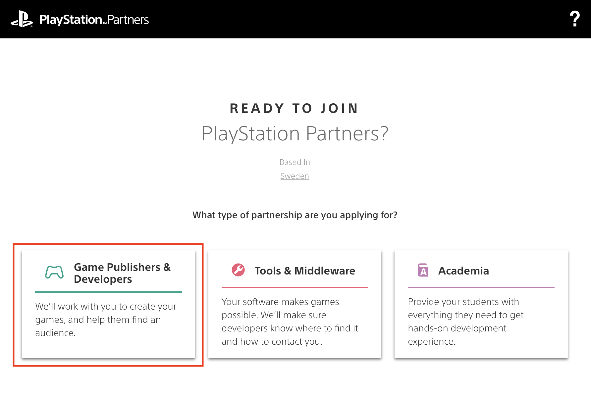

# Sony PlayStation support

The Defold Foundation is an approved PlayStation® Middleware provider and we are actively working on a PlayStation port of Defold. We expect this work to be completed by the end of Q3 2022.

# Sign up for PlayStation development

Support for the PlayStation platform is not included in the standard version of Defold. In order to get access to PlayStation support in Defold you need to:

1. Become a Defold community donor with PlayStation access included in your membership tier, and
2. Become a Sony PlayStation Partner.

## Become a Defold community donor with PlayStation® access

You become a Defold community donor on the [Defold community donation page](/community-donations/). You can become a donor with PlayStation access using either GitHub Sponsors or Patreon. Pay attention to the available tiers and select one which includes PlayStation access.

## Register as Sony PlayStation Partner

You register as a game developer for Nintendo platforms at the [Sony PlayStation Partner page](https://register.playstation.net/):

When you register you will get access to PlayStation developer tools and resources to create and publish games and applications for current Sony platforms.

### Request Defold access

When you have been approved by Sony you need to log in to the PlayStation Developer Portal and visit the Tools and Middleware page and sign up for Defold access. When you register for Defold access we will get an email from Sony verifying you as a registered PlayStation Partner. We will then proceed to verify you as a community donor with Sony PlayStation access included in your membership tier.

When we have verified you as a donor with Sony PlayStation access we will provide you with the access to the following:

* Versions of the Defold editor and the Defold command line tools (bob.jar) with support for bundling to the PlayStation platform.
* Private forum group where you are able to get PlayStation specific support.
* PlayStation specific documentation
* API reference to PlayStation specific engine functionality.
