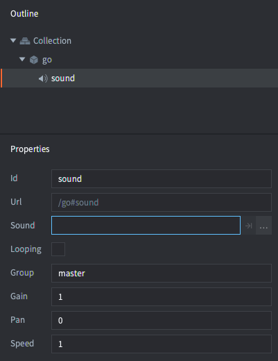

# Sound

Defold's sound implementation is simple but powerful. There are only two concepts that you need to be aware of:

Sound components
: These components contain an actual sound that should be played and are able to play back the sound.

Sound groups
: Each sound component can be designated to belong to a _group_. Groups offer an easy way to manage sounds that belong together in an intuitive way. For instance, a group "sound_fx" can be set up and any sound belonging to that group can be ducked by a simple function call.

## Creating a sound component

Sound components can only be instanced in-place in a game object. Create a new game object, right click on it and select <kbd>Add Component ▸ Sound</kbd> and press *OK*.


The created component has a set of properties that should be set:



*Sound*
: Should be set to a sound file in your project. The file should be in _Wave_ or _Ogg Vorbis_ format. Defold supports sound files saved at 16bit bit depth and with a sampling rate of 44100.

*Looping*
: If checked the sound will play back in a loop until explicitly stopped.

*Group*
: The name of the sound group the sound should belong to. If this property is left empty, the sound will be assigned to the built-in "master" group.

*Gain*
: You can set the gain for the sound directly on the component. This allows you to easily tweak the gain for a sound without going back to your sound program and performing a re-export. See below for details on how gain is calculated.

*Pan*
: You can set the pan value for the sound directly on the component. The pan must be a value between -1 (-45 degrees left) and 1 (45 degrees right).

*Speed*
: You can set the speed value for the sound directly on the component. A value of 1.0 is normal speed, 0.5 is half speed and 2.0 is double speed.


## Playing the sound

When you have a sound component set up properly, you can cause it to play its sound by calling [`sound.play()`](/ref/sound/#sound.play:url-[play_properties]-[complete_function]):

```lua
sound.play("go#sound", {delay = 1, gain = 0.5, pan = -1.0, speed = 1.25})
```

::: sidenote
A sound will continue to play even if the game object the sound component belonged to is deleted. You can call [`sound.stop()`](/ref/sound/#sound.stop:url) to stop the sound (see below).
:::
Each message sent to a component will cause it to play another instance of the sound, until the available sound buffer is full and the engine will print errors in the console. It is advised that you implement some sort of gating and sound grouping mechanism.

## Stopping the sound

If you wish to stop playing a sound you can call [`sound.stop()`](/ref/sound/#sound.stop:url):

```lua
sound.stop("go#sound")
```

## Gain


The sound system has 4 levels of gain:

- The gain set on the sound component.
- The gain set when starting the sound via a call to `sound.play()` or when changing the gain on the voice via a call to `sound.set_gain()`.
- The gain set on the group via a [`sound.set_group_gain()`](/ref/sound#sound.set_group_gain) function call.
- The gain set on the "master" group. This can be altered by `sound.set_group_gain(hash("master"))`.

The output gain is the result of these 4 gains multiplied. The default gain is 1.0 everywhere (0 dB).

## Sound groups

Any sound component with a sound group name specified will be put in a sound group with that name. If you don't specify a group the sound will be assigned to the "master" group. You can also explicitly set the group on a sound component to "master" which has the same effect.

A few functions are available to get all available groups, get the string name, get and set gain, rms (see http://en.wikipedia.org/wiki/Root_mean_square) and peak gain. There is also a function that allows you to test if the target device's music player is running:

```lua
-- If sound playing on this iPhone/Android device, silence everything
if sound.is_music_playing() then
    for i, group_hash in ipairs(sound.get_groups()) do
        sound.set_group_gain(group_hash, 0)
    end
end
```

The groups are identified with a hash value. The string name can be retrieved with [`sound.get_group_name()`](/ref/sound#sound.get_group_name) which can be used to display group names in development tools, for instance a mixer to test group levels.


::: important
You should not write code that relies on the string value of a sound group since they are not available in release builds.
:::

All values are linear between 0 and 1.0 (0 dB). To convert to decibel, simply use the standard formula:

$$
db = 20 \times \log \left( gain \right)
$$

```lua
for i, group_hash in ipairs(sound.get_groups()) do
    -- The name string is only available in debug. Returns "unknown_*" in release.
    local name = sound.get_group_name(group_hash)
    local gain = sound.get_group_gain(group_hash)

    -- Convert to decibel.
    local db = 20 * math.log10(gain)

    -- Get RMS (gain Root Mean Square). Left and right channel separately.
    local left_rms, right_rms = sound.get_rms(group_hash, 2048 / 65536.0)
    left_rmsdb = 20 * math.log10(left_rms)
    right_rmsdb = 20 * math.log10(right_rms)

    -- Get gain peak. Left and right separately.
    left_peak, right_peak = sound.get_peak(group_hash, 2048 * 10 / 65536.0)
    left_peakdb = 20 * math.log10(left_peak)
    right_peakdb = 20 * math.log10(right_peak)
end

-- Set the master gain to +6 dB (math.pow(10, 6/20)).
sound.set_group_gain("master", 1.995)
```

## Gating sounds

If your game plays the same sound on an event and that event is triggered often, you run the risk of playing the same sound two times or more almost at the same time. If that happens, the sounds will be _phase shifted_ which can result in some very noticeable artifacts.


The easiest way to deal with this problem is to build a gate that filters sound messages and does not allow the same sound to be played more than once within a set interval:

```lua
-- Don't allow the same sound to be played within "gate_time" interval.
local gate_time = 0.3

function init(self)
    -- Store played sound timers in a table and count down each frame until they have been
    -- in the table for "gate_time" seconds. Then remove them.
    self.sounds = {}
end

function update(self, dt)
    -- Count down the stored timers
    for k,_ in pairs(self.sounds) do
        self.sounds[k] = self.sounds[k] - dt
        if self.sounds[k] < 0 then
            self.sounds[k] = nil
        end
    end
end

function on_message(self, message_id, message, sender)
    if message_id == hash("play_gated_sound") then
        -- Only play sounds that are not currently in the gating table.
        if self.sounds[message.soundcomponent] == nil then
            -- Store sound timer in table
            self.sounds[message.soundcomponent] = gate_time
            -- Play the sound
            sound.play(message.soundcomponent, { gain = message.gain })
        else
            -- An attempt to play a sound was gated
            print("gated " .. message.soundcomponent)
        end
    end
end
```

To use the gate, simply send it a `play_gated_sound` message and specify the target sound component and sound gain. The gate will call `sound.play()` with the target sound component if the gate is open:

```lua
msg.post("/sound_gate#script", "play_gated_sound", { soundcomponent = "/sounds#explosion1", gain = 1.0 })
```

::: important
It does not work to have the gate listen to `play_sound` messages since that name is reserved by the Defold engine. You will get unexpected behavior if you use reserved message names.
:::
