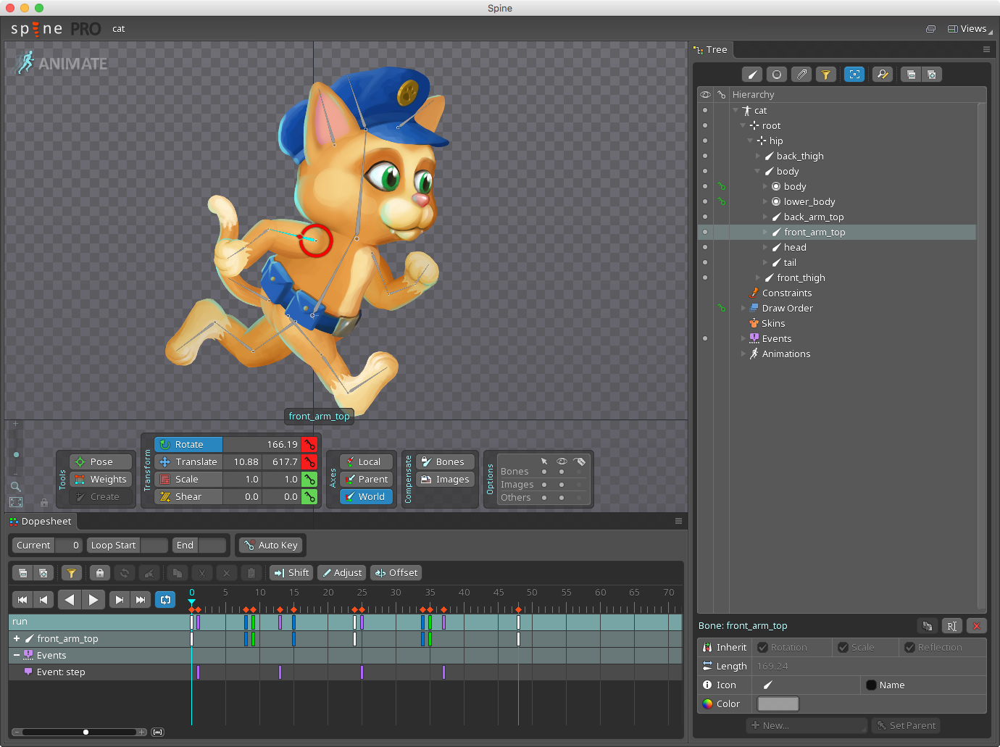
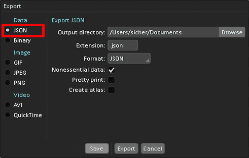
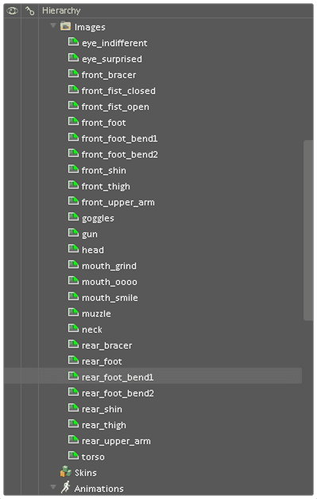

# Spine animation

_Spine_ is a third party animation tool by Esoteric Software that allows you to create animations where movement of _bones_ in a skeletal rig drives various parts of the animated object. It is particularly useful to animate characters and animals, but works very well for other types of objects, like ropes, vehicles or foliage.

Defold implements runtime evaluation and animation expressed in the [Spine JSON format](http://esotericsoftware.com/spine-json-format).

Defold supports most of Spine's animation features, including inverse kinematics (IK).

::: important
Currently, Defold does not support animation keys that flip bones over the X or Y axis. Defold supports mesh animation but only with bones, meaning that you can't animate single vertices. If you need to animate single vertices you can do that through a bone being 100% bound to that vertex only and animate the bone.
:::

::: important
The Spine runtime implementation in Defold supports all Spine 2.x features. The runtime provides only limited additional support for Spine 3.x features. Make sure to use only Spine 2.x features to ensure compatibility with the Defold runtime!
:::

## Concepts

*Spine JSON data file*
: This data file contains the skeleton, all the image slot names, skins and the actual animation data. No images are embedded in this file though. Create this file from your animation software of choice.

*Spine scene*
: The Defold resource tying together the Spine JSON data file and the Defold image atlas file that is used to fill bone slots with graphics.

*Spine model*
: The _SpineModel_ component is put in a game object to bring the graphics and animation to the screen. The component contains the skeleton game object hierarchy, which animation to play, what skin to use and it also specifies the material used for rendering the model. See [SpineModel documentation](/manuals/spinemodel) for details.

*Spine Node*
: If using Spine animation in a GUI scene, use Spine GUI nodes instead of Spine model components. See the [GUI spine documentation](/manuals/gui-spine) for details.

## Animation tools

The Spine JSON data format that Defold supports can be created by Esoteric Software's _Spine_ software. In addition, _Dragon Bones_ has the ability to export Spine JSON data files.

_Spine_ is available from http://esotericsoftware.com

_Dragon Bones_ is available from http://dragonbones.com

::: important
_Dragon Bones_ should typically be able to export to Spine JSON data files without any problems. If your _Dragon Bones_ exported data file isn't rendered properly in Defold we recommend that you use the official [Spine Skeleton Viewer](http://esotericsoftware.com/spine-skeleton-viewer) to first verify that the data can be correctly parsed. If there is a problem with the exported data the Spine Skeleton Viewer can pinpoint problems in the JSON data file, for instance missing or incorrect fields.
:::

## Importing a Spine character and animations

When you have a model and animations that you have created in Spine, the process of importing them into Defold is straightforward:

- Export a Spine JSON version of the animation data.
- Put the exported JSON file somewhere in your project hierarchy.
- Put all images associated with the model somewhere in your project hierarchy.
- Create an _Atlas_ file and add all the images to it. (See [2D graphics documentation](/manuals/2dgraphics) for details on how to create an atlas and below for some caveats)

If you work in _Dragon Bones_, simply select *Spine* as your output data type. Also select *Images* as image type. This will export a *.json* file and all necessary images into a folder. Then add those to Defold as described above.

When you have the animation data and image files imported and set up in Defold, you need to create a _Spine scene_ resource file:

- Create a new _Spine scene_ resource file (Select <kbd>New ▸ Spine Scene File</kbd> from the main menu)
- The new file opens in the spine scene editor.
- Set the *Properties*.

{srcset="images/spine/spinescene@2x.png 2x"}

Spine Json
: The Spine JSON file to use as source for bone and animation data.

Atlas
: The atlas containing images named corresponding to the Spine data file.

## Creating SpineModel components

When you have all data imported and your _Spine scene_ resource file ready, you can create SpineModel components. See [SpineModel documentation](/manuals/spinemodel) for details.

## Creating Spine GUI nodes

You can also use Spine animations in GUI scenes. See the [GUI spine documentation](/manuals/gui-spine) for details.

## Animating Spine models and nodes

Defold gives you powerful runtime control of how animations should play through a Lua interface. See the [Animation documentation](/manuals/animation) for details.

## Atlas caveats

The animation data references the images used for the bones by name with the file suffix stripped off. You add images to your Spine project in the Spine software and they are listed in the hierarchy under *Images*:

This example shows files laid out in a flat structure. It is, however, possible to organize the files in subfolders and the file references will reflect that. For instance, a file *head_parts/eyes.png* on disk will be referenced as *head_parts/eyes* when you use it in a slot. This is also the name used in the exported JSON file so when creating the Defold image atlas, all names must match an atlas animation.

If you select <kbd>Add Images</kbd> Defold will automatically create animation groups with the same name as the added files, but with the file suffix stripped off. So, after having added the file *eyes.png* its animation group can be referenced by the name "eyes". This works with file names only, not paths.

So what do you do if your animation references "head_parts/eyes"? The easiest way to accomplish a match is to add an animation group (right click the root node in the Atlas *Outline* view and select *Add Animation Group*). You can then name that group "head_parts/eyes" (it's just a name, not a path and `/` characters are legal) and then add the file "eyes.png" to the group.

{srcset="images/spine/atlas_names@2x.png 2x"}

Moving on to animate your Spine model, please read the [Animation documentation](/manuals/animation).
