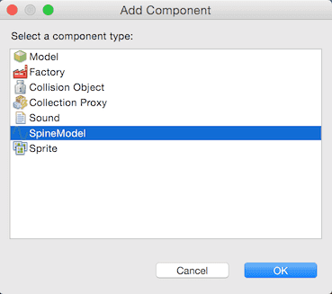

# Spine Model

The SpineModel component is used to bring _Spine_ skeletal animations to life in Defold.

## Creating SpineModel components

Create a game object and add a *SpineModel* component to it. You can either create the component in-place (right click the game object and select <kbd>Add Component</kbd>) or create it on file first (Select <kbd>New ▸ Spine Model File</kbd> from the menu) and then add the file to the game object (right click the game object and select <kbd>Add Component From File</kbd>).

The Spine component has a set of properties that you need to set:

Spine scene
: Set this to the Spine scene file you created earlier.

Default animation
: Set this to the animation you want the model to start with.

Skin
: If your model has skins, select the one you want it to start with.

Material
: If you need to render the model with a custom material, change this property.

Blend Mode
: If you want a blend mode other than the default `Alpha`, change this property.

You should now be able to view your Spine model in the editor:

## Runtime animation

Defold provides powerful support for controlling animation in runtime. See the [Animation documentation](/manuals/animation/#_animating_spine_models) for details.
