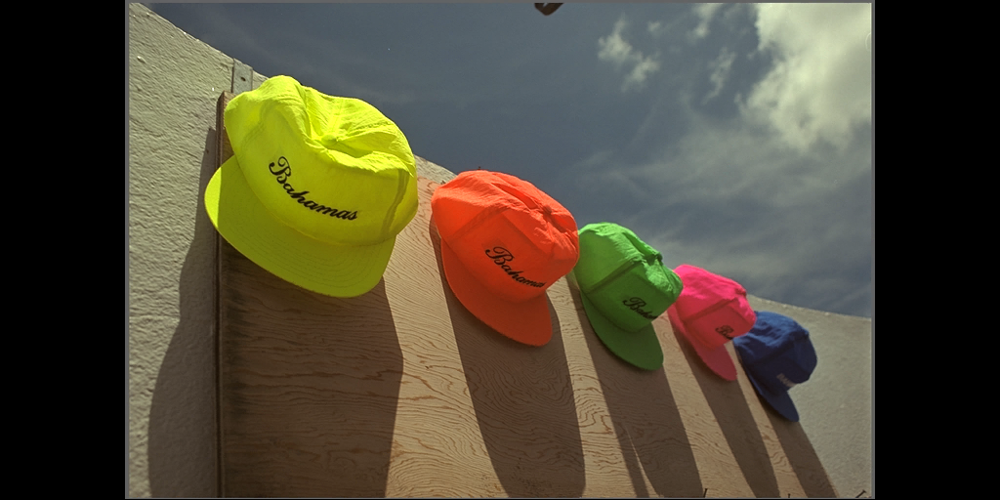

# Texture profiles

Defold supports automatic texture processing and compression of image data (in *Atlas*, *Tile sources*, *Cubemaps* and stand-alone textures used for models, GUI etc).

There are two types of compression, software image compression and hardware texture compression.

1. Software compression (such as PNG and JPEG) reduces the storage size of image resources. This makes the the final bundle size smaller. However, the image files need to be uncompressed when read into memory so even though an image is small on disk, it can have a large memory footprint.

2. Hardware texture compression also reduces the storage size of image resources. But, unlike software compression, it reduces the in-memory footprint for textures. This is because the graphics hardware is able to directly manage compressed textures without first having to uncompress them.

The processing of textures is configured through a specific texture profile. In this file you create _profiles_ that express what compressed format(s) and type should be used when creating bundles for a specific platform. _Profiles_ are then tied to matching file _paths patterns_, allowing fine tuned control over what files in your project should be compressed and exactly how.

Since all available hardware texture compression is lossy, you will get artifacts in your texture data. These artifacts are highly dependent on how your source material looks and what compression method is used. You should test your source material and experiment to get the best results. Google is your friend here.

You can select what software image compression is applied on the final texture data (compressed or raw) in the bundle archives. Defold supports [Basis Universal](https://github.com/BinomialLLC/basis_universal) and [ASTC](https://www.khronos.org/opengl/wiki/ASTC_Texture_Compression) compression formats.

::: sidenote
Compression is a resource intensive and time consuming operation that can cause _very_ long build times depending on the number of texture images to compress and also the chosen texture formats and type of software compression.
:::

### Basis Universal

Basis Universal (or BasisU for short) compresses the image into a intermediary format that is transcoded at runtime to a hardware format appropriate for the current device's GPU. The Basis Universal format is a high quality but lossy format.
All images are also compressed using LZ4 for further reduction of file size when stored in the game archive.

### ASTC

ASTC is a flexible and efficient texture compression format developed by ARM and standardized by the Khronos Group. It offers a wide range of block sizes and bit rates, allowing developers to balance image quality and memory usage effectively. ASTC supports various block sizes, from 4×4 to 12×12 texels, corresponding to bit rates ranging from 8 bits per texel down to 0.89 bits per texel. This flexibility enables fine-grained control over the trade-off between texture quality and storage requirements.

ASTC supports various block sizes, from 4×4 to 12×12 texels, corresponding to bit rates ranging from 8 bits per texel down to 0.89 bits per texel. This flexibility enables fine-grained control over the trade-off between texture quality and storage requirements. The following table shows the supported block sizes and their corresponding bit rates:

| Block Size (width x height) | Bits per pixel |
| --------------------------- | -------------- |
| 4x4                         | 8.00           |
| 5x4                         | 6.40           |
| 5x5                         | 5.12           |
| 6x5                         | 4.27           |
| 6x6                         | 3.56           |
| 8x5                         | 3.20           |
| 8x6                         | 2.67           |
| 10x5                        | 2.56           |
| 10x6                        | 2.13           |
| 8x8                         | 2.00           |
| 10x8                        | 1.60           |
| 10x10                       | 1.28           |
| 12x10                       | 1.07           |
| 12x12                       | 0.89           |

#### Supported devices

While ASTC provides great results, it is not supported by all graphics cards. Here is a small list of supported devices based on vendor:

| GPU vendor         | Support                                                               |
| ------------------ | --------------------------------------------------------------------- |
| ARM (Mali)         | All ARM Mali GPUs that support OpenGL ES 3.2 or Vulkan support ASTC.  |
| Qualcomm (Adreno)  | Adreno GPUs supporting OpenGL ES 3.2 or Vulkan support ASTC.          |
| Apple              | Apple GPUs since the A8 chip support ASTC.                            |
| NVIDIA             | ASTC support is mostly for mobile GPUs (e.g., Tegra-based chips).     |
| AMD (Radeon)       | AMD GPUs that support Vulkan generally support ASTC via software.     |
| Intel (Integrated) | ASTC is supported in modern Intel GPUs via software.                  |

## Texture profiles

Each project contains a specific *.texture_profiles* file that contains the configuration used when compressing textures. By default, this file is *builtins/graphics/default.texture_profiles* and it has a configuration matching every texture resource to a profile using RGBA with no hardware texture compression and using the default ZLib file compression.

To add texture compression:

- Select <kbd>File ▸ New...</kbd> and choose *Texture Profiles* to create a new texture profiles file. (Alternatively copy *default.texture_profiles* to a location outside of *builtins*)
- Choose a name and location for the new file.
- Change the *texture_profiles* entry in *game.project* to point to the new file.
- Open the *.texture_profiles* file and configure it according to your requirements.

You can turn on and off the use of texture profiles in the editor preferences. Select <kbd>File ▸ Preferences...</kbd>. The *General* tab contains a checkbox item *Enable texture profiles*.

## Path Settings

The *Path Settings* section of the texture profiles file contains a list of path patterns and which *profile* to use when processing resources that match the path. The paths are expressed as "Ant Glob" patterns (see http://ant.apache.org/manual/dirtasks.html#patterns for details). Patterns can be expressed using the following wildcards:

`*`
: Matches zero or more characters. For instance `sprite*.png` matches the files *sprite.png*, *sprite1.png* and *sprite_with_a_long_name.png*.

`?`
: Matches exactly one character. For instance: `sprite?.png` matches the files *sprite1.png*, *spriteA.png* but not *sprite.png* or *sprite_with_a_long_name.png*.

`**`
: Matches a complete directory tree, or---when used as the name of a directory---zero or more directories. For instance: `/gui/**` matches all files in the directory */gui* and all its subdirectories.

This example contains two path patterns and their corresponding profiles.

`/gui/**/*.atlas`
: All *.atlas* files in directory */gui* or any of its subdirectories will be processed according to profile "gui_atlas".

`/**/*.atlas`
: All *.atlas* files anywhere in the project will be process according to the profile "atlas".

Note that the more generic path is put last. The matcher works top down. The first occurrence that matches the resource path will be used. A matching path expression further down the list never overrides the first match. Had the paths been put in the opposite order every atlas would have been processed with profile "atlas", even the ones in directory */gui*.

Texture resources that _do not_ match any path in the profiles file will be compiled and rescaled to the closest power of 2, but will otherwise be left intact.

## Profiles

The *profiles* section of the texture profiles file contains a list of named profiles. Each profile contains one or more *platforms*, each platform being described by a list of properties.

*Platforms*
: Specifies a matching platform. `OS_ID_GENERIC` matches all platforms including dev-app builds on device, `OS_ID_WINDOWS` matches Windows target bundles, `OS_ID_IOS` matches iOS bundles and so on. Note that if `OS_ID_GENERIC` is specified, it will be included for all platforms.

::: important
If two [path settings](#path-settings) matches the same file and the path uses different profiles with different platforms **both** profiles will be used and **two** texture will be generated.
:::

*Formats*
: One or more texture formats to generate. If several formats are specified, textures for each format are generated and included in the bundle. The engine selects textures of a format that is supported by the runtime platform.

*Mipmaps*
: If checked, mipmaps are generated for the platform. Unchecked by default.

*Pre-multiply alpha*
: If checked, alpha is pre-multiplied into the texture data. Checked by default.

*Max Texture Size*
: If set to a non-zero value, textures are limited in pixel size to the specified number. Any texture that has a width or height larger than the specified value will be scaled down.

The *Formats* added to a profile each have the following properties:

*Format*
: The format to use when encoding the texture. See below for all available texture formats.

*Compressor*
: The compressor to use when encoding the texture.

*Compressor Preset*
: Selects a compression preset to use for encoding the resulting compressed image. Each compressor preset is unique to the compressor and its settings depend on the compressor itself. To simplify these settings, the current compression presets come in four levels:

| Preset    | Note                                          |
| --------- | --------------------------------------------- |
| `LOW`     | Fastest compression. Low image quality        |
| `MEDIUM`  | Default compression. Best image quality       |
| `HIGH`    | Slowest compression. Smaller file size        |
| `HIGHEST` | Slow compression. Smallest file size          |

Note that the `uncompressed` compressor only has one preset called `uncompressed`, which means no compression will be applied to the textures.
To see the list of available compressors, see [Compressors](#compressors)

## Texture formats

Graphics hardware textures can be processed into uncompressed or *lossy* compressed data with various numbers of channels and bit depths. Hardware compression that is fixed means that the resulting image will be of a fixed size, regardless of the image content. This means that the quality loss during compression depends on the content of the original texture.

Since Basis Universal compression transcoding is dependent on the device's GPU capabilities, the recommended formats for use with the Basis Universal compression is the generic formats like:
`TEXTURE_FORMAT_RGB`, `TEXTURE_FORMAT_RGBA`, `TEXTURE_FORMAT_RGB_16BPP`, `TEXTURE_FORMAT_RGBA_16BPP`, `TEXTURE_FORMAT_LUMINANCE` and `TEXTURE_FORMAT_LUMINANCE_ALPHA`.

The Basis Universal transcoder supports many output formats, like `ASTC4x4`, `BCx`, `ETC2`, `ETC1` and `PVRTC1`.

The following lossy compression formats are currently supported:

| Format                            | Compression | Details  |
| --------------------------------- | ----------- | -------------------------------- | ---- |
| `TEXTURE_FORMAT_RGB`              | none        | 3 channel color. Alpha is discarded |
| `TEXTURE_FORMAT_RGBA`             | none        | 3 channel color and full alpha.    |
| `TEXTURE_FORMAT_RGB_16BPP`        | none        | 3 channel color. 5+6+5 bits. |
| `TEXTURE_FORMAT_RGBA_16BPP`       | none        | 3 channel color and full alpha. 4+4+4+4 bits. |
| `TEXTURE_FORMAT_LUMINANCE`        | none        | 1 channel gray-scale, no alpha. RGB channels multiplied into one. Alpha is discarded. |
| `TEXTURE_FORMAT_LUMINANCE_ALPHA`  | none        | 1 channel gray-scale and full alpha. RGB channels multiplied into one. |

For ASTC, the number of channels will always be 4 (RGB + alpha), and the format itself defines the size of the block compression.
Note that these formats are only compatible with an ASTC compressor - any other combination will produce a build error.

`TEXTURE_FORMAT_RGBA_ASTC_4X4`
`TEXTURE_FORMAT_RGBA_ASTC_5X4`
`TEXTURE_FORMAT_RGBA_ASTC_5X5`
`TEXTURE_FORMAT_RGBA_ASTC_6X5`
`TEXTURE_FORMAT_RGBA_ASTC_6X6`
`TEXTURE_FORMAT_RGBA_ASTC_8X5`
`TEXTURE_FORMAT_RGBA_ASTC_8X6`
`TEXTURE_FORMAT_RGBA_ASTC_8X8`
`TEXTURE_FORMAT_RGBA_ASTC_10X5`
`TEXTURE_FORMAT_RGBA_ASTC_10X6`
`TEXTURE_FORMAT_RGBA_ASTC_10X8`
`TEXTURE_FORMAT_RGBA_ASTC_10X10`
`TEXTURE_FORMAT_RGBA_ASTC_12X10`
`TEXTURE_FORMAT_RGBA_ASTC_12X12`

## Compressors

The following texture compressors are supported by default. The data is uncompressed when the texture file is loaded into memory.

| Name                              | Formats                   | Note                                                                                          |
| --------------------------------- | ------------------------- | --------------------------------------------------------------------------------------------- |
| `Uncompressed`                    | All formats               | No compression will be applied. Default.                                                      |
| `BasisU`                          | All RGB/RGBA formats      | Basis Universal high quality, lossy compression. Lower quality level results in smaller size. |
| `ASTC`                            | All ASTC formats          | ASTC lossy compression. Lower quality level results in smaller size.                          |

::: sidenote
Defold 1.9.7 refactored the texture compressor pipeline to support installable compressors, which is the first step in
enabling implementing a texture compression algorithm in an extension (such as WEBP, or something completely custom).
:::

## Example image

To better give an understanding of the output, here is an example.
Note that the image quality, compression time and compression size are always dependent on the input image and may vary.

Base image (1024x512):

### Compression times

| Preset     | Compression time | Relative time   |
| ----------------------------- | --------------- |
| `LOW`     | 0m0.143s         | 0.5x            |
| `MEDIUM`  | 0m0.294s         | 1.0x            |
| `HIGH`    | 0m1.764s         | 6.0x            |
| `HIGHEST` | 0m1.109s         | 3.8x            |

### Signal loss

The comparison is done using the `basisu` tool (measuring the PSNR)
100 dB means no signal loss (i.e. it's the same as the original image).

| Preset     | Signal                                          |
| ------------------------------------------------------------ |
| `LOW`     | Max:  34 Mean: 0.470 RMS: 1.088 PSNR: 47.399 dB |
| `MEDIUM`  | Max:  35 Mean: 0.439 RMS: 1.061 PSNR: 47.620 dB |
| `HIGH`    | Max:  37 Mean: 0.898 RMS: 1.606 PSNR: 44.018 dB |
| `HIGHEST` | Max:  51 Mean: 1.298 RMS: 2.478 PSNR: 40.249 dB |

### Compression file sizes

Original file size is 1572882 bytes.

| Preset     | File Sizes | Ratio    |
| ---------------------------------- |
| `LOW`     | 357225     | 22.71 %  |
| `MEDIUM`  | 365548     | 23.24 %  |
| `HIGH`    | 277186     | 17.62 %  |
| `HIGHEST` | 254380     | 16.17 %  |

### Image quality

Here are the resulting images (retrieved from the ASTC encoding using the `basisu` tool)

`LOW`

`MEDIUM`

`HIGH`

`HIGHEST`

