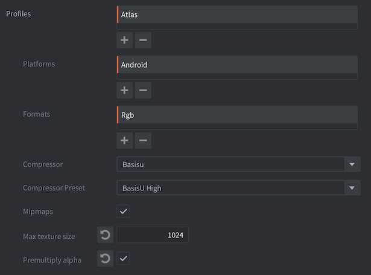

# Texture profiles

Defold supports automatic texture processing and compression of image data (in *Atlas*, *Tile sources*, *Cubemaps* and stand-alone textures used for models, GUI etc).

There are two types of compression, software image compression and hardware texture compression.

1. Software compression (such as PNG and JPEG) reduces the storage size of image resources. This makes the the final bundle size smaller. However, the image files need to be uncompressed when read into memory so even though an image is small on disk, it can have a large memory footprint.

2. Hardware texture compression also reduces the storage size of image resources. But, unlike software compression, it reduces the in-memory footprint for textures. This is because the graphics hardware is able to directly manage compressed textures without first having to uncompress them.

The processing of textures is configured through a specific texture profile. In this file you create _profiles_ that express what compressed format(s) and type should be used when creating bundles for a specific platform. _Profiles_ are then tied to matching file _paths patterns_, allowing fine tuned control over what files in your project should be compressed and exactly how.

Since all available hardware texture compression is lossy, you will get artifacts in your texture data. These artifacts are highly dependent on how your source material looks and what compression method is used. You should test your source material and experiment to get the best results. Google is your friend here.

You can select what software image compression is applied on the final texture data (compressed or raw) in the bundle archives. Defold supports [Basis Universal](https://github.com/BinomialLLC/basis_universal) texture compression, which compresses the image into a intermediary format. This format is transcoded at runtime to a hardware format appropriate for the current device's GPU.
The Basis Universal format is a high quality but lossy format.
All images are also compressed using LZ4 for further reduction of file size when we store them into the game archive.

::: sidenote
Compression is a resource intensive and time consuming operation that can cause _very_ long build times depending on the number of texture images to compress and also the chosen texture formats and type of software compression.
:::

## Texture profiles

Each project contains a specific *.texture_profiles* file that contains the configuration used when compressing textures. By default, this file is *builtins/graphics/default.texture_profiles* and it has a configuration matching every texture resource to a profile using RGBA with no hardware texture compression and using the default ZLib file compression.

To add texture compression:

- Select <kbd>File ▸ New...</kbd> and choose *Texture Profiles* to create a new texture profiles file. (Alternatively copy *default.texture_profiles* to a location outside of *builtins*)
- Choose a name and location for the new file.
- Change the *texture_profiles* entry in *game.project* to point to the new file.
- Open the *.texture_profiles* file and configure it according to your requirements.

You can turn on and off the use of texture profiles in the editor preferences. Select <kbd>File ▸ Preferences...</kbd>. The *General* tab contains a checkbox item *Enable texture profiles*.

## Path Settings

The *Path Settings* section of the texture profiles file contains a list of path patterns and which *profile* to use when processing resources that match the path. The paths are expressed as "Ant Glob" patterns (see http://ant.apache.org/manual/dirtasks.html#patterns for details). Patterns can be expressed using the following wildcards:

`*`
: Matches zero or more characters. For instance `sprite*.png` matches the files *sprite.png*, *sprite1.png* and *sprite_with_a_long_name.png*.

`?`
: Matches exactly one character. For instance: `sprite?.png` matches the files *sprite1.png*, *spriteA.png* but not *sprite.png* or *sprite_with_a_long_name.png*.

`**`
: Matches a complete directory tree, or---when used as the name of a directory---zero or more directories. For instance: `/gui/**` matches all files in the directory */gui* and all its subdirectories.

This example contains two path patterns and their corresponding profiles.

`/gui/**/*.atlas`
: All *.atlas* files in directory */gui* or any of its subdirectories will be processed according to profile "gui_atlas".

`/**/*.atlas`
: All *.atlas* files anywhere in the project will be process according to the profile "atlas".

Note that the more generic path is put last. The matcher works top down. The first occurrence that matches the resource path will be used. A matching path expression further down the list never overrides the first match. Had the paths been put in the opposite order every atlas would have been processed with profile "atlas", even the ones in directory */gui*.

Texture resources that _do not_ match any path in the profiles file will be compiled and rescaled to the closest power of 2, but will otherwise be left intact.

## Profiles

The *profiles* section of the texture profiles file contains a list of named profiles. Each profile contains one or more *platforms*, each platform being described by a list of properties.

*Platforms*
: Specifies a matching platform. `OS_ID_GENERIC` matches all platforms including dev-app builds on device, `OS_ID_WINDOWS` matches Windows target bundles, `OS_ID_IOS` matches iOS bundles and so on. Note that if `OS_ID_GENERIC` is specified, it will be included for all platforms.

::: important
If two [path settings](#path-settings) matches the same file and the path uses different profiles with different platforms **both** profiles will be used and **two** texture will be generated.
:::

*Formats*
: One or more texture formats to generate. If several formats are specified, textures for each format are generated and included in the bundle. The engine selects textures of a format that is supported by the runtime platform.

*Mipmaps*
: If checked, mipmaps are generated for the platform. Checked by default.

*Premultiply alpha*
: If checked, alpha is premultiplied into the texture data. Checked by default.

*Max Texture Size*
: If set to a non-zero value, textures are limited in pixel size to the specified number. Any texture that has a width or height larger than the specified value will be scaled down.

The *Formats* added to a profile each have the following properties:

*Format*
: The format to use when encoding the texture. See below for all available texture formats.

*Compression*
: Selects the quality level for the resulting compressed image.

| LEVEL    | Note                                          |
| -------- | --------------------------------------------- |
| `FAST`   | Fastest compression. Low image quality        |
| `NORMAL` | Default compression. Best image quality       |
| `HIGH`   | Slowest compression. Smaller file size        |
| `BEST`   | Slow compression. Smallest file size          |

::: sidenote
Since 1.2.185 we've redefined these enums, since they are a bit ambiguous.
:::

*Type*
: Selects the type of compression used for the resulting compressed image, `COMPRESSION_TYPE_DEFAULT`, `COMPRESSION_TYPE_WEBP` or `COMPRESSION_TYPE_WEBP_LOSSY`. See [Compression Types](#compression-types) below for more details.

## Texture formats

Graphics hardware textures can be processed into uncompressed or *lossy* compressed data with various numbers of channels and bit depths. Hardware compression that is fixed means that the resulting image will be of a fixed size, regardless of the image content. This means that the quality loss during compression depends on the content of the original texture.

Since Basis Universal compression transcoding is dependent on the device's GPU capabilities, the recommended formats for use with the Basis Universal compression is the generic formats like:
`TEXTURE_FORMAT_RGB`, `TEXTURE_FORMAT_RGBA`, `TEXTURE_FORMAT_RGB_16BPP`, `TEXTURE_FORMAT_RGBA_16BPP`, `TEXTURE_FORMAT_LUMINANCE` and `TEXTURE_FORMAT_LUMINANCE_ALPHA`.

The Basis Universal transcoder supports many output formats, like `ASTC4x4`, `BCx`, `ETC2`, `ETC1` and `PVRTC1`.
For a complete, up-to-date list, see

::: sidenote
The hardware specific output formats are currently disable due to the recent upgrade to our usage of Basis Universal encoder.

We are currently looking into how to reintroduce support for both these formats, as well as readding support for WEBP compression.
Our current long running task of introducing content pipeline plugins aim to fix this.
:::

The following lossy compression formats are currently supported:

PVRTC
: Textures are compressed in blocks. In 4 bit mode (4BPP) each block is 4×4 pixels. In 2 bit mode (2BPP) each block is 8×4 pixels. Each block always occupies 64 bits (8 bytes) of memory space.  The format is used in all generations of the iPhone, iPod Touch, and iPad. (certain Android devices, that use PowerVR GPUs, also support the format). Defold supports PVRTC1, as indicated by the suffix "V1" in the format identifiers.

ETC
: Ericsson Texture Compression. Blocks of 4×4 pixels are compressed into a single 64-bit word. The 4×4 block is divided in half and each half is assigned a base color. Each pixel is then encoded as one of four offset values from the base color of its half. Android supports ETC1 since version 2.2 (Froyo). Defold compresses ETC1 textures.

| Format                            | Compression | Details  |
| --------------------------------- | ----------- | -------------------------------- | ---- |
| `TEXTURE_FORMAT_RGB`              | none        | 3 channel color. Alpha is discarded |
| `TEXTURE_FORMAT_RGBA`             | none        | 3 channel color and full alpha.    |
| `TEXTURE_FORMAT_RGB_16BPP`        | none        | 3 channel color. 5+6+5 bits. |
| `TEXTURE_FORMAT_RGBA_16BPP`       | none        | 3 channel color and full alpha. 4+4+4+4 bits. |
| `TEXTURE_FORMAT_LUMINANCE`        | none        | 1 channel gray-scale, no alpha. RGB channels multiplied into one. Alpha is discarded. |
| `TEXTURE_FORMAT_LUMINANCE_ALPHA`  | none        | 1 channel gray-scale and full alpha. RGB channels multiplied into one. |
| `TEXTURE_FORMAT_RGB_PVRTC2BPPV1`  | 1:16 fixed. | No alpha. Requires square images. Non square images will be resized. |
| `TEXTURE_FORMAT_RGB_PVRTC4BPPV1`  | 1:8 fixed   | No alpha. Requires square images. Non square images will be resized. |
| `TEXTURE_FORMAT_RGBA_PVRTC2BPPV1` | 1:16 fixed | Pre-multiplied alpha. Requires square images. Non square images will be resized. |
| `TEXTURE_FORMAT_RGBA_PVRTC4BPPV1` | 1:8 fixed. | Pre-multiplied alpha. Requires square images. Non square images will be resized. |
| `TEXTURE_FORMAT_RGB_ETC1`         | 1:6 fixed  | No alpha |

## Compression types

The following software image compression types are supported. The data is uncompressed when the texture file is loaded into memory.

::: sidenote
Currently the `WEBP` compression will always fallback to `BASIS_UASTC` compression.

We are currently looking into how to reintroduce support for both these formats, as well as readding support for WEBP compression.
Our current long running task of introducing content pipeline plugins aim to fix this.
:::

| Type                              | Formats                   | Note |
| --------------------------------- | ------------------------- | ---- |
| `COMPRESSION_TYPE_DEFAULT`        | All formats               | Generic lossless data compression. Default. |
| `COMPRESSION_TYPE_BASIS_UASTC`    | All RGB/RGBA formats      | Basis Universal high quality, lossy compression. Lower quality level results in smaller size. |
| `COMPRESSION_TYPE_WEBP`           | All formats               | WebP lossless compression. Higher quality level results in smaller size. |
| `COMPRESSION_TYPE_WEBP_LOSSY`     | All non hardware compressed formats. | WebP lossy compression. Lower quality level results in smaller size. |

For hardware compressed texture formats PVRTC or ETC, the WebP lossless compression process transforms the compressed hardware texture format data into data more suitable for WebP image compression using an internal intermediate format. This is then transformed back into the compressed hardware texture format when loaded by the run-time. WebP lossy type is currently not supported for hardware compressed texture formats PVRTC and ETC.

## Example image

To better give an understanding of the output, here is an example.
Note that the image quality, compression time and compression size are always dependent on the input image and may vary.

Base image (1024x512):

### Compression times

| Level      | Compression time | Relative time   |
| ----------------------------- | --------------- |
| `FAST`     | 0m0.143s         | 0.5x            |
| `NORMAL`   | 0m0.294s         | 1.0x            |
| `HIGH`     | 0m1.764s         | 6.0x            |
| `BEST`     | 0m1.109s         | 3.8x            |

### Signal loss

The comparison is done using the `basisu` tool (measuring the PSNR)
100 dB means no signal loss (i.e. it's the same as the original image).

| Level      | Signal                                          |
| ------------------------------------------------------------ |
| `FAST`     | Max:  34 Mean: 0.470 RMS: 1.088 PSNR: 47.399 dB |
| `NORMAL`   | Max:  35 Mean: 0.439 RMS: 1.061 PSNR: 47.620 dB |
| `HIGH`     | Max:  37 Mean: 0.898 RMS: 1.606 PSNR: 44.018 dB |
| `BEST`     | Max:  51 Mean: 1.298 RMS: 2.478 PSNR: 40.249 dB |

### Compression file sizes

Original file size is 1572882 bytes.

| Level      | File Sizes | Ratio    |
| ---------------------------------- |
| `FAST`     | 357225     | 22.71 %  |
| `NORMAL`   | 365548     | 23.24 %  |
| `HIGH`     | 277186     | 17.62 %  |
| `BEST`     | 254380     | 16.17 %  |

### Image quality

Here are the resulting images (retrieved from the ASTC encoding using the `basisu` tool)

`FAST`

`NORMAL`

`HIGH`

`BEST`

