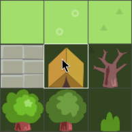

# Tile map

A *Tile Map* is a component that allows you to assemble, or paint, tiles from a *Tile Source* onto a large grid area. Tile maps are commonly used to build game level environments. You can also use the *Collision Shapes* from the tile source in your maps for collision detection and physics simulation.

Before you can create a tile map you need to create a Tile Source. Refer to the [Tile Source manual](/manuals/tilesource) to learn how to create a Tile Source.

## Creating a tile map

To create a new tile map:

- <kbd>right click</kbd> a location in the *Assets* browser, then select <kbd>New... ▸ Tile Map</kbd>).
- Name the file.
- The new tile map automatically opens in the tile map editor.

  {srcset="images/tilemap/tilemap@2x.png 2x"}

- Set the *Tile Source* property to a tile source file that you have prepared.

To paint tiles on your tile map:

1. Select or create a *Layer* to paint on in the *Outline* view.
2. Select a tile to use as brush (press <kbd>Space</kbd> to show the tile palette)

   {srcset="images/tilemap/palette@2x.png 2x"}

3. Paint with the selected brush. To erase a tile, either pick an empty tile and use it as brush, or select the eraser (<kbd>Edit ▸ Select Eraser</kbd>).

   {srcset="images/tilemap/paint_tiles@2x.png 2x"}

You can pick tiles directly from a layer and use the selection as a brush. Hold <kbd>Shift</kbd> and click a tile to pick it up as the current brush. While holding <kbd>Shift</kbd> you can also click and drag to select a block of tiles to use as a larger brush.

{srcset="images/tilemap/pick_tiles@2x.png 2x"}

## Adding a tile map to your game

To add a tile map to your game:

1. Create a game object to hold the tile map component. The game object can be in a file or created directly in a collection.
2. Right-click the root of the game object and select <kbd>Add Component File</kbd>.
3. Select the tile map file.

{srcset="images/tilemap/use_tilemap@2x.png 2x"}

## Changing tiles from script

You can read and write the content of a tile map dynamically while your game is running. To do so, use the [`tilemap.get_tile()`](/ref/tilemap/#tilemap.get_tile) and [`tilemap.set_tile()`](/ref/tilemap/#tilemap.set_tile) functions:

```lua
local tile = tilemap.get_tile("/level#map", "ground", x, y)

if tile == 2 then
    -- Replace grass-tile (2) with dangerous hole tile (number 4).
    tilemap.set_tile("/level#map", "ground", x, y, 4)
end
```
