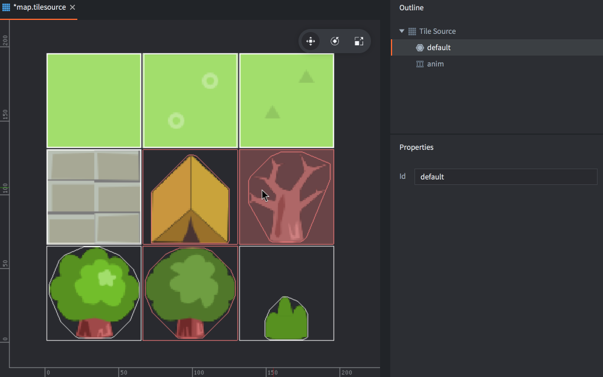

# Tile source

A *Tile Source* can be used by a [Tilemap component](/manuals/tilemap) to paint tiles onto a grid area or it can be used as the graphics source for a [Sprite](/manuals/sprite) or [Particle Effect component](/manuals/particlefx). You can also use the *Collision Shapes* from the tile source in a Tilemap for [collision detection and physics simulation](/manuals/physics).

## Creating a tile source

You need an image containing all the tiles. Each tile must have the exact same dimensions and be placed in a grid. Defold supports _spacing_ between the tiles and a _margin_ around each tile.

{srcset="images/tilemap/small_map@2x.png 2x"}

Once you have the source image created, you can create a Tile Source:

- Import the image to your project by dragging it into a project location in the *Assets* browser.
- Create a new tile source file (<kbd>right click</kbd> a location in the *Assets* browser, then select <kbd>New... ▸ Tile Source</kbd>).
- Name the new file.
- The file now opens in the tile source editor.
- Click the browse-button next to the *Image* property and select your image. Now you should see the image displayed in the editor.
- Adjust the *Properties* to match the source image. When everything is correct the tiles will line up perfectly.

{srcset="images/tilemap/tilesource@2x.png 2x"}

Size
: The size of the source image.

Tile Width
: The width of each tile.

Tile Height
: The height of each tile.

Tile Margin
: The number of pixels surrounding each tile (orange in the image above).

Tile Spacing
: The number of pixels between each tile (blue in the image above).

Inner Padding
: Specifies how many empty pixels should be automatically added around the tile in the resulting texture used when the game is run.

Extrude Border
: Specifies how many times the edge pixels should be automatically replicated around the tile in the resulting texture used when the game is run.

Collision
: Specifies the image to use to automatically generate collision shapes for tiles.

## Tile source flip-book animations

To define an animation in a tile source the animation frame tiles must lie next to each other in a sequence left to right. The sequence can wrap from one row to the next. All newly created tile sources have a default animation named "anim". You can add new animations by <kbd>right clicking</kbd> the tile source root in the *Outline* and selecting <kbd>Add ▸ Animation</kbd>.

Selecting an animation displays the animation *Properties*.

{srcset="images/tilemap/animation@2x.png 2x"}

Id
: The identity of the animation. Must be unique for the tile source.

Start Tile
: The first tile of the animation. Numbering starts at 1 in the top left corner and goes to the right, line by line down to the bottom right corner.

End Tile
: The last tile of the animation.

Playback
: Specifies how the animation should play:

  - `None` does not play back at all, the first image is displayed.
  - `Once Forward` plays the animation one time from the first to the last image.
  - `Once Backward` plays the animation one time from the last to the first image.
  - `Once Ping Pong` plays the animation one time from the first to the last image and then back to the first image.
  - `Loop Forward` plays the animation repeatedly from the first to the last image.
  - `Loop Backward` plays the animation repeatedly from the last to the first image.
  - `Loop Ping Pong` plays the animation repeatedly from the first to the last image and then back to the first image.

Fps
: The playback speed of the animation, expressed in frames per second (FPS).

Flip horizontal
: Flips the animation horizontally.

Flip vertical
: Flips the animation vertically.

## Tile source collision shapes

Defold uses an image specified in the *Collision* property to generate a _convex_ shape for each tile. The shape will outline the part of the tile that has color information, i.e. is not 100% transparent.

Often it is sensible to use the same image for collision as the one containing the actual graphics, but you are free to specify a separate image if you want collision shapes that differ from the visuals. When you specify a collision image, the preview is updated with an outline on each tile indicating the generated collision shapes.

The tile source outline lists collision groups that you have added to the tile source. New tile source files will get one "default" collision group added. You can add new groups by <kbd>right clicking</kbd> the tile source root in the *Outline* and selecting <kbd>Add ▸ Collision Group</kbd>.

To select the tile shapes that should belong to a certain group, select the group in th *Outline*, then click each tile that you wish to assign to the group. The outline of the tile and shape is colored with the group's color. The color is automatically assigned to the group in the editor.

{srcset="images/tilemap/collision@2x.png 2x"}

To remove a tile from its collision group, select the tile source root element in the *Outline*, then click the tile.
