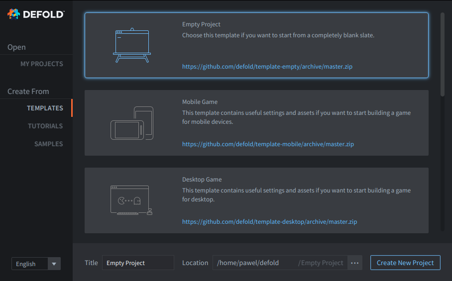
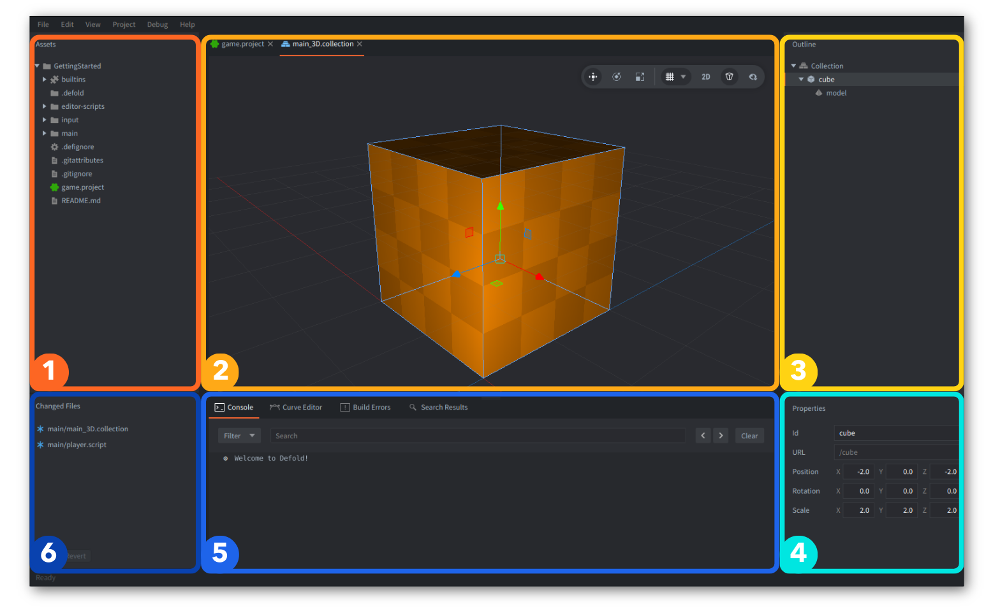

# Defold for Unity users

If you have prior experience with Unity, this guide will help you quickly switch to Defold. Wherever possible, we provide references to Defold’s official manuals and resources for further details.

## Introduction

Defold is a completely free, truly cross-platform 3D game engine. It comes with the Defold Editor for Windows, Linux, and macOS, and its full source code is available on [Github](https://github.com/defold/defold/).

If you are coming from Unity, Defold might feel familiar in some areas, and simpler and more lightweight in others. Defold is **focused on performance first**. Its core architecture is closer to Unity’s DOTS approach.

Defold is much smaller than Unity. It allows you to build, for example, web or mobile games under 5 MB. You can also strip out additional parts of the engine and move some game content into [Live Update](/manuals/live-update) to download separately later.

A size comparison and other reasons to choose Defold are described on the [Why Defold page](https://defold.com/why/).

### Features

Defold provides the basic building blocks you need to create virtually any type of game, offered as game objects and components. It also includes many customization options and features, including:

1. An editor for visual scenes, components, and resources, plus a built-in code editor for scripts.
3. A message-passing system for decoupled communication.
4. A fully scriptable rendering pipeline (render script + materials/shaders) with easily swappable backends (OpenGL, Vulkan, etc.)
5. Extensibility via Native Extensions (C++/C#), plus editor extensibility and customization via Editor Scripts and UI widgets.
6. Full source code access and a build pipeline, if you need to further customize the engine for your project.

If you are already familiar with game development, the switch will be easier once you get used to Defold’s concepts and terminology.

We also recommend checking out a video by Game From Scratch about [Defold for Unity developers](https://www.youtube.com/watch?v=-3CzCbd4QZ0).

---

## Installation

1. Download Defold for your OS.
2. Unzip it and launch.

That’s it. There is no “Defold Hub” and you don’t need to choose or install anything else: SDKs, modules, toolchains, platform bundles, etc. Neither Android Studio nor Xcode is required. That’s why we say Defold has zero setup.

If you need more details read this short [Installation manual](/manuals/installation).

### Versions

We recommend using the newest version and updating frequently, so there is no LTS version of Defold. You can always update Defold from within the Editor. New versions are released regularly - usually monthly, with about two weeks of public beta.

---

## Welcome Screen

Defold greets you with a welcome screen similar to the Unity Hub, where you can open recent projects or start a new one. As in Unity, you can choose from:
- `Templates` - basic empty projects for quicker setup for a specific platform or genre,
- `Tutorials` - guided tours that teach you and help you take your first steps,
- `Samples` - official or community-contributed use cases and examples,



When you create your first project and/or open it, it will open in the Defold Editor.

---

## Defold Editor Overview

We’ll present the Defold Editor here from the perspective of a Unity user, but we encourage you to check out the comprehensive [Editor Overview manual](/manuals/editor-overview).



The Defold Editor is divided into 6 main panes. Below is a comparison of Defold naming and functional differences:

| Defold | Unity | Differences |
|---|---|---|
| 1. Assets | Project (Assets Browser) | In Unity, the Assets pane is usually at the bottom, while in Defold it is docked on the left. Unity creates and uses meta files for all resources; Defold does not. |
| 2. Main Editor | Scene View | The Defold Editor is context-sensitive (different editors for different file types), while Unity uses separate specialized windows (e.g., Animator, Shader Graph). Defold also has a built-in code editor. |
| 3. Outline | Hierarchy | Unity shows all scene objects globally, while Defold reflects only the currently opened file or the selected element (game object or component). |
| 4. Properties | Inspector | Unity shows Game Objects and their Components (with properties) inside the Inspector, while Defold shows only the properties for the current selection in the Outline. |
| 5. Tools | Console | Defold provides tools in tabs such as Curve Editor, Build Errors, Search Results, and the Debugger. In Unity, tools like Timeline or the Frame Debugger can be docked in the bottom area. |
| 6. Changed Files | Unity Version Control (Plastic SCM) | Unity Version Control (formerly Plastic SCM/Collaborate) is an external service (part of Unity DevOps/Services). In Defold, once Git is integrated into your project, changed files are shown here. You can still use Git externally in both. |

Other useful Editor related naming:

| Defold | Unity | Differences |
|---|---|---|
| Game Build | Game Preview | Shows the running game built with the engine. Defold can run multiple instances of the game from the Editor, similar to Unity 6+ Multiplayer Play Mode. Unity embeds the game preview inside the Editor, while in Defold the game always runs in a separate window. Defold can also run the game on an external device (e.g., a mobile phone), similar to Unity Remote. |
| Tabs | Tabs | Defold allows side-by-side editing in two panes within the Main Editor view. Tabs and panes are docked inside a single Editor window; pane visibility can be toggled (<kbd>F6</kbd>, <kbd>F7</kbd>, <kbd>F8</kbd>) and pane sizes can be adjusted. |
| Toolbar | Toolbar / Scene View Options | Unity also docks account, collaboration, and other related options here. In newer Unity versions, the transform tools have been moved into the Scene view, similar to Defold. |
| Console | Console | Shows prints, warnings, and errors, and supports log categories, filtering, searching, and clickable links. The Unity Console is detachable. Compilation errors are shown in the Unity Console, while in Defold they appear in a separate Build Errors tab. |
| Build Errors | Compilation Errors in Console | Displays errors when building and bundling the project. Lua scripts are interpreted, while Unity scripts are compiled. Defold uses a Lua Language Server for static analysis. |
| Search Results | Search / Project Search | Shows results from a global search across the whole project. Unity provides additional search filters by type and labels. |
| Curve Editor | Unity Curve Editor | llows editing curves for particle effect properties. Unity also uses curve editors for animations. |
| [Debugger](/manuals/debugging/) | Visual Studio Debugger | Lets you set, enable, disable, and remove breakpoints (including conditional ones) and step through code execution. It’s fully integrated in Defold out of the box. |

---

## Key Concepts

If you generalize enough, the key concepts behind most game engines are very similar. They’re meant to help developers build games more easily (like assembling blocks) while handling tasks such as rendering, transforms, animations and audio, input, lifecycles, communication, platform differences, and more.

### Building Blocks

Defold operates with just a few basic building blocks:


Quick lookup:
| Defold | Unity |
|---|---|
| Game Object | Game Object |
| Component | Component|
| Collection | Scene |

For more details, check the full manual about [Defold building blocks](/manuals/building-blocks/).

### Game Objects 
Defold uses **"Game Objects"**, similar to Unity. In both engines, Game Objects are containers for data with an ID, and they all have transforms: position, rotation, and scale. In Defold, the transform is built-in rather than a separate component. You can create parent-child relationships between Game Objects. In Defold, this can be done in the Editor inside a "Collection" (explained below) or dynamically at runtime.

### Components
In both engines, Game Objects can be extended with **"Components"**. Defold provides the minimum set of components necessary. There is less distinction between 2D and 3D than in Unity (e.g., with colliders), so there are fewer components overall, while still giving you everything you need to build more complex systems on top.

Under the hood, in Defold everything is highly optimized to be iterated over each component's type in batches. Unity gets closer to those Defold architecture benefits with DOTS.

Read more about [Defold Components here](/manuals/components/).

The table below presents similar Unity components for quick lookup:

| Defold | Unity | Comment |
|---|---|---|
| [Sprite](/manuals/sprite/) | Sprite Renderer | Both support custom materials. In Defold, you can change the tint (color property) only via code. |
| [Tilemap](/manuals/tilemap/) | Tilemap / Grid | DDefold’s Tilemap Editor supports only square grids (but there’s an extension for, e.g. [Hexagon](https://github.com/selimanac/defold-hexagon/)) and has no built-in tile rules, but tools like [Tiled](https://defold.com/assets/tiled/), [TileSetter](https://defold.com/assets/tilesetter/) or [Sprite Fusion](https://defold.com/assets/spritefusion/) have export to Defold options. |
| [Label](/manuals/label/) | Text / TextMeshPro | Defold has a [RichText extension](https://defold.com/assets/richtext/) for rich formatting (similar to TextMeshPro). |
| [Sound](/manuals/sound/) | AudioSource | Defold has only a global sound source (not spatial). There is an [FMOD extension](https://github.com/defold/extension-fmod) for Defold. |
| [Factory](/manuals/factory/) | Prefab Instantiate() | In Defold, a Factory is a component with a specific prototype (prefab). In Unity, you can instantiate any prefab from code. |
| [Collection Factory](/manuals/collection-factory/) | - (No direct equivalent) | A Collection Factory component in Defold can spawn multiple Game Objects with parent-child relationships at once. |
| [Collision Object](/manuals/physics-object) | Rigidbody + Collider | In Defold, physics and shapes are combined in a single component. |
| [Collision Shapes](/manuals/physics-shapes/)  | BoxCollider / SphereCollider / CapsuleCollider | In Defold, shapes (box, sphere, capsule) are configured inside the Collision Object component. Both engines also support collision shapes from tilemaps and convex hull data. |
| [Camera](/manuals/camera/) | Camera | In Unity, the camera has some more built-in rendering and post-processing settings, while Defold delegates it for custom control for user via the render script. |
| [GUI](/manuals/gui/) | UI Toolkit / Canvas | Defold GUI is a powerful component for building complete UIs and templates, with GUI scripts to control them. Unity doesn’t have an equivalent single UI component, but uses Canvas plus UI packages (and IMGUI—Defold has a comparable Dear ImGui extension). |
| [GUI Script](/manuals/gui-script/) | Unity UI (uGUI) / UI Toolkit / IMGUI | Defold GUIs and templates can be controlled via GUI scripts using the dedicated `gui` API. |
| [Model](/manuals/model/) | MeshRenderer + Material | In Defold, a Model component bundles a 3D model file, textures, and a material with shaders. |
| [Mesh](/manuals/mesh/) | MeshRenderer / MeshFilter / Procedural Mesh | In Defold, Mesh is a component for managing a vertex set via code. It’s similar, but even lower-level than Model: it includes a material, textures, and a few other properties. |
| [ParticleFX](/manuals/particlefx/) | Particle System | Defold’s particle editor supports 2D/3D particle effects with many properties, and lets you animate them over time using curves in the Curve Editor. It has no Trails or Collisions. Particles can use different materials. |
| [Script](/manuals/script/) | Script | More details on programming differences explained below. |

#### Extensions and custom components

Defold also has an official [Spine](/manuals/extension-spine/) and [Rive](/manuals/extension-rive/) components available via extensions.

You can also create your own [custom Components](https://github.com/defold/extension-simpledata) using Native Extensions, like e.g. this community created [Object Interpolation Component](https://github.com/indiesoftby/defold-object-interpolation).

Some Unity components have no out-of-the-box equivalent in Defold, for example: Audio Listener, Light, Terrain, LineRenderer, TrailRenderer, Cloth, Animator, or NavMeshAgent. However, all of this functionality can be implemented in scripts, and there are already solutions available—for example, different lighting pipelines, the Mesh component for generating arbitrary meshes (including terrain), or [Hyper Trails](https://defold.com/assets/hypertrails/) for customizable trail effects. Defold may also add new built-in components in the future, such as lights.

### Resources

Some Components require **"Resources"**, similar to Unity, for example, sprites and models need textures. A few of them are compared in the table below:

| Defold | Unity | Comment |
|---|---|---|
| [Atlas](/manuals/atlas/) | Sprite Atlas / Texture2D | Both support Multi-Page atlases. Defold also has an [extension for Texture Packer](https://defold.com/extension-texturepacker/). |
| [Tile source](/manuals/tilesource/) | Tile Palette + Asset | In Defold, a tile source can be used as the texture for tilemaps, but also for sprites or particles. Defold also has a built-in tilemap editor. |
| [Font](/manuals/font/) | Font | Used by the Defold Label component or text nodes in GUI, similarly like in Text/TextMeshPro in Unity. |
| [Material](/manuals/material/) | Material | Defold materials are similar to Unity materials. In Defold, shaders are named as vertex and fragment programs. |

### Collection vs Scene

In Defold Game Objects and Components can be placed in separate files, like Unity prefabs, or be defined in a **"Collection"** file.

A Collection in Defold is essentially a file with a scene description, **not** a runtime object. It only defines what Game Objects (with which Components) should be *instantiated* in the game and establishes parent-child relationships between those objects.

Unity scenes share the same global game state and physics simulation, effectively the same *world*. Whereas in Defold, a collection (loaded at bootstrap or via a Collection Proxy) creates a separate game *world* at runtime (with its own physics world, engine operations and addressing namespace).

When you understand that a collection file is a static definition, and that Game Objects with Components are what actually get created in runtime from resource files (either individual game object files or collections, akin to Unity’s prefabs), it becomes easier to grasp Defold’s addressing and messaging system.

Defold object addresses are *static* and do not change when you alter parent-child relationships, because the identity of a game object instance is fixed once instantiated.

| | Defold Collection | Unity Scene |
|---|---|---|
| Separate physics world? | Yes | No |
| Separate game objects space? | Yes | No |
| Isolated scripts/runtime? | Yes | No |
| Dynamic Loading | Yes (via Collection Proxy) | Yes (via SceneManager.LoadScene and additive loading patterns) |
| Visibility between Game Objects | Only via messaging system and full URLs | Full access |

This approach ensures clear separation of game worlds in Defold and promotes clean addressing and messaging.

Read more about Collections in the [Building Blocks manual](/manual/building-blocks/#collections).

---

## Project Resources and Assets

Both Unity and Defold organize game content in a project directory, but there are some differences in how assets are handled:

### Assets

Unity uses an `Assets/` folder with `.meta` files for each asset. Defold does not use meta files — the project is simply the same folder structure you have on your computer. The Assets pane in the Defold Editor reflects the actual directory structure, so changes on disk are immediately reflected in the project and vice versa.

### Resource Formats

Unity automatically converts some formats behind the scenes into engine-optimized import formats. In Defold you explicitly provide resource files (like `.png`, `.gltf` models, `.wav`/`.ogg` audio, etc.) and assign them to components or use them as resources in your game.

In Unity, you can use a lone image directly as a sprite. In Defold, standalone images can only be used directly for Models and Meshes; for Sprites, GUI, Tilemaps, or Particles you must create an **atlas** resource (a packed texture containing multiple images) or a **tilesource** (a grid-based source of tiles). Defold also stores its engine-created files as text-based formats by default, which is easier to maintain in a version control system.

### Library Cache

Unity generates a `Library/` folder for imported and preprocessed assets. Defold does not create a permanent library cache in the project root; instead, asset building and caching happens during the build process. Although, Defold does cache compiled assets in the build/default folder (and can also use local or remote caches for faster builds), but it does not maintain a separate persistent “Library” directory like Unity does.

---

## Code Writing

### Built-in Code Editor

Defold Editor includes a built-in code editor with code completion, syntax highlighting, quick documentation lookup, and linting, but you can still use your own external editor if you prefer. All Defold components and related files are text based, so you can edit them with any text editor, but you must follow the proper formatting and element structure since they are Protobuf-based.


### VS Code

If you are used to VS Code and want to use it to write your game’s code, we recommend installing `Defold Kit` from the Visual Studio Marketplace. It provides Lua highlighting, autocompletion, linting, workspace configuration, and more.

You can also configure Defold Editor preferences to open text files by default in VS Code (or any other external editor). See [Editor Preferences](/manuals/editor-preferences/) for details.

More information on writing code, using external tools, and installing the VS Code extension can be found in the [Writing Code manual](/manual/writing-code).

### Lua

Defold uses Lua for all script files (`*.script`, `*.gui_script`, `*.render_script` or `*.editor_script`) and `*.lua` modules.

### Teal

Defold supports the use of transpilers that emit Lua code, such as Teal—a typed (statically-checked) dialect of Lua, but this functionality is more limited and requires additional setup; details are available in the [Teal Extension Repo](https://github.com/defold/extension-teal).

### Shaders - GLSL

Defold uses GLSL (GL Shading Language) in shaders - `Fragment Programs` (in Unity called also fragment shaders) and `Vertex Programs` (vertex shaders), it's very similar to C and is used in Unity alongside HLSL, so you might be familiar with it already. Defold offers no Shader Graph like in Unity, this might be a downside, but you can still make the same shaders in Defold.

Read more about shaders in the [Shaders manual](/manuals/shader).

Defold uses a concept of `Material` that connects `.fp` and `.vp` shaders, samplers (textures) and other things like Vertex Attributes or Constants.

Read more about materials in the [Materials manual](/manuals/material).

### C++/C# Native Extensions

In Defold you can write native extensions in C++ and C#. If you are very comfortable with C#, it’s technically possible to structure most of your game logic in a C# extension and just call it from a small Lua bootstrap script, though this requires some advanced API knowledge and is not recommended for beginners.

Read more about extensions in [Defold Native Extensions manual](/manual/extensions.md).

---

## Messaging System

One of the first things you’ll notice in Defold is that objects don’t directly reference each other. There is no `GetComponent`, no direct method calls between scripts on different game objects, and no global scene access like in Unity.

Instead, Defold uses an explicit message passing system with strict addressing, where scripts communicate by sending messages to URLs rather than calling methods or accessing components directly. You never get direct references to other objects or components — you only send them messages. What those objects do with the messages is up to them.

This may feel strange at first, but once you understand it, you’ll see that it encourages loose coupling and helps avoid many issues with tight interdependencies.

In Unity, communication usually looks like this:

```c#
var enemy = GameObject.Find("Enemy");
enemy.GetComponent<EnemyAI>().TakeDamage(10);
```

So objects can directly reference each other and call methods on other scripts. Everything exists in one shared scene space.

In Defold you send a message from one script to another component:

```lua
msg.post("#my_component", "my_message", { my_name = "Defold" })
```

And can handle those messages in script:

```lua
function on_message(self, message_id, messsage)
    if message_id == hash("my_message") then
        print("Hello ", message.my_name)
    end
end
```

Ignore `#` and `hash` for now, we'll get to this later. The rest should be straightforward. You can send a message to any component (including *yourself* - your own script) of any instantiated game object.

Sometimes you send messages to *Sprite* or *Collision* components, for example, to enable or disable them. Sometimes `Components` send messages to your *Script*, for example, when collision occurs, so you can handle it, because Defold internally uses the same messaging system, for engine events and gameplay communication. However, in typical usage you communicate between Script components most often.

Defold scripts never call each other directly, and objects communicate only via messages. This allows scripts and components to remain decoupled, while still letting you explicitly configure communication between any of them. In that sense the messaging system is somewhat similar to Unity’s SendMessage or event systems, though the addressing and use patterns differ.

You can read more details in the [Message Passing Manual](/manuals/message-passing/).

### Addressing

Objects and components in Defold are identified by addresses — known as URLs — not by direct references. Every instantiated object and component has its own unique address, and you don’t need to traverse a scene graph to find them. This makes addressing explicit and direct rather than implicit via pointers or object references.

A simple URL in Defold might look like this:
```lua
"/player"
```

This is *conceptually* similar to:
```c#
GameObject.Find("player")
```
but it’s part of a structured addressing model that includes socket, path, and fragment.

Now it's time to explain why `"/"` or `"#"` were used in addresses/ Defold URLs consist of three parts (using this informal breakdown):

```yaml
socket: /path #fragment
```
or, described more semantically:
```yaml
collection: /gameobject #component 
```
(Spaces are added in the above descriptions only to separate those 3 parts visually)

So simply put:
- `/` precedes the Game Object ID,
- `#` precedes the Component ID,
- `:` is at the end of the Collection name (namespace).

So it's like a scheme is in [URL](https://en.wikipedia.org/wiki/URL) (except query).

The `socket:` identifies the world or collection context, the `/path` identifies the Game Object, and the `#fragment` identifies the specific component on that object (such as a script, sprite, or collision component).

Those identifiers are determined before instantiating and never change from creation until removal. You can change them in your files in the Editor in Property `Id`, or you get them from calls to `factory.create` or `collectionfactory.create`, when instantiating in runtime.

### Relative addressing

You don’t always need to use a fully qualified URL. If you send messages within the same collection (the same *world*), you can omit the socket part:

```yaml
/gameobject #component
```
And if you are sending to a component within the same game object, you can omit the game object part as well:

```yaml
#component
```

Two useful shorthands are:
- `#` for sending to this *Script* component
- `.` for sending to all components in this *Game Object*

Relative addressing and shorthands allow you to write URLs that are reusable in different contexts and game objects without specifying full paths.

### Messagging to GUI and render

Because Defold separates the GUI world from the Game Object world, you can also send messages also from your game object `.scripts` to `.gui_scripts`.

You can also send messages to special system namespaces using an identifier that starts with `@`. For example, the render system can be addressed via `@render`: and you can use this to control certain built-in rendering features, such as changing the projection in the default render script:

```lua
msg.post("@render:", "use_stretch_projection", { near = -1, far = 1 })
```

More details you can find in the [Addressing manual](/manuals/addressing/).

---

## Prefabs and instances

Unity can instantiate anything in the Scene statically or dynamically, and Defold can do the same. In Unity you take a Prefab and call `Instantiate(prefab)`. In Defold you have 3 components for instantiating content:

- `Factory` - instantiates a **single Game Object** from a given prototype: a `*.go` file (prefab).
- `Collection Factory` - instantiates a **set of Game Objects** with parent-child relationships from a given prototype: a `*.collection` file.
- `Collection Proxy` - **loads** and instantiates a new *world* from a `*.collection` file.

### Factory

Once you have a Factory component defined with its Prototype property set to the appropriate Game Object file, spawning is as simple as calling in code:

```lua
factory.create("#my_factory")
```

This uses the address of the component, in this case - a relative path using the identifier `"#my_factory"`.

It returns the unique identifier of the newly created instance, so if you need to reference it later, it’s worth storing it in a variable:

```lua
local new_instance_id = factory.create("#my_factory")
```

The new object will appear in the game world and behave like any other: scripts will run, it can participate in collisions, rendering, etc.

Remember that in Defold you don’t need to manually pool objects - the engine itself does pooling internally for you.

Check more details in the [Factory manual](/manuals/factory/). 

### Collection Factory

The difference between Factory and Collection Factory component is that Collection Factory can spawn **multiple** game objects at once, and define at creation the parent-child relationships as defined in the `*.collection` file.

Such a distinction is not present in Unity, it doesn't have a dedicated concept that matches Defold's Collection Factory. The closest analogy is just a nested Prefab that contains a hierarchy of objects.

It returns a table with ids of all spawned instances:

```lua
local spawned_instances = collectionfactory.create("#my_collectionfactory")
```

Check more details in the [Collection Factory manual](/manuals/collection-factory/).

### Custom properties of instances

When calling `factory.create()` or `collectionfactory.create()` you can also specify optional parameters such as position, rotation, scale and script properties, so you can control exactly how and where the instance appears, and how it behaves e.g.:

```lua
factory.create("#my_factory", my_position, my_rotation, my_scale, my_properties)
```

### Dynamic Loading

In both Factory and Collection Factory components you can mark a prototype for dynamic resource loading so that its heavy assets are only pulled into memory when needed, and unloaded when they’re no longer used.

Check more details in the [Resource Management manual](/manuals/resource/). 

### Collection Proxy

When using a Factory or a Collection Factory, the spawned objects are instantiated into the **current game world**. They become part of the same active collection context and behave like any other game object at runtime.

On the other hand, a Collection Proxy refers to a specific `*.collection` file, but instead of injecting those objects into the *current world*, it loads and instantiates a *new game world*. This is somewhat similar to loading an entire scene in Unity, but with stricter separation.

In Unity you might load an additive scene like this:

```c#
SceneManager.LoadSceneAsync("Level2", LoadSceneMode.Additive);
```

In Defold you load the new collection by sending a message to the Collection Proxy component:

```lua
msg.post("#myproxy", "load")
```

1. When you send the proxy a message `"load"` (or `"async_load"` for asynchronous loading), the engine allocates a new world, instantiates everything in that collection there, and keeps it isolated.
2. Once loaded, the proxy sends back a `"proxy_loaded"` message indicating the world is ready.
3. You then typically send `"init"` and `"enable"` messages so the objects in that new world begin their normal lifecycle.

You cannot directly access game objects in a proxy-loaded world from outside that world. To communicate, you have to use explicit messaging with URLs that include the world name (socket, the first part of the URL).

This isolation can be a huge advantage when implementing level transitions, mini-games, or large modular systems because it prevents unintended interactions, and also allows separate control over update timing if needed (e.g. for pause or slow motion).

If you’ve ever used multiple scenes in Unity and needed them to behave independently, think of a Collection Proxy as a way to bring that concept directly into Defold.

Check more details in the [Collection Proxy manual](/manuals/collection-proxy/).

---

## Application Lifecycle

You’re familiar with a set of Unity lifecycle events: Awake, Start, Update, FixedUpdate, LateUpdate, and OnDestroy or OnApplicationQuit.

Defold also has a well-defined application lifecycle, but the concepts and terminology differ. Defold exposes lifecycle stages through a set of predefined Lua callbacks that are called by the engine during initialization, each frame, and finalization.

Here’s a comparison:

| Defold | Unity | Comment |
|-|-|-|
| `init()` | `Awake()` / `Start()` / `OnEnable()`| Defold has a single initialization entry point and callback - init(). It is called on every component on its creation. |
| `on_input` | Input Methods | Defold receives inputs, when [input focus is set for the script](/manuals/input/#input-focus). Processed first in the update loop. |
| `fixed_update()` | `FixedUpdate()` | Called at fixed timestep. To enable it in Defold, you have to set the `Use Fixed Timestep` - [details](https://defold.com/manuals/project-settings/#use-fixed-timestep). Since 1.12.0 it runs before `update()`. |
| `update()` | `Update()` | Called once per frame with delta time. |
| `late_update()` | `LateUpdate()` | Called after `update()`, just before the frame renders. Available since 1.12.0. |
| `on_message` | Message Receiver | Defold's core callback for receiving messages. Processed when any message is in a queue. |
| `final` | `OnDisable` / `OnDestroy` / `OnApplicationQuit` | Defold calls `final()` callbacks for each component when its game object is destroyed in runtime (using `go.delete()`) or world/collection is unloaded and during application termination for all remaining objects. |

::: sidenote
Remember that Defold doesn't guarantee any order of execution between components, when multiple ones are initialized/updated/removed at once. Decoupled design is encouraged.

### Initialization

Think of Defold’s `init()` as combining elements of Unity’s `Awake()`, `Start()` and `OnEnable()` into a single entry point where the engine has already set everything up and you can safely prepare your component state.

### When messagges are handled?

Because you can already post messages in `init()`, the messages are dispatched first just after the initialization.

Messages are handled after each internal processing loop, every time there is something in a queue, so `on_message()` can be called, for example, even several times in an update loop.

### Update loop

Every frame, Defold runs through a sequence of operations — handling input, dispatching messages, triggering script and GUI updates, applying physics, transforms, and in the end rendering graphics.

The main difference is that in Unity you might call methods directly on other objects’ components, or use event systems. In Defold your components can communicate via message passing.

### Finalization

In Defold, cleanup is always tied to deletion or unloading of the world, and your only per-component exit hook is `final()`.

A subtle difference from Unity’s model is that there is no distinction between a component being disabled and the entire application quitting.

### Rendering

Render script (`*.render_script`) is a part of the rendering pipeline, which also participates in the lifecycle with its own `init()`, `update()`, and `on_message()` callbacks, but they operate on the render thread and are separate from game object and GUI script logic.

For further details read the [Application Lifecycle Manual](/manuals/application-lifecycle/).

---

## GUI

Defold’s GUI system performs a specific role for handling on-screen User Interfaces - letting you design HUDs, menus, overlays, dialogs, and other elements, but it does so with a separate component and runtime API, similar to UI Toolkit / UnGUI

Defold’s GUI system performs a specific role for handling on-screen User Interfaces - letting you design HUDs, menus, overlays, dialogs, and other elements, but it does so with a separate component and runtime API, similar to UI Toolkit / Unity UI (uGUI) with Canvas.

At its core, Defold’s GUI is a “world” separate from the game objects world, though it's very similar and duplicates a lot of behavior. It isn’t built with regular Game Objects that live in Collections - except, it's a separate Component on its own with GUI nodes organized in a tree and optional GUI script to define the behavior.

### GUI Nodes

When you open a `*.gui` component file in Defold, you are presented with canvas where you place `"GUI nodes"`. These are the building blocks of the GUI. You can add GUI nodes of type:

- Box (rectangular shape with any texture)
- Text (with any font)
- Pie (eliptical/circular/ring-like shaped "progress" element with texture)
- ParticleFX
- Template (another whole nested `.gui` file, like a GUI prefab)
- and Spine node, when using Spine extension.

### GUI Script

GUI component have a special property for GUI scripts - you assign one `*.gui_script` file per component and it allows to modify the bahaviour of the component, so it's very similar to regular scripts, except it doesn’t use the `go.*` namespace (which is for game object scripts). Instead, it uses a special `gui.*` namespace API that only works inside GUI scripts (`*.gui_script`). You can think of it like a separate Scene.ity UI (uGUI) with Canvas.

At its core, Defold’s GUI is a “world” separate from the game objects world, though it's very similar and duplicates a lot of behavior. It isn’t built with regular Game Objects that live in Collections - except, it's a separate Component on its own with GUI nodes organized in a tree and optional GUI script to define the behavior.

### GUI Nodes

When you open a `*.gui` component file in Defold, you are presented with canvas where you place `"GUI nodes"`. These are the building blocks of the GUI. You can add GUI nodes of type:

- Box (rectangular shape with any texture)
- Text (with any font)
- Pie (eliptical/circular/ring-like shaped "progress" element with texture)
- ParticleFX
- Template (another whole nested `.gui` file, like a GUI prefab)
- and Spine node, when using Spine extension.

### GUI Script

GUI component have a special property for GUI scripts - you assign one `*.gui_script` file per component and it allows to modify the bahaviour of the component, so it's very similar to regular scripts, except it doesn’t use the `go.*` namespace (which is for game object scripts). Instead, it uses a special `gui.*` namespace API that only works inside GUI scripts (`*.gui_script`). You can think of it like a separate Scene.

### GUI Rendering

GUI elements are rendered independently of the game camera, typically in screen-space, but this behavior can be changed in custom rendering pipelines.

For further details read the [GUI Manual](/manuals/gui/).


---

## Where to go from here

- [Defold examples](/examples)
- [Tutorials](/tutorials)
- [Manuals](/manuals)
- [Reference](/ref/go)
- [FAQ](/faq/faq)

If you have questions or get stuck, the [Defold forums](//forum.defold.com) are a great place to reach out for help.
