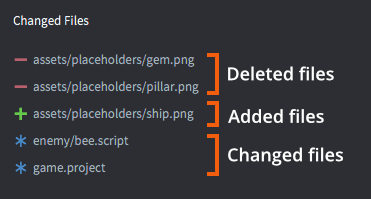

# Version control

Defold is built intended for small teams that work in intense collaboration to create games. Team members can work in parallel on the same content with very little friction. Defold has built-in support for version control using [Git](https://git-scm.com). Git is designed for distributed collaborative work and it is an extremely powerful tool that allows for a wide range of workflows.

## Changed files

When you save changes in your local working copy, Defold tracks all changes in the *Changed Files* editor pane, listing each file that has either been added, deleted or modified.

Select a file in the list and click <kbd>Diff</kbd> to view the changes that you have done to the file or <kbd>Revert</kbd> to undo all changes and restore the file to the state it had after the last synchronization.

## Git

Git is built primarily to handle source code and text files and stores those types of files with a very low footprint. Only the changes between each version are stored, which means that you can keep an extensive history of changes to all your project files to a relatively small cost. Binary files such as image or sound files, however, does not benefit from Git's storage scheme. Each new version you check in and synchronize takes about the same space. That is usually not a major issue with final project assets (JPEG or PNG images, OGG sound files etc) but it can quickly become an issue with working project files (PSD files, Protools projects etc). These types of files often grow very large since you usually work in much higher resolution than the target assets. It is generally considered best to avoid putting large working files under the control of Git and instead use a separate storage and backup solution for those.

There are many ways you can use Git in a team workflow. The one Defold uses is as follows. When you synchronize, the following happens:

1. Any local changes are stashed so they can be restored if something fails later in the sync process.
2. Server changes are pulled.
3. The stash is applied (the local changes are restored), this may result in merge conflicts that need to be resolved.
4. The user gets the option to commit any local file changes.
5. If there are local commits, the user may choose to push these to the server. Again, it is possible that this leads to conflicts that need to be resolved.

If you prefer a different workflow you can run Git from command line or through a third party application to perform pulls, pushes, commits and merges, working on several branches and so on.
