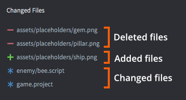

# Version control

Defold projects work well with [Git](https://git-scm.com), but synchronization is handled outside the editor. Use your preferred Git client or the command line to clone, fetch, pull, commit, push, create branches, and resolve conflicts.

## Changed files

When the project directory is a Git working-tree root with at least one commit, Defold lists non-ignored files detected as added, modified, deleted, or renamed in the *Changed Files* editor pane. It derives these entries by comparing files on disk directly with the current commit (`HEAD`), so staging a change does not alter the list. Resolve merge conflicts in an external Git client.

Select exactly one modified or renamed file and click <kbd>Diff</kbd> to view its text diff. Click <kbd>Revert</kbd> to discard the selected working-tree and index changes. Tracked files are restored to `HEAD`; files absent from `HEAD` are deleted, whether they are untracked or staged as additions; and renames delete the new path and restore the old path. This cannot be undone in the editor, so commit or back up work you may need.

## Git

Git stores Defold's text-based project files efficiently. Frequently changing large binary assets, such as PSD or audio-production files, can still make repository history grow quickly. Consider Git LFS or a separate storage and backup solution for large working files.

The *Changed Files* pane provides local status, diff, and revert operations only. It does not know whether commits have been pushed to a remote repository and does not fetch, pull, commit, or push changes. Perform those operations in an external Git client or from the command line. By default, Defold reloads external changes and refreshes the pane when it regains focus. If *Load External Changes on App Focus* is disabled, choose *File ▸ Load External Changes*.
