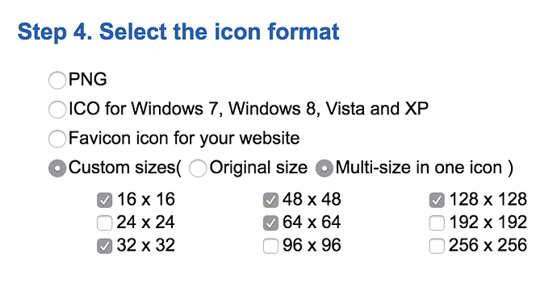

# Windows development

Developing Defold applications for the Windows platform is a straight forward process with very few considerations to make.

## Project settings

Windows specific application configuration is done from the [Windows section](/manuals/project-settings/#windows) of the *game.project* settings file.

## Application icon

The application icon used for a Windows game must be in the .ico format. You can easily create a .ico file from a .png file using an online tool such as [ICOConvert](https://icoconvert.com/). Upload an image and use the following icon sizes:

