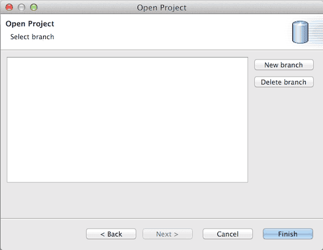
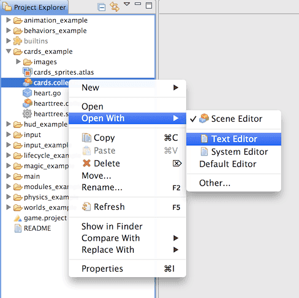
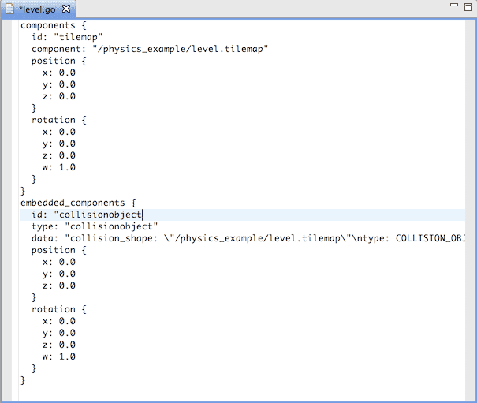
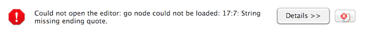
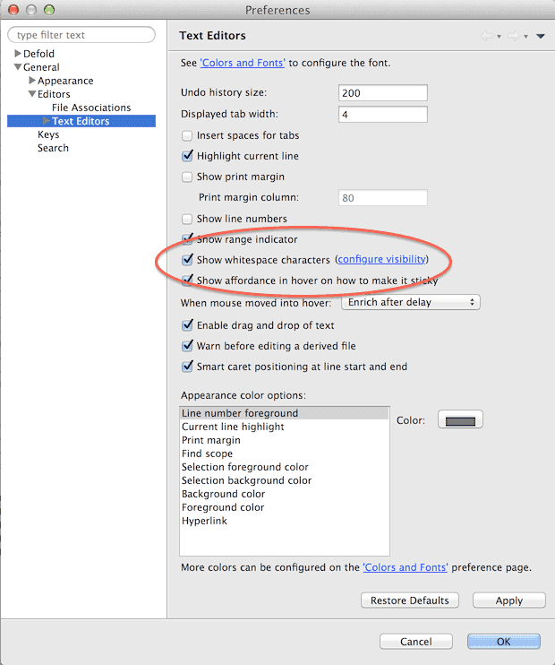
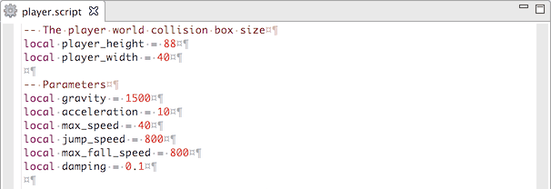

Workflow
========

This manual covers how assets are handled in Defold, how you can change the structure of your project easily with the help of powerful refactoring, how collaboration works and advanced topics like external editors and the underlying Git tools.

## Assets

A game project usually consist of a large number of external assets that are produced in various specialized programs for producing graphics, 3D models, sound files, animations and so forth. Defold is by default set up for a workflow that encourages you to work separately with your external tools, store the working files for those tools separately and then import the assets into Defold and the project file structure as they are finalized.

Git is built primarily to handle source code and text files and stores those types of files with a very low footprint. Only the changes between each version is stored, which means that you can keep an extensive history of changes to all your project files to a relatively small cost. Binary files such as image or sound files, however, does not benefit from Git's storage scheme. Each new version you check in and synchronize takes about the same space. That is usually not a major issue with the final project assets (JPEG or PNG images, OGG sound files etc) but it can quickly become an issue with working project files (PSD files, Protools projects etc). These types of files or projects often grow very large since you usually work in much higher resolution than the target assets.

It is generally considered best to avoid putting large working files under the control of Git and instead use a separate solution for keeping backups. If you do large scale processing or generation of asset files from a working project it is usually easy to write simple scripts that copy the final files into the proper place in the Defold project hierarchy.

## Refactoring

Refactoring refers to the process of restructuring existing code and assets to improve the design. During the development of a project, the need to change or move things around often surface:

* Names need to change to adhere to naming conventions or to improve clarity.
* Code or asset files need to move to a more logical place in the project hierarchy.
* New code and/or assets with better functionality are built to replace old ones, that are deleted.

Defold helps you refactor efficiently by keeping track of how assets are used and automatically updates references to assets that are renamed and/or moved. As a developer, you should feel free in your work. Your project is a flexible structure that you can change at will without fearing that everything will break and fall into pieces. Defold will help you in your refactoring work making the process as effortless as possible.

That said, there are cases where Defold is unable to automatically update references when you are doing refactoring work. In those cases, the editor can't solve the problem, but will provide helpful error signals.

For instance, if you add a Tilemap component to a Game Object and then delete the component file, the Defold compiler will signal an error when you try to start the game. The editor will also add error badges to all relevant icons in the Project View and in the Game Object or Collection hierarchy to help you quickly locate the problem:


Some of these error signals Defold can add instantly as you make a change, required that you have the relevant asset open. Badges in the Project View, however, are only added when the compiler is run (i.e. when you try to run your game).

::: important
If you move or rename files outside of the editor (i.e. in the OS X Finder, Windows Explorer or shell) the automatic refactoring mechanisms will not work. If you do file operations outside of the Defold editor, be aware that file references in your project assets might break.
:::

## Collaboration

Defold is built on a foundation intended for intense collaboration. Multiple team members can work in parallel on the same content with very little friction. Defold is built upon Git that is designed for distributed collaborative work. Git is an extremely powerful tool that allows for a wide range of workflows and Defold uses it to provide simple and powerful functionality.

When you start working on a project for the first time (by selecting <kbd>File ▸ Open Project</kbd>), Defold will ask you to create a new local branch for the project.



Click *New branch* and name the branch. Defold then creates a complete local clone of the project structure, as it exists on the project server. The branches that you create only exist on your computer. You can have as many or as few of them as you like, and you can create new ones and delete old ones at will.

When you start working and save changes you made to the project, these changes will be stored inside the current branch. No one else sees them until you _Synchronize_ your branch with the server repository.

## Synchronizing

Synchronizing your project branch means that it is brought in sync with the project as it looks on the master branch on the server. Whatever changes that has been made on the server are pulled to your branch and whatever changes that you have made to your local branch are pushed to the server repository.

When you have done some work in your current branch that you wish to share with the rest of the project team, you select <kbd>File ▸ Synchronize</kbd>. This brings up a window where you can inspect your changes and write a _useful_ commit message:


All files that are either changed, added or deleted from the project are listed in the top pane of the window. Each file carry an annotation:

[M]
: The file has been modified in your branch.

[A]
: The file has been added to your branch.

[D]
: The file has been deleted from your branch.


To inspect the changes that has been done to a file, simply double click the file in the commit-list to open the Compare window:


The window shows two versions of the file (in case of a modified file. Added or deleted files view differently). On the left hand side is the file as it looked on the server _when you last synchronized_. The right hand side shows your local version. Any differences are clearly highlighted so you can quickly review them.

The built in file comparison tool works on text files only. However, since Defold stores all working files (game objects, collections, atlases etc etc) in easily understandable JSON files, you can often figure out the meaning of the changes that has been made to such files:


## Resolving conflicts

If you are working in a team, chances are that another branch have been synchronized to the server repository _while_ you were working on your branch. Some other team member (or yourself for that matter, but on a different branch) might have previously pushed changes to the very files you are about to push to the server.

This is often not a problem and most such conflicts can be automatically resolved. However, if your changes are done in the exact same positions in the working files as the changes on the server, Defold will signal a warning and ask for your help to resolve the conflict.


Select whether you want to keep your version (select "Yours") or the version on the server (select "Theirs"). To view the conflicts, double click the file to open a compare window where the conflicts are highlighted:

::: sidenote
The editor does not allow you to pick changes from the two conflicting files. If you need to do this you can perform the Git operations from the command line and use a separate merge tool.
:::


## External editors and tools

Defold does not provide editing tools for drawing images, creating sound files or bone animation. Such assets need to be created outside of Defold in specialized tools. Defold is agnostic when it comes to what tools it prefers. Any image program that can produce PNG files will do, any sound program that can save WAV files will do and any program that can save or export Spine JSON files will do (refer to the [Spine documentation](/manuals/spine) for details).

Defold automatically detects changes to any assets that are in the project hierarchy and updates the editor view accordingly. The update cycle is not instant so you might have to wait a second or two to see your changes in the editor.

The automatic asset tracking allows you to customize your work flow according to your needs.

Shell scripts / batch files
: You can use external scripts to automatically rebuild assets. For instance, if your source material are of higher resolution or in a different format you can run a script or batch file that resizes or converts the files before copying them into the proper place in the project hierarchy.

Data generation
: You can use custom tools to create specialized data and write it into Lua script files (as table structures) 

## Opening assets in the text editor

Defold automatically choses the appropriate editor for the item you are trying to edit. However, it is also possible to open any project file in the Defold text editor. In some situations this possibility is extremely useful and it is advisable to, at least, familiarize yourself with the file formats which helps when resolving conflicts.

To open a file in the text editor, right-click the file in the Project view and select <kbd>Open With ▸ Text Editor</kbd>:



Note that Defold remembers the choice of editor for the particular file. If you open a file with the Text Editor, subsequent double clicks on the file in the Project view will automatically open the file in the Text Editor. To reset the selected editor for the file, simply right-click the file and select <kbd>Open With ▸ [Filetype Editor]</kbd> where [Filetype Editor] is the type of editor used for the file type (e.g. Scene Editor for Game Objects, Tile Source Editor for Tile Sources and so forth).

Extra care should be taken when working with files through the Text Editor. Easy to make errors can prevent the file from being possible to open in the designated editor. For instance, suppose you edit a Game Object file and omits an end-quote character in one of the names:



If you save this file from the Text Editor and then try to open it in the Scene Editor, Defold will signal an error and you will have to manually fix the error (either by re-editing the file, or by reverting your changes):



Defold tries to provide helpful error messages and it is often easy to track down the error. If you need further aid, double-click the file in the Changed Files pane to bring up a window with all changes since your last Synchronize.

## Git

Defold uses Git to do version tracking on all files in a simple and easily understandable manner. 

* Each branch you create in the editor is a clone of the remote project repository, stored in a separate folder.
* Any changes you do locally are saved in the cloned repository.
* When you Synchronize your project, the following happens:
    1. Your changes are committed to the local repository.
    2. The editor pulls any changes from the remote repository and merges it with your local repository.
    3. If there are merge conflicts, you are asked to resolve them.
    4. Finally, your changes are pushed to the remote repo.

The Git command line tool can be used to perform manual operations that the editor does not support. For instance, you can inspect the commit history of the repository:

```bash
git log
```

and then do a checkout from a specific commit:

```bash
git checkout <commit-hash> <file path>
```

You can also set up a more advanced work flow if you want, allowing you to pull changes directly between team members. If you run into situations where more than one person work on an experimental branch, you might want to consider utilizing Git for that. Please visit http://git-scm.com to learn more about Git.

## Line endings and Windows

When you edit a text file on your computer and press *Return* on your keyboard, an invisible character sequence is inserted into the file indicating the line ending. Different operating systems use different sequences for historical reasons. These are the most common:

Unix and Mac OS X
: A single *Line Feed* character. (*LF*, '\n', 0x0A or 10 in decimal)

Windows
: One *Carriage Return* character followed by a *Line Feed* character (*CR*+*LF*, '\r\n', 0x0D0A)

Mac OS 9 (and earlier)
: A single *Carriage Return* character (*CR*, '\r', 0x0D or 13 in decimal)


::: sidenote
You can read more on line endings, or "newlines" at http://en.wikipedia.org/wiki/Newline
:::

When you work together in a team with mixed operating systems, the line endings may cause problems. New files created in the Project View in Defold will get Unix line endings so as long as you work with text files solely within Defold, you should never have any problems. However, external tools that write files with other line endings might cause unexpected problems.

Suppose a team member works on a Windows machine and edits a Lua script file in an external editor that saves files with Windows line endings. She then opens the file in the Defold Lua Editor. Everything looks normal so she synchronizes the changes to the server repository.

Meanwhile, a second team member who works on a Mac OS X machine does some editing in the same file. The changes done by the two team members are in different parts of the script file so normally, Git should automatically resolve the conflict and merge the two sets of changes. Nevertheless, when team member two synchronizes Defold detects a conflict. Team member number two double clicks the file to compare versions and sees that a conflict is highlighted on every single line through the file:


What happened is that the two files actually differs in how they encode the line endings. Since one file uses the *LF* character at the end of each line and the other the characters *CR*`*LF*, there is a legitimate conflict on each line and you will have to resolve it. If you have team members that work a lot with external tools line endings will cause merge conflicts all the time.

## Line endings in Defold

Defold has some built in tools for seeing and changing line endings. You can turn on visible whitespace in the preferences (select <kbd>File ▸ Preferences...</kbd>):



This setting makes the editor deliberately show all whitespace characters like *LF*, *CR*, *Space* and *Tab*:



There is also a menu option <kbd>File ▸ Convert Line Delimiters To ▸ ...</kbd> where you can select which type of delimiter you want to set for the currently open file.

## Make Git deal with line endings properly

Git can be configured to specifically deal with line endings in a number of different ways:

```bash
# Configure Git on OS X to properly handle line endings
$ git config --global core.autocrlf input
```

The global Git setting `core.autocrlf` takes one parameter:

false
: The default. The result is that Git doesn't touch the line endings of your files. You can check in files with *LF*, *CR*`*LF* line endings, or a mix and Git does not care. If you work in a mixed operating system environment you should not use this setting.


true
: Git will process all text files and turn all *LF* line endings to *CR*`*LF* when writing them into the working directory and back to *LF* when they are checked into the repository again. This is a good setting on Windows machines.


input
: Git will process all files and turn all *CR*+*LF* into *LF* line endings when checking files into the repository. When checking files out, the files are untouched. This is a good setting on Unix and OS X machines.


You can configure Git with more fine grained control on how it should deal with line endings by creating a ".gitattributes" file in your repository:

```txt
# Set default behaviour, in case users don't have core.autocrlf set.
* text=auto

# Explicitly declare text files we want to always be normalized and converted 
# to native line endings on checkout.
*.c text
*.h text
*.sh eol=lf
*.lua text
*.py text
*.script text
*.gui_script text
*.go text

# Denote all files that are truly binary and should not be modified.
*.png binary
*.jpg binary
*.apk binary
*.ipa binary
*.jar binary
*.zip binary
*.ogg binary
```

See the Git documentation on ".gitattributes" at http://git-scm.com/docs/gitattributes for details.

