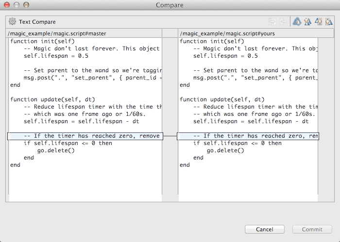

# Workflow

A game project usually consists of a large number of external assets that are produced in various specialized programs for producing graphics, 3D models, sound files, animations and so forth. Defold is builit for a workflow where you to work in your external tools and then import the assets into Defold as they are finalized.

Defold is built intended for small teams that work in intense collaboration to create games. Team members can work in parallel on the same content with very little friction. Defold is built upon [Git](https://git-scm.com) that is designed for distributed collaborative work. Git is an extremely powerful tool that allows for a wide range of workflows and Defold uses it to provide built in simple and powerful functionality.

## Your local working copy

Before you can start working on a new project you need to get it to your local disk so the Defold editor can open it. 


Click to open project <kbd>From Dashboard</kbd> to bring up a list of Defold hosted projects that you have access to. Specify a location on your hard drive where the project files will be stored. If you already have a folder on your hard drive containing a Defold project you can open it by clicking open project <kbd>From Disk</kbd>. 

When you save changes in your local working copy, Defold tracks all changes in the *Changed Files* editor pane, listing each file that has either been added, deleted or modified.


Select a file in the list and click <kbd>Diff</kbd> to view the changes that you have done to the file or <kbd>Revert</kbd> to undo all changes and restore the file to the state it had after the last synchronization.

## Synchronizing

To synchronize your project means that the project files are brought into sync with the project as it looks on the server. You should synchronize if:

1. You want to bring your project up to speed with what is stored on the server.
2. You want to share your local project changes with other team members by committing and pushing your changes to the server.

To start synchronizing, select <kbd>File ▸ Synchronize</kbd> in the menu.

This brings up a window where you can inspect your changes and write a _useful_ commit message:


To inspect the changes that have been done to a file, simply double click the file in the commit-list to open the Compare window:



The window shows two versions of the file (in case of a modified file; added or deleted files are shown differently). On the left hand side is the file as it looked on the server _when you last synchronized_. The right hand side shows your local version. Any differences are clearly highlighted so you can quickly review them.

The built in file comparison tool works on text files only. However, since Defold stores all working files (game objects, collections, atlases, etc etc) in easily understandable JSON files, you can often figure out the meaning of the changes that have been made to such files:


## Refactoring

Refactoring refers to the process of restructuring existing code and assets to improve the design. During the development of a project, the need to change or move things around often surfaces:

* Names need to change to adhere to naming conventions or to improve clarity.
* Code or asset files need to move to a more logical place in the project hierarchy.
* New code and/or assets with better functionality are built to replace old ones, that are deleted.

Defold helps you refactor efficiently by keeping track of how assets are used and automatically updating references to assets that are renamed and/or moved. As a developer, you should feel free in your work. Your project is a flexible structure that you can change at will without fearing that everything will break and fall to pieces. Defold will help you in your refactoring work making the process as effortless as possible.

That said, there are cases where Defold is unable to automatically update references when you are doing refactoring work. In those cases, the editor can't solve the problem, but will provide helpful error signals.

For instance, if you add a Tilemap component to a Game Object and then delete the component file, the Defold compiler will signal an error when you try to start the game. The editor will also add error badges to all relevant icons in the Project View and in the Game Object or Collection hierarchy to help you quickly locate the problem:


Some of these error signals Defold can add instantly as you make a change, provided that you have the relevant asset open. Badges in the Project View, however, are only added when the compiler is run (i.e. when you try to run your game).

::: important
If you move or rename files outside of the editor (i.e. in the OS X Finder, Windows Explorer or shell) the automatic refactoring mechanisms will not work. If you do file operations outside of the Defold editor, be aware that file references in your project assets might break.
:::

## Resolving conflicts

If you are working in a team, chances are that another branch has been synchronized to the server repository _while_ you were working on your branch. Some other team member (or yourself for that matter, but on a different branch) might have previously pushed changes to the very files you are about to push to the server.

This is often not a problem and most such conflicts can be automatically resolved. However, if your changes are done in the exact same positions in the working files as the changes on the server are, Defold will signal a warning and ask for your help to resolve the conflict.


Select whether you want to keep your version (select "Yours") or the version on the server (select "Theirs"). To view the conflicts, double click the file to open a compare window where the conflicts are highlighted:

::: sidenote
The editor does not allow you to pick changes from the two conflicting files. If you need to do this you can perform the Git operations from the command line and use a separate merge tool.
:::


## External editors and tools

Defold does not provide editing tools for creating images, sound files, models or animations. Such assets need to be created outside of Defold in specialized tools and imported into Defold. Defold automatically detects changes to any asset in the project hierarchy and updates the editor view accordingly.

There is currently no way to hook custom build steps into the in-editor builder, but we provide a stand-alone build pipeline (see [Bob the builder](/manuals/bob)) that can be incorporated in any pipeline.

The editor saves all Defold assets in text based files that are merge friendly. They are also easy to create and modify with simple scripts. See [this forum thread](https://forum.defold.com/t/deftree-a-python-module-for-editing-defold-files/15210) for more information. Note though that we do not publish our file format details since they do change once in a while.

Extra care should be taken when working with Defold asset files through a text editor or external tool. If you introduce errors those can prevent the file from opening in the Defold editor. 

## Git

Git is built primarily to handle source code and text files and stores those types of files with a very low footprint. Only the changes between each version are stored, which means that you can keep an extensive history of changes to all your project files to a relatively small cost. Binary files such as image or sound files, however, does not benefit from Git's storage scheme. Each new version you check in and synchronize takes about the same space. That is usually not a major issue with final project assets (JPEG or PNG images, OGG sound files etc) but it can quickly become an issue with working project files (PSD files, Protools projects etc). These types of files often grow very large since you usually work in much higher resolution than the target assets. It is generally considered best to avoid putting large working files under the control of Git and instead use a separate storage and backup solution for those.

There are many ways you can use Git in a team workflow. The one Defold uses is as follows. When you synchronize, the following happens:

1. Any local changes are stashed so they can be restored if something fails later in the sync process.
2. Server changes are pulled.
3. The stash is applied (the local changes are restored), this may result in merge conflicts that need to be resolved.
4. The user gets the option to commit any local file changes.
5. If there are local commits, the user may choose to push these to the server. Again, it is possible that this leads to conflicts that need to be resolved.

If you prefer a different workflow you can run Git from command line or through a third party application to perform pulls, pushes, commits and merges, working on several branches and so on.

## Line endings and Windows

When you edit a text file on your computer and press *Return* on your keyboard, an invisible character sequence is inserted into the file indicating the line ending. Different operating systems use different sequences for historical reasons. These are the most common:

Unix and Mac OS X
: A single *Line Feed* character. (*LF*, `\n`, 0x0A or 10 in decimal)

Windows
: One *Carriage Return* character followed by a *Line Feed* character (*CR*+*LF*, `\r\n`, 0x0D0A)

Mac OS 9 (and earlier)
: A single *Carriage Return* character (*CR*, `\r`, 0x0D or 13 in decimal)

::: sidenote
You can read more on line endings, or "newlines" at http://en.wikipedia.org/wiki/Newline
:::

When you work together in a team with mixed operating systems, the line endings may cause problems. New files created in the Project View in Defold will get Unix line endings so as long as you work with text files solely within Defold, you should never have any problems. However, external tools that write files with other line endings might cause unexpected problems.

Suppose a team member works on a Windows machine and edits a Lua script file in an external editor that saves files with Windows line endings. She then opens the file in the Defold Lua Editor. Everything looks normal so she synchronizes the changes to the server repository.

Meanwhile, a second team member who works on a Mac OS X machine does some editing in the same file. The changes done by the two team members are in different parts of the script file so normally, Git should automatically resolve the conflict and merge the two sets of changes. Nevertheless, when team member two synchronizes, Defold detects a conflict. Team member number two double clicks the file to compare versions and sees that a conflict is highlighted on every single line throughout the file:


This happened because the two files actually differ in how they encode the line endings. Since one file uses the *LF* character at the end of each line and the other uses the characters *CR*+*LF*, there is a legitimate conflict on each line and you will have to resolve it. If you have team members that work a lot with external tools, line endings will cause merge conflicts all the time.

## Make Git deal with line endings properly

Git can be configured to specifically deal with line endings in a number of different ways:

```sh
# Configure Git on OS X to properly handle line endings
$ git config --global core.autocrlf input
```

The global Git setting `core.autocrlf` takes one parameter:

false
: The default. The result is that Git doesn't touch the line endings of your files. You can check in files with *LF*, *CR*+*LF* line endings, or a mix and Git does not care. If you work in a mixed operating system environment you should not use this setting.

true
: Git will process all text files and turn all *LF* line endings to *CR*+*LF* when writing them into the working directory and back to *LF* when they are checked into the repository again. This is a good setting on Windows machines.

input
: Git will process all files and turn all *CR*+*LF* into *LF* line endings when checking files into the repository. When checking files out, the files are untouched. This is a good setting on Unix and OS X machines.

You can configure Git with more fine grained control on how it should deal with line endings by creating a *.gitattributes* file in your repository:

```
<hello></hello>
# Set default behaviour, in case users don't have core.autocrlf set.
* text=auto

# Explicitly declare text files we want to always be normalized and converted
# to native line endings on checkout.
*.c text
*.h text
*.sh eol=lf
*.lua text
*.py text
*.script text
*.gui_script text
*.go text

# Denote all files that are truly binary and should not be modified.
*.png binary
*.jpg binary
*.apk binary
*.ipa binary
*.jar binary
*.zip binary
*.ogg binary
```

See the Git documentation on *.gitattributes* at http://git-scm.com/docs/gitattributes for details.

