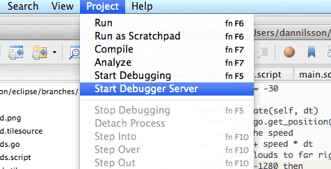

# Debugging Lua scripts with ZeroBrane Studio

Defold contains a built-in debugger, but it is also possible to run the free and open-source Lua IDE _ZeroBrane Studio_ as an external debugger. ZeroBrane Studio needs to be installed in order to use the debugging features. The program is cross-platform and runs on both OSX and Windows.

Download "ZeroBrane Studio" from http://studio.zerobrane.com

## ZeroBrane configuration

In order for ZeroBrane to find the files in your project, you need to point it to the location of your Defold project directory. A convenient way of finding this out is by using the <kbd>Show in Desktop</kbd> option on a file the root of your Defold project.

1. Right click on *game.project*
2. Choose <kbd>Show in Desktop</kbd>

{ srcset="images/zerobrane/show_in_desktop@2x.png 2x" }

## To set up ZeroBrane

To set up ZeroBrane, select <kbd>Project ▸ Project Directory ▸ Choose...</kbd>:


Once this has been set up to match the current Defold project directory, it should be possible to see the directory tree of the Defold project in ZeroBrane, and to navigate and open the files.

Other recommended, but not necessary configuration changes can be found further down in the document.

## Starting the debugging server

Before starting a debugging session, the ZeroBrane built-in debugging server needs to be started. The menu option for starting it can be found under the <kbd>Project</kbd> menu. Just select <kbd>Project ▸ Start Debugger Server</kbd>:



## Connecting your application to the debugger

Debugging can be started at any point in the lifetime of the Defold application, but needs to be actively initiated from Lua script. The Lua code to start a debugging session looks like this:

::: sidenote
If your game exits when `dbg.start()` is called, it might be because ZeroBrane has detected a problem and sends the exit command to the game. For some reason, ZeroBrane needs a file opened to start the debug session, otherwise it will output:
"Can't start debugging without an opened file or with the current file not being saved 'untitled.lua')."
In ZeroBrane, open the file you added `dbg.start()` to fix this error.
:::

```lua
dbg = require "builtins.scripts.mobdebug"
dbg.start()
```

By inserting the above code into the application, it will connect to ZeroBrane’s debugging server (through "localhost", by default) and pause at the next statement to be executed.

```txt
Debugger server started at localhost:8172.
Mapped remote request for '/' to '/Users/my_user/Documents/Projects/Defold_project/'.
Debugging session started in '/Users/my_user/Documents/Projects/Defold_project'.
```

Now it is possible to use the debugging features available in ZeroBrane; you can step, inspect, add and remove breakpoints etc.

::: sidenote
The debugging will only be enabled for the lua context from where debugging is initiated. Enabling "shared_state" in game.project means you can debug your whole application no matter where you started.
:::


Should the connection attempt fail (possibly because the debugging server is not running), your application will continue to run as normal after the connection attempt has been made.

## Remote debugging

As debugging happens over regular network connections (TCP), this allows for debugging remotely. This means it is possible to debug your application while it is running on a mobile device.

The only change needed is to the command which starts the debugging. By default, `start()` will try to connect to localhost, but for remote debugging, we need to manually specify the address to ZeroBrane’s debugging server, like this:

```lua
dbg = require "builtins.scripts.mobdebug"
dbg.start("192.168.5.101")
```

This also means it is important to make sure to have network connectivity from the remote device, and that any firewalls or similar software allows TCP connections through on port 8172. Otherwise the application might stall when launching when it attempts to make the connection to your debugging server.

## Other recommended ZeroBrane setting

It is possible to make ZeroBrane automatically open Lua script files during debugging. This makes it possible to step into functions in other source files without having to open them manually.

The first step is to access the editor configuration file. It is recommended that you change the user version of the file.

- Select <kbd>Edit ▸ Preferences ▸ Settings: User</kbd>
- Add the following to the configuration file:

  ```txt
  - to automatically open files requested during debugging
  editor.autoactivate = true
  ```

- Restart ZeroBrane

