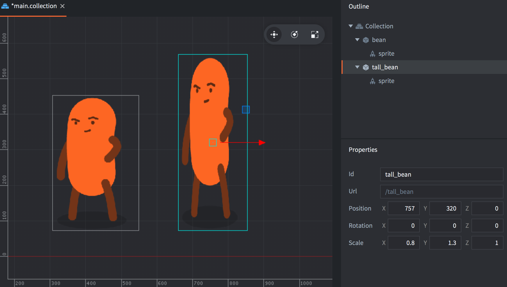

Components are used to give specific expression and/or functionality to game objects. Components have to be contained inside game objects and are affected by the position, rotation and scale of the game object that contains the component:

{srcset="../shared/images/components@2x.png 2x"}

Many components have type specific properties that can be manipulated and there are component type specific functions available for interacting with them in runtime:

```lua
-- disable the can "body" sprite
msg.post("can#body", "disable")

-- play "hoohoo" sound on "bean" in 1 second
sound.play("bean#hoohoo", { delay = 1, gain = 0.5 } )
```

Components are either added in-place in a game object, or added to a game object as a reference to a component file:

<kbd>Right-click</kbd> the game object in the *Outline* view and select <kbd>Add Component</kbd> (add in-place) or <kbd>Add Component File</kbd> (add as file reference).

In most cases it makes most sense to create components in-place, but the following component types must be created in separate resource files before being added by reference to a game object:

* Script
* GUI
* Particle FX
* Tile Map
