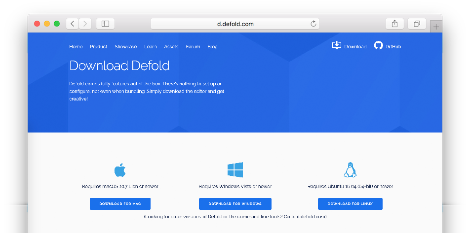
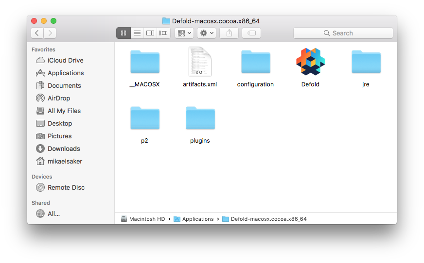
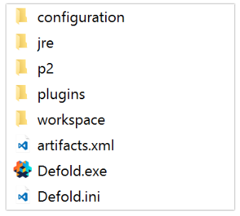
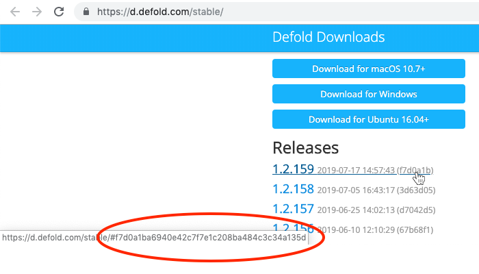

## Downloading

Go to the [Defold download page](https://defold.com/download/) where you will find Download buttons for macOS, Windows and Linux (Ubuntu):



## Installation

Installation on macOS
: The downloaded file is a DMG image containing the program.

  1. Locate the file "Defold-x86_64-darwin.dmg" and double click it to open the image.
  2. Drag the application "Defold" to the "Applications" folder link.

  To start the editor, open your "Applications" folder and <kbd>double click</kbd> the file "Defold".

  

Installation on Windows
: The downloaded file is a ZIP archive that needs to be extracted:

  1. Locate the archive file "Defold-x86_64-win32.zip" (or "Defold-x86-win32.zip" for 32 bit Windows), <kbd>press and hold</kbd> (or <kbd>right-click</kbd>) the folder, select *Extract All*, and then follow the instructions to extract the archive to a folder named "Defold".
  2. Move the folder "Defold" to "C:\Program Files (x86)\"

  To start the editor, open the folder "Defold" and <kbd>double click</kbd> the file "Defold.exe".

  

Installation on Linux
: The downloaded file is a ZIP archive that needs to be extracted:

  1. From a terminal, locate the archive file "Defold-x86_64-linux.zip" unzip it to a target Directory called "Defold".

     ```bash
     $ unzip Defold-x86_64-linux.zip -d Defold
     ```

  To start the editor, change directory to where you extracted the application, then run the `Defold` executable, or <kbd>double click</kbd> it on your desktop.

  ```bash
  $ cd Defold
  $ ./Defold
  ```

  If you run into any problems starting the editor, opening a project or running a Defold game please refer to the [Linux section of the FAQ](/faq/faq#linux-issues).

  ## Install an old version

  You can download and install old editor versions using the following link pattern:

  * Windows: https://d.defold.com/archive/%sha1%/stable/editor2/Defold-x86_64-win32.zip
  * macOS: https://d.defold.com/archive/%sha1%/stable/editor2/Defold-x86_64-darwin.dmg
  * Linux: https://d.defold.com/archive/%sha1%/stable/editor2/Defold-x86_64-linux.zip

  Replace `%sha1%` by the editor release hash representing the version in question. The hash of each Defold version can be seen in the links to the released version on the download page at https://d.defold.com/stable/ (make sure to remove the initial # character and only copy the alpha-numeric part):


