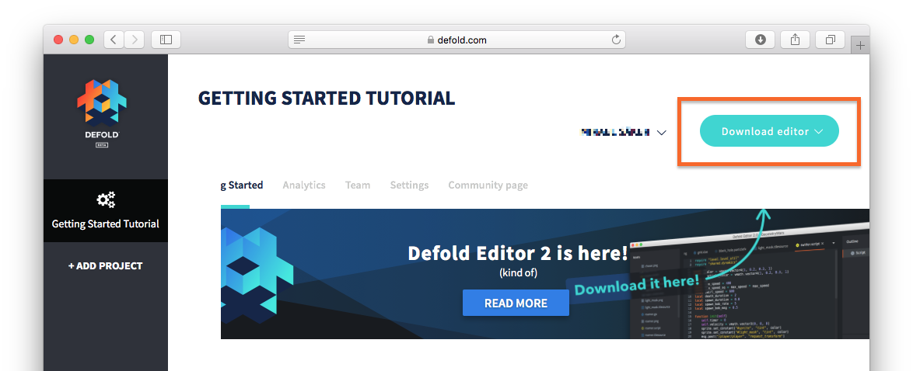

## Downloading

If you haven't already downloaded and installed the Defold editor, it's time to do that.

Log in to the [Defold Dashboard](//www.defold.com/dashboard/) where you will find a "Download editor" menu button:



Click "Download editor" and select the right package for your computer:

* MacOS
* Windows (32 bit)
* Windows (64 bit)
* Linux (64 bit)

There are also builds of the legacy editor 1 avaliable.

## Installation

Installation on MacOS
: The downloaded file is a DMG image containing the program.

  1. Locate the file "Defold-x86_64-darwin.dmg" and double click it to open the image.
  2. Drag the application "Defold" to the "Applications" folder link.

  To start the editor, open your "Applications" folder and <kbd>double click</kbd> the file "Defold".

  

Installation on Windows
: The downloaded file is a ZIP archive that needs to be extracted:

  1. Locate the archive file "Defold-x86_64-win32.zip" (or "Defold-x86-win32.zip" for 32 bit Windows), <kbd>press and hold</kbd> (or <kbd>right-click</kbd>) the folder, select *Extract All*, and then follow the instructions to extract the archive to a folder named "Defold".
  2. Move the folder "Defold" to "C:\Program Files (x86)\"

  To start the editor, open the folder "Defold" and <kbd>double click</kbd> the file "Defold.exe".

  

Installation on Linux
: The downloaded file is a ZIP archive that needs to be extracted:

  1. From a terminal, locate the archive file "Defold-x86_64-linux.zip" unzip it to a target Directory called "Defold".

     ```bash
     $ unzip Defold-x86_64-linux.zip -d Defold
     ```

  To start the editor, change directory to where you extracted the application, then run the `Defold` executable, or <kbd>double click</kbd> it on your desktop.

  ```bash
  $ cd Defold
  $ ./Defold
  ```

  If you run into any problems starting the editor, opening a project or running a Defold game please refer to the [Linux section of the FAQ](/faq/faq.md#linux-issues).
