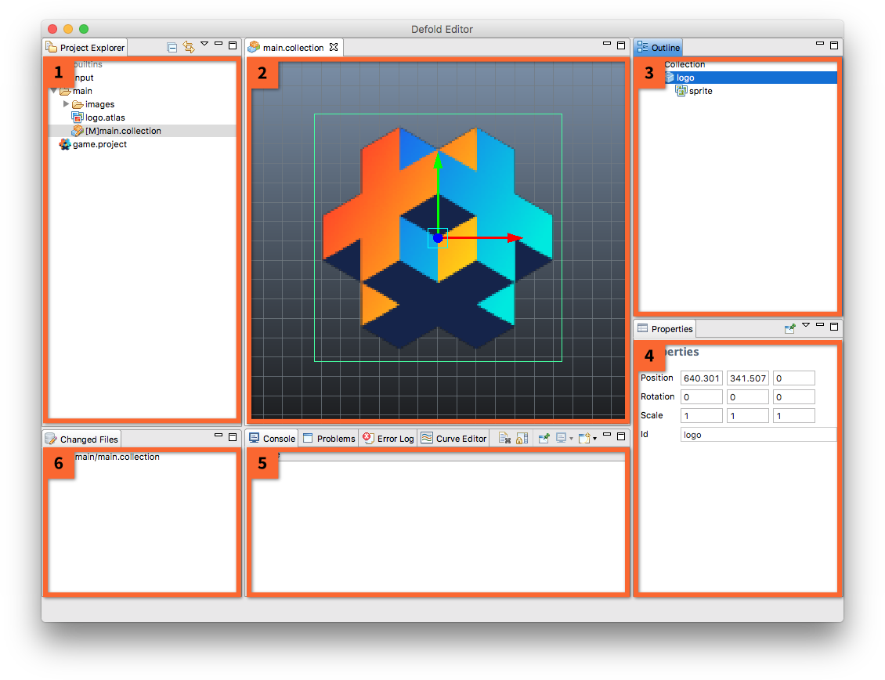

## The editor views

The Defold editor is separated into a set of panes, or views, that display specific information.

The old editor looks different but works very much the same, only with less functionality.

1. The *Assets* view, or *Project Explorer* (editor 1), lists all the files that are part of your project. You click and scroll to navigate the list. All file oriented operations can be made in this view:

   - <kbd>Double click</kbd> a file to open it in an editor for that file type.
   - <kbd>Drag and drop</kbd> to add files from elsewhere on your disk to the project or move files and folders to new locations in the project.
   - <kbd>Right click</kbd> to open a pop up menu from where you can create new files or folders, rename, delete, track file dependencies and more.

2. The *Editor* view in the center shows the currently open file in an editor for that file type.

   In all visual editors you can navigate with the camera:

   - Pan: <kbd>Alt + left mouse button</kbd>.
   - Pan (editor 1): <kbd>Alt + Middle button</kbd> (three button mouse) or <kbd>Option + Ctrl + Mouse button</kbd> (one button mouse)
   - Zoom: <kbd>Alt + Right button</kbd> (three button mouse) or <kbd>Ctrl + Mouse button</kbd> (one button). If your mouse has a scroll wheel, it can be used to zoom.
   - Rotate in 3D (editor 2): <kbd>Ctrl + left mouse button</kbd>.

   The menu <kbd>Scene</kbd> contains tools to move, rotate and scale the currently selected object, options to frame the view to the current selection and to realign the camera. Editor 2 contains a toolbar in the top right where you find the move, rotate and scale tools.

3. The *Outline* shows the content of the file currently being edited, but in a hierarchial tree structure. The outline reflects the editor view and allows you to perform operations on your items:
   - <kbd>Click</kbd> to select an item. Hold <kbd>Shift</kbd> or <kbd>Option</kbd> to expand the selection.
   - <kbd>Drag and drop</kbd> to move items. Drop a game object on another game object in a collection to child it.
   - <kbd>Right click</kbd> to open a pop up menu from where you can add items, delete selected items etc.

5. The *Properties* view shows properties associated with the currently selected item, like Position, Rotation, Animation etc, etc.

6. The *Console* shows any error output or purposeful printing that you do while your game is running. Alongside the console are tabs containing the *Curve Editor* which is used when editing curves in the particle editor, the *Build Errors* view that shows build errors, and the *Search Results* view that displays search results.

7. The *Changed Files* view lists any files that has been changed, added or deleted in your project. By synchronizing the project regularly you can bring your local copy in sync with what is stored in the project Git repository, that way you can collaborate within a team, and you won’t lose your work if unfortune strikes. Some file oriented operations can be performed in this view:

   - <kbd>Double click</kbd> a file to open a diff view of the file. Editor 2 opens the file in a suitable editor, just like in the assets view.
   - <kbd>Right click</kbd> a file to open a pop up menu from where you can open a diff view, revert all changes done to the file, find the file on the filesystem and more (editor 2).
