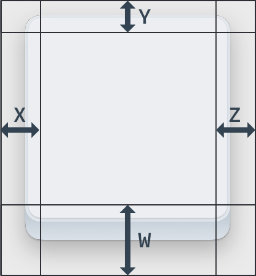
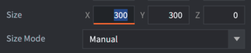
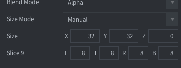
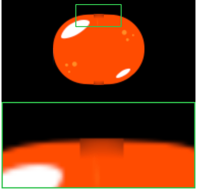

## Slice-9 texturing

GUI box nodes and Sprite components sometimes feature elements that are context sensitive in regard to their size: panels and dialogs that need to be resized to fit the containing content or a health bar that need to be resized to show the remaining health of an enemy. These may cause visual problems when you apply texturing to the resized node or sprite.

Normally, the engine scales the texture to fit the rectangular boundaries, but by defining slice-9 edge areas it is possible to limit what parts of the texture that should scale:

{srcset="../shared/images/gui_slice9_scaling.png@2x.png 2x"}

The *Slice9* box node consists of 4 numbers that specify the number of pixels for the left, top, right and bottom margin that should not be regularly scaled:

{srcset="../shared/images/gui_slice9_properties@2x.png 2x"}

The margins are set clockwise, starting on the left edge:

{srcset="../shared/images/gui_slice9@2x.png 2x"}

- Corner segments are never scaled.
- Edge segments are scaled along a single axis. The left and right edge segments are scaled vertically. The top and bottom edge segments are scaled horizontally.
- The central texture area is scaled horizontally and vertically as needed.

The *Slice9* texture scaling described above is only applied when you change box node's or sprite's size:

{srcset="../shared/images/gui_slice9_size@2x.png 2x"}

::: important
If you change scale parameter of the box node or sprite (or on the game object) - the node or sprite and texture is scaled without applying *Slice9* parameters.
:::

### Mipmaps and slice-9
Due to the way mipmapping works in the renderer, scaling of texture segments can sometimes exhibit artifacts. This happens when you _scale down_ segments below the original texture size. The renderer then selects a lower resolution mipmap for the segment, resulting in visual artifacts.

{srcset="../shared/images/gui_slice9_mipmap@2x.png 2x"}

To avoid this problem, make sure that the texture's segments that will be scaled are small enough never to be scaled down, only up.
