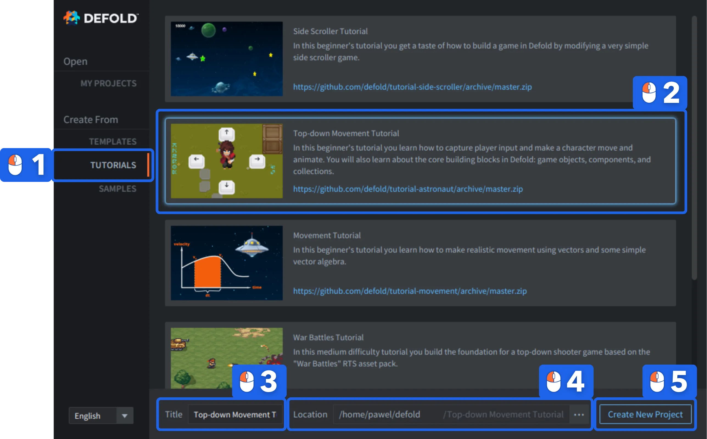

# Top down movement tutorial

In this beginner's tutorial you learn how to define and capture player input and make a character move and animate. You will also learn about the core building blocks in Defold: game objects, components and collections.

In this beginner's tutorial, you will learn how to create a simple top-down character controller in Defold. You will start from a specially prepared project, so you don't have to worry about the assets and basic set up, you will focus instead on mechanics.

You will explore the basic structure of a Defold project, including collections, game objects, sprites, scripts, tilemaps, atlases, and cameras. You will add walking animations to the character, handle player input, move the game object using Lua, normalize diagonal movement, and switch animations based on movement direction.

By the end, you will have a working animated character that moves around a small tilemap level, and you will be ready to expand it further with features such as WASD controls, camera following, or a larger map.

## Run it from the Defold directly

The tutorial is integrated with the Defold editor and easily accessible from the Defold welcome screen:

1. Select *Create From* -> <kbd>Tutorials</kbd> on the left.
2. Select the <kbd>Top-down Movement Tutorial</kbd>.
3. Type a *Title* or your project.
4. Select a *Location* for the project on your local drive.
5. Click <kbd>Create New Project</kbd>.

The editor automatically opens the "README" file from the project root, containing the full tutorial text that you can follow.

{.icon} [You can also read the full tutorial text on Github](https://github.com/defold/tutorial-astronaut)

If you get stuck, head over to the [Defold Forum](//forum.defold.com) where you will get help from the Defold team and many friendly users.

Happy Defolding!
