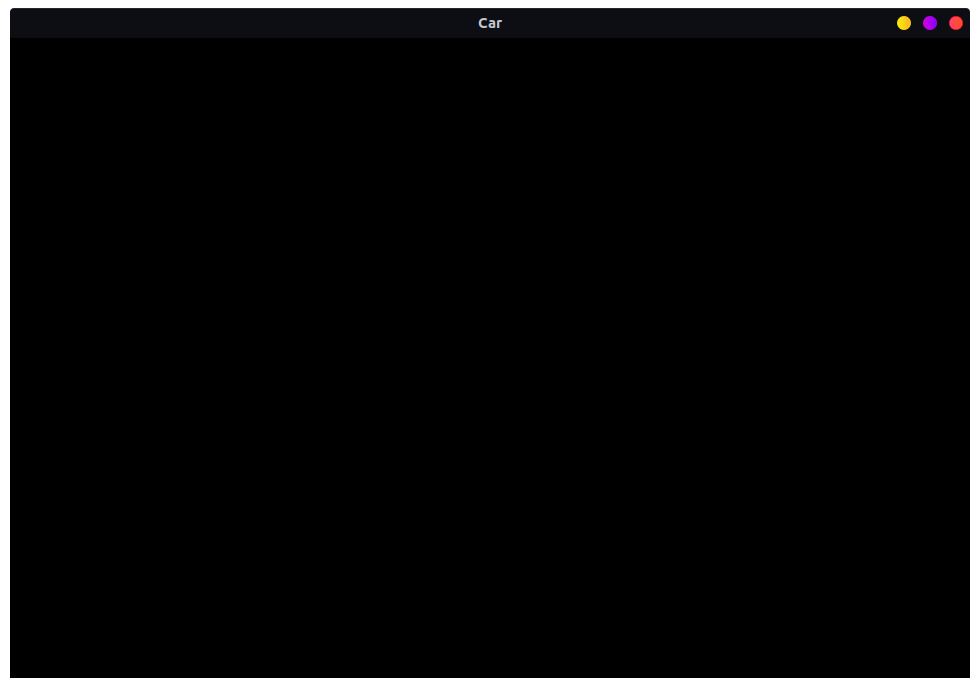
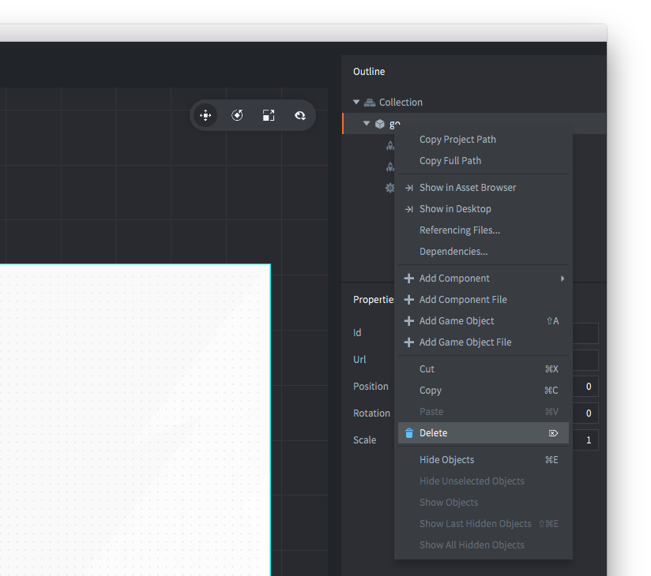
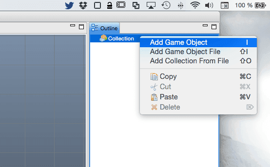
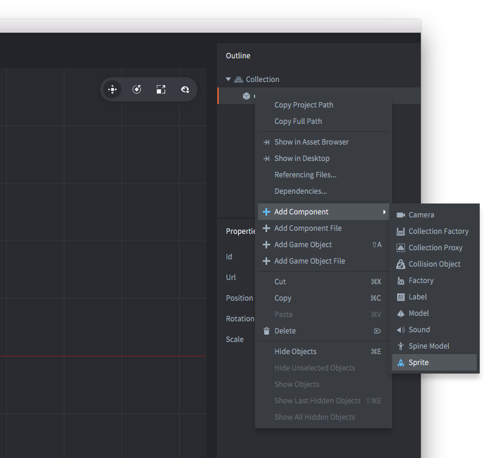
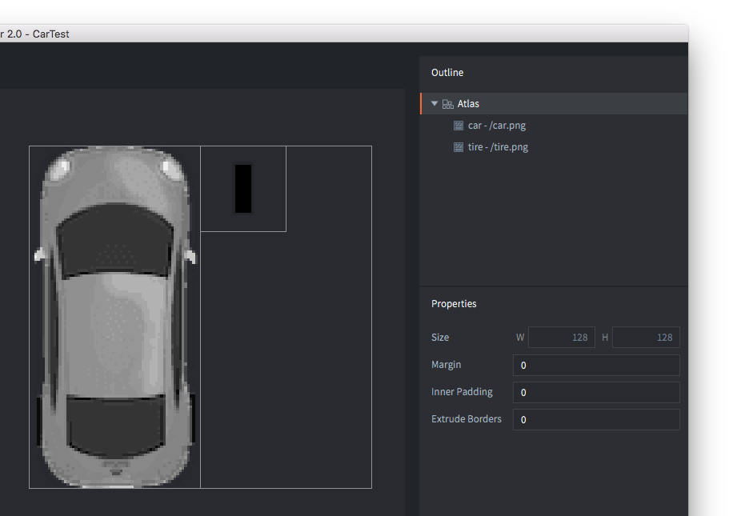
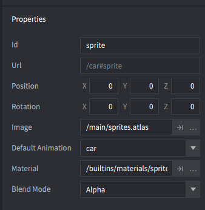
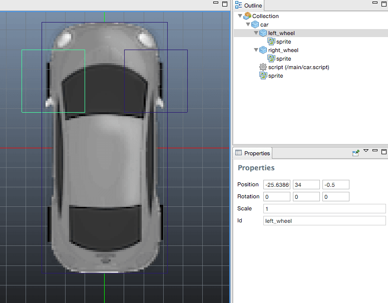
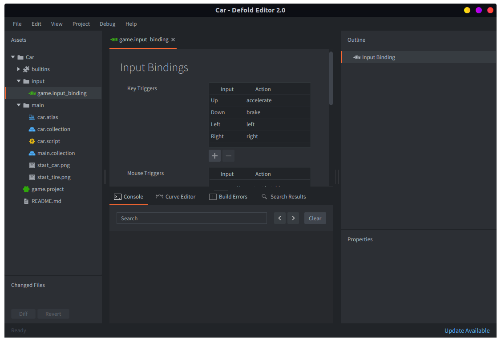
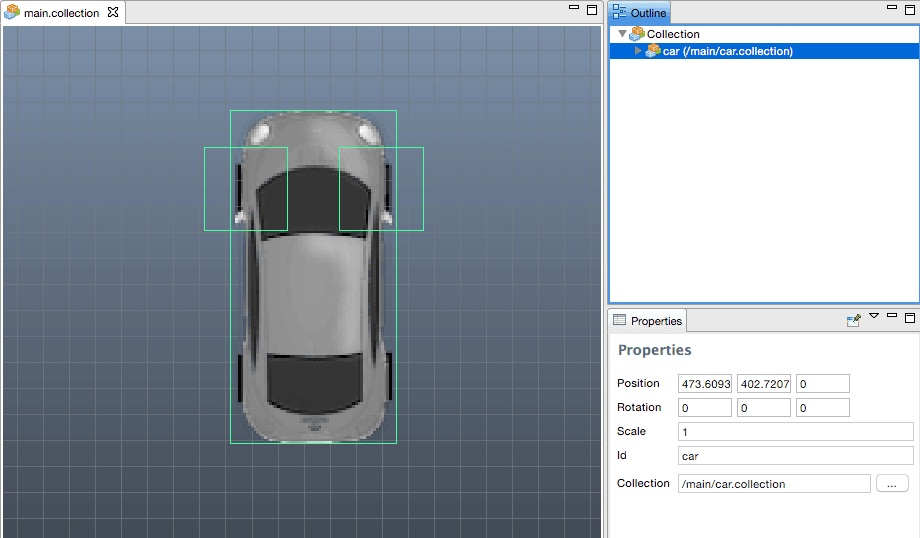

# Building a car

If you are new to Defold, this guide will help you getting your bearings right in the editor. It also explains the basic ideas and the most common building blocks in Defold: Game objects, Collections, Scripts and Sprites.

We're going to start from an empty project and work step by step to a very small, playable application. At the end you will hopefully have a feel for how Defold works and you will be ready to tackle a more extensive tutorial or dive right into the manuals.

## The editor

Start by creating a [new project](/manuals/project-setup/) and opening it in the editor. If you double-click the file *main/main.collection* the file will open up:


The editor consists of the following main areas:

Assets pane
: This is a view of all files in your project. Different file types have different icons. Double click on a file to open in in a designated editor for that file type. The special read-only folder *builtins* is common for all projects and include useful items like a default render script, a font, materials for rendering various components and other things.

Main Editor View
: Depending on which filetype you're editing, this view will show an editor for that type. Most commonly used is the Scene editor that you see here. Each open file is shown in a separate tab.

Changed Files
: Contains a list of all the edits you have made in your branch since last synchronization. So if you see anything in this pane, you have changes that are not on the server yet. You can open a text-only diff and revert changes through this view.

Outline
: The content of the currently edited file in a hierarchical view. You can add, delete, modify and select objects and components through this view.

Properties
: The properties set on the currently selected object or component.

Console
: When running the game, this view captures output (logging, errors, debug info etc) coming from the game engine, and also any custom `print()` and `pprint()` debug messages from your scripts. If your app or game won't start the console is the first thing to check. Behind the console are a set of tabs displaying error information as well as a curve editor that is used when building particle effects.

## Running the game

The "Empty" project template actually isn't completely empty. As you've already seen, it contains one game object with a simple image. Select <kbd>Project ▸ Build and Launch</kbd> to build the project and launch the game.



It's perhaps not very exciting, but it's a running Defold game application and we can easily modify it into something more interesting. So let's do that.

First of all, let's clean the file *main.collection* of the one game object it contains. Select "logo" in the *Outline* view, right-click and select *Delete*. That's it. If you run the game again, the application window will be totally black.



## Assembling the car

The first thing we're going to do is to create a new collection. A collection is a container of game objects that you have placed and put into position. Collections are most commonly used to build game levels but they are very useful whenever you need to reuse groups and/or hierarchies of game objects that belong together. It might be helpful to think about collections as a kind of prefab.

Click on the *main* folder in the *Assets pane*, then right-click and select <kbd>New ▸ Collection File</kbd>. You can also select <kbd>File ▸ New ▸ Collection File</kbd> from the main menu.


Name the new collection file *car.collection* and open it. We're going to use this new, empty collection to build a small car out of a couple of game objects. A game object is a container of components (like sprites, sounds, logic scripts etc) that you use to build your game. Each game object is uniquely identified in the game by its id. Game objects can communicate with each other through message passing, but more on that later.

Also, it's possible to create a game object in place in a collection, as we did here. That results in a one-of-a-kind object. You can copy that object but each copy is separate---changing one does not affect the others. This means that if you create 10 copies of a game object and realize that you want to change them all, you will need to edit all 10 instances of the object. Therefore, in place created game objects should be used for objects that you do not intend to make a lot of copies of.

However, a game object that is stored in a _file_ works as a blueprint. When you place instances of a file stored game object in a collection each object is placed _by reference_---it is a clone based on the blueprint. If you decide you need to change the blueprint, every single placed game object based on that blueprint is instantly updated.



Select the root "Collection" node in the *Outline* view, right-click and select <kbd>Add Game Object</kbd>. A new game object with the id "go" will appear in the collection. Mark it and set its id to "car" in the *Properties* view. So far, "car" is very uninteresting. It is empty, has neither visual representation nor any logic. To add a visual representation, we need to add a sprite _component_.

Components are used to extend game objects with presence (graphics, sound) and functionality (spawn factories, collisions, scripted behaviors). A component can't exist by itself but has to reside inside a game object. Components are usually defined in place in the same file as the game object. However, if you want to reuse a component you can store it in a separate file (like you can with game objects) and include it as a reference in any game object file. Some component types (Lua scripts, for instance) has to be placed in a separate component file and then included as reference in your objects.

Note that you do not manipulate components directly---you can move, rotate, scale and animate properties of game objects that in turn contain components.



Select the "car" game object, right-click and select <kbd>Add Component</kbd>, then select *Sprite* and click *Ok*. If you mark the sprite in the *Outline* view you will see that it needs a few properties set:

Image
: This requires an image source for the sprite. Create an atlas image file by marking "main" in the *Assets pane* view, right-clicking and selecting <kbd>New ▸ Atlas File</kbd>. Name the new atlas file *sprites.atlas* and double click it to open it in the atlas editor. Save the following two image files to your computer and drag them into *main* in the *Assets pane* view. Now you can mark the Atlas root node in the atlas editor, right click and select <kbd>Add Images</kbd>. Add the car and the tire image to the atlas and save. Now you can select *sprites.atlas* as the image source for the sprite component in the "car" game object in the "car" collection.

Images for our game:


Add these images to the atlas:





Default Animation
: Set this to "car" (or whatever you named the car image). Each sprite needs a default animation that is played when it is shown in the game. When you add images to an atlas, Defold conveniently creates one-frame (still) animations for each image file.

## Completing the car

Continue by adding two more game objects in the collection. Call them "left_wheel" and "right_wheel" and put a sprite component in each, showing the tire image that we added to *sprites.atlas*. Then grab the wheel game objects and drop them onto "car" to make them children under "car". Game objects that are children under other game objects will be attached to their parent when the parent moves. They can be moved individually as well, but all motion happens relative to the parent object. For the tires this is perfect since we want them to stick to the car and we can just rotate them slightly left and right as we steer the car. A collection can contain any number of game objects, side by side or arranged into complex parent-child trees, or a mix.

Move the tire game objects into place by selecting them and then choosing <kbd>Scene ▸ Move Tool</kbd>. Grab the arrow handlebars, or the center green square to move the object to a good spot. The final thing we need to do is to make sure that the tires are drawn below the car. We do that by setting the Z component of the position to -0.5. Every visual item in a game is drawn from the back to front, sorted on their Z value. An object with a Z-value of 0 will be drawn on top of an object with a Z-value of -0.5. Since the default Z-value of the car game object is 0, the new value on the tire objects will put them under the car image.



The last piece of the puzzle is a _script_ to control the car. A script is a component that contains a program that defines game object behaviors. With scripts you can specify the rules of your game, how objects should respond to various interactions (with the player as well as other objects). All scripts are written in the Lua programming language. To be able to work with Defold, you or someone on your team needs to learn how to program in Lua.

Mark "main" in the *Assets pane*, right-click and select <kbd>New ▸ Script File</kbd>. Name the new file *car.script*, then add it to the "car" game object by marking "car" in the *Outline* view, right click and select <kbd>Add Component File</kbd>. Select *car.script* and click *OK*. Save the collection file.

Double click *car.script* and edit the script so it contains the following:

```lua
-- car.script
-- Constants
local turn_speed = 0.1                           -- Slerp factor
local max_steer_angle_left = vmath.quat_rotation_z(math.pi / 6)     -- 30 degrees
local max_steer_angle_right = vmath.quat_rotation_z(-math.pi / 6)   -- -30 degrees
local wheels_vector = vmath.vector3(0, 72, 0)               -- Vector from center of back and front wheel pairs

function init(self)
    -- Send a message to the render script (see builtins/render/default.render_script) to set the clear color.
    -- This changes the background color of the game. The vector4 contains color information
    -- by channel from 0-1: Red = 0.2. Green = 0.2, Blue = 0.2 and Alpha = 1.0
    msg.post("@render:", "clear_color", { color = vmath.vector4(0.2, 0.2, 0.2, 1.0) } )

    -- Acquire input focus so we can react to input
    msg.post(".", "acquire_input_focus")

    -- Some variables
    self.steer_angle = vmath.quat()
    self.direction = vmath.quat()

    -- Velocity and acceleration are car relative (not rotated)
    self.velocity = vmath.vector3()
    self.acceleration = vmath.vector3()
end

function update(self, dt)
    -- Calculate new velocity based on current acceleration
    self.velocity = self.velocity + self.acceleration * dt

    -- Calculate the new positions of front and back wheels
    local front_vel = vmath.rotate(self.steer_angle, self.velocity)
    local new_front_pos = vmath.rotate(self.direction, wheels_vector + front_vel)
    local new_back_pos = vmath.rotate(self.direction, self.velocity)

    -- Calculate the car's new direction
    local new_dir = vmath.normalize(new_front_pos - new_back_pos)
    self.direction = vmath.quat_rotation_z(math.atan2(new_dir.y, new_dir.x) - math.pi / 2)

    -- Update position based on current velocity and direction
    local pos = go.get_position()
    pos = pos + vmath.rotate(self.direction, self.velocity)
    go.set_position(pos)

    -- Set the game object's rotation to the direction
    go.set_rotation(self.direction)
end

function on_message(self, message_id, message, sender)
    if message_id == hash("left") then
        -- Interpolate the steering angle.
        self.steer_angle = vmath.slerp(turn_speed, self.steer_angle, max_steer_angle_left)
        go.set_rotation(self.steer_angle, "left_wheel")
        go.set_rotation(self.steer_angle, "right_wheel")
    elseif message_id == hash("right") then
        -- Interpolate the steering angle.
        self.steer_angle = vmath.slerp(turn_speed, self.steer_angle, max_steer_angle_right)
        go.set_rotation(self.steer_angle, "left_wheel")
        go.set_rotation(self.steer_angle, "right_wheel")
    elseif message_id == hash("set_acceleration") then
        -- Set acceleration y component (car relative) to the message data field "acc".
        self.acceleration.y = message.acc
    end
end

function on_input(self, action_id, action)
    if action_id == hash("left") then
        msg.post("#", "left")
    elseif action_id == hash("right") then
        msg.post("#", "right")
    elseif action_id == hash("accelerate") and action.value == 1 then
        msg.post("#", "set_acceleration", { acc = 10 })
    elseif action_id == hash("accelerate") and action.value == 0 then
        msg.post("#", "set_acceleration", { acc = 0 })
    elseif action_id == hash("brake") and action.value == 1 then
        msg.post("#", "set_acceleration", { acc = -10 })
    elseif action_id == hash("brake") and action.value == 0 then
        msg.post("#", "set_acceleration", { acc = 0 })
    end
end
```

Don't forget to save your edits. The script contains 5 parts:

Constants
: At the top we define a couple of local variables that we use as constants throughout the script. This is optional but usually a good practice since it makes changes of the values easier.

`init()`
: The function `init()` is run when the game object that the script component exists in is brought to life in the game. This function is usually used to set up internal variables, that we add to the game object "self" that is passed to the function. Any variable added to "self" will be kept through the lifetime of the game object. This script sends two messages during initialization. The first is to the rendering system, which sets the background color for the game. The second message is sent to the game object harboring the script ("." is shorthand for that) asking the game object to start receiving input.

`update()`
: This function is called once each frame (i.e. 60 times a second) during the lifetime of the game object. We use the function to calculate the speed and direction of the car based on the rotation of the car and the tires. The parameter "dt" is the current timestep (1/60 of a second in this case) and we use that to scale the calculations right. The way steering is computed is an approximation but yields pretty good results if the steering angles are not too extreme. After the calculations, the script updates the position of the game object. This affects all components in the game object (the car body sprite) as well as any child game objects (the tires).

`on_message()`
: This function is called whenever a message arrives to the script component. We check what message is arriving and take proper action, setting game object variables to new values. If steering left or right, we interpolate with `vmath.slerp()` against the max values, if we are accelerating or decelerating both are handled by the message "set_acceleration" and a message value "acc" with the value of acceleration, positive or negative.

`on_input()`
: Since this game object listens to input (through the message "acquire_input_focus" in `init()` we receive input actions. Input are mapped from actual key, mouse, touch or game pad input to input "actions". We react to steering, accelerate and brake actions. When these actions arrive we send messages to the script component itself ("#" is shorthand for that) and through the logic in `on_message()` the car reacts. Now, we could just as well have skipped `on_message()` and put all logic straight into `on_input()` but there are benefits to using messages like we do. By allowing the car object to react to messages we can move the input handling to a different place, or perhaps add an AI driver somewhere that could drive the car through messages.

## Input

There is no input actions set up yet, so let's fix that. Open the file */input/game.input_bindings* and add *key_trigger* bindings for "accelerate", "brake", "left" and "right". We set them to the arrow keys (KEY_LEFT, KEY_RIGHT, KEY_UP and KEY_DOWN):



## Adding the car to the game

Now the car is ready to roll. We have created it inside "car.collection" but it does not yet exist in the game. That is because the engine currently loads "main.collection" on startup. To fix that we simply have to add *car.collection* to *main.collection*. Open *main.collection*, mark the "Collection" root node in the *Outline* view, right-click and select <kbd>Add Collection From File</kbd>, select *car.collection* and click *OK*. Now the contents of the *car.collection* will be placed in *main.collection* as new instances. If you change the content of *car.collection*, each instance of the collection will be updated automatically when the game is built.



## Trying the final game

Now, select <kbd>Project ▸ Build And Launch</kbd> from the main menu and take your new car for a spin!

(You can try it right here in the browser if you want. Use the arrow keys to control the car)

<div id="game-container" class="game-container">
    
    <canvas id="game-canvas" tabindex="1" width="1280" height="720">
    </canvas>
    <button id="game-button">
        START GAME <span class="icon"></span>
    </button>
    <script src="//storage.googleapis.com/defold-doc/assets/dmloader.js">
    </script>
    <script src="//storage.googleapis.com/defold-doc/assets/dmengine_1_2_106.js" async>
    </script>
    <script>
        /* Load app on click in container. */
        document.getElementById("game-button").onclick = function (e) {
            var extra_params = {
                archive_location_filter: function( path ) {
                    return ("//storage.googleapis.com/defold-doc/assets/car" + path + "");
                },
                load_done: function() {},
                game_start: function() {
                    var e = document.getElementById("game-preview");
                    e.parentElement.removeChild(e);
                }
            }
            Module.runApp("game-canvas", extra_params);
            document.getElementById("game-button").style.display = 'none';
            document.getElementById("game-button").onclick = null;
        };
    </script>
</div>

If you want you can try to add more instances of *car.collection* to *main.collection*. Each instance is a clone of what's inside *car.collection* with the exact same behavior. Each one listens to input and reacts to the same messages.

That concludes this introductory tutorial. Now go ahead and dive into Defold. We have lots of [manuals and tutorials](/learn) prepared to guide you, and if you get stuck, you are very welcome to the [forum](//forum.defold.com).

Happy Defolding!
