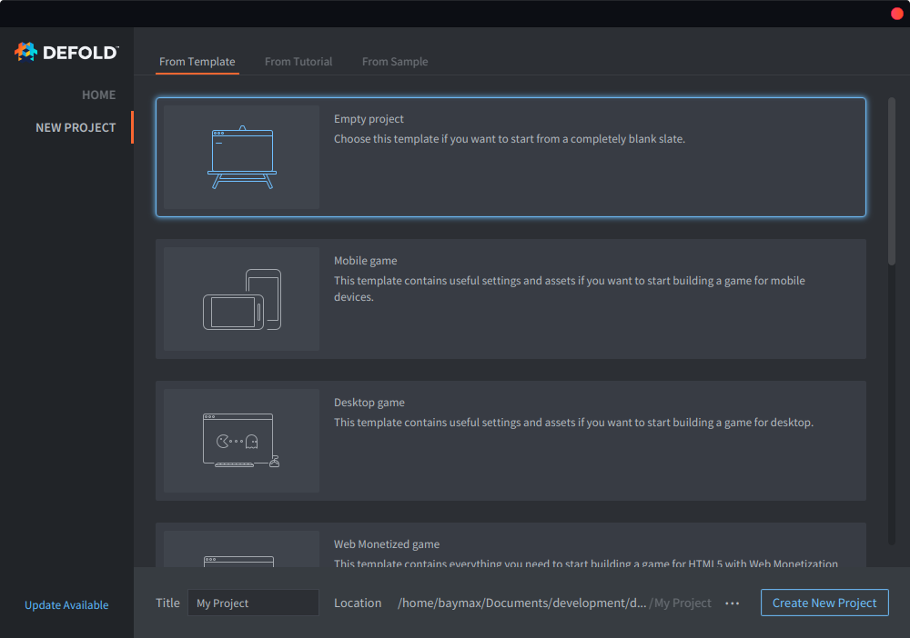
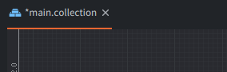

# Building a car

If you are new to Defold, this guide will help you getting your bearings right in the editor. It also explains the basic ideas and the most common building blocks in Defold: Game objects, Collections, Scripts and Sprites.

We're going to start from an empty project and work step by step to a very small, playable application. At the end you will hopefully have a feel for how Defold works and you will be ready to tackle a more extensive tutorial or dive right into the manuals.

::: sidenote
Throughout the tutorial, detailed descriptions on concepts and how to do certain moments are marked like this paragraph. If you feel that these section go into too much detail, please skip them.
:::

## Creating a new project



1. Start Defold.
2. Select *New Project* on the left.
3. Select the *From Template* tab.
4. Select *Empty Project*
5. Select a location for the project on your local drive.
6. Click *Create New Project*.

## The editor

Start by creating a [new project](/manuals/project-setup/) and opening it in the editor. If you double-click the file *main/main.collection* the file will open up:


The editor consists of the following main areas:

Assets pane
: This is a view of all files in your project. Different file types have different icons. Double click on a file to open in in a designated editor for that file type. The special read-only folder *builtins* is common for all projects and include useful items like a default render script, a font, materials for rendering various components and other things.

Main Editor View
: Depending on which filetype you're editing, this view will show an editor for that type. Most commonly used is the Scene editor that you see here. Each open file is shown in a separate tab.

Changed Files
: Contains a list of all the edits you have made in your branch since last synchronization. So if you see anything in this pane, you have changes that are not on the server yet. You can open a text-only diff and revert changes through this view.

Outline
: The content of the currently edited file in a hierarchical view. You can add, delete, modify and select objects and components through this view.

Properties
: The properties set on the currently selected object or component.

Console
: When running the game, this view captures output (logging, errors, debug info etc) coming from the game engine, and also any custom `print()` and `pprint()` debug messages from your scripts. If your app or game won't start the console is the first thing to check. Behind the console are a set of tabs displaying error information as well as a curve editor that is used when building particle effects.

## Running the game

The "Empty" project template actually is completely empty. Nonetheless, select <kbd>Project ▸ Build and Launch</kbd> to build the project and launch the game.


A black screen is perhaps not very exciting, but it's a running Defold game application and we can easily modify it into something more interesting. So let's do that.

::: sidenote
The Defold editor works on files. By double-clicking a file in the *Assets pane* you open it in a suitable editor. You can then work with the contents of the file.

When you are done editing a file you have to save it. Select <kbd>File ▸ Save</kbd> in the main menu. The editor gives a hint by adding an asterisk '\*' to the filename in the tab for any file that contain unsaved changes.


:::

## Assembling the car

The first thing we're going to do is to create a new collection. A collection is a container of game objects that you have placed and put into position. Collections are most commonly used to build game levels but they are very useful whenever you need to reuse groups and/or hierarchies of game objects that belong together. It might be helpful to think about collections as a kind of prefab.

Click on the *main* folder in the *Assets pane*, then right-click and select <kbd>New ▸ Collection File</kbd>. You can also select <kbd>File ▸ New ▸ Collection File</kbd> from the main menu.


Name the new collection file *car.collection* and open it. We're going to use this new, empty collection to build a small car out of a couple of game objects. A game object is a container of components (like sprites, sounds, logic scripts etc) that you use to build your game. Each game object is uniquely identified in the game by its id. Game objects can communicate with each other through message passing, but more on that later.

Also, it's possible to create a game object in place in a collection, as we did here. That results in a one-of-a-kind object. You can copy that object but each copy is separate---changing one does not affect the others. This means that if you create 10 copies of a game object and realize that you want to change them all, you will need to edit all 10 instances of the object. Therefore, in place created game objects should be used for objects that you do not intend to make a lot of copies of.

However, a game object that is stored in a _file_ works as a blueprint. When you place instances of a file stored game object in a collection each object is placed _by reference_---it is a clone based on the blueprint. If you decide you need to change the blueprint, every single placed game object based on that blueprint is instantly updated.


Select the root "Collection" node in the *Outline* view, right-click and select <kbd>Add Game Object</kbd>. A new game object with the id "go" will appear in the collection. Mark it and set its id to "car" in the *Properties* view. So far, "car" is very uninteresting. It is empty, has neither visual representation nor any logic. To add a visual representation, we need to add a sprite _component_.

Components are used to extend game objects with presence (graphics, sound) and functionality (spawn factories, collisions, scripted behaviors). A component can't exist by itself but has to reside inside a game object. Components are usually defined in place in the same file as the game object. However, if you want to reuse a component you can store it in a separate file (like you can with game objects) and include it as a reference in any game object file. Some component types (Lua scripts, for instance) has to be placed in a separate component file and then included as reference in your objects.

Note that you do not manipulate components directly---you can move, rotate, scale and animate properties of game objects that in turn contain components.


Select the "car" game object, right-click and select <kbd>Add Component</kbd>, then select *Sprite* and click *Ok*. If you mark the sprite in the *Outline* view you will see that it needs a few properties set:

Image
: This requires an image source for the sprite. Create an atlas image file by marking "main" in the *Assets pane* view, right-clicking and selecting <kbd>New ▸ Atlas File</kbd>. Name the new atlas file *sprites.atlas* and double click it to open it in the atlas editor. Save the following two image files to your computer and drag them into *main* in the *Assets pane* view. Now you can mark the Atlas root node in the atlas editor, right click and select <kbd>Add Images</kbd>. Add the car and the tire image to the atlas and save. Now you can select *sprites.atlas* as the image source for the sprite component in the "car" game object in the "car" collection.

Images for our game:


Add these images to the atlas:


Default Animation
: Set this to "car" (or whatever you named the car image). Each sprite needs a default animation that is played when it is shown in the game. When you add images to an atlas, Defold conveniently creates one-frame (still) animations for each image file.

## Completing the car

Continue by adding two more game objects in the collection. Call them "left_wheel" and "right_wheel" and put a sprite component in each, showing the tire image that we added to *sprites.atlas*. Then grab the wheel game objects and drop them onto "car" to make them children under "car". Game objects that are children under other game objects will be attached to their parent when the parent moves. They can be moved individually as well, but all motion happens relative to the parent object. For the tires this is perfect since we want them to stick to the car and we can just rotate them slightly left and right as we steer the car. A collection can contain any number of game objects, side by side or arranged into complex parent-child trees, or a mix.

Move the tire game objects into place by selecting them and then choosing <kbd>Scene ▸ Move Tool</kbd>. Grab the arrow handlebars, or the center green square to move the object to a good spot. The final thing we need to do is to make sure that the tires are drawn below the car. We do that by setting the Z component of the position to -0.5. Every visual item in a game is drawn from the back to front, sorted on their Z value. An object with a Z-value of 0 will be drawn on top of an object with a Z-value of -0.5. Since the default Z-value of the car game object is 0, the new value on the tire objects will put them under the car image.


## The car script

The last piece of the puzzle is a _script_ to control the car. A script is a component that contains a program that defines game object behaviors. With scripts you can specify the rules of your game, how objects should respond to various interactions (with the player as well as other objects). All scripts are written in the Lua programming language. To be able to work with Defold, you or someone on your team needs to learn how to program in Lua.

Mark "main" in the *Assets pane*, right-click and select <kbd>New ▸ Script File</kbd>. Name the new file *car.script*, then add it to the "car" game object by marking "car" in the *Outline* view, right click and select <kbd>Add Component File</kbd>. Select *car.script* and click *OK*. Save the collection file.

Double click *car.script* to open it.

::: sidenote
Defold provides several lifecycle functions to code game logic. Read more about them in the [Script Manual](/manuals/script).
:::

Start by removing the `final`, `on_message` and `on_reload` functions as we won't be needing them
for this tutorial.

Next, add the following lines of code before the init function start starts.

```lua
-- Constants
local turn_speed = 0.1                           									 -- Slerp factor
local max_steer_angle_left = vmath.quat_rotation_z(math.pi / 6)     -- 30 degrees
local max_steer_angle_right = vmath.quat_rotation_z(-math.pi / 6)   -- -30 degrees
local steer_angle_zero = vmath.quat_rotation_z(0)									 -- Zero degrees
local wheels_vector = vmath.vector3(0, 72, 0)         		        	-- Vector from center of back and front wheel pairs

local acceleration = 50 																						-- The acceleration of the car

-- prehash the inputs
local left = hash("left")
local right = hash("right")
local accelerate = hash("accelerate")
local brake = hash("brake")
```

The changes made here are fairly simple, we just added a bunch of `constants` to our script that we'll be using later on to code our car.

::: sidenote
Pay notice to how we store the hashes beforehand in variables. It is actually a good practice to do so as it makes your code more readable and performant.
:::

Next, edit the `init` function so that it contains the following:

```lua
function init(self)
	-- Send a message to the render script (see builtins/render/default.render_script) to set the clear color.
	-- This changes the background color of the game. The vector4 contains color information
	-- by channel from 0-1: Red = 0.2. Green = 0.2, Blue = 0.2 and Alpha = 1.0
	msg.post("@render:", "clear_color", { color = vmath.vector4(0.2, 0.2, 0.2, 1.0) } )		--<1>

	-- Acquire input focus so we can react to input
	msg.post(".", "acquire_input_focus")		-- <2>

	-- Some variables
	self.steer_angle = vmath.quat()				 -- <3>
	self.direction = vmath.quat()

	-- Velocity and acceleration are car relative (not rotated)
	self.velocity = vmath.vector3()
	self.acceleration = vmath.vector3()

	-- Input vector. This is modified later in the on_input function
	-- to store the input.
	self.input = vmath.vector3()
end
```

Wondering what we just changed? Here is an explanation.

1. Send a message to our render script asking it set the background color to grey. Render scripts are special scripts in Defold that control how objects are shown on the screen.
2. To listen to input actions in a script component or GUI script, the message `acquire_input_focus` needs to be sent to the game object holding the component. In our case we send this message to the gameobject that holds the car script.
3. Then, we declare some variables that we'll use to keep track of the current state of our car.

That was easy now, wasn't it? We'll continue now by editing the `update` function so that it now contains the following:

```lua
function update(self, dt)
	-- Set acceleration to the y input
	self.acceleration.y = self.input.y * acceleration				-- <1>

	-- Calculate the new positions of front and back wheels
	local front_vel = vmath.rotate(self.steer_angle, self.velocity)
	local new_front_pos = vmath.rotate(self.direction, wheels_vector + front_vel)
	local new_back_pos = vmath.rotate(self.direction, self.velocity)								-- <2>

	-- Calculate the car's new direction
	local new_dir = vmath.normalize(new_front_pos - new_back_pos)
	self.direction = vmath.quat_rotation_z(math.atan2(new_dir.y, new_dir.x) - math.pi / 2)			-- <3>

	-- Calculate new velocity based on current acceleration
	self.velocity = self.velocity + self.acceleration * dt			-- <4>

	-- Update position based on current velocity and direction
	local pos = go.get_position()
	pos = pos + vmath.rotate(self.direction, self.velocity)
	go.set_position(pos)																			-- <5>

	-- Interpolate the wheels using vmath.slerp
	if self.input.x > 0 then																		-- <6>
		self.steer_angle = vmath.slerp(turn_speed, self.steer_angle, max_steer_angle_right)
	elseif self.input.x < 0 then
		self.steer_angle = vmath.slerp(turn_speed, self.steer_angle, max_steer_angle_left)
	else
		self.steer_angle = vmath.slerp(turn_speed, self.steer_angle, steer_angle_zero)
	end

	-- Update the wheel rotation
	go.set_rotation(self.steer_angle, "left_wheel")					-- <7>
	go.set_rotation(self.steer_angle, "right_wheel")

	-- Set the game object's rotation to the direction
	go.set_rotation(self.direction)

	-- reset acceleration and input
	self.acceleration = vmath.vector3()								-- <8>
	self.input = vmath.vector3()
end
```

That was a huge function! But don't worry, this is how it all works:

1. We first set our acceleration vector based on our input vector. This ensures that the car's acceleration is in the direction of the input.
2. Next, the displacement of both the wheels is calculated based on the simple logic that while the back wheels of the car always move forward, the front wheel move in the direction they're turned towards.
3. Based on the displacement of both wheels, the new direction of motion of our car is calculated.
4. Here, we add the calculated acceleration to the velocity.
5. Finally, we update the position of the car based on our current velocity.
6. We slerp the steering angle based on our left/right input. This is done so that the wheels don't snap instantly whenever the input changes.
7. The rotation of the the wheels is then set based on the current steer angle of the car. Similarily, the rotation of the car is set based on the direction it is currently moving in.
8. Finally, we reset the acceleration and input vectors.

Finally, it is time to make our car react to input. Update the `on_input` function so it looks like this:

```lua
function on_input(self, action_id, action)
	-- set the input vector to correspond to the key press
	if action_id == left then
		self.input.x = -1
	elseif action_id == right then
		self.input.x = 1
	elseif action_id == accelerate then
		self.input.y = 1
	elseif action_id == brake then
		self.input.y = -1
	end
end
```

This function is actually fairly simple, we just accept the input and set our input vector.

Don't forget to save your edits.

## Input

There is no input actions set up yet, so let's fix that. Open the file */input/game.input_bindings* and add *key_trigger* bindings for "accelerate", "brake", "left" and "right". We set them to the arrow keys (KEY_LEFT, KEY_RIGHT, KEY_UP and KEY_DOWN):


## Adding the car to the game

Now the car is ready to roll. We have created it inside "car.collection" but it does not yet exist in the game. That is because the engine currently loads "main.collection" on startup. To fix that we simply have to add *car.collection* to *main.collection*. Open *main.collection*, mark the "Collection" root node in the *Outline* view, right-click and select <kbd>Add Collection From File</kbd>, select *car.collection* and click *OK*. Now the contents of the *car.collection* will be placed in *main.collection* as new instances. If you change the content of *car.collection*, each instance of the collection will be updated automatically when the game is built.


Now, select <kbd>Project ▸ Build</kbd> and take your new car for a spin!
You'll notice that you're now able to move to make the car move to your will. But something isn't right yet. When you leave the controls, the car does not stop, as it should have. It's time to add that in!

## Drag to the rescue

Whenever an object moves in the real world, the force of drag acts against the object causing it to slow down. This force almost falls proportional to the square velocity of the moving object, and hence can be described as `D = k * |V| * V` where `k` is a constant, `V` is the velocity and `|V|` its magnitude (speed). Let's add that.

In the constants section at the top of the script, add the following constant

```lua
local drag = 1.1	        --the drag constant <1>
```

Then in the update function, just above this line add the following lines and save the file.

```lua
function update(self, dt)
	...
  -- Calculate new velocity based on current acceleration
	self.velocity = self.velocity + self.acceleration * dt
  ...
end
```

```lua
function update(self, dt)
	...
	-- Speed is the magnitude of the velocity
	local speed = vmath.length_sqr(self.velocity)

	-- Apply drag
	self.acceleration = self.acceleration - speed * self.direction * drag

	-- Stop if we are already slow enough
	if speed < 0.5 then self.velocity = vmath.vector3(0) end
  ...
end
```

1. Declare the drag value as a constant.
2. Calculate the speed with which we are moving.
3. Apply the drag to the current acceleration based on the formula
4. Stop if the car is already slow enough.

## The complete car script

After completing the above steps, your *car.script* should look like :

```lua
local turn_speed = 0.1                           					-- Slerp factor
local max_steer_angle_left = vmath.quat_rotation_z(math.pi / 6)	    -- 30 degrees
local max_steer_angle_right = vmath.quat_rotation_z(-math.pi / 6)   -- -30 degrees
local steer_angle_zero = vmath.quat_rotation_z(0)					-- Zero degrees
local wheels_vector = vmath.vector3(0, 72, 0)         				-- Vector from center of back and front wheel pairs

local acceleration = 100 											-- The acceleration of the car
local drag = 1.1	-- the drag constant

function init(self)
	-- Send a message to the render script (see builtins/render/default.render_script) to set the clear color.
	-- This changes the background color of the game. The vector4 contains color information
	-- by channel from 0-1: Red = 0.2. Green = 0.2, Blue = 0.2 and Alpha = 1.0
	msg.post("@render:", "clear_color", { color = vmath.vector4(0.2, 0.2, 0.2, 1.0) } )

	-- Acquire input focus so we can react to input
	msg.post(".", "acquire_input_focus")

	-- Some variables
	self.steer_angle = vmath.quat()
	self.direction = vmath.quat()

	-- Velocity and acceleration are car relative (not rotated)
	self.velocity = vmath.vector3()
	self.acceleration = vmath.vector3()

	-- Input vector. This is modified later in the on_input function
	-- to store the input.
	self.input = vmath.vector3()
end

function update(self, dt)
	-- Set acceleration to the y input
	self.acceleration.y = self.input.y * acceleration

	-- Calculate the new positions of front and back wheels
	local front_vel = vmath.rotate(self.steer_angle, self.velocity)
	local new_front_pos = vmath.rotate(self.direction, wheels_vector + front_vel)
	local new_back_pos = vmath.rotate(self.direction, self.velocity)

	-- Calculate the car's new direction
	local new_dir = vmath.normalize(new_front_pos - new_back_pos)
	self.direction = vmath.quat_rotation_z(math.atan2(new_dir.y, new_dir.x) - math.pi / 2)

	-- Speed is the magnitude of the velocity
	local speed = vmath.length(self.velocity)

	-- Apply drag
	self.acceleration = self.acceleration - speed * self.velocity * drag

	-- Stop if we are already slow enough
	if speed < 0.5 then self.velocity = vmath.vector3() end

	-- Calculate new velocity based on current acceleration
	self.velocity = self.velocity + self.acceleration * dt

	-- Update position based on current velocity and direction
	local pos = go.get_position()
	pos = pos + vmath.rotate(self.direction, self.velocity)
	go.set_position(pos)

	-- Interpolate the wheels using vmath.slerp
	if self.input.x > 0 then
		self.steer_angle = vmath.slerp(turn_speed, self.steer_angle, max_steer_angle_right)
	elseif self.input.x < 0 then
		self.steer_angle = vmath.slerp(turn_speed, self.steer_angle, max_steer_angle_left)
	else
		self.steer_angle = vmath.slerp(turn_speed, self.steer_angle, steer_angle_zero)
	end

	-- Update the wheel rotation
	go.set_rotation(self.steer_angle, "left_wheel")
	go.set_rotation(self.steer_angle, "right_wheel")

	-- Set the game object's rotation to the direction
	go.set_rotation(self.direction)

	-- reset acceleration and input
	self.acceleration = vmath.vector3()
	self.input = vmath.vector3()
end

function on_input(self, action_id, action)
	-- set the input vector to correspond to the key press
	if action_id == hash("left") then
		self.input.x = -1
	elseif action_id == hash("right") then
		self.input.x = 1
	elseif action_id == hash("accelerate") then
		self.input.y = 1
	elseif action_id == hash("brake") then
		self.input.y = -1
	end
end
```

## Trying the final game

Now, select <kbd>Project ▸ Build</kbd> from the main menu and take your new car for a spin!

That concludes this introductory tutorial. Here is a set of challenges that you may wish to tackle on your own:

1. Currently the car moves with the same acceleration in both forward and backward direction. You may wish to change this so that the car moves slower when it is moving backwards.
2. Make some of the constants (like acceleration) `properties` so that they can be changed for different instances of the car.
3. Add sounds to your car and make it go vroom! ([Hint](manuals/sound/))

Now go ahead and dive into Defold. We have lots of [manuals and tutorials](/learn) prepared to guide you, and if you get stuck, you are very welcome to the [forum](//forum.defold.com).

Happy Defolding!
