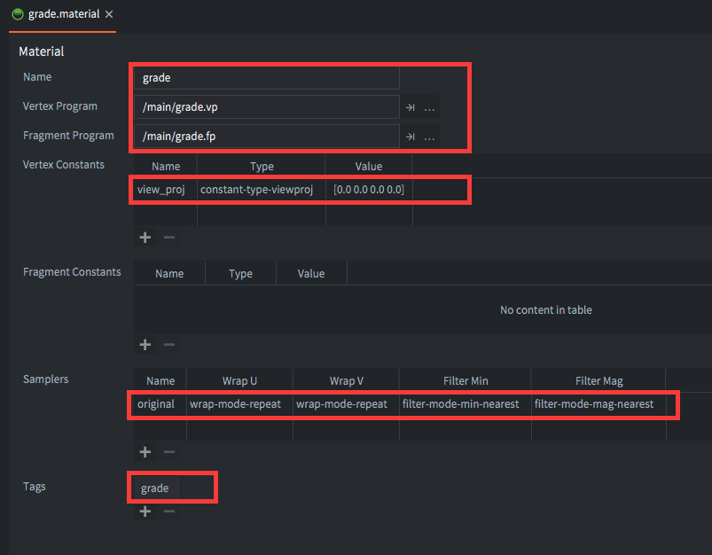
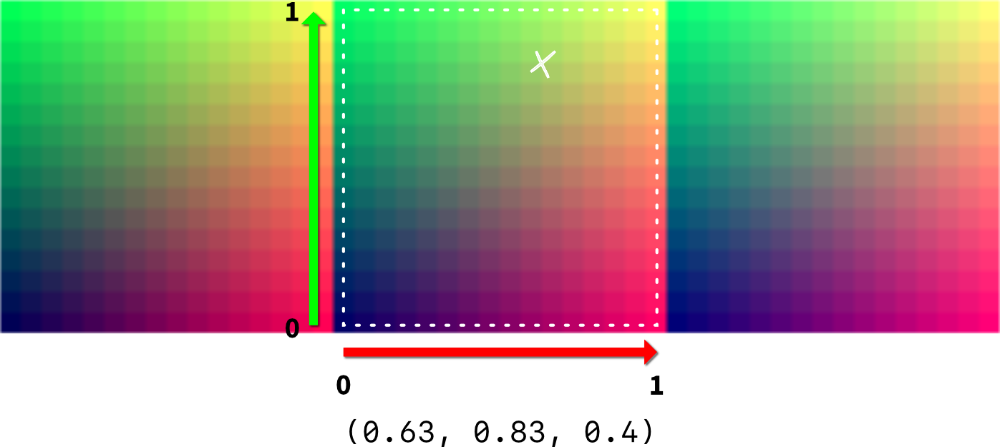
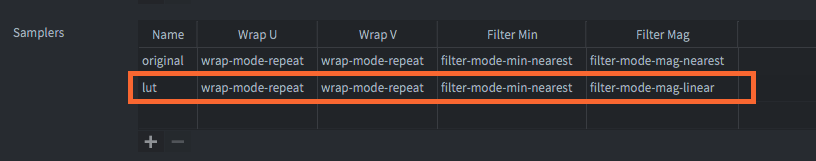
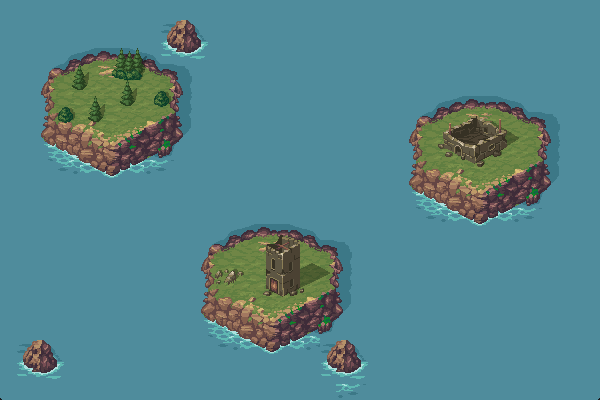
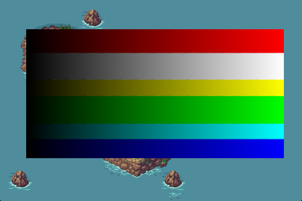
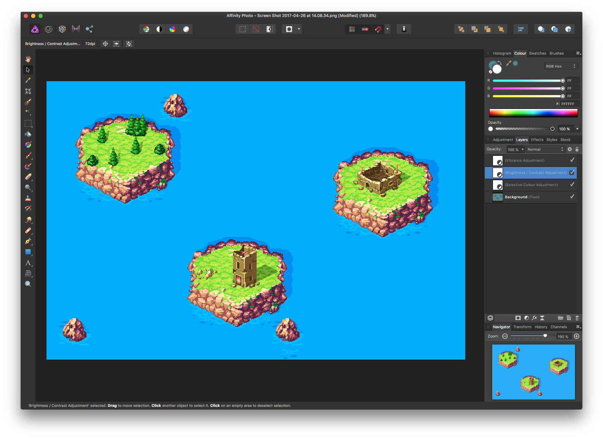
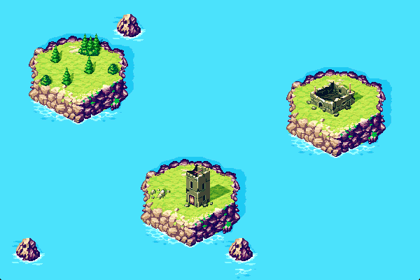

# Grading tutorial

In this tutorial we are going to create a full screen color post processing effect for a game. The method used here is widely applicable for various types of post effects like blur, trails, glow, color adjustments and so on.

It is assumed that you have basic knowledge about GL shaders and that you have some understanding of the Defold rendering pipeline. If you need to read up on these subjects, check out [our Shader manual](/manuals/shader/) and the [Rendering manual](/manuals/rendering/).

## Render targets

With the default render script, each visual component (sprite, tilemap, particle effect, GUI etc) is rendered directly to the graphics card *frame buffer* so they will appear on the screen. The actual drawing of a component is done by GL *shader programs*. The default shader programs draw each component's pixel data as is---what you have in your images will appear on screen untouched. 

By replacing the shader programs you can modify the pixel data, or create new pixel colors programmatically. The [Shadertoy tutorial](/tutorials/shadertoy) teaches you how to do that. However, sometimes you want to modify the pixel data for everything that appears on screen. Let's say that you want to render the whole game in black-and-white. One solution to that problem is to modify all shaders for all components so they desaturates color. That would take a bit of work. Currently, Defold ships with 6 built in materials and 6 vertex and fragment shader program pairs so it's not undoable, but any subsequent changes you want to make has to be made to each program.

An alternative solution is to instead do the rendering in two steps:


1. Draw all components as usual, but instead of drawing them to the frame buffer, draw to an off-screen buffer. This buffer is called a *render target*.
2. Then draw a square polygon to the frame buffer and use the off-screen buffer as the polygon's texture source. We make sure that the square polygon covers the whole screen.

With this method, we only need to add shader programs to step 2 to create a full screen effect. Now, let's set this up in Defold.

## Drawing to an off-screen buffer

We need to use a custom render script for this method to work. The default render script is a good starting point so start by copying it:

1. Copy */builtins/render/default.render_script* to a location in your project, for instance */main/grade.render_script*. In the *Asset* view, right click *default.render_script*, select <kbd>Copy</kbd> then right click *main* and select <kbd>Paste</kbd>. Right click the copy and select <kbd>Rename...</kbd>.
2. Create a new render file */main/grade.render*. Right click *main* in the *Asset* view and select <kbd>New ▸ Render</kbd>.
3. Open *grade.render* and set the *Script* property to "/main/grade.render_script".
   
   

4. Open *game.project* and set *Render* to "/main/grade.render".

   

Now the game runs with a new render pipeline that we can modify. To test that the render script is properly used, run your game, then modify the render script and reload it. For example, disable drawing of tiles and sprites, then press <kbd>⌘ + R</kbd> to hot-relad the render script into the running game:

```lua
...

render.set_projection(vmath.matrix4_orthographic(0, render.get_width(), 0, render.get_height(), -1, 1))

-- render.draw(self.tile_pred) -- <1>
render.draw(self.particle_pred)
render.draw_debug3d()

...
```
1. Comment out drawing of the "tile" predicate, which includes all sprites and tiles. This should be around line 33.

If the sprites and tiles disappear with `render.draw(self.tile_pred)` commented out you know that the game runs your render script. Undo the change to the render script. Now, let's modify the render script to draw to the off-screen buffer:

```lua
function init(self)
    self.tile_pred = render.predicate({"tile"})
    self.gui_pred = render.predicate({"gui"})
    self.text_pred = render.predicate({"text"})
    self.particle_pred = render.predicate({"particle"})

    self.clear_color = vmath.vector4(0, 0, 0, 0)
    self.clear_color.x = sys.get_config("render.clear_color_red", 0)
    self.clear_color.y = sys.get_config("render.clear_color_green", 0)
    self.clear_color.z = sys.get_config("render.clear_color_blue", 0)
    self.clear_color.w = sys.get_config("render.clear_color_alpha", 0)

    self.view = vmath.matrix4()

    local color_params = { format = render.FORMAT_RGBA,
                       width = render.get_window_width(),
                       height = render.get_window_height() } -- <1>
    local target_params = {[render.BUFFER_COLOR_BIT] = color_params }

    self.target = render.render_target("original", target_params) -- <2>
end
```
1. Set up color buffer parmeters for the render target.
2. Create the render target with the color buffer parameters.

Now we just need to wrap the original rendering code with `render.enable_render_target()` and `render.disable_render_target()`:

```lua
function update(self)
  render.enable_render_target(self.target) -- <1>
  
  ... -- <2>
  
  render.disable_render_target(self.target) -- <3>
end
```
1. Enable the render target. From now on, every call to `render.draw()` will draw to our off-screen buffer instead to the on-screen frame-buffer.
2. All original drawing code in `update()` is left as is.
3. The whole game is now drawn to our render target's off-screen buffer. We are not going to draw to it anymore, so it's time to disable it.

That's it. Running the game will draw everything to the render target's off-sceen buffer. But since we are not yet drawing anything to the frame-buffer we will only see a black screen.

## Something to fill the screen with

To get the data from the off-screen buffer to the screen, we need something that we can texture with the render target's color buffer and that we can make fill the whole screen. For that purpose we are going to use a flat, quadratic 3D model.

Create a quadratic plane mesh in Blender (or any other 3D modelling program). Set the vertex coordinates to -1 and 1 on the X-axis and -1 and 1 on the Y axis. Blender has the Z-axis up by default so you need to rotate the mesh 90° around the X-axis. You should also make sure that you generate correct UV-coordinates for the mesh. In Blender, enter Edit Mode with the mesh selected, then select <kbd>Mesh ▸ UV unwrap... ▸ Unwrap</kbd>.


1. Export the model as a Collada file called quad.dae and drag it into your Defold project.
2. Open *main.collection* and create a new game object "grade".
3. Add a Model component to "grade".
3. Set the *Mesh* property to the *quad.dae* file.

Leave the game object unscaled at origo. We are soon going to apply projection and a view that makes it fill the whole screen, but first we need a material and shader programs for the quad:

1. Create a new material *grade.material*. Right click *main* in the *Asset* view and select <kbd>New ▸ Material</kbd>.
2. Create a vertex shader program *grade.vp* and a fragment shader program *grade.fp*. Right click *main* in the *Asset* view and select <kbd>New ▸ Vertex program</kbd> and <kbd>New ▸ Fragment program</kbd>.
3. Open *grade.material* and set the *Vertex program* and *Fragment program* properties to the new shader program files.
4. Add a *Vertex constant* named "view_proj" of type `CONSTANT_TYPE_VIEWPROJ`. This is the view and projection matrix used in the vertex program for the quad vertices.
5. Add a *Sampler* called "original" which will be used to sample pixels from the off-screen buffer.
6. Add a *Tag* called "grade" which will be used in the render script.

   

7. Open *main.collection*, select the model component in game object "grade" and set its *Material* property to "/main/grade.material".

   

8. The vertex shader program can be left according to the template:

    ```glsl
    // grade.vp
    uniform mediump mat4 view_proj;

    // positions are in world space
    attribute mediump vec4 position;
    attribute mediump vec2 texcoord0;

    varying mediump vec2 var_texcoord0;

    void main()
    {
      gl_Position = view_proj * vec4(position.xyz, 1.0);
      var_texcoord0 = texcoord0;
    }
    ```

9. Modify the fragment shader program. Instead of setting `gl_FragColor` to the sampled color directly, let's try a simple color manipulation to make sure everything works as expected:

    ```glsl
    // grade.fp
    varying mediump vec4 position;
    varying mediump vec2 var_texcoord0;

    uniform lowp sampler2D original;

    void main()
    {
      vec4 color = texture2D(original, var_texcoord0.xy);
      // Desaturate the color sampled from the original texture
      float grey = color.r * 0.3 + color.g * 0.59 + color.b * 0.11;
      gl_FragColor = vec4(grey, grey, grey, 1.0);
    }
    ```

Now we have the model in place with its material and shaders.

## Texturing with the off-screen buffer

We need to add a render predicate to the render script so we can draw the quad model. Open *grade.render_script* and edit the `init()` function:

```lua
function init(self)
    self.tile_pred = render.predicate({"tile"})
    self.gui_pred = render.predicate({"gui"})
    self.text_pred = render.predicate({"text"})
    self.particle_pred = render.predicate({"particle"})
    self.grade_pred = render.predicate({"grade"}) -- <1>

    ...
end
```
1. Add a new predicate for the "grade" tag that we set in *grade.material*.

After the render target's color buffer has been filled in `update()` we set up a view and a projection that make the quad model fill the whole screen. We then use the render target's color buffer as the quad's texture:

```lua
function update(self)
  render.enable_render_target(self.target)
  
  ...
  
  render.disable_render_target(self.target)

  render.set_view(vmath.matrix4()) -- <1>
  render.set_projection(vmath.matrix4())
  
  render.enable_texture(0, self.target, render.BUFFER_COLOR_BIT) -- <2>
  render.draw(self.grade_pred) -- <3>
  render.disable_texture(0, self.target) -- <4>
end
```
1. Set the view to the identity matrix. This means camera is at origo looking straight ahead. The projection is also the identity matrix---the quad stretching from (-1, -1) to (1, 1) will cover the whole screen.
2. Set texture slot 0 to the color buffer of the render target. We have sampler "original" at slot 0 in our *grade.material* so the fragment shader will sample from our off screen buffer.
3. Draw the predicate we created for the tag "grade". The quad model has the *grade.material* material which sets that tag---thus the quad will be drawn.
4. Disable texture slot 0 since we are done drawing with it.

Now let's run the game and see the result:


## Color grading

Colors are expressed as a three component values where the components dictate the amount of red, green and blue a color should contain. The full color spectrum from black, through red, green, blue, yellow and pink to white can be fit into a cube shape:


Any color that can be displayed on screen can be found in this color cube. The basic idea of color grading is to create such a color cube but distort the colors in it and use it as a 3D *lookup table* in the fragment shader:

1. Sample the color value for the pixel from the off-screen buffer.
2. Look up the position of the sampled color value in the color-graded color cube.
3. Set the fragment color to the looked up value.


## Representing the lookup table

Open GL ES 2.0 does not support 3D textures so we need to figure out a way to represent the 3D color cube as a 2D texture that we can sample from. The standard way of doing that is to slice the cube along the Z-axis (blue) and lay each slice side by side in a 2-dimensional grid. Each of the 16 slices contains a 16⨉16 pixel grid.


We see that the table contains 16 cells (one for each blue color intensity) and within each cell 16 red colors along the X axis and 16 green colors along the Y axis. It might seem like we have merely 4 bit color depth, which by most standards is lousy. But thanks to a feature of GL graphics hardware we can get very good results anyway. Let's see how.

## Looking up colors

To look up a color is a matter of checking the blue component and figure out which cell to pick the red and green values from. The formula for finding the cell with the right red-green color set is simple:

$$
cell = \left \lfloor{B \times (N - 1)} \right \rfloor
$$

Where `B` is the blue component value between 0 and 1 and `N` is the total numbers of cells. In our case the cell number will be in the range `0`--`15` where cell `0` have colors with the blue component at `0` and cell `15` have colors with the blue component at `1`.

For the RGB value `(0.63, 0.83, 0.4)` we can find all the colors with blue set to `0.4` in cell number 6. Knowing that, the lookup of the green and red position is simple:



Note that we need to treat red and green values `(0, 0)` as being in the *center* of the bottom left pixel and the values `(1.0, 1.0)` as being in the *center* of the top right pixel.

::: sidenote
The reason we read starting at the center of the lower left pixel and up to the center of the top right one is that we don't want any pixels outside of the current cell to affect the sampled value. See below about filtering.
:::


When sampling at these specific coordinates on the texture we see that we end up right between 4 pixels. So when sampling from that location, what color value will GL give us?

The answer depends on how we have set up *filtering* for the sampler in the material. If we set `FILTER_MODE_MAG_NEAREST`, GL will get return the color value of the nearest pixel value, position value rounded down. In this case we will read the color value at `(0.60, 0.80)`. With this particular lookup texture it means that we will quantize the color values in increments of 1/15. Making a larger lookup texture will get us more colors, but there is a much better method.

We can set `FILTER_MODE_MAG_LINEAR` for the sampler which will make GL return *interpolated* values. If we read the color value between two pixels `A` and `B` we will get a value that is a mix of the two pixel colors and the ratio of color from `A` and `B` depends on the distance to the pixels. If we read right at the center of `A` we get only `A`'s color, whereas if we read right between them we get 50% of each. In our example above, we get 25% of each of the 4 pixels around the sample point.

What we have just done is to eliminate color quantization. By utilizing linear interpolation in the graphics hardware, we can get very good color precision out of a pretty small lookup table.

## Implementing the lookup

Let's now build this in Defold.

1. Open *grading.texture*.
2. Add a second sampler called "lut" (for lookup table).
3. Set the *Filter mag* property to `FILTER_MODE_MAG_LINEAR`.

    

4. Download the following lookup table texture and add it to your project.

    

5. Open *main.collection* and set the *lut* texture to the lookup texture.

    

6. Finally, open *grading.fp* and add support for color lookup:

    ```glsl
    varying mediump vec4 position;
    varying mediump vec2 var_texcoord0;

    uniform lowp sampler2D original;
    uniform lowp sampler2D lut; // <1>

    #define MAXCOLOR 15.0 // <2>
    #define COLORS 16.0
    #define WIDTH 256.0 
    #define HEIGHT 16.0

    void main()
    {
        vec4 px = texture2D(original, var_texcoord0.xy); // <3>
        
        float cell = floor(px.b * MAXCOLOR); // <4>
       
        float half_px_x = 0.5 / WIDTH; // <5>
        float half_px_y = 0.5 / HEIGHT;

        // <6>
        float r_offset = half_px_x + px.r / COLORS * (MAXCOLOR / COLORS);
        float g_offset = half_px_y + px.g * (MAXCOLOR / COLORS);
      
        vec2 lut_pos = vec2(cell / COLORS + r_offset, g_offset); // <7>

        vec4 graded_color = texture2D(lut, lut_pos); // <8>

        gl_FragColor = graded_color; // <9>
    }
    ```
    1. Declare the sampler "lut" so we can use it.
    2. Constants for max color (15 since we start from 0), number of colors per channel and texture width and height.
    3. Sample from the original texture (the off-screen buffer).
    4. Which cell to read color from is based on the blue channel value.
    5. Half pixel offsets so we read from pixel centers.
    6. Calculate the X and Y offset on the texture based on original pixel red and green values.
    7. Calculate the final sample position on the lookup texture.
    8. Sample the color from the lookup texture.
    9. Set the color on the quad's texture to the sampled color.

Since the lookup table just returns the same color value as we look up, the resulting look of the game is unaltered---as is:



This looks fine, but there are problems in there that we can bring to the surface by adding a test texture widh some gradients to our game world. Look at this:


The blue gradient shows some serious banding. Why is that?

## Interpolating the blue channel

The problem with the blue channel is that GL is unable to perform any interpolation when reading the color from the texture. We preselect a particular blue color value, select a cell from the texture and read from it. If the blue channel contains a value in the range `0.400`--`0.465` the result is the same, we sample from the same cell no matter what.

The solution to this problem is to implement the interpolation ourselves. If the lookup blue value is between two cells, we should sample from both of the cells and then mix the colors according to how close the lookup blue value is to the cell's blue value.

We read from two cells:

$$
cell_{low} = \left \lfloor{B \times (N - 1)} \right \rfloor
$$

and:

$$
cell_{high} = \left \lceil{B \times (N - 1)} \right \rceil
$$

Then we sample from the cells as shown above and mix the sampled colors according to the formula:

$$
color = color_{low} \times (1 - C_{frac}) + color_{high} \times C_{frac}
$$

Here `color`~low~ is the color sampled from the lower (leftmost) cell and `color`^high^ is the color sampled from the higher (rightmost) cell. The value `C`~frac~ is the fractional part of the blue channel value scaled to the `0`--`15` color range:

$$
C_{frac} = B \times (N - 1) - \left \lfloor{B \times (N - 1)} \right \rfloor
$$

The implementation of this in the fragment shader *grade.fp* is pretty straightforward:

```glsl
varying mediump vec4 position;
varying mediump vec2 var_texcoord0;

uniform lowp sampler2D original;
uniform lowp sampler2D lut;

#define MAXCOLOR 15.0
#define COLORS 16.0
#define WIDTH 256.0
#define HEIGHT 16.0

void main()
{
  vec4 px = texture2D(original, var_texcoord0.xy);
    
    float cell = px.b * MAXCOLOR;

    float cell_l = floor(cell); // <1>
    float cell_h = ceil(cell);
    
    float half_px_x = 0.5 / WIDTH;
    float half_px_y = 0.5 / HEIGHT;
    float r_offset = half_px_x + px.r / COLORS * (MAXCOLOR / COLORS);
    float g_offset = half_px_y + px.g * (MAXCOLOR / COLORS);
    
    vec2 lut_pos_l = vec2(cell_l / COLORS + r_offset, g_offset); // <2>
    vec2 lut_pos_h = vec2(cell_h / COLORS + r_offset, g_offset);

    vec4 graded_color_l = texture2D(lut, lut_pos_l); // <3>
    vec4 graded_color_h = texture2D(lut, lut_pos_h);

    // <4>
    vec4 graded_color = mix(graded_color_l, graded_color_h, fract(cell));

    gl_FragColor = graded_color;
}
```
1. Calculate the two cells.
2. Calculate the two separate lookup positions, one for each cell.
3. Sample the two colors.
3. Mix the colors according to the fraction of `cell`, which is the unrounded cell number.

Running the game again with the test texture now yields much better results. The banding on the blue channel is gone:



## Time to do some grading!

Okay, that was a lot of work to draw something that looks exactly like the original game world. But this setup allows us to do something really cool. Hang on now!

1. Take a screenshot of the game in its unaffected form.
2. Open the screenshot in your favorite image manipulation program.
3. Apply any number of color adjustments (brightness, contrast, color curves, white balance, exposure etc, etc).
    
    

4. Open the lookup table texture file *lut16.png* and apply the same color adjustments to it.
5. Save the lookup table texture file.
6. Replace the *lut16.png* used in your Defold project with the graded one.
7. Run the game!



Joy!