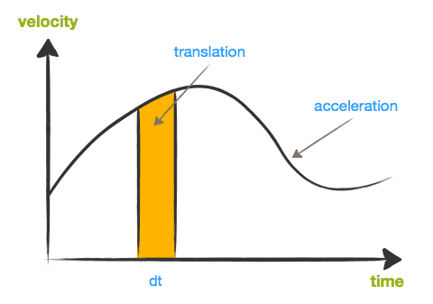
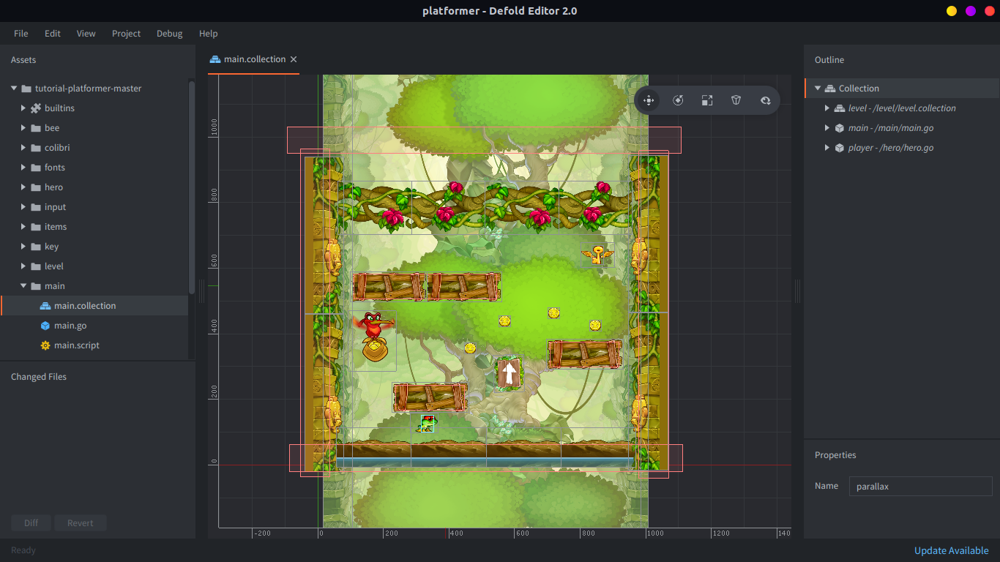

# Platformer

In this article, we go through the implementation of a basic tile-based 2D platformer in Defold. The mechanics we will learn are moving left/right, jumping and falling.

<div id="game-container" class="game-container">
  
  <canvas id="game-canvas" tabindex="1" width="1024" height="768">
  </canvas>
  <button id="game-button">
    START GAME <span class="icon"></span>
  </button>
  <script src="//storage.googleapis.com/defold-doc/assets/dmloader.js"></script>
  <script src="//storage.googleapis.com/defold-doc/assets/dmengine_1_2_106.js" async></script>
  <script>
      /* Load app on click in container. */
      document.getElementById("game-button").onclick = function (e) {
          var extra_params = {
              archive_location_filter: function( path ) {
                  return ("//storage.googleapis.com/defold-doc/assets/platformer" + path + "");
              },
              load_done: function() {},
              game_start: function() {
                  var e = document.getElementById("game-preview");
                  e.parentElement.removeChild(e);
              }
          }
          Module.runApp("game-canvas", extra_params);
          document.getElementById("game-button").style.display = 'none';
          document.getElementById("game-button").onclick = null;
      };
  </script>
</div>

There are many different ways to go about creating a platformer. Rodrigo Monteiro has written an exhaustive analysis on the subject and more [here](http://higherorderfun.com/blog/2012/05/20/the-guide-to-implementing-2d-platformers/).

We highly recommend you read it if you are new to making platformers, as it contains plenty of valuable information. We will go into a bit more detail on a few of the methods described and how to implement them in Defold. Everything should however be easy to port to other platforms and languages (we use Lua in Defold).

We assume that you're familiar with a bit of vector mathematics (linear algebra). If you're not, it's a good idea to read up on it since it's insanely useful for game development. David Rosen at Wolfire has written a very good series about it [here](http://blog.wolfire.com/2009/07/linear-algebra-for-game-developers-part-1/).

If you are already using Defold, you can create a new project based on the _Platformer_ template-project and play around with that while reading this article.

::: sidenote
Some readers has brought up that our suggested method is not possible with the default implementation of Box2D. We made a few modifications to Box2D to make this work:

Collisions between kinematic and static objects are ignored. Change the checks in `b2Body::ShouldCollide` and `b2ContactManager::Collide`.

Also, the contact distance (called separation in Box2D) is not supplied to the callback-function.
Add a distance-member to `b2ManifoldPoint` and make sure it's updated in the `b2Collide*` functions.
:::

## Collision Detection

Collision detection is needed to keep the player from moving through the level geometry.
There are a number of ways to deal with this depending on your game and its specific requirements.
One of the easiest ways, if possible, is to let a physics engine take care of it.
In Defold we use the physics engine [Box2D](http://box2d.org/) for 2D games.
The default implementation of Box2D does not have all the features needed, see the bottom of this article for how we modified it.

A physics engine stores the states of the physics objects along with their shapes in order to simulate physical behaviour. It also reports collisions while simulating, so the game can react as they happen. In most physics engines there are three types of objects: _static_, _dynamic_ and _kinematic_ objects (these names might be different in other physics engines). There are other types of objects too, but let's ignore them for now.

- A *static* object will never move (e.g. level geometry).
- A *dynamic* object is influenced by forces and torques which are transformed into velocities during the simulation.
- A *kinematic* object is controlled by the application logic, but still affects other dynamic objects.

In a game like this, we are looking for something that resembles physical real-world behaviour, but having responsive controls and balanced mechanics is far more important. A jump that feels good does not need to be physically accurate or act under real-world gravity. [This](http://hypertextbook.com/facts/2007/mariogravity.shtml) analysis shows however that the gravity in Mario games gets closer to a gravity of 9.8 m/s^2^ for each version. :-)

It's important that we have full control of what's going on so we can design and tweak the mechanics to achieve the intended experience. This is why we choose to model the player character by a kinematic object. Then we can move the player character around as we please, without having to deal with physical forces. This means that we will have to solve separation between the character and level geometry ourselves (more about this later), but that's a drawback we are willing to accept. We will represent the player character by a box shape in the physics world.

## Movement

Now that we have decided that the player character will be represented by a kinematic object, we can move it around freely by setting the position. Let's start with moving left/right.

The movement will be acceleration-based, to give a sense of weight to the character. Like for a regular vehicle, the acceleration defines how fast the player character can reach the max speed and change direction. The acceleration is acting over the frame time-step---usually provided in a parameter `dt` (delta-`t`)---and then added to the velocity. Similarly, the velocity acts over the frame and the resulting translation is added to the position. In maths, this is called [integration over time](http://en.wikipedia.org/wiki/Integral).



The two vertical lines marks the beginning and end of the frame. The height of the lines is the velocity the player character has at these two points in time. Let us call these velocities `v`~0~ and `v`~1~ . `v`~1~ is given by applying the acceleration (the slope of the curve) for the time-step `dt`:

$$
v1 = v0 + acceleration \times dt
$$

The orange area is the translation we are supposed to apply to the player character during the current frame. Geometrically, we can approximate the area as:

$$
translation = \frac{(v0 + v1) \times dt}{2}
$$

This is how we integrate the acceleration and velocity to move the character in the update-loop:

1. Determine the target speed based on input
2. Calculate the difference between our current speed and the target speed
3. Set the acceleration to work in the direction of the difference
4. Calculate the velocity change this frame (dv is short for delta-velocity), as above:

    ```lua
    local dv = acceleration * dt
    ```

5. Check if dv exceeds the intended speed difference, clamp it in that case
6. Save the current velocity for later use (`self.velocity`, which right now is the velocity used the previous frame):

    ```lua
    local v0 = self.velocity
    ```

7. Calculate the new velocity by adding the velocity change:

    ```lua
    self.velocity = self.velocity + dv
    ```

8. Calculate the x-translation this frame by integrating the velocity, as above:

    ```lua
    local dx = (v0 + self.velocity) * dt * 0.5
    ```

9. Apply it to the player character

If you are unsure how to handle input in Defold, there's a guide about that [here](/manuals/input).

At this stage, we can move the character left and right and have a weighted and smooth feel to the controls. Now, let's add gravity!

Gravity is also an acceleration, but it affects the player along the y-axis. This means that it will be applied in the same manner as the movement acceleration described above. If we just change the calculations above to vectors and make sure we include gravity in the y-component of the acceleration at step 3), it will just work. Gotta love vector-math! :-)

## Collision Response

Now our player character can move and fall, so it's time to look at collision responses.
We obviously need to land and move along the level geometry. We will use the contact points provided by the physics engine to make sure we never overlap anything.

A contact point carries a _normal_ of the contact (pointing out from the object we collide with, but might be different in other engines) as well as a _distance_, which measures how far we have penetrated the other object. This is all we need to separate the player from the level geometry.
Since we are using a box, we might get multiple contact points during a frame. This happens for example when two corners of the box intersect the horizontal ground, or the player is moving into a corner.


To avoid making the same correction multiple times, we accumulate the corrections in a vector to make sure we don't over-compensate. This would make us end up too far away from the object we collided with. In the image above, you can see that we currently have two contact points, visualized by the two arrows (normals). The penetration distance is the same for both contacts, if we would use that blindly each time we would end up moving the player twice the intended amount.

::: sidenote
It's important to reset the accumulated corrections each frame to the 0-vector.
Put something like this at the end of the `update()` function:
`self.corrections = vmath.vector3()`
:::

Assuming there is a callback-function that will be called for each contact point, here's how to do the separation in that function:

```lua
local proj = vmath.dot(self.correction, normal) -- <1>
local comp = (distance - proj) * normal -- <2>
self.correction = self.correction + comp -- <3>
go.set_position(go.get_position() + comp) -- <4>
```
1. Project the correction vector onto the contact normal (the correction vector is the 0-vector for the first contact point)
2. Calculate the compensation we need to make for this contact point
3. Add it to the correction vector
4. Apply the compensation to the player character

We also need to cancel out the part of the player velocity that moves towards the contact point:

```lua
proj = vmath.dot(self.velocity, message.normal) -- <1>
if proj < 0 then
    self.velocity = self.velocity - proj * message.normal -- <2>
end
```
1. Project the velocity onto the normal
2. If the projection is negative, it means that some of the velocity points towards the contact point; remove that component in that case

## Jumping

Now that we can run on the level geometry and fall down, it's time to jump! Platformer-jumping can be done in many different ways. In this game we are aiming for something similar to Super Mario Bros and Super Meat Boy. When jumping, the player character is thrusted upwards by an impulse, which is basically a fixed speed.

Gravity will continuously pull the character down again, resulting in a nice jump arc. While in the air, the player can still control the character. If the player lets go of the jump button before the peak of the jump arc, the upwards speed is scaled down to halt the jump prematurely.

1. When the input is pressed, do:

    ```lua
    -- jump_takeoff_speed is a constant defined elsewhere
    self.velocity.y = jump_takeoff_speed
    ```

    This should only be done when the input is _pressed_, not each frame it is continuously _held down_.

2. When the input is released, do:

    ```lua
    -- cut the jump short if we are still going up
    if self.velocity.y > 0 then
        -- scale down the upwards speed
        self.velocity.y = self.velocity.y * 0.5
    end
    ```

ExciteMike has made some nice graphs of the jump arcs in [Super Mario Bros 3](http://meyermike.com/wp/?p=175) and [Super Meat Boy](http://meyermike.com/wp/?p=160) that are worth checking out.

## Level Geometry

The level geometry is the collision shapes of the environment that the player character (and possibly other things) collide with. In Defold, there are two ways to create this geometry.

Either you create separate collision shapes on top of the levels you build. This method is very flexible and allows fine positioning of graphics. It is especially useful if you want soft slopes.
The game [Braid](http://braid-game.com/) used this method of building levels, and it is the method the example level in this tutorial is built too. Here is how it looks in the Defold editor:



Another option is to build levels out of tiles and have the editor automatically generate the physics shapes, based on tile graphics. This means that the level geometry will be automatically updated when you change the levels which can be extremely useful.

The placed tiles will get their physics shapes automatically merged into one if they align.
This eliminates the gaps that can make your player character stop or bump when sliding across several horizontal tiles. This is done by replacing the tile polygons with edge shapes in Box2D at load-time.


Above is an example where we created five neighboring tiles out of a piece of the platformer graphics. In the image you can see how the placed tiles (top) correspond to one single shape that has been stitched together into one (bottom grey contour).

Check out our guides about [physics](/manuals/physics) and [tiles](/manuals/2dgraphics) for more info.

## Final Words

If you want more information about platformer mechanics, here is an impressively huge amount of info about the physics in [Sonic](http://info.sonicretro.org/Sonic_Physics_Guide).

If you try our template project on an iOS device or with a mouse, the jump can feel really awkward.
That's just our feeble attempt at platforming with one-touch-input. :-)

We did not talk about how we handled the animations in this game. You can get an idea by checking out the *player.script* below, look for the function `update_animations()`.

We hope you found this information useful!
Please make a great platformer so we all can play it! <3

## Code

Here is the content of *player.script*:

```lua
-- player.script

-- these are the tweaks for the mechanics, feel free to change them for a different feeling
-- the acceleration to move right/left
local move_acceleration = 3500
-- acceleration factor to use when air-borne
local air_acceleration_factor = 0.8
-- max speed right/left
local max_speed = 450
-- gravity pulling the player down in pixel units
local gravity = -1000
-- take-off speed when jumping in pixel units
local jump_takeoff_speed = 550
-- time within a double tap must occur to be considered a jump (only used for mouse/touch controls)
local touch_jump_timeout = 0.2

-- pre-hashing ids improves performance
local msg_contact_point_response = hash("contact_point_response")
local msg_animation_done = hash("animation_done")
local group_obstacle = hash("obstacle")
local input_left = hash("left")
local input_right = hash("right")
local input_jump = hash("jump")
local input_touch = hash("touch")
local anim_run = hash("run")
local anim_idle = hash("idle")
local anim_jump = hash("jump")
local anim_fall = hash("fall")

function init(self)
    -- this lets us handle input in this script
    msg.post(".", "acquire_input_focus")

    -- initial player velocity
    self.velocity = vmath.vector3(0, 0, 0)
    -- support variable to keep track of collisions and separation
    self.correction = vmath.vector3()
    -- if the player stands on ground or not
    self.ground_contact = false
    -- movement input in the range [-1,1]
    self.move_input = 0
    -- the currently playing animation
    self.anim = nil
    -- timer that controls the jump-window when using mouse/touch
    self.touch_jump_timer = 0
end

local function play_animation(self, anim)
    -- only play animations which are not already playing
    if self.anim ~= anim then
        -- tell the sprite to play the animation
        msg.post("#sprite", "play_animation", {id = anim})
        -- remember which animation is playing
        self.anim = anim
    end
end

local function update_animations(self)
    -- make sure the player character faces the right way
    sprite.set_hflip("#sprite", self.move_input < 0)
    -- make sure the right animation is playing
    if self.ground_contact then
        if self.velocity.x == 0 then
            play_animation(self, anim_idle)
        else
            play_animation(self, anim_run)
        end
    else
        if self.velocity.y > 0 then
            play_animation(self, anim_jump)
        else
            play_animation(self, anim_fall)
        end
    end
end

function update(self, dt)
    -- determine the target speed based on input
    local target_speed = self.move_input * max_speed
    -- calculate the difference between our current speed and the target speed
    local speed_diff = target_speed - self.velocity.x
    -- the complete acceleration to integrate over this frame
    local acceleration = vmath.vector3(0, gravity, 0)
    if speed_diff ~= 0 then
        -- set the acceleration to work in the direction of the difference
        if speed_diff < 0 then
            acceleration.x = -move_acceleration
        else
            acceleration.x = move_acceleration
        end
        -- decrease the acceleration when air-borne to give a slower feel
        if not self.ground_contact then
            acceleration.x = air_acceleration_factor * acceleration.x
        end
    end
    -- calculate the velocity change this frame (dv is short for delta-velocity)
    local dv = acceleration * dt
    -- check if dv exceeds the intended speed difference, clamp it in that case
    if math.abs(dv.x) > math.abs(speed_diff) then
        dv.x = speed_diff
    end
    -- save the current velocity for later use
    -- (self.velocity, which right now is the velocity used the previous frame)
    local v0 = self.velocity
    -- calculate the new velocity by adding the velocity change
    self.velocity = self.velocity + dv
    -- calculate the translation this frame by integrating the velocity
    local dp = (v0 + self.velocity) * dt * 0.5
    -- apply it to the player character
    go.set_position(go.get_position() + dp)

    -- update the jump timer
    if self.touch_jump_timer > 0 then
        self.touch_jump_timer = self.touch_jump_timer - dt
    end

    update_animations(self)

    -- reset volatile state
    self.correction = vmath.vector3()
    self.move_input = 0
    self.ground_contact = false

end

local function handle_obstacle_contact(self, normal, distance)
    -- project the correction vector onto the contact normal
    -- (the correction vector is the 0-vector for the first contact point)
    local proj = vmath.dot(self.correction, normal)
    -- calculate the compensation we need to make for this contact point
    local comp = (distance - proj) * normal
    -- add it to the correction vector
    self.correction = self.correction + comp
    -- apply the compensation to the player character
    go.set_position(go.get_position() + comp)
    -- check if the normal points enough up to consider the player standing on the ground
    -- (0.7 is roughly equal to 45 degrees deviation from pure vertical direction)
    if normal.y > 0.7 then
        self.ground_contact = true
    end
    -- project the velocity onto the normal
    proj = vmath.dot(self.velocity, normal)
    -- if the projection is negative, it means that some of the velocity points towards the contact point
    if proj < 0 then
        -- remove that component in that case
        self.velocity = self.velocity - proj * normal
    end
end

function on_message(self, message_id, message, sender)
    -- check if we received a contact point message
    if message_id == msg_contact_point_response then
        -- check that the object is something we consider an obstacle
        if message.group == group_obstacle then
            handle_obstacle_contact(self, message.normal, message.distance)
        end
    end
end

local function jump(self)
    -- only allow jump from ground
    -- (extend this with a counter to do things like double-jumps)
    if self.ground_contact then
        -- set take-off speed
        self.velocity.y = jump_takeoff_speed
        -- play animation
        play_animation(self, anim_jump)
    end
end

local function abort_jump(self)
    -- cut the jump short if we are still going up
    if self.velocity.y > 0 then
        -- scale down the upwards speed
        self.velocity.y = self.velocity.y * 0.5
    end
end

function on_input(self, action_id, action)
    if action_id == input_left then
        self.move_input = -action.value
    elseif action_id == input_right then
        self.move_input = action.value
    elseif action_id == input_jump then
        if action.pressed then
            jump(self)
        elseif action.released then
            abort_jump(self)
        end
    elseif action_id == input_touch then
        -- move towards the touch-point
        local diff = action.x - go.get_position().x
        -- only give input when far away (more than 10 pixels)
        if math.abs(diff) > 10 then
            -- slow down when less than 100 pixels away
            self.move_input = diff / 100
            -- clamp input to [-1,1]
            self.move_input = math.min(1, math.max(-1, self.move_input))
        end
        if action.released then
            -- start timing the last release to see if we are about to jump
            self.touch_jump_timer = touch_jump_timeout
        elseif action.pressed then
            -- jump on double tap
            if self.touch_jump_timer > 0 then
                jump(self)
            end
        end
    end
end
```
