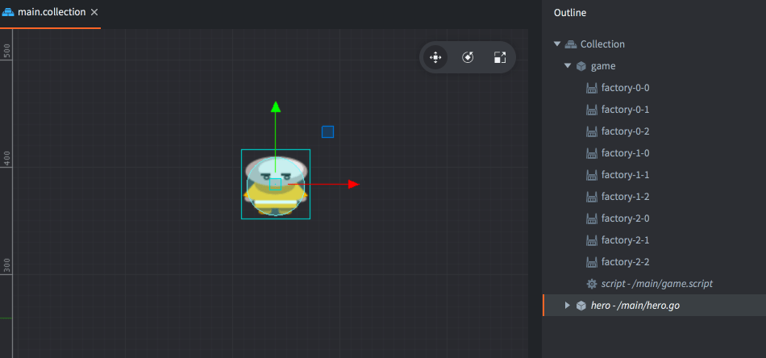
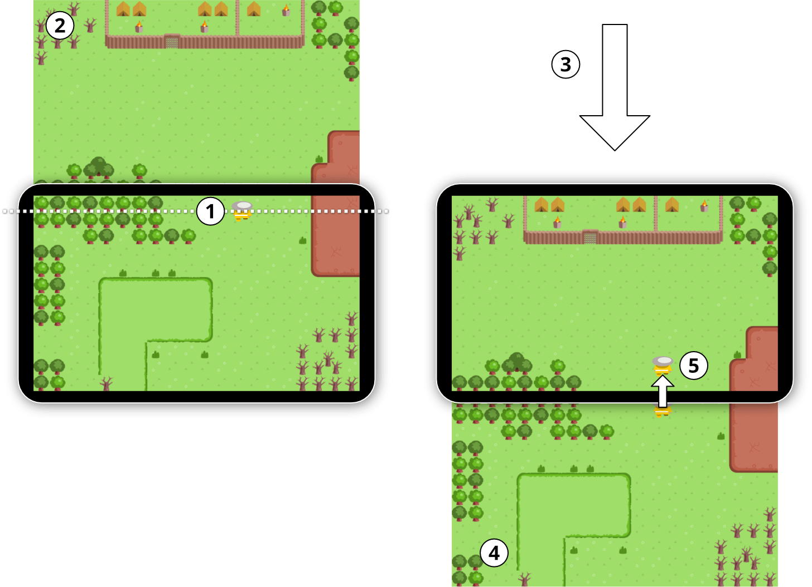
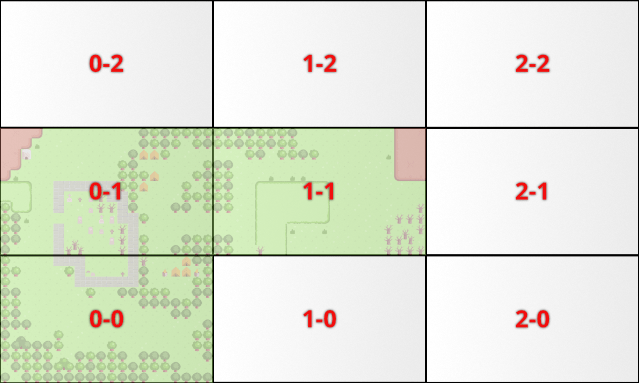
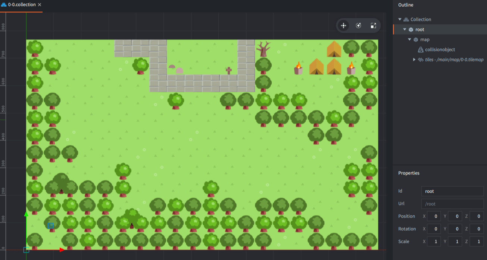
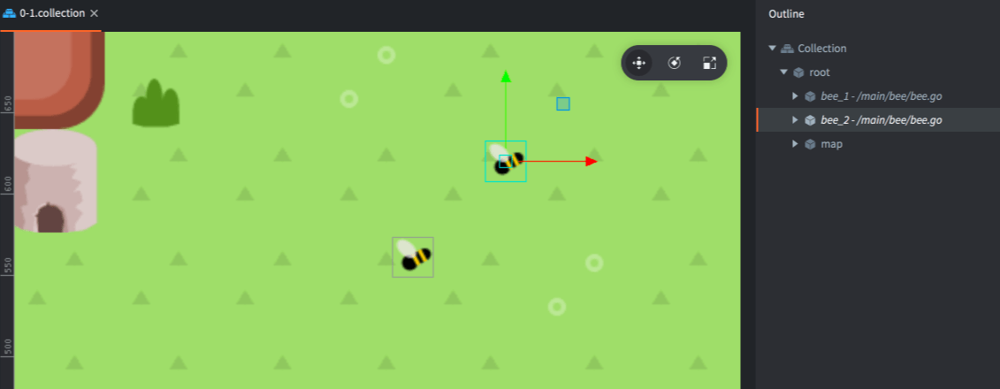
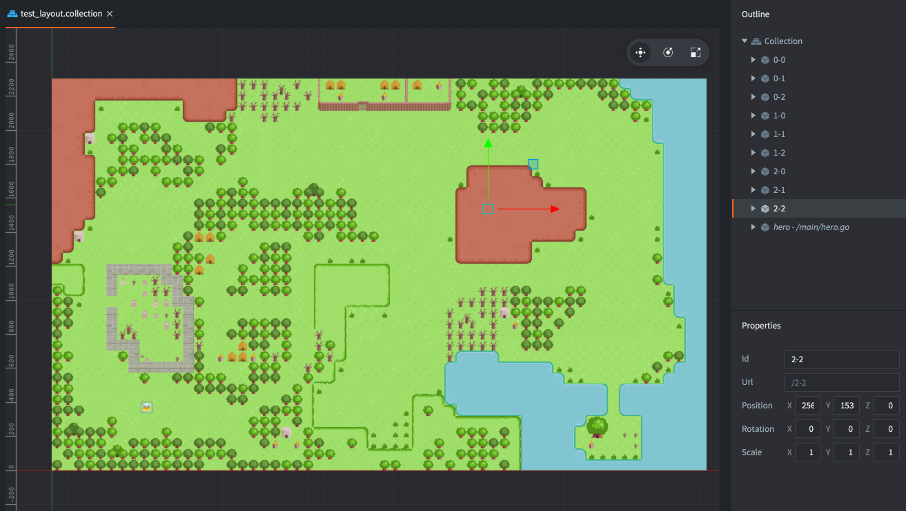
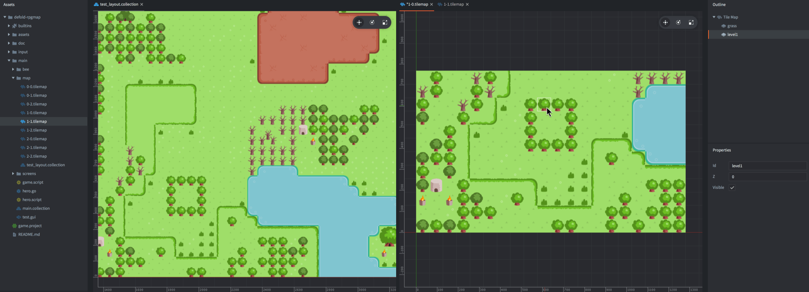

# RPG map - sample project

In this sample project which you can [open from the editor](/manuals/project-setup/) or [download from GitHub](https://github.com/defold/sample-rpgmap), we show one method of creating very large RPG maps in Defold. The design is based on the following assumptions:

1. The world is presented one screen at a time. This allows the game to naturally contain enemies and NPC characters within the boundaries of a single screen. The level designer has full control over how the world is presented on the player's screen.
2. The player character should be able to travel arbitrarily far without the game exhibiting floating point precision issues. These typically cause objects to flutter stangely when they move far from origin.
3. The player's movement is restricted by obstacles on the map, so the level designer can lead the player between screens using trees, rocks, water and other obstacles.
4. It should be possible to mix and match tilemaps, sprites and other visual content.

First, run the sample and walk through the 3x3 screen big world to get a feel for the sample's setup. You control the character with the arrow keys.

## The main collection

Open "/main/main.collection" to view the bootstrap collection for this sample.

The main collection contains the player character game object, controlled in 8 directions with the arrow buttons, and a second game object called "game" that controls the flow of the game. The "game" object consists of a script and one collection factory for each screen in the game. The factories are named according to the screen grid naming scheme.

The script "/main/game.script" tracks on which screen the player currently is. The script also reacts to a custom message called "load_screen". This message loads a new screen and swaps it with the current screen in the direction the hero moves. Initially, a screen is loaded into the center of the screen and there is no other screen to switch place with.

## Changing screens

The hero is controlled by the script "/main/hero.script". The script checks if the hero game object moves past a top, bottom, left or right line close to the screen edge:

1. If the hero moves close enough to a screen edge, a message is sent to the "game" object script to load the next screen.
2. The next screen collection is spawned by calling `factory.create()` on the correct collectionfactory component. The content of the collection is positioned outside the screen.
3. The next screen is scrolled into the center of view and the current screen is scrolled out in the opposite direction. The player character is also scrolled the same distance and with the same speed.
4. The old current screen, that is now off-screen, is deleted and the next screen is promoted to be the new current screen.
5. The hero animates into view in the new screen and the player regains control.

All of this happens within a second so the transition is smooth and non disruptive.

## Screens

Each screen in the game world is built inside a separate collection containing the tilemap, collision object and other game objects that are unique to the screen. To facilitate management and loading of the screens the screen collections are named according to a simple scheme:

Each screen collection is named according to its position in the world grid. The first number is the X grid position and the second is the Y grid position.

In the *Assets* view, navigate to and open the collection "/main/screens/0-0.collection" which describes the screen in the lowest left corner of the map:

Notice that there is a game object named "root" that is the parent to all of the screen's content. This is another convention used in the sample and it serves a very important purpose: when a screen is brought into view, only the "root" game object needs to be moved. All child objects are automatically moved along with the root parent. If there are special game objects on a screen, they can also be freely animated since their movement is relative to the root parent. When the the screen is scrolled in or out, these children moves with the screen. Special code is only needed if an object needs to move between screens.

The bees on screen 0-1 are simple showcases of this idea:

## Editing screens in the world context

Each screen has its own tilemap that can be edited in the built in tilemap editor. However, the main drawback of editing each screen in isolation is that it is not possible to easily see how it connects to its adjacent screens, which is an important aspect of creating continuity through the game world.

For this reason, a special collection was created. Open "/main/map/test_layout.collection" to view this world test layout collection:

The only purpose of this collection is to be used as an editing tool during development. Editing a specific screen side by side with the test layout collection gives you context for the screen you currently work on and the editing process is much nicer:

Any edits to the screen tilemap (here on the right hand pane) are immediately reflected in the test collection (in the left pane). Also note that the test layout collection is not added to the static hierarchy so it is automatically excluded from all builds.

## Summary

As you have seen, this sample is built according to specific constraints regarding the game world and how the game hero traverses through it. If your game has different requirements you probably need to find a different solution. For instance, if your game demands that the camera should move seamlessly over the world map, you need a different way of splitting up your content, a different loading mechanism, and also different tools helping you to author your game world.

This concludes the walkthrough of the RPG map sample. As always, you are free to use the content of the sample in any way you see fit. To learn more about Defold, check out our [documentation pages](https://defold.com/learn) for more examples, tutorials, manuals and API docs.

If you run into trouble or have questions, [head over to our forum](https://forum.defold.com/).

Happy Defolding!
