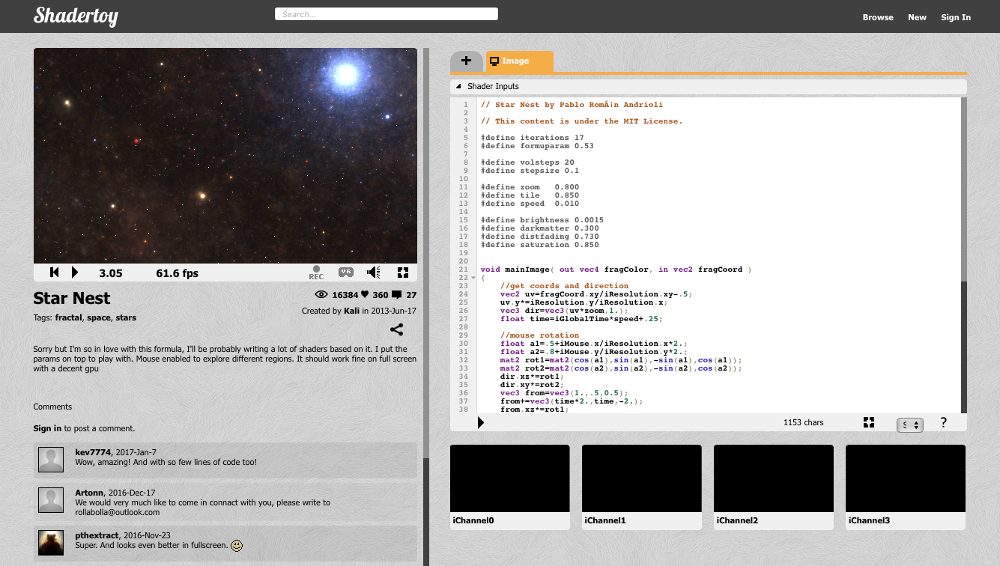

# Shadertoy tutorial

[Shadertoy.com](https://www.shadertoy.com/) is a site that gathers user contributed GL shaders. It is a great resource for finding shader code and inspiration. In this tutorial we will take a shader from Shadertoy and make it run in Defold. Some basic understanding of shaders is assumed. If you need to read up, [the Shader manual](/manuals/shader/) is a good place to start.

The shader we will use is [Star Nest](https://www.shadertoy.com/view/XlfGRj) by Pablo Andrioli (user "Kali" on Shadertoy). It is a purely procedural mathematical black magickery fragment shader that renders a really cool starfield effect.



The shader is just 65 lines of quite complicated GLSL code, but don't worry. We're gonna treat it as a black box that does its thing based on a few simple inputs. Our job here is to modify the shader so it interfaces with Defold instead of Shadertoy.

## Something to texture

The Star Nest shader is a pure fragment shader, so we only need something for the shader to texture. There are a number of options: a sprite, a tilemap, a GUI or a model. For this tutorial we are going to use a simple 3D model. The reason is that we can easily make the model rendering into a full screen effect---something we need to do if we want to do visual post processing, for example.

We start by creating a quadratic plane mesh in Blender (or any other 3D modelling program). For convenience the 4 vertex coordinates are at -1 and 1 on the X-axis and -1 and 1 on the Y axis. Blender has the Z-axis up by default so you need to rotate the mesh 90° around the X-axis. You should also make sure that you generate correct UV-coordinates for the mesh. In Blender, enter *Edit Mode* with the mesh selected, then select <kbd>Mesh ▸ UV unwrap... ▸ Unwrap</kbd>.


<a class="btn btn-primary btn-xs-block btn-icon" href="//storage.googleapis.com/defold-doc/assets/quad.dae.zip">Download quad.dae<span aria-hidden="true" class="icon icon-download"></span></a>


::: sidenote
Blender is a free, open-source 3D software which can be downloaded from [blender.org](https://www.blender.org).
:::


1. Export the model as a *Collada* file called *quad.dae* and drag it into a new Defold project.
2. Open your "main.collection" file in Defold and create a new game object "star-nest".
3. Add a *Model* component to "star-nest".
4. Set the *Mesh* property to the *quad.dae* file.
5. The model is small (2⨉2 units) so we need to scale the "star-nest" game object to a reasonable size. 600⨉600 is a nice large size so set the X and Y scale to 300.

The model should appear in the scene editor, but it is rendered all black. That is because it has no material set yet:


## Creating the material

Create a new material file *star-nest.material*, a vertex shader program *star-nest.vp* and a fragment shader program *star-nest.fp*:

1. Open *star-nest.material*.
2. Set the *Vertex Program* to `star-nest.vp`.
3. Set the *Fragment Program* to `star-nest.fp`.
4. Add a *Vertex Constant* and name it "view_proj" (for "view projection").
5. Set its *Type* to `CONSTANT_TYPE_VIEWPROJ`.
6. Add a tag "tile" to the *Tags*. This is so that the quad is included in the render pass when sprites and tiles are drawn.

    

7. Open the vertex shader program file *star-nest.vp*. It should contain the following code. Leave the code as is.

    ```glsl
    // star-nest.vp
    uniform mediump mat4 view_proj;

    // positions are in world space
    attribute mediump vec4 position;
    attribute mediump vec2 texcoord0;

    varying mediump vec2 var_texcoord0;

    void main()
    {
        gl_Position = view_proj * vec4(position.xyz, 1.0);
        var_texcoord0 = texcoord0;
    }
    ```

8. Open the fragment shader program file *star-nest.fp* and modify the code so the fragment color is set based on the X and Y coordinates of the UV coordinates (`var_texcoord0`). We do this to make sure we have the model set up correctly:

    ```glsl
    // star-nest.fp
    varying mediump vec2 var_texcoord0;

    void main()
    {
        gl_FragColor = vec4(var_texcoord0.xy, 0.0, 1.0);
    }
    ```

9. Set the material on the model component in the "star-nest" game object.

Now the editor should render the model with the new shader and we can clearly see if the UV coordinates are correct; the bottom left corner should have black color (0, 0, 0), the top left corner green color (0, 1, 0), the top right corner yellow color (1, 1, 0) and the bottom right corner should have red color (1, 0, 0):


## The star nest shader

Now everything is in place to start working on the actual shader code. Let's first take a look at the original code. It consists of a few sections:


1. Lines 5--18 defines a bunch of constants. We can leve these as is.

2. Lines 21 and 63 contains the input fragment X and Y screen space texture coordinates (`in vec2 fragCoord`), and output fragment color (`out vec4 fragColor`).

    In Defold, the input texture coordinates are passed from the vertex shader as UV coordinates (in the range 0--1) through a varying variable `var_texcoord0`. The output fragment color is set to the built-in variable `gl_FragColor`.

3. Lines 23--27 sets up the dimensions of the texture as well as movement direction and scaled time. The resolution of the viewport/texture is passed to the shader as `uniform vec3 iResolution`. The shader calculates UV style coordinates with the right aspect ratio from the fragment coordinates and the resolution. Some resolution offsetting is also done to get a nicer framing.

    The Defold version needs to alter these calculations to use the UV coordinates from `var_texcoord0`.

    Time is also set up here. It is passed to the shader as `uniform float iGlobalTime`. Defold does not currently support `float` uniforms so we need to provide time through a `vec4` instead.

4. Lines 29--39 sets up the rotation of the volumetric rendering, with mouse position affecting the rotation. The mouse coordinates are passed to the shader as `uniform vec4 iMouse`.

    For this tutorial we are going to skip mouse input.

5. Lines 41--62 is the core of the shader. We can leave this code as is.

## The modified star nest shader

Going through the sections above and doing the necessary changes results in the following shader code. It has been cleaned up a little for better readability. The differences between the Defold and Shadertoy versions are noted:

```glsl
// Star Nest by Pablo Román Andrioli
// This content is under the MIT License.

#define iterations 17
#define formuparam 0.53

#define volsteps 20
#define stepsize 0.1

#define zoom   0.800
#define tile   0.850
#define speed  0.010

#define brightness 0.0015
#define darkmatter 0.300
#define distfading 0.730
#define saturation 0.850

varying mediump vec2 var_texcoord0; // <1>

void main() // <2>
{
    // get coords and direction
    vec2 res = vec2(1.0, 1.0); // <3>
    vec2 uv = var_texcoord0.xy * res.xy - 0.5;
    vec3 dir = vec3(uv * zoom, 1.0);
    float time = 0.0; // <4>

    float a1=0.5; // <5>
    float a2=0.8;
    mat2 rot1=mat2(cos(a1),sin(a1),-sin(a1),cos(a1));
    mat2 rot2=mat2(cos(a2),sin(a2),-sin(a2),cos(a2));
    dir.xz*=rot1;
    dir.xy*=rot2;
    vec3 from = vec3(1.0, 0.5, 0.5);
    from += vec3(time * 2.0, time, -2.0);
    from.xz *= rot1;
    from.xy *= rot2;

    //volumetric rendering
    float s = 0.1, fade = 1.0;
    vec3 v = vec3(0.0);
    for(int r = 0; r < volsteps; r++) {
        vec3 p = from + s * dir * 0.5;
        // tiling fold
        p = abs(vec3(tile) - mod(p, vec3(tile * 2.0)));
        float pa, a = pa = 0.0;
        for (int i=0; i < iterations; i++) {
            // the magic formula
            p = abs(p) / dot(p, p) - formuparam;
            // absolute sum of average change
            a += abs(length(p) - pa);
            pa = length(p);
        }
        //dark matter
        float dm = max(0.0, darkmatter - a * a * 0.001);
        a *= a * a;
        // dark matter, don't render near
        if(r > 6) fade *= 1.0 - dm;
        v += fade;
        // coloring based on distance
        v += vec3(s, s * s, s * s * s * s) * a * brightness * fade;
        fade *= distfading;
        s += stepsize;
    }
    // color adjust
    v = mix(vec3(length(v)), v, saturation);
    gl_FragColor = vec4(v * 0.01, 1.0); // <6>
}
```
1. The vertex shader sets a varying `var_texcoord0` with the UV coordinates. We need to declare it.
2. Shadertoy has a `void mainImage(out vec4 fragColor, in vec2 fragCoord)` entry point. In Defold we get no parameters to `main()`. So instead, we read the varying `var_texcoord0` and write to `gl_FragColor`.
3. For this tutorial we define static resolution for the rendering. Currently the model is square so we can use `vec2 = vec2(1.0, 1.0);`. With a rectangular model of size 1280⨉720 we instead set `vec2 res = vec2(1.78, 1.0);` and multiply the uv coordinates with that to get the correct aspect ratio.
4. For the time being, `time` is set to zero. We will add time in the next stage.
5. We'll keep this tutorial simple by removing the `iMouse` values altogether. Note that we still use the rotation calculations to reduce visual symmetry in the volumetric rendering.
6. Finally, set the resulting fragment color.

Save the fragment shader program. The model should now be nicely textured with a star field in the Scene editor:


## Animation

The final piece of the puzzle is the introduction of time to make the stars move. To pass a time value to the shader we need to use a shader constant, a uniform. To set up a new constant:

1. Open *star-nest.material*.
2. Add a *Fragment Constant* and name it "time".
3. Set its *Type* to `CONSTANT_TYPE_USER`. Leave the x, y, z and w components at 0.


Now we need to modify the shader code to declare and use the new constant:

```glsl
...
varying mediump vec2 var_texcoord0;
uniform lowp vec4 time; // <1>

void main()
{
    //get coords and direction
    vec2 res = vec2(2.0, 1.0);
    vec2 uv = var_texcoord0.xy * res.xy - 0.5;
    vec3 dir = vec3(uv * zoom, 1.0);
    float time = time.x * speed + 0.25; // <2>
    ...
```
1. Declare a new uniform of type `vec4` with name "time". It should suffice to keep it at `lowp` (Low precision).
2. Read the `x` component of the time uniform and use it to calculate a time value.

The final step is to feed a time value to the shader:

1. Create a new script file *star-nest.script*.
2. Enter the following code:

```lua
function init(self)
    self.t = 0 -- <1>
end

function update(self, dt)
    self.t = self.t + dt -- <2>
    model.set_constant("#model", "time", vmath.vector4(self.t, 0, 0, 0)) -- <3>
end
```
1. Store a value `t` in the script component (`self`) and intialize to 0.
2. Each frame increase the value of `self.t` with the number of seconds that has passed since the last frame. This value is available through the parameter `dt` (delta time) and is 1/60 (`update()` is called 60 times a second).
3. Set the "time" constant on the model component. The constant is a `vector4` so we use the `x`component for the time value.
4. Finally, add *star-nest.script* as a script component to the "star-nest" game object:

    

And that's it! We are done!

You can view the results here:

<div id="game-container" class="game-container">
  
  <canvas id="game-canvas" tabindex="1" width="1280" height="720">
  </canvas>
  <button id="game-button">
    START GAME <span class="icon"></span>
  </button>
  <script type='text/javascript' src="//storage.googleapis.com/defold-doc/assets/dmloader.js"></script>
  <script type='text/javascript' src="//storage.googleapis.com/defold-doc/assets/dmengine_1_2_106.js" async></script>
  <script type='text/javascript'>
      /* Load app on click in container. */
      document.getElementById("game-button").onclick = function (e) {
          var extra_params = {
              archive_location_filter: function( path ) {
                  return ("//storage.googleapis.com/defold-doc/assets/shadertoy" + path + "");
              },
              load_done: function() {},
              game_start: function() {
                  var e = document.getElementById("game-preview");
                  e.parentElement.removeChild(e);
              }
          }
          Module.runApp("game-canvas", extra_params);
          document.getElementById("game-button").style.display = 'none';
          document.getElementById("game-button").onclick = null;
      };
  </script>
</div>

A fun continuation exercise is to add the original mouse movement input to the shader. It should be fairly straightforward if you grasp how to deal with input.

Happy Defolding!
