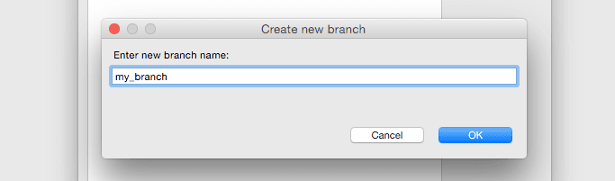
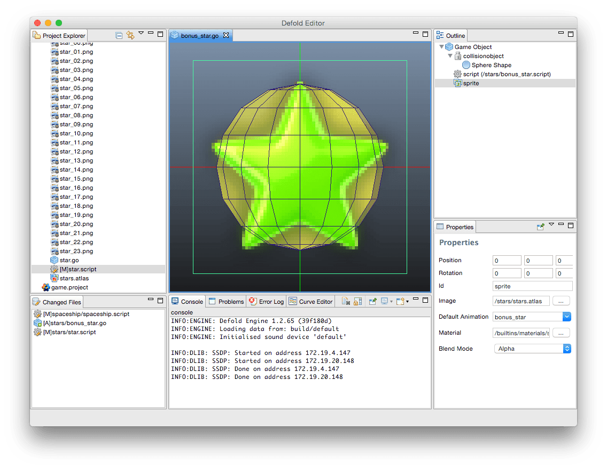
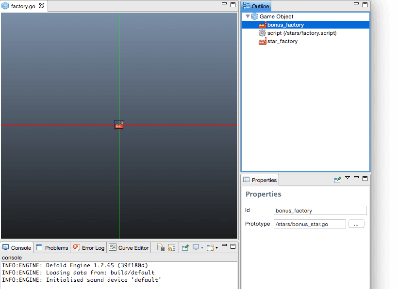
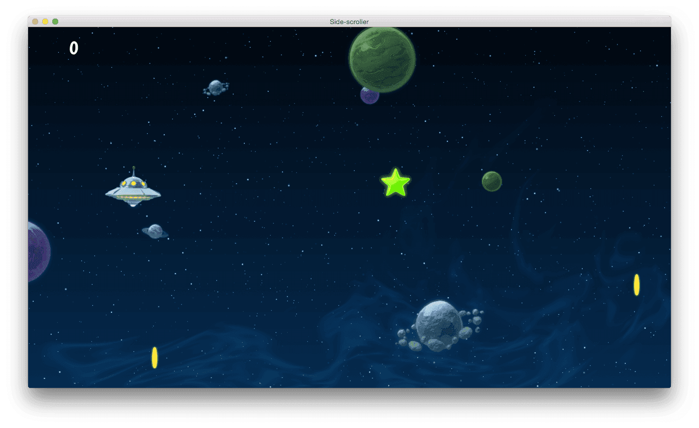

# Side scroller

The game is extremely simple. The player controls a space ship and is supposed to collect stars that appear on the screen. The ship is controlled with the up and down arrow keys on the keyboard.

(You can try the game right here in the browser. Use the arrow keys to control the ship.)

<div id="game-container" class="game-container">
  
  <canvas id="game-canvas" tabindex="1" width="1280" height="720">
  </canvas>
  <button id="game-button">
    START GAME <span class="icon"></span>
  </button>
  <script src="//storage.googleapis.com/defold-doc/assets/dmloader.js"></script>
  <script src="//storage.googleapis.com/defold-doc/assets/dmengine.js" async></script>
  <script>
      /* Load app on click in container. */
      document.getElementById("game-button").onclick = function (e) {
          var extra_params = {
              archive_location_filter: function( path ) {
                  return ("//storage.googleapis.com/defold-doc/assets/side-scroller" + path + "");
              },
              load_done: function() {},
              game_start: function() {
                  var e = document.getElementById("game-preview");
                  e.parentElement.removeChild(e);
              }
          }
          Module.runApp("game-canvas", extra_params);
          document.getElementById("game-button").style.display = 'none';
          document.getElementById("game-button").onclick = null;
      };
  </script>
</div>

## Setup

1. Start by going to the [dashboard](//dashboard.defold.com), log in and click *New Project*.
2. Select the "Side-scroller" tutorial as the template project.
3. Start the editor and open the project you just created with <kbd>File ▸ Open Project</kbd> (the editor can be downloaded from the [dashboard](//dashboard.defold.com)).
4. Select your project and click *Next*.
5. Create a new branch. A branch is like a personal view of the project. Other members of your project won't see your changes until you synchronize your branch (which can be done with <kbd>File ▸ Synchronize</kbd>.

  

6. Try the game with <kbd>Project ▸ Build And Launch</kbd>.

  

## Tweaking

We can tweak the game in order to make it more fun. You can exit the game with the <kbd>Esc</kbd> key, but let's keep the game running and update it live. The speed of the space ship could be faster so let's fix that first:

1. Switch back to the editor and open the file *spaceship.script* with <kbd>Edit ▸ Open Resource...</kbd>
2. In the beginning of the file, change:

    ```lua
    local max_speed = 60
    ```

    to:

    ```lua
    local max_speed = 150
    ```

    This will increase the movement speed of the space ship.

3. Reload the script file into the running game with <kbd>Edit ▸ Reload Resource</kbd>.
4. Try moving the space ship with the arrow-keys on your keyboard. Notice how the it moves faster now.

Currently, the player only gets 1 point for each star collected. More score is more fun so let's take care of that.

1. Open the file *star.script*.
2. In the beginning of the file, change:

    ```lua
    local score = 1
    ```

    to:

    ```lua
    local score = 1000
    ```

3. Reload the file again with <kbd>Edit ▸ Reload Resource</kbd>.
4. Collect some stars and notice how the score has dramatically increased.

## Add a bonus star

Finally, the game would be a bit more interesting if bonus stars would appear now and then. In order to have bonus stars appear, we first need to create a game object, which works as a blueprint.

1. Add a new game object file called *bonus_star.go* in the *stars* directory with <kbd>File ▸ New ▸ Game Object File</kbd>.
2. Add a *Sprite* component to the game object with <kbd>Game Object ▸ Add Component</kbd>. This attaches graphics to the bonus star.
3. In the *Outline* view (upper right), a new item appeared called "sprite". Its properties are displayed in the Properties-view below.

    - Set *Image* property to `stars.atlas` by using the browse-button *...*. The atlas contains the graphics for the bonus star.
    - Set *Default Animation* to "bonus_star" and hit *ENTER*. "bonus_star" is an animation defined in the atlas.

    A green star should appear on the screen. Hit the <kbd>F</kbd> key or select <kbd>Scene ▸ Frame Objects</kbd> if the view of the star is not very good.

4. Select the game object again by clicking on the *Game Object* item in the *Outline*-view.
5. Add a _Collision Object_ component to the game object with <kbd>Game Object ▸ Add Component</kbd>. This lets the bonus stars collide with other game objects, specifically the player space ship in our case.

    - Click on the "collisionobject" item in the Outline-view to show its properties.
    - In the *Properties* view, set its *Type* to `Kinematic`. This means that the collision object will follow the game object it belongs to.
    - Right click "collisionobject" in the *Outline* view and select *Add Shape*. Add a `Sphere` shape to the collision object.
   
    The shape(s) you add defines the boundary as far as collisions are concerned.

6. Scale the sphere in the scene view until it reasonably covers the star; press <kbd>R</kbd> to use the Scale tool. You can also move the sphere by pressing <kbd>W</kbd>.
7. Select the *Game Object* item again and add the script *bonus_star.script* with <kbd>Game Object ▸ Add Component From File</kbd>. This script moves the bonus stars and make sure the player gets the right amount of points for catching them.



## Create a factory component

The factory component is responsible for making sure the bonus stars appear in the game.

1. Open the file *factory.go* with <kbd>Edit ▸ Open Resource...</kbd>
2. Add another _Factory_ component to it with <kbd>Game Object ▸ Add Component</kbd>.
    - Set the new factory component's _Prototype_ to `bonus_star.go` with the browse-button.
    - Set its _Id_ to "bonus_factory".



## Modify the factory script

Now we will make sure the factory game object starts creating the bonus stars by modifying its script.

1. Open *factory.script* with <kbd>Edit ▸ Open Resource...</kbd>
2. Near the bottom of the file, change:

    ```lua
    -- component = "#bonus_factory"
    ```

    to:
    
    ```lua
    component = "#bonus_factory"
    ```
    
    This makes the bonus stars appear roughly 20% of the time.

3. Restart the game by closing the window (or <kbd>Esc</kbd>) to exit, then <kbd>Project ▸ Build and Launch</kbd> in the editor.

    The new bonus stars will start to appear!



**You Win!**

Now go ahead and create more games in Defold!
