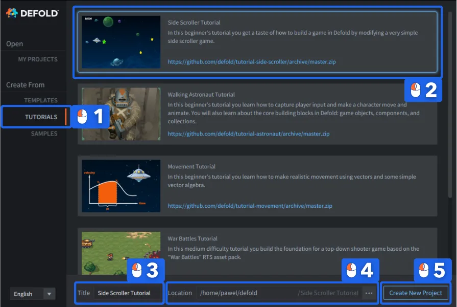

# Side scroller tutorial

The tutorial is integrated with the Defold editor and easily accessible:

Start Defold and:
1. Select `Create From` ▸ `TUTORIALS` on the left.
2. Select the "Side Scroller Tutorial".
3. Rename it, if you want.
4. Select a location for the project on your local drive.
5. Click `Create New Project`.

The editor automatically opens the "README" file from the project root, containing the full tutorial text.

{.icon} [You can also read the full tutorial text on Github](https://github.com/defold/tutorial-side-scroller)

If you get stuck, head over to the [Defold Forum](//forum.defold.com) where you will get help from the Defold team and many friendly users.

Happy Defolding!
