# Snake

This tutorial walks you through the process of creating one of the most common classic games you can attempt to recreate. There are a lot of variations on this game, this one features a snake that eats "food" and that only grows when it eats. This snake also crawls on a playfield that contains obstacles.

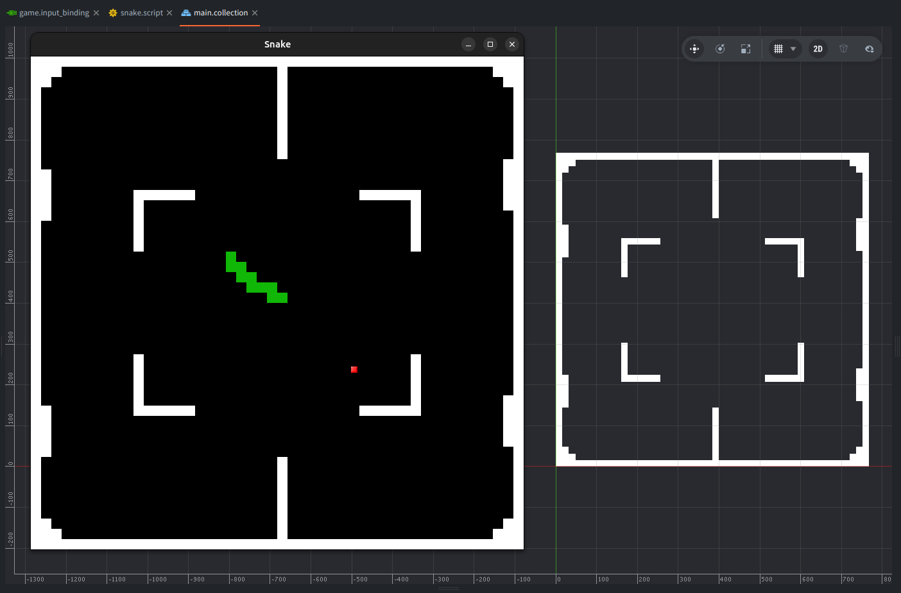

### What you'll learn here?

In this tutorial you'll learn how to:
- create a game from scratch in Defold
- set up and handle inputs
- create tilemaps and modify them in runtime
- write scripts in Lua

### A note for beginners

This tutorial is designed for the beginners, but if you are completely new to Defold and the game development, we recommend reading some of the introductory manuals first, especially about [Defold's Building Blocks](/manuals/building-blocks/) and the [Glossary](/manuals/glossary/). If you don't have Defold downloaded yet, check the [Installation manual](/manuals/install/). It's also recommended to check the [Editor's overview](manuals/editor/), to quickly dive into the Editor itself, but we also provide here screenshots for each step.

## Creating the project

Start Defold and:

1. Select *Create From* ▸ *Templates* on the left side.
2. Select *Empty Project*.
3. Type a project name in *Title*.
4. Select a *Location* for the project.
5. Click *Create New Project*.

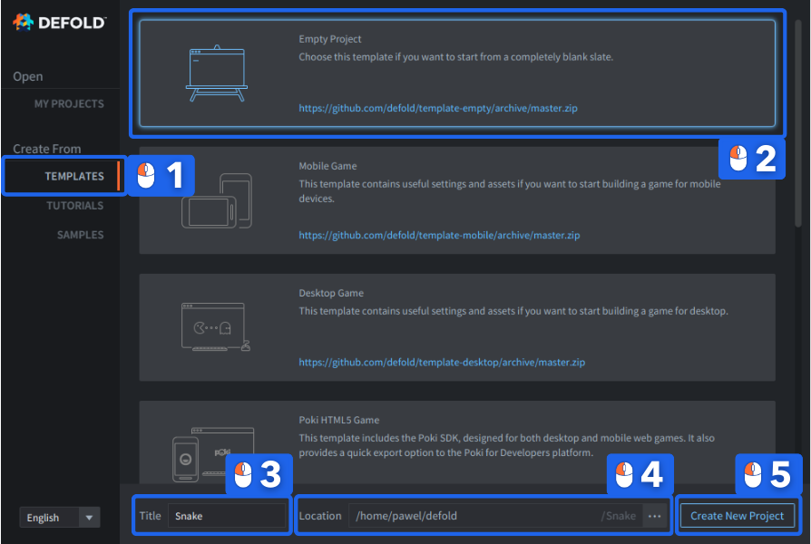

<input type="checkbox"/> Done!

## Project settings

We'll start with defining the resolution of the game.

1. When the Editor is opened, search for the `game.project` file, on the left side, in the *Assets* pane. Double click on it to open.
2. Go to the *Display* section of the `game.project` file.
3. Set the dimensions of the game (`Width` and `Height`) to 768⨉768 or some other multiple of 16.

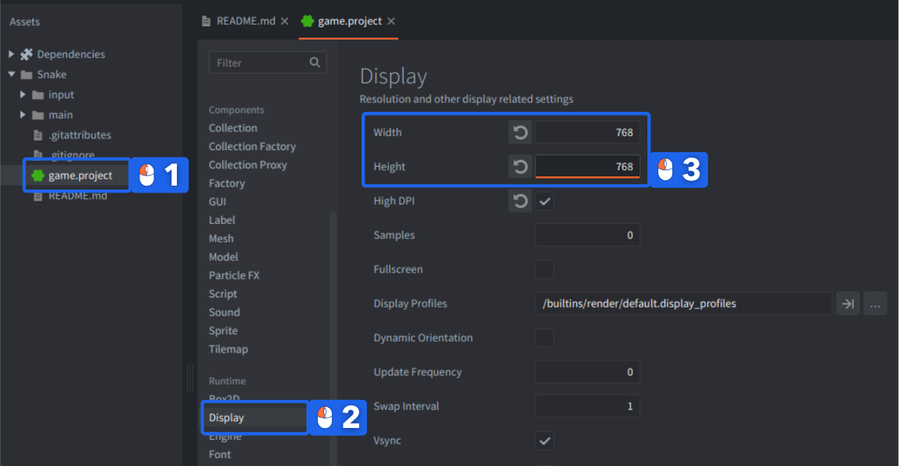

The reason why you want to do this is because the game will be drawn on a grid where each segment is going to be 16x16 pixels, and this way the game screen won't cut off any partial segments. This `game.project` file contains all important settings of the projects - you can read about all of them in the [Project Settings manual](/manuals/project-settings/).

<input type="checkbox"/> Done!

## Creating new folders in Assets pane

Very little is needed in terms of graphics for a minimalist Snake clone. One 16⨉16 green segment for the snake, one white block for the obstacles and one, smaller red block representing the food.

First, create a directory for the assets in the Defold Editor:

1. <kbd>Right click</kbd> on the `main` folder
2. Select `New Folder`.
3. A popup asking for a name will appear - type `assets` and click `Create Folder`.

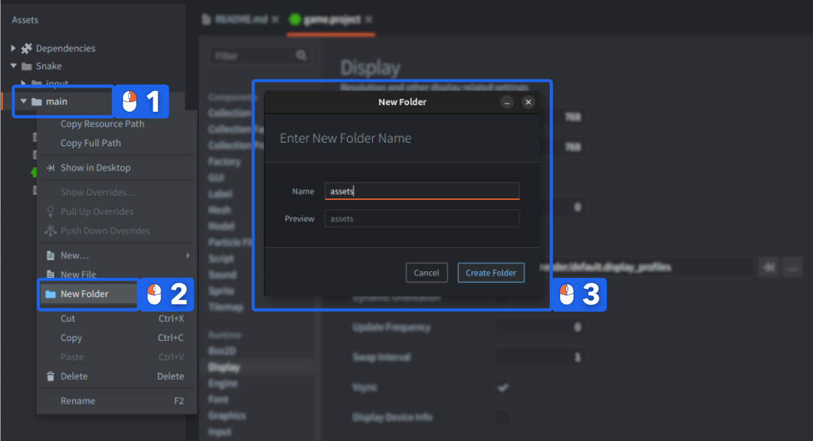

<input type="checkbox"/>`Done!`

## Adding graphics to the game

This image below is the only asset you need:


1. <kbd>Right click</kbd> the image above and save it to your local disk. Then, drag and drop (or copy + paste) the downloaded image to the new location in the project folder, that you just created.

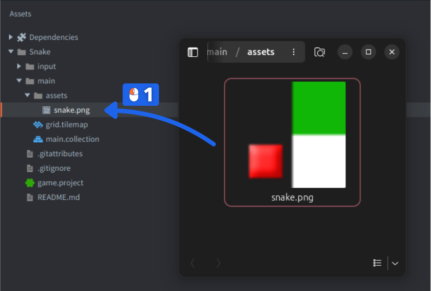

You can also read more details about [importing assets here](/manuals/importing-graphics/).

<input type="checkbox"/>`Done!`

## Adding Tile Source

Defold provides a built-in [Tilemap](/manuals/tilemap/) component that you will use to create the playfield consisting of the *tiles* aligned in a grid. A tilemap allows you to set and read individual tiles, which suits this game perfectly. Since tilemaps fetch their graphics from a [Tilesource](/manuals/tilesource/), you need to create one:

1. <kbd>Right click</kbd> the `assets` folder.
2. Select `New` ▸ `Tile Source` in the "Resources" section.
3. Name the new file "snake" (the editor will save the file as `snake.tilesource`).

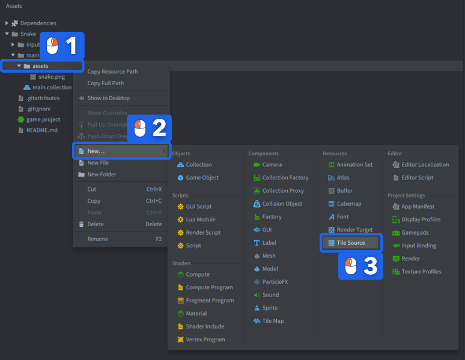

The tilesource will open in a dedicated Tilesource Editor for this type of file, and you'll be asked to provide an image for it, that is necessary. On the right side you can find a `Properties` pane:

4. Set the `Image` property to the graphics file you just imported.
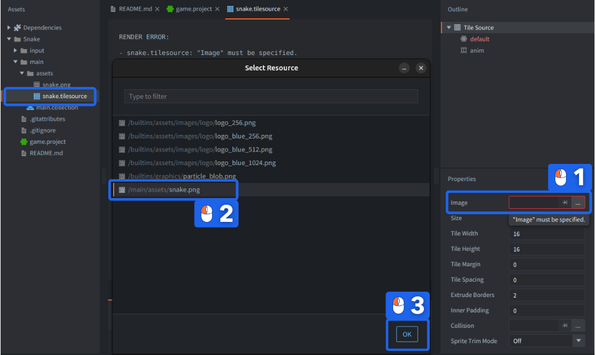

5. The `Width` and `Height` properties should be kept at 16 (default value). This will split the 32⨉32 pixel image into 4 tiles, numbered 1–4.

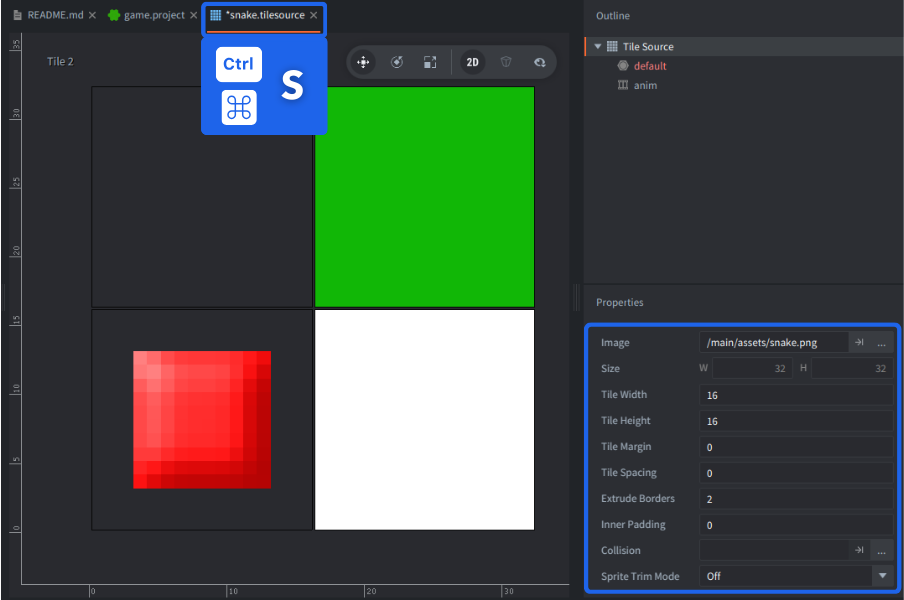

Note that the *Extrude Borders* property is set to 2 pixels. This is to prevent visual artifacts around the tiles that have graphics all the way out to the edge.

If you make any changes to a file an asterisk mark `*` appears next to its name on its tab. Select `File` ▸ `Save All` or use shortcut `<kbd>Ctrl</kbd>+<kbd>S</kbd> (<kbd>⌘Cmd</kbd> + <kbd>S</kbd> on Mac) to save all files.

<input type="checkbox"/> Done!

## Creating the playfield tilemap

Now you have a tilesource ready for use, so it's time to create the playfield tilemap component:

1. <kbd>Right click</kbd> the `main` folder and select <kbd>New</kbd> ▸ <kbd>Tile Map</kbd> in the "Components" section. Name the new file "grid" (the editor will save the file as "grid.tilemap").
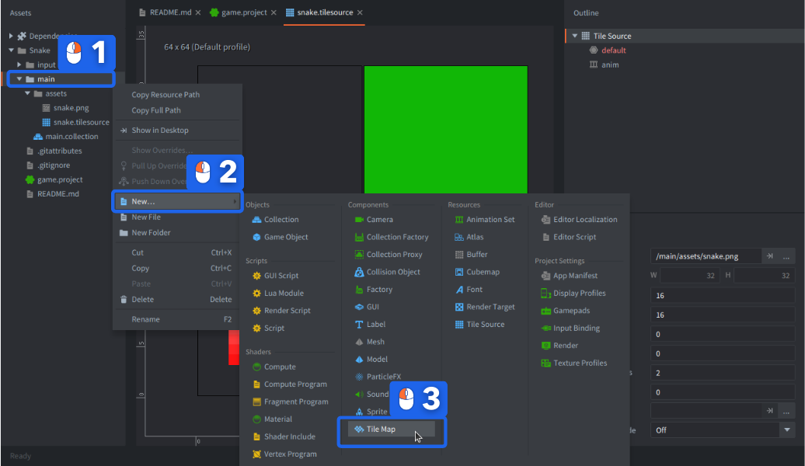

2. It will open in a Tilemap Editor, and highlight that it needs a **Tile Source**, so set the *Tile Source* property to the previously created "snake.tilesource".
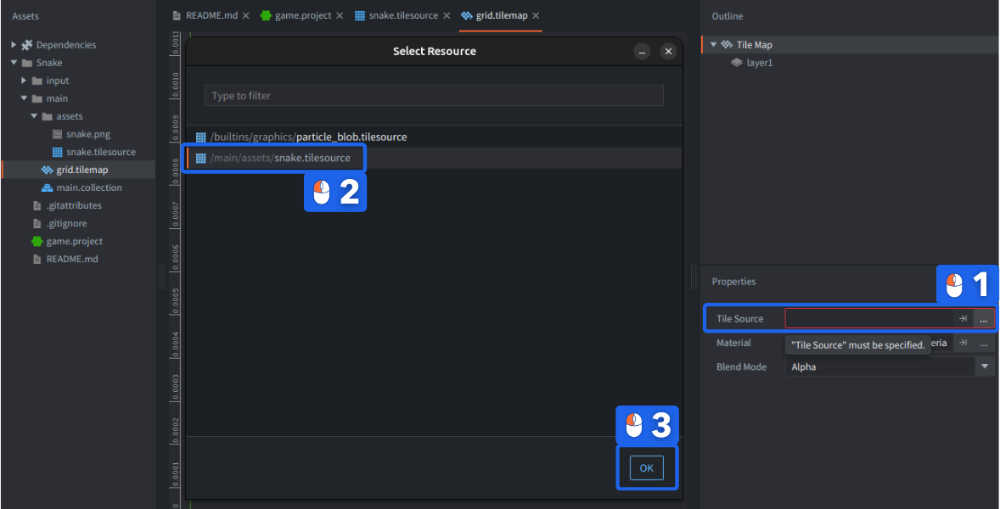

<input type="checkbox"/> Done!

## Drawing tiles in the tilemap

Defold only stores the area of the tilemap that is actually used so you need to add enough tiles to fill the boundaries of the screen.

1. Select the `layer1` layer in the `Outline` pane on the right side.
2. Choose the menu option `Edit` ▸ `Select Tile...` or shortcut <kbd>Space</kbd> to display the tile palette, then click the tile you want to use when painting.
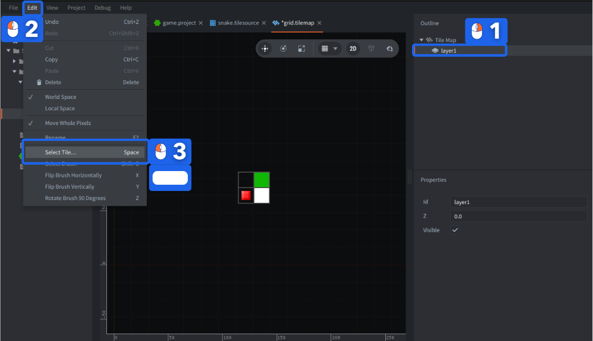

3. Paint a border around the edge of the screen and some obstacles.
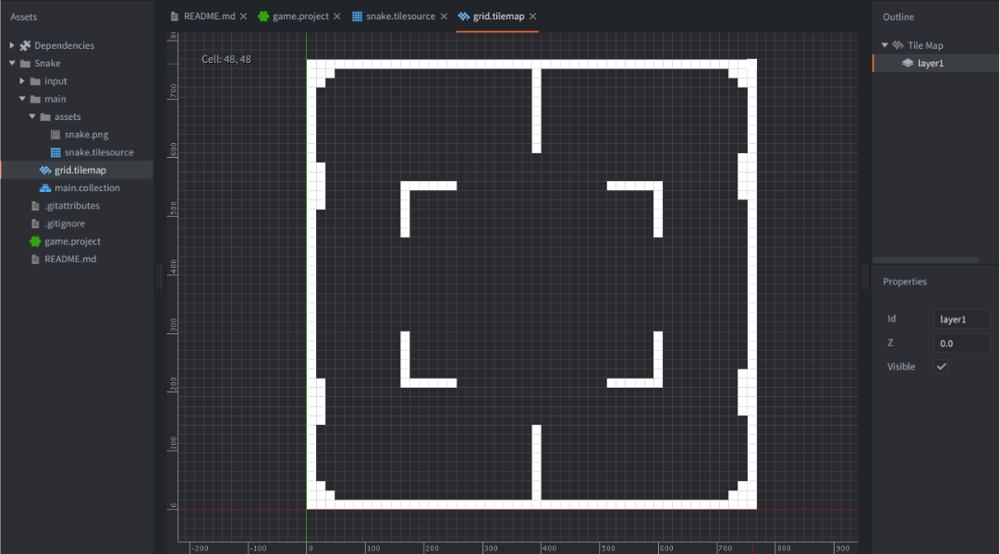

You will need a tilemap of size 48x48 tiles (because our display is 768 and we have 16px tiles, so 768/16 = 48) to fill our game screen.

Save the tilemap when you are done.

<input type="checkbox"/> Done!

## Adding the tilemap to the game

Now we need to add our tilemap to the game. If you are familiar with Defold Building Blocks, components are part of Game Objects and game objects can be defined in the Collections.

1. Open `main.collection` by double-clicking on it in the `Assets` pane. This is, in the Empty Project template by default, the bootstrap collection that is loaded on engine start.

2. <kbd>Right click</kbd> the root in the `Outline` and select `Add Game Object` which creates a new game object in the collection that is loaded when the game starts.
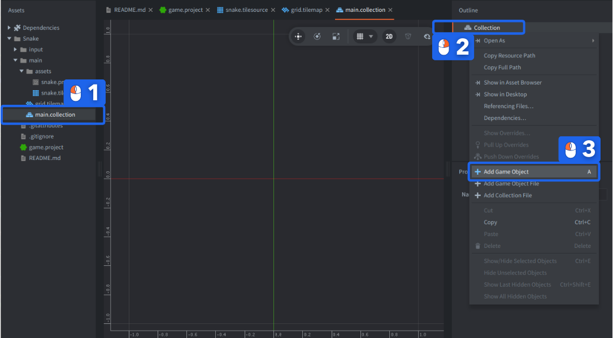

3. <kbd>Right click</kbd> the new game object and select `Add Component File`. Choose the file "grid.tilemap" that you just created.
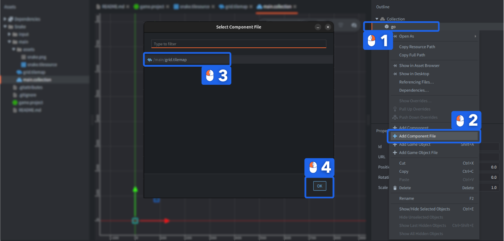

Right now we have a tilemap in our game collection. It should be visible, when you run the game from the Editor.

1. Select `Project` ▸ `Build` or shortcut <kbd>Ctrl</kbd> + <kbd>B</kbd> (<kbd>⌘Cmd</kbd> + <kbd>B</kbd> on Mac).

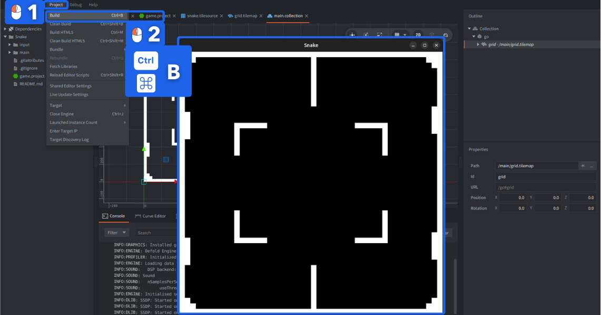

<input type="checkbox"/> Done!

## Adding a script to the game

1. <kbd>Right click</kbd> the folder `main` in the `Assets` browser and select `New` ▸ `Script` in the Scripts section. Name the new script file "snake" (it will be saved as "snake.script"). This file will hold all the logic for the game.
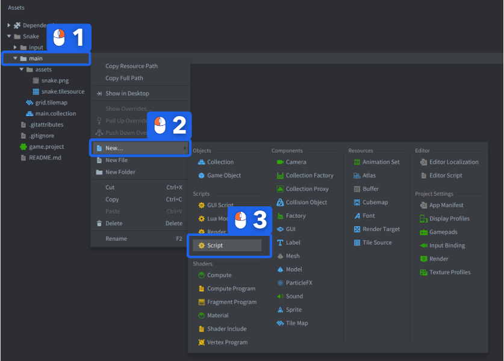

2. Go back to *main.collection* and <kbd>right click</kbd> the game object holding the tilemap. Select <kbd>Add&nbsp;Component&nbsp;File</kbd> and choose the file "snake.script".

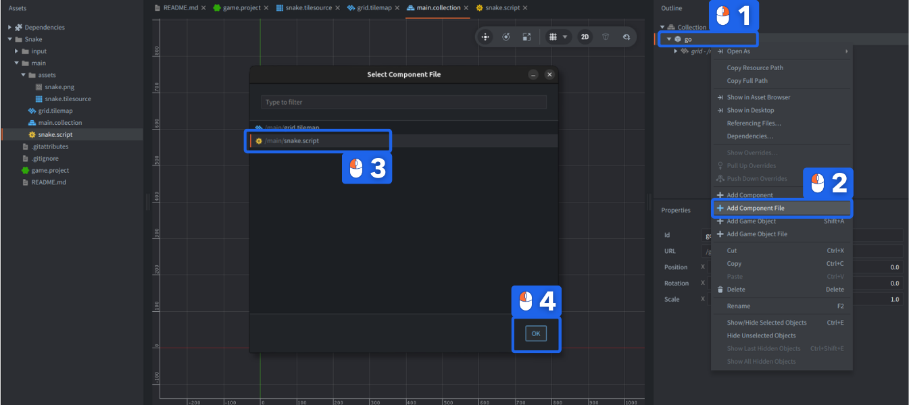

Now you have the tilemap component and the script in place.

<input type="checkbox"/> Done!

## The game script

The script you are going to write will drive all of the game. We will be adding features one by one.

### Simple movement algorithm

The idea for how that is going to work is the following:

1. The script keeps a list of tile positions that the snake currently occupies.
2. If the player presses a directional key, store the direction the snake should be moving.
3. At a regular interval, move the snake one step in the current movement direction.

### Initialization

Open *snake.script* and locate the `init()` function. This function is called by the engine when the script is initialized on game start. Change the code to the following:

```lua
function init(self)
    self.segments = { -- <1>
        {x = 7, y = 24},
        {x = 8, y = 24},
        {x = 9, y = 24},
        {x = 10, y = 24}
    }
    self.dir = {x = 1, y = 0} -- <2>
    self.speed = 7.0 -- <3>
    self.time = 0 -- <4>
end
```

In this code we:

1. Store the segments of the snake as a Lua table named `self.segments` containing a list of tables, each holding a X and Y position for a segment.
2. Store the current direction as a table named `self.dir` holding an X and Y direction.
3. Store the current movement speed in `self.speed`, expressed as tiles per second.
4. Store a timer value in `self.time` that will be used to keep track of movement speed.

The script code above is written in the Lua language. There are a few things to note about the code, but if you won't yet understand any of the below, don't worry about it. Just tag along, experiment and give it time --- you will get it eventually. For now, you can remember in `init()` we just initialized the variables that we will be using.

- Defold reserves a set of built-in callback *functions* that are called during the lifetime of a script component. These are *not* methods but plain functions.
- The runtime passes a reference to the current script component instance through the parameter `self`. The `self` reference is used to store instance data.
- The `self` reference can be used as a Lua table that you can store data in. Just use the dot notation as you would with any other table: `self.data = "value"`. The reference is valid throughout the lifetime of the script, in this case from game start until you quit it.
- Lua table literals are written surrounded with curly braces `{}`.
- Table entries can be key/value pairs (`{x = 10, y = 20}`), nested Lua tables (`{ {a = 1}, {b = 2} }`) or other data types.

<input type="checkbox"/> Done!

### Update

The `init()` function is called exactly once, when the script component is instantiated into the running game. The function `update()`, however, is called once **each frame**, so 60 times a second by default. That makes the function ideal for real-time game logic.

The idea for the update is this: at some set interval do the following:

1. Find where the head of the snake is, then make a new head in the position next to it that is offset by the current movement direction. So, if the snake is moving by X=1 and Y=0 and the current head is at location X=0 and Y=0, then the new head should be at X=1 and Y=0.
2. Save the new head position in the list of segments that constitutes the snake.
3. Get the position of the tail from the segment table.
4. Clear the tail tile at this position.
5. Draw all the snake segments (tiles) at positions from the table.

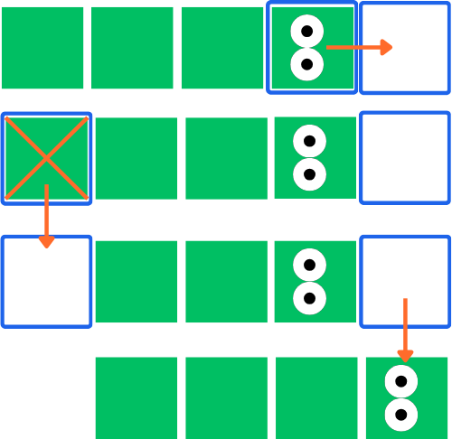

:::sidenote
Keep in mind that our head of the snake is at the end of the table, and the tail is at the beginning.
:::

1. Find the `update()` function in *snake.script* and change the code to the following:

```lua
function update(self, dt)
    self.time = self.time + dt -- <1>
    if self.time >= 1.0 / self.speed then -- <2>
        local head = self.segments[#self.segments] -- <3>

        local newhead = {
            x = head.x + self.dir.x,
            y = head.y + self.dir.y
        } -- <4>

        table.insert(self.segments, newhead) -- <5>

        local tail = table.remove(self.segments, 1) -- <6>

        tilemap.set_tile("#grid", "layer1", tail.x, tail.y, 0) -- <7>

        for i, s in ipairs(self.segments) do -- <8>
            tilemap.set_tile("#grid", "layer1", s.x, s.y, 2) -- <9>
        end

        self.time = 0 -- <10>
    end
end
```

In this code we:

1. Advance the timer with the time difference (in seconds) since the last time `update()` was invoked --- so-called "delta time", or `dt`.
2. If the timer has advanced enough:
3. Get the current head's position. `#` is the operator used to get the length of a table given that it is used as an array, which it is in our case --- all the segments are table values with no key specified.
4. Create a new head segment based on the current head location and the movement direction (`self.dir`).
5. Add the new head to the (end of the) segments table.
6. Pop the tail from the beginning of the segments table.
7. Clear the tile at the position of the removed tail. Our tilemap `#grid` has only 1 layer named `layer1`.
8. Loop through the elements in the segments table. Each iteration will have `i` set to the position in the table (starting from 1) and `s` set to the current segment.
9. Set the tile at the position of the segment to the value 2 (which is the tile with the green snake color).
10. When done, reset the timer to zero.

If you run the game now you should see the 4-segment-long snake crawl from left to right over the play field.

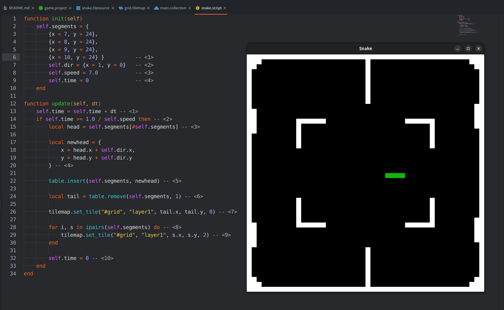

<input type="checkbox"/> Done!

## Player input

Before you add a code to react to the player input, you need to set up the input connections.

### Input bindings

1. Find in the `input` folder the file `game.input_binding` and <kbd>double click</kbd> to open it.
2. Add a set of *Key Trigger* bindings for movement up, down, left and right. In the *Input* column select keyboard keys and in the *Action* columns type action names.

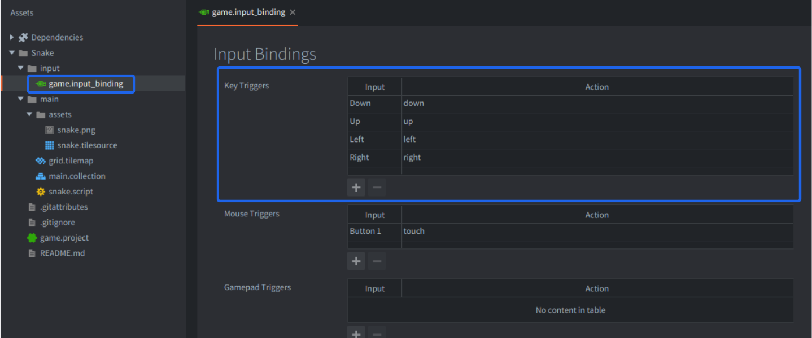

The input binding file maps actual user input (keys, mouse movements etc) to action *names* that are fed to scripts that have requested input.

<input type="checkbox"/> Done!

### Acquiring input focus

With bindings in place, open *snake.script* and add the following line at the beginning of the `init()` function:

```lua
function init(self)
    msg.post(".", "acquire_input_focus") -- <1>

    self.segments = {
        {x = 7, y = 24},
        {x = 8, y = 24},
        {x = 9, y = 24},
        {x = 10, y = 24}
    }
    self.dir = {x = 1, y = 0}
    self.speed = 7.0
    self.time = 0
end
```

The added line:
1. Send a message to the current game object ("." is shorthand for the current game object) telling it to start receiving input from the engine.

Then find `on_input` function and type the following code:

```lua
function on_input(self, action_id, action)
    if action_id == hash("up") and action.pressed then -- <1>
        self.dir.x = 0 -- <2>
        self.dir.y = 1
    elseif action_id == hash("down") and action.pressed then
        self.dir.x = 0
        self.dir.y = -1
    elseif action_id == hash("left") and action.pressed then
        self.dir.x = -1
        self.dir.y = 0
    elseif action_id == hash("right") and action.pressed then
        self.dir.x = 1
        self.dir.y = 0
    end
end
```

These `if...elseif...` branches do the following:
1. If the input action "up" is received, as set up in the input bindings, and the `action` table has the `pressed` field set to `true` (player pressed the key) then:
2. Set the movement direction.

Run the game again and check that you are able to steer the snake.

<input type="checkbox"/> Done!

### Improving input handling

Now, notice that if you press two keys simultaneously, that will result in two calls to `on_input()`, one for each press. As the code is written above, only the call that happens last will have an effect on the snake's direction since subsequent calls to `on_input()` will overwrite the values in `self.dir`.

Also note that if the snake moves left and you press the <kbd>right</kbd> key, the snake will steer into itself. The *apparently* obvious fix to this problem is by adding an additional condition to the `if` clauses in `on_input()`:

```lua
if action_id == hash("up") and self.dir.y ~= -1 and action.pressed then
    ...
elseif action_id == hash("down") and self.dir.y ~= 1 and action.pressed then
    ...
```

However, if the snake is moving left and the player *quickly* presses first <kbd>up</kbd>, then <kbd>right</kbd> before the next movement step happens, only the <kbd>right</kbd> press will have an effect and the snake will move into itself. With the conditions added to the `if` clauses shown above, the input will be ignored. *Not good!*

A proper solution to this problem is to store the input in a queue and pull entries from that queue as the snake moves:

```lua
function init(self)
    msg.post(".", "acquire_input_focus")

    self.segments = {
        {x = 7, y = 24},
        {x = 8, y = 24},
        {x = 9, y = 24},
        {x = 10, y = 24}
    }
    self.dir = {x = 1, y = 0}
    self.speed = 7.0
    self.time = 0

    self.dirqueue = {} -- <1>
end
```

This time, we:
1. Added a variable `self.dirqueue` that is initialized as an empty table.

In the `update()` function add:

```lua
function update(self, dt)
    self.time = self.time + dt
    if self.time >= 1.0 / self.speed then
        local newdir = table.remove(self.dirqueue, 1) -- <1>
        if newdir then
            local opposite = newdir.x == -self.dir.x or newdir.y == -self.dir.y -- <2>
            if not opposite then
                self.dir = newdir -- <3>
            end
        end

        local head = self.segments[#self.segments]
        local newhead = {x = head.x + self.dir.x, y = head.y + self.dir.y}

        table.insert(self.segments, newhead)

        local tail = table.remove(self.segments, 1)
        tilemap.set_tile("#grid", "layer1", tail.x, tail.y, 0)

        for i, s in ipairs(self.segments) do
            tilemap.set_tile("#grid", "layer1", s.x, s.y, 2)
        end

        self.time = 0
    end
end
```

1. Pull the first item from the direction queue.
2. If there is an item (`newdir` is not null) then check if `newdir` is pointing opposite to `self.dir`.
3. Only set new direction if it does not point opposite.

And modify `on_input` to store current input in the queue instead:

```lua
function on_input(self, action_id, action)
    if action_id == hash("up") and action.pressed then
        table.insert(self.dirqueue, {x = 0, y = 1}) -- <1>
    elseif action_id == hash("down") and action.pressed then
        table.insert(self.dirqueue, {x = 0, y = -1})
    elseif action_id == hash("left") and action.pressed then
        table.insert(self.dirqueue, {x = -1, y = 0})
    elseif action_id == hash("right") and action.pressed then
        table.insert(self.dirqueue, {x = 1, y = 0})
    end
end
```

1. Add input direction to the direction queue instead of setting `self.dir` directly.

Start the game and check that it plays as expected.

<input type="checkbox"/> Done!

## Food and collision with obstacles

The snake needs food on the map so it can grow long and fast. Let's add that!

### Spawning the food

Above the `init()` function add a new function:

```lua
local function put_food(self) -- <1>
    self.food = {x = math.random(2, 47), y = math.random(2, 47)} -- <2>
    tilemap.set_tile("#grid", "layer1", self.food.x, self.food.y, 3) -- <3>
end
```

In this function we:
1. Declare a new function called `put_food()` that puts a piece of food on the map.
2. Store a random X and Y position in a variable called `self.food`.
3. Set the tile at position X and Y to the value 3, which is the tile graphics for the food.

Then call it at the end of the `init()` function:
```lua
function init(self)
    msg.post(".", "acquire_input_focus")

    self.segments = {
        {x = 7, y = 24},
        {x = 8, y = 24},
        {x = 9, y = 24},
        {x = 10, y = 24}
    }
    self.dir = {x = 1, y = 0}
    self.dirqueue = {}
    self.speed = 7.0
    self.time = 0

    math.randomseed(socket.gettime()) -- <1>
    put_food(self) -- <2>
end
```

1. Before starting to pull random values with `math.random()`, set the random seed, otherwise the same series of random values will be generated. This seed should only be set once.
2. Call the function `put_food()` at game start so the player begins with a food item on the map.

<input type="checkbox"/> Done!

### Eating the food

Now, detecting if the snake has collided with something is just a matter of looking at what's on the tilemap where snake is heading and react.

Add a variable that keeps track of whether the snake is alive or not:

```lua
function init(self)
    msg.post(".", "acquire_input_focus")

    self.segments = {
        {x = 7, y = 24},
        {x = 8, y = 24},
        {x = 9, y = 24},
        {x = 10, y = 24}
    }
    self.dir = {x = 1, y = 0}
    self.dirqueue = {}
    self.speed = 7.0
    self.time = 0

    self.alive = true -- <1>

    math.randomseed(socket.gettime())
    put_food(self)
end
```

1. A flag telling if the snake is alive or not.

Then add logic that tests for collision with wall/obstacle and food:

```lua
function update(self, dt)
    self.time = self.time + dt
    if self.time >= 1.0 / self.speed and self.alive then -- <1>
        local newdir = table.remove(self.dirqueue, 1)

        if newdir then
            local opposite = newdir.x == -self.dir.x or newdir.y == -self.dir.y
            if not opposite then
                self.dir = newdir
            end
        end

        local head = self.segments[#self.segments]
        local newhead = {x = head.x + self.dir.x, y = head.y + self.dir.y}

        table.insert(self.segments, newhead)

        local tile = tilemap.get_tile("#grid", "layer1", newhead.x, newhead.y) -- <2>

        if tile == 2 or tile == 4 then
            self.alive = false -- <3>
        elseif tile == 3 then
            self.speed = self.speed + 1 -- <4>
            put_food(self)
        else
            local tail = table.remove(self.segments, 1) -- <5>
            tilemap.set_tile("#grid", "layer1", tail.x, tail.y, 1)
        end

        for i, s in ipairs(self.segments) do
            tilemap.set_tile("#grid", "layer1", s.x, s.y, 2)            
        end

        self.time = 0
    end
end
```

1. Only advance the snake if it's alive.
2. Before drawing to the tilemap, read what's at the position where the new snake head will be.
3. If the tile is an obstacle or another part of the snake, game over!
4. If the tile is food, increase the speed, then put out a new food item.
5. Note that the removal of the tail only happens if there is no collision. This means that if the player eats food, the snake will grow by one segment since no tail is removed on that move.

Now try the game and make sure it plays well!

This concludes the tutorial but please continue experimenting with the game and work through some of the exercises below!

<input type="checkbox"/> Done!

## The complete script

Here is the complete script code for reference:

```lua
local function put_food(self)
    self.food = {x = math.random(2, 47), y = math.random(2, 47)}
    tilemap.set_tile("#grid", "layer1", self.food.x, self.food.y, 3)        
end

function init(self)
    msg.post(".", "acquire_input_focus")

    self.segments = {
        {x = 7, y = 24},
        {x = 8, y = 24},
        {x = 9, y = 24},
        {x = 10, y = 24}
    }
    self.dir = {x = 1, y = 0}
    self.dirqueue = {}
    self.speed = 7.0
    self.time = 0

    self.alive = true

    math.randomseed(socket.gettime())
    put_food(self)
end

function update(self, dt)
    self.time = self.time + dt
    if self.time >= 1.0 / self.speed and self.alive then
        local newdir = table.remove(self.dirqueue, 1)

        if newdir then
            local opposite = newdir.x == -self.dir.x or newdir.y == -self.dir.y
            if not opposite then
                self.dir = newdir
            end
        end

        local head = self.segments[#self.segments]
        local newhead = {x = head.x + self.dir.x, y = head.y + self.dir.y}

        table.insert(self.segments, newhead)

        local tile = tilemap.get_tile("#grid", "layer1", newhead.x, newhead.y)

        if tile == 2 or tile == 4 then
            self.alive = false
        elseif tile == 3 then
            self.speed = self.speed + 1
            put_food(self)
        else
            local tail = table.remove(self.segments, 1)
            tilemap.set_tile("#grid", "layer1", tail.x, tail.y, 1)
        end

        for i, s in ipairs(self.segments) do
            tilemap.set_tile("#grid", "layer1", s.x, s.y, 2)            
        end

        self.time = 0
    end
end

function on_input(self, action_id, action)
    if action_id == hash("up") and action.pressed then
        table.insert(self.dirqueue, {x = 0, y = 1})
    elseif action_id == hash("down") and action.pressed then
        table.insert(self.dirqueue, {x = 0, y = -1})
    elseif action_id == hash("left") and action.pressed then
        table.insert(self.dirqueue, {x = -1, y = 0})
    elseif action_id == hash("right") and action.pressed then
        table.insert(self.dirqueue, {x = 1, y = 0})
    end
end
```

## Exercises

It’s a good exercise to try implementing these improvements:

1. Add a key input handling to restart the game, when it's over.
2. Add scoring and a score counter, be it using just a label component (easier) or a whole gui.
3. The put_food() function doesn’t account for the snake’s position or any obstacles. Fix it, so it only spawns on free spots.
4. When the game is over, show a “Game Over” message and allow the player to try again.
5. Extra credit: add a second player-controlled snake.
