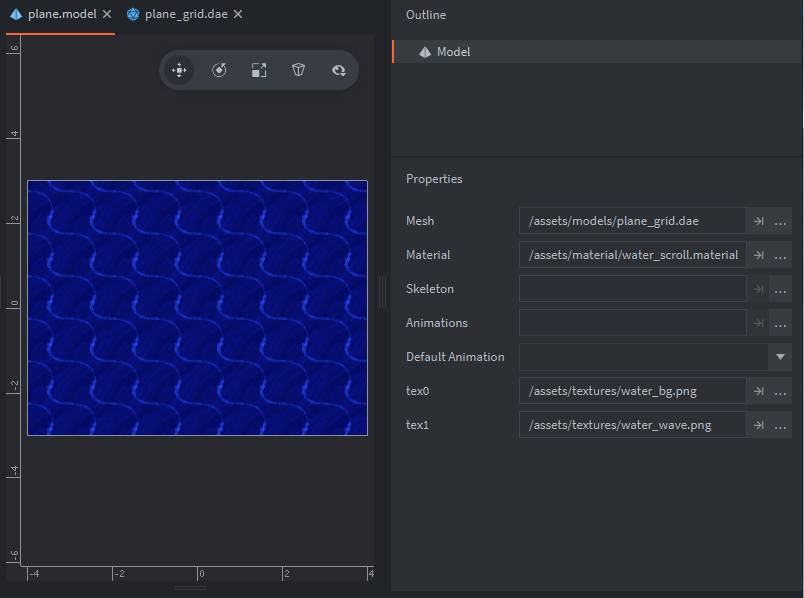
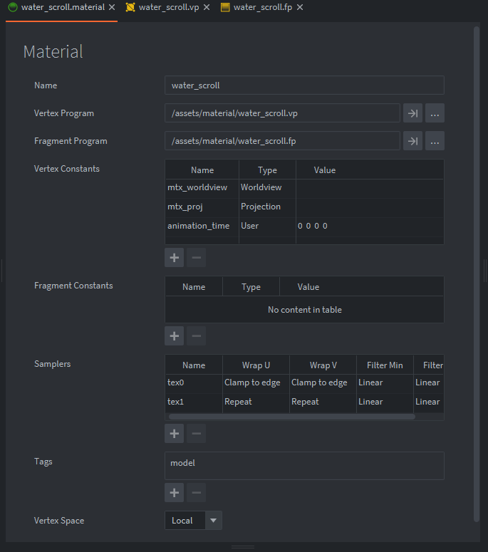

Credits: This tutorial is contributed by forum user MasterMind ([original forum post](https://forum.defold.com/t/texture-scrolling-shader-tutorial-example/71553)).

# Texture scrolling shader tutorial

Scrolling textures via shader is a staple in many shader effects. Let's make one! Use the [example project](https://github.com/FlexYourBrain/Texture_Scrolling_Example) to follow along and try it out yourself. The method that will be used is UV offsetting using a constant in the shader.

There is also a [demo of the example project on itch.io](https://flexyourbrain.itch.io/texture-scrolling-in-defold) for those that would like to see the result of this short tutorial/guide:


## Setup

The project is setup like this:

* One subdivided 3D plane (.dae) that will be used to display the scrolling texture.
* One model component with the 3D plane (.dae file) assigned.
* Two 64x64 texture images (water_bg.png and water_wave.png) created to seamlessly tile are assigned in the .model properties.
* One shader (Material + Vertex Program + Fragment Program) that is assigned to the plane model.
* One constant set in materials and the shader.
* One script component attached to the model game object to start the animation loop.



_Note: water_bg is assigned to tex0 slot and water_wave is set to tex1 slot. Two sampler slots are assigned in material sampler properties shown below._



_Currently tex1 will be the texture that will be scrolling so Wrap U & V are set to Repeat._

That is the basic setup and now we can move on to the `water_scroll.vp` (vertex) and `water_scroll.fp` (fragment) programs. You can see in the image above these are set to the material.


## Shader code

It’s good practice to avoid doing to much calculations in the fragment program if you can avoid it so we calculate the UV offset in the vertex program before the coordinates are sent to the fragment program. We also create a constant "animation_time" with type user to the vertex constant properties set in the material (as seen above). The constant is a vector 4 but we only use the first value. If we denote this vector 4 as vector4(x,y,z,w) we will only use x value in the shader as shown below.


```glsl
// water_scroll.vp

// UV / Texture Scroll
attribute highp vec4 position;
attribute mediump vec2 texcoord0;

uniform mediump mat4 mtx_worldview;
uniform mediump mat4 mtx_proj;
uniform mediump vec4 animation_time; // vertex constant set up in material as type user.

varying mediump vec2 var_texcoord0; // setup var texcoord 0
varying mediump vec2 var_texcoord1; // setup var texcoord 1

void main()
{
    vec4 p = mtx_worldview * vec4(position.xyz, 1.0);
    var_texcoord0 = texcoord0;
    var_texcoord1 = vec2(texcoord0.x - animation_time.x, texcoord0.y); // Calculate var texcoord 1 uv offset on U(x) axis to fragment program 
    gl_Position = mtx_proj * p;
}
```

The model supplies the attribute `texcoord0` which is our texture UV coordinates. We declare our vec4 uniform named animation_time and we also have two vec2 varying texcoords 0 and 1 which we pass these to the fragment program after we assign them the attribute UV coords `texcoord0` in `void main()`. As you can see `var_texcoord1` is different because this one we are offsetting before it is sent to the fragment program. Assign a vec2 so that we can `animation_time` to the x and y separately if we want. In this case we only take `texcoord0.x` and subtract our constant `animation_time.x` which when animated will offset in the negative U axis (horizontal left), we set `texcoord0.y` to keep its attribute position. EZ PZ!


```glsl
// water_scroll.fp

varying mediump vec2 var_texcoord0; // var texcoord 0 used with water_bg sampler
varying mediump vec2 var_texcoord1; // var texcoord 1 used with water_waves sampler, UV animation calulation done in vertex program

uniform lowp sampler2D tex0; // Material sampler slot 0 = water background / set in plane.model
uniform lowp sampler2D tex1; // Material sampler slot 1 = water waves / set in plane.model

void main()
{
    vec4 water_bg = texture2D(tex0, var_texcoord0.xy);
    vec4 water_waves = texture2D(tex1, var_texcoord1.xy);
    
    gl_FragColor = vec4(water_bg.rgb + water_waves.rgb ,1.0); // add texture waves to bg using addition(+), alpha set to 1.0 as there is no transparency being used0
}
```

Now to the fragment program, we have a simple setup. Two "in" varying vec2’s that we sent from the vertex program `var_textcoord0` and `var_texcoord1` and then we supply uniforms for the sampler textures we set in our model and material they are named `tex0` and `tex1`. Then in `void main()` we create vector 4’s to assign to our textures using `texture2d()`, the images are in RGBA (red,green,blue,alpha) channel format. We assign sampler name and then the texture coordinates we want them to use. As you see in the image above "water_waves" has `var_texcoord1` assigned. this is the texture we are animating/scrolling and `var_texcoord0` assigned to water_bg we left as is. For the global reserved variable `gl_FragColor` this is where pixel colors are assigned with the same `vec4(r,g,b,a)` format. We want to combine the 2 textures together so we use addition to mix the rgb channels of each texture together, also we are not using the textures alpha channel so we assign a float value of 1.0 which equals full opacity.


## Shader animation script

```lua
-- animate_shader.script
local animate = 1.0
-- local float will be used to set animation_time constant in scroll material , only x constant value is used in the shader 
-- so there is no need to create a vector 4

function init(self)
	go.animate("/scroll#plane", "animation_time.x", go.PLAYBACK_LOOP_FORWARD, animate, go.EASING_LINEAR, 4.0)
end
```

There are more than one ways of animating constant values, you can calculate delta time steps and update the constant with these values in the render script or a normal script if you wanted to. In this case we are only animating one shader and if you wanted a time step in several shaders calculating in an `update()` might be more ideal. However we will use `go.animate()` because we have a lot of functionality at our disposal. Using `go.animate()` we can animate just the x value of our constant using "animation_time.x". We also have duration, delay and easing to play with if we so choose. We can also set playback to loop or play once and cancel the animation if we needed to. These all come in very handy when animating our shaders.

The `local animate` float 1.0 is our target value we are animating in "animation_time.x". In shaders for the most part we deal with normalized float values 0.0 to 1.0. Notice the default constant values in the material for our `animation_time` is (0,0,0,0) we are animating the first zero from 0.0 to 1.0. This means our offset UV coords will animate to the edge and then loop again over and over which is exactly what we want!


## Next steps

As an exercise you can try to animate the `water_bg` texture coordinates in the opposite direction like in the example demo!

Hope this helps. If you do make something scroll please share!

/ MasterMind


