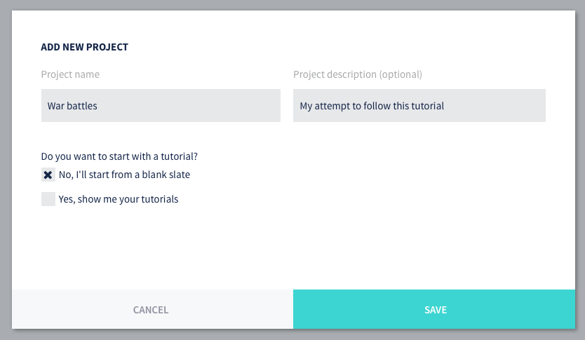

# War battles tutorial

This tutorial goes through the steps needed to create a small playable game embryo in Defold. You do not need to have any prior experience with Defold, but if you have done some programming in Lua, Javascript, Python or similar, that will help. To get an idea about what you are about to build, you can try the result here:

    
    <canvas id="game-canvas" tabindex="1" width="720" height="720">
    </canvas>
    <button id="game-button">
        START GAME 
    </button>
    
    
    

## New project

The tutorial is integrated with the editor so it is really easy to get going:

1. Start Defold.
2. Select *New Project* on the left.
3. Select the *From Tutorial* tab.
4. Select the "War battles tutorial"
5. Select a location for the project on your local drive and click *Create New Project*.

The editor now automatically opens the "README" file from the project root, containing the full tutorial text.

- If you are new to Defold, check out the [editor introduction](/manuals/editor).
- If you get stuck, please head over to the [Defold Forum](//forum.defold.com) where you can talk to the Defold developers and many friendly users.
- The tutorial is also available on Github: https://github.com/defold/tutorial-war-battles

Happy Defolding!