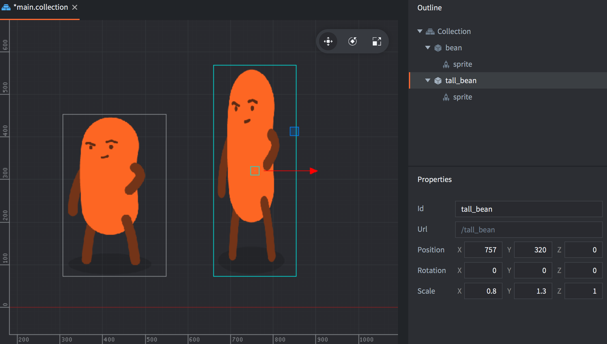

Los componentes se usan para dar una expresión y/o funcionalidad específicas a los objetos de juego. Los componentes deben estar contenidos dentro de objetos de juego y se ven afectados por la posición, rotación y escala del objeto de juego que contiene el componente:



Muchos componentes tienen propiedades específicas de su tipo que pueden manipularse, y hay funciones específicas del tipo de componente disponibles para interactuar con ellos en tiempo de ejecución:

```lua
-- deshabilita el sprite "body" de "can"
msg.post("can#body", "disable")

-- reproduce el sonido "hoohoo" en "bean" en 1 segundo
sound.play("bean#hoohoo", { delay = 1, gain = 0.5 } )
```

Los componentes se agregan en el lugar dentro de un objeto de juego, o se agregan a un objeto de juego como referencia a un archivo de componente:

Haz <kbd>click derecho</kbd> en el objeto de juego en la vista *Outline* y selecciona <kbd>Add Component</kbd> (agregar en el lugar) o <kbd>Add Component File</kbd> (agregar como referencia de archivo).

En la mayoría de los casos tiene más sentido crear componentes en el lugar, pero los siguientes tipos de componente deben crearse en archivos de recursos separados antes de agregarlos por referencia a un objeto de juego:

* Script
* GUI
* Particle FX
* Tile Map
