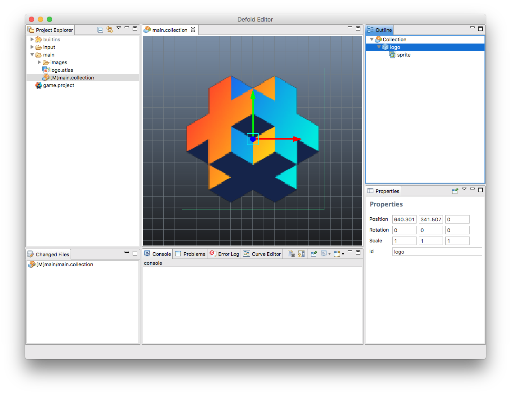

## Editor 1 y 2

Actualmente estamos en transición al editor Defold 2, que ahora mismo está en beta. La mayor parte de la documentación nueva que producimos es para el nuevo editor y con el tiempo actualizaremos toda la documentación, pero ese proceso tomará tiempo. Puedes reconocer la versión del editor en las capturas de pantalla por el tema de color.

Editor 2 tiene un agradable tema oscuro:

Editor 1 tiene un tema claro estándar:

Te invitamos a [probar el nuevo editor](https://www.defold.com/editor-two/).
