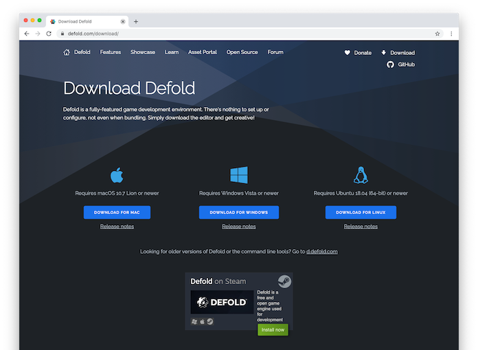
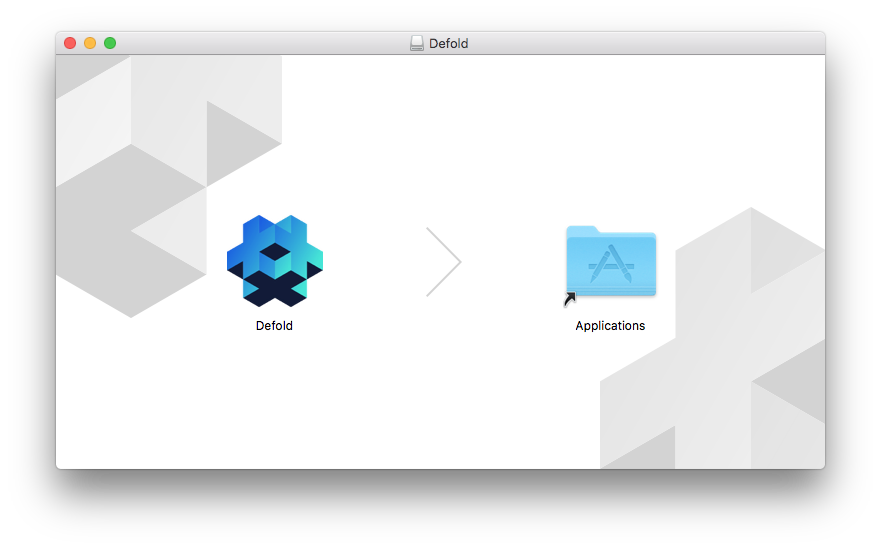
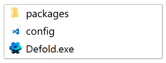

## Descarga

Ve a la [página de descarga de Defold](https://defold.com/download/) donde encontrarás botones de descarga para macOS, Windows y Linux (Ubuntu):



## Instalación

Instalación en macOS
: El archivo descargado es una imagen DMG que contiene el programa.

  1. Localiza el archivo "Defold-x86_64-macos.dmg" y haz doble click para abrir la imagen.
  2. Arrastra la aplicación "Defold" a la carpeta "Applications".

  Para iniciar el editor, abre tu carpeta de "Applications" y haz <kbd>doble click</kbd> al archivo "Defold".

  

Instalación en Windows
: El archivo descargado es un archivo ZIP que necesita ser extraído:

  1. Localiza el archivo "Defold-x86_64-win32.zip", <kbd>mantén presionado</kbd> (o <kbd>click derecho</kbd>) a la carpeta, selecciona *Extraer todo*, y después sigue las instrucciones para extraer el archivo en una carpeta denominada "Defold".
    2. Mueve la carpeta "Defold" a tu ubicación preferida (por ejemplo, `D:\Defold`). No deberías mover Defold a `C:\Program Files (x86)\` o `C:\Program Files\`, ya que esto impedirá que el editor se actualice.

  Para iniciar el editor, abre la carpeta "Defold" y <kbd>doble click</kbd> al ejecutable "Defold.exe".

  

Instalción en Linux
: El archivo descargado es un archivo ZIP que necesita ser extraído:

  1. Desde una terminal, localiza el archivo "Defold-x86_64-linux.zip" y extráelo a un directorio llamado "Defold".

     ```bash
     $ unzip Defold-x86_64-linux.zip -d Defold
     ```

  Para iniciar el editor, cambia el directorio a donde quieras extraer la aplicación, entonces arranca el ejecutable `Defold`, o hazle <kbd>doble click</kbd> en tu escritorio.

  ```bash
  $ cd Defold
  $ ./Defold
  ```

  Hay una ayuda para instalar una entrada de escritorio en el menú `Help > Create Desktop Entry`.

  Si presentas problemas iniciando el editor, abriendo un proyecto o corriendo un juego de Defold por favor refiere a la [sección del FAQ de Linux](/faq/faq#linux-questions).

## Instalar una versión anterior

Cada versión beta y estable de Defold también está [disponible en GitHub](https://github.com/defold/defold/releases).
