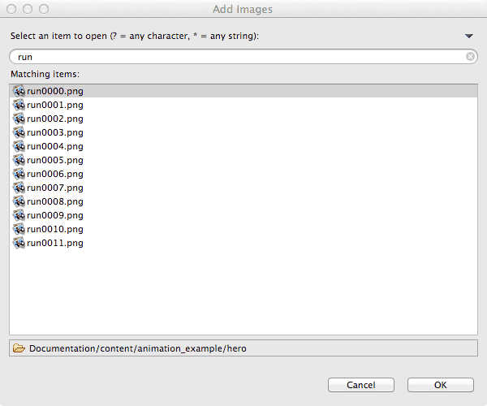
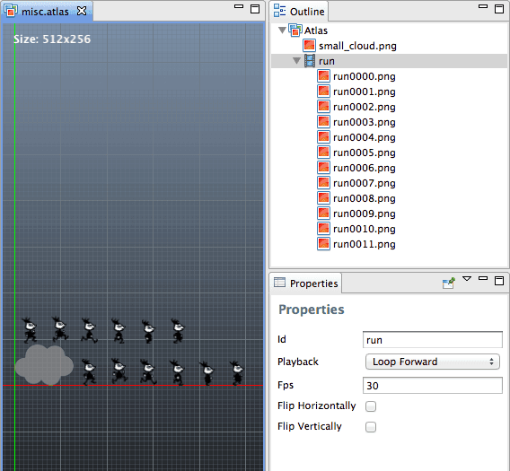
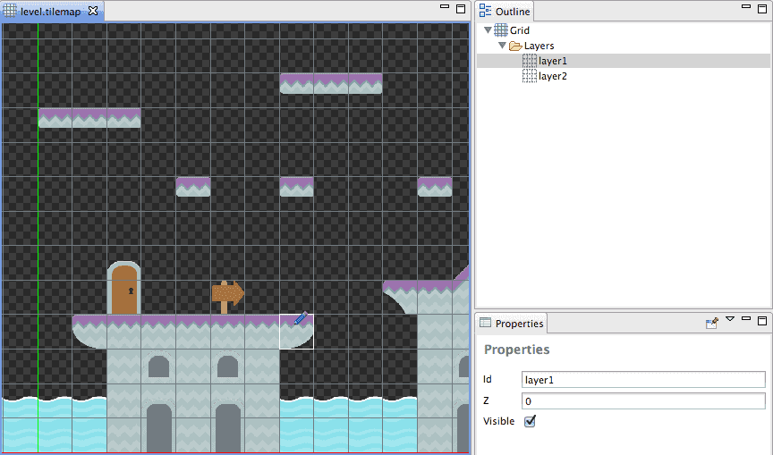
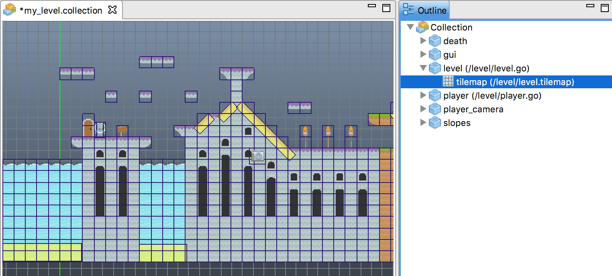

# 2D Graphics
2D 게임은 일반적으로 많은 이미지를 사용하여 만들어지며, 플립-북 애니메이션이나 복잡한 스파인(Spine) 애니메이션에 사용되거나 타일맵의 레벨이나 배경에 매핑되기도 합니다. 이 메뉴얼에서는 Defold가 지원하는 2D 그래픽 요소에 대해 자세히 알아보도록 합니다.

성능상의 이유로, 다수의 이미지들을 하나 혹은 몇 개의 큰 이미지로 병합하여, 작은 원본 이미지를 어떤 큰 이미지의 서브-이미지로 참조할 수 있습니다. 작은 이미지들을 큰 이미지로 병합하는 것은 데스크탑PC나 콘솔게임기에 비해 메모리와 전력이 부족한 모바일 디바이스에서 특히 중요합니다.

Defold에는 큰 이미지를 나타내는 두 가지 방식의 에셋이 있습니다:

#### Atlases
아틀라스는 이미지들의 목록을 포함하고 있으며, 자동적으로 큰 이미지로 병합합니다. 자세한 것은 http://en.wikipedia.org/wiki/Texture_atlas 를 참고하세요.

#### Tile Sources
타일 소스는 균일한 격자(grid)에 정렬된 서브-이미지들을 이미 포함하고 있는 이미지 파일을 참조합니다. 다른 툴에서는 타일셋(tile set)이나 스프라이트시트(sprite sheet)라는 용어를 사용합니다. 자세한 것은 http://en.wikipedia.org/wiki/Tileset#Tile_set 를 참고하세요.

## Importing Image Files
Defold에서 에셋을 사용하려면 프로젝트 계층구조(project hierarchy)에 있어야 하므로, 그래픽에 쓰일 이미지 파일을 임포트 해야 합니다. 이미지 에셋을 임포트하기 위해서는 그냥 당신의 컴퓨터 파일 시스템에서 Defold 에디터의 프로젝트 익스플로러 창(Assets pane)의 적당한 위치로 드래그-앤-드롭 하면 됩니다.

> 현재, Defold는 오직 PNG 이미지 포멧 만을 지원합니다.


## Creating an Atlas
아틀라스를 사용하기 전에, 먼저 아틀라스에 이미지를 채우는 것이 필요합니다. 아틀라스에 이미지나 애니메이션을 추가하면, 스프라이트나 파티클FX 컴포넌트와 같이 오브젝트 컴포넌트에 그래픽 소스로 사용 할 수 있습니다. (아래의 Sprite 와 ParticleFX 가이드 참고)

1. 위에서 설명한대로 이미지 파일들을 임포트 하기
2. 프로젝트 익스플로러 창(Assets pane)에서 마우스 오른쪽 버튼을 눌러 **New > Atlas File** 선택하기
3. 아웃라인 창(Outline)에서 마우스 오른쪽 버튼을 눌러 **Add Images** 선택하기

이렇게 하면 아틀라스에 추가하길 원하는 이미지들을 검색하고 선택할 수 있는 대화상자가 열리게 됩니다. 이미지 파일을 필터링하거나 한 번에 여러 파일들을 선택할 수 있습니다.





#### Defining flip-book animations
아틀라스에서 하위 이미지들을 선탁해여 플립-북 애니메이션을 정의 할 수 있습니다:

1. 아웃라인 창(Outline)에서 마우스 오른쪽 버튼을 눌러 **Add Animation Group** 선택하기
2. 생성된 애니메이션 그룹에 마우스 오른쪽 버튼을 눌러 **Add Images**를 누르고 애니메이션의 프레임에 사용할 이미지들을 선택하기
3. 필요한 만큼 애니메이션의 속성(**Properties**)을 조절하기

필요하다면 이미지를 드래그해서 아웃라인 창의 이미지 순서를 바꿀 수 있습니다. 또한 복사 붙여넣기 신공(**Edit** 메뉴, 마우스 오른쪽 버튼, 키보드 단축키)을 사용하여 아웃라인 창의 이미지들을 쉽게 복사할 수도 있습니다. 미리보기를 하려면 해당 애니메이션을 선택하고 키보드의 **Space**키를 눌러 주세요.

## Creating a Tile Source
타일 소스를 만들려면 모든 타일을 포함하고 있는 이미지가 필요합니다. 모든 타일은 반드시 완전히 동일한 크기로 격자(grid)에 배치되어야 합니다. Defold는 각 타일 사이의 간격을 조절하는 spacing과 padding을 지원합니다. 또한 Defold는 때때로 발생하는 visual artifacts(잔상이나 플리커링 등의의 이상한 시각적 현상들)을 피하기 위해 자동적으로 외곽선을 돌출(extrude borders) 시킬 수 있습니다.

이미지 소스가 준비되면 아래 방법으로 타일 소스를 만들 수 있습니다:

1. 이미지를 프로젝트 익스플로러 창(Assets pane)으로 드래그하여 프로젝트에 임포트합니다.
2. 새 타일 소스(Tile Source) 파일을 생성합니다.
3. 속성창의 **Image** 속성에서 검색[...] 버튼을 눌러 이미지를 선택합니다. 이제 이미지가 에디터에 표시됩니다.
4. 타일의 높이(**Tile Height**)나, 넓이(**Tile Width**), 마진(**Tile Margin**), 간격(**Tile Spacing**)을 원본 이미지에 알맞게 조절합니다. 각 셀이 투명한 그리드에 정확하게 정렬되면 모든 것이 올바르게 설정된 것입니다.


> 선형 필터링(linear filtering - 아래 참조)과 함께 타일들이 다닥 다닥 붙어있는(외곽선이 없는) 타일 소스를 사용하면 edge bleeding으로 불리는 visual artifact가 발생할 위험이 있습니다. 만약 이웃한 타일의 가장자리가 컬러가 있는 픽셀로 되어 있다면, 이 가장자리 부분의 색상이 흘러 넘치는 것 처럼 이상하게 보일 수도 있습니다. 이 문제를 해결하기 위한 가장 쉬운 방법은 **Extrude Border** 속성(아틀라스나 타일 소스에서 찾을 수 있음)을 설정하는 것입니다. 이 값은 가장자리의 픽셀이 게임 실행에 사용된 최종 텍스쳐에서 자동적으로 몇 번이나 복제되어야 하는 지를 지정합니다.

> 좋은 측정방법은 게임이 보여질 때 텍스쳐의 크기를 얼만큼 조절할지에 알맞는 숫자를 명시하는 것입니다. 게임월드를 절반 크기로 나타내려면 **Extrude Borders**를 2로 설정하면 됩니다. 텍스처를 절반 크기로 줄여서 사용하면, 렌더링에 밉맵(mipmap)이 사용됩니다. 이 밉맵은 원본 이미지의 넓이와 높이가 절반입니다.

## Tile Source Collision Shapes
타일 맵(Tile Map)을 사용하여 물리 상호작용을 활성화하는 충돌 영역(Collision shape)은 자동적으로 생성될 수 있습니다. Defold는 **Collision** 속성에 명시된 이미지로부터 각 타일에 볼록한 영역(Convex shape)을 생성하기 위해 알파 채널(alpha channel)을 사용합니다. 이 속성에는 이미지와 똑같은 충돌 영역을 위해 동일한 이미지를 사용하여 충돌 영역을 생성하는 것이 대부분이겠지만, 보이는 것과 다른 충돌 영역을 원한다면 다른 이미지를 선택해도 됩니다. 충돌(collision) 이미지를 지정하면, 생성된 충돌 영역을 나타내는 각 타일의 윤곽선으로 미리보기가 업데이트 됩니다. 자세한 것은 [Physics](/manuals/physics) 문서를 참고 바랍니다.


## Tile Source flip-book animations
타일 소스에 애니메이션을 정의하려면 각 프레임에 타일을 하나 씩 할당(동일한 넓이와 높이로 격자에 들어맞게)해야 하며 왼쪽에서 오른쪽 순서로 나란히 놓아야 합니다. 다음 줄로 행이 넘어가면 다시 맨 왼쪽부터 시작됩니다. 새로 생성된 타일 소스에는 "anim"이라고 하는 기본 애니메이션이 있습니다. 이것을 클릭하면 이름(id), 시작과 끝 프레임(Start Tile, End Tile), 재생(Playback) 방법 및 속도(Fps), 애니메이션이 가로나 세로로 뒤집혀야 하는지(Flip Horizontally, Flip Vertically)를 설정하는 애니메이션 속성창(**Properties**)이 나타납니다.


아웃라인(Outline) 창의 **Tile Source**를 마우스 오른쪽 클릭하여 컨텍스트 메뉴를 열고 **Add Animation**를 선택하여 타일 소스에 애니메이션을 쉽게 더 추가할 수 있습니다.


## Manipulating Game Objects and components
게임 오브젝트에 시각적 구성요소(스프라이트, 파티클FX 등)를 추가하면, 컴포넌트의 위치값과 회전 값을 설정할 수 있습니다. 이 값은 게임 오브젝트의 위치, 회전에 대한 오프셋으로 사용됩니다. 게다가 이 값은 게임 오브젝트를 조립(assemble)할때 컴포넌트에 설정 됩니다.


Defold의 게임 오브젝트는 이동, 회전이 가능하며 이 속성들을 애니메이션 처리 할 수 있습니다. 게임 오브젝트를 이동, 회전하면 하위의 컴포넌트도 같이 움직이게 되지만, 게임 오브젝트에 상대적인 위치값과 회전값(relative position and rotation)은 유지됩니다. 컴포넌트는 끄고 켤 수 있지만 동적으로 이동, 회전하거나 애니메이션 효과를 주는것은 불가능합니다(아래의 예외사항 참고). 그러므로 그래픽의 위치, 회전을 변경하길 원한다면 별도의 게임오브젝트로 집어 넣어야 합니다. 게임 오브젝트의 그룹이나 게임오브젝트 계층(hierarchy)은 컬렉션에 편리하게 조립(assemble)된 후 이 오브젝트들을 스크립트를 통해 자유롭게 다룰 수 있습니다:


```lua
    -- wand 게임 오브젝트에 이동, 회전 애니메이션 시키기
    go.animate("wand", "position", go.PLAYBACK_ONCE_FORWARD, vmath.vector3(530, 79, -0.1), go.EASING_INOUTSINE, 0.5)
    go.animate("wand", "euler", go.PLAYBACK_ONCE_FORWARD, vmath.vector3(0, 0, -70), go.EASING_INOUTSINE, 0.5)
```

## Dynamically scaling Sprites
스프라이트 컴포넌트의 크기를 동적으로 변경하는 것이 가능합니다. 이 기능은 게임 오브젝트와 컴포넌트가 어떻게 서로 연관되어 동작하는지 작동 방식의 이해(mental model)가 조금 어려울 수 있습니다.

스프라이트는 vmatch.vector3 타입인 "scale" 프로퍼티를 가지고 있습니다. 이 컴포넌트에 아래처럼 애니메이션 효과를 줄 수 있습니다:

```lua
go.animate("my_object#sprite", "scale.x", go.PLAYBACK_ONCE_FORWARD, 1.5, go.EASING_INOUTSINE, 2)
```

## Sprites
스프라이트 컴포넌트는 그래픽이나 플립북 애니메이션을 게임 오브젝트에 추가하는데 사용됩니다. 일반적으로 캐릭터나 소품(props)들을 만드는 데 쓰이며, 스프라이트 컴포넌트를 만드는 것은 매우 간단합니다:

1. 스프라이트가 속할 게임오브젝트를 생성하거나 열기
2. 아웃라인 창에서 게임 오브젝트에 마우스 오른쪽 버튼 눌러서 **Add Component** 선택하기
3. "Sprite" 선택하기
4. 스프라이트의 **Image** 속성을 타일소스나 아틀라스로 지정하기
5. 스프라이트의 **Default Animation** 속성을 기본적으로 플레이할 애니메이션으로 지정하기

기본 애니메이션은 게임 실행중에 게임 오브젝트가 생성되면 플레이 됩니다. 만약 이미지 리소스로 아틀라스를 사용중이라면 **Default Animation** 속성의 드롭다운 메뉴를 통해서 이미지들을 볼 수 있습니다. 타일 소스에 있는 이미지로부터 스프라이트를 만들고 싶다면, 1 프레임 짜리 애니메이션을 만들고 **Playback** 속성을 "None"으로 설정하면 됩니다.

#### Collision Shapes
스프라이트는 아직 타일소스에서 충돌모형(Collision Shape)을 자동생성하는 것을 지원하지 않습니다. 대신, 다른 게임 오브젝트와 마찬가지로 충돌 모형(Collision Shape)을 사용하여 충돌 오브젝트(Collision Object)를 추가할 수 있습니다. 자세한 것은 [Physics](/manuals/physics) 문서를 참고 바랍니다.

#### Blend Mode
블렌드 모드 속성은 스프라이트가 뒤쪽에 겹쳐진 그래픽과 어떻게 혼합(blend)할지 정의하는 속성입니다. 아래에 사용 가능한 블렌드 모드의 종류와 각각 어떻게 계산되는지에 대한 설명이 있습니다:

###### Alpha
기본 블렌딩: a0 * rgb0 + (1 - a0) * rgb1
###### Add
해당 스프라이트 픽셀의 컬러값을 이용해 배경을 밝게 함: rgb0 + rgb1
###### Add Alpha
보여지는(visible) 스프라이트 픽셀의 컬러값을 이용해 배경을 밝게 함: a0 * rgb0 + rgb1
###### Multiply
해당 스프라이트 픽셀의 컬러값을 이용하여 배경을 어둡게 함: rgb0 * rgb1

#### Sprite Shading
기본 스프라이트 쉐이딩 파일은 프로젝트의 "/builtins/material/sprite.\*" 에 있습니다. 기본 쉐이딩은 표준 텍스쳐 색상 보정(regular texture lookup)을 수행하지만 텍스쳐 색상과 겹쳐지는(multiply) 색조(tint: fragment shader constant) 또한 가지게 됩니다.

클릭시 스프라이트를 하얗게 번쩍이는 것과 같은 효과를 주기 위해 커스텀 쉐이딩을 구현할 수 있습니다. 스프라이트에 커스텀 쉐이딩을 설정하기 위해 아래 단계를 따라해 봅시다:

1. "/builtins/material/sprite.*" 의 파일들을 당신의 프로젝트 디렉토리 중 하나("built-in" 디렉토리의 컨텐츠는 수정 할 수 없습니다.)에 복사합니다. 이것은 정해진 방식은 아니지만 작업을 더 쉽게 만듭니다.
2. 복사한 "sprite.material" 파일을 열어, 위에서 복사한 쉐이더 파일(.vp와 .fp 파일)의 경로로 다시 매핑(remap)합니다.
3. 복사한 쉐이더 파일(.vp와 .fp 파일)을 원하는 대로 수정합니다. 만약 쉐이더 상수(shader constants)를 사용하려면 반드시 메터리얼(material) 파일에 선언되어야 합니다.
4. 스프라이트를 열어서 속성창(Properties)에서 새 메터리얼로 지정해줍니다.
5. 게임 실행 중에 쉐이더 상수(shader constants)를 설정하려면,  sprite.set_constant() 함수와 sprite.reset_contant() 함수를 사용하면 됩니다.

## Tile Maps
타일맵은 큰 격자(grid) 공간으로 타일 소스의 타일을 조립하거나 페인팅 하게 해 주는 컴포넌트입니다. 타일맵은 일반적으로 레벨 환경을 만드는데 사용됩니다. 또한 충돌을 감지하고 물리 시뮬레이션을 위해 맵의 타일소스로부터 충돌 모형(Collision Shapes)을 사용할 수도 있습니다.

#### Painting Tiles
1. 작업하길 원하는 타일맵을 엽니다.
2. Property 또는 Outline 창에 플래그 이슈(flagged issues)가 없는지 확인합니다.
3. Outline 창에서 페인팅하려는 레이어를 선택하거나 생성합니다.
4. 브러시로 사용할 타일을 선택합니다. (타일 팔레트를 보기 위해서 **Space** 키를 눌러 보세요.)



#### Picking Tiles
타일맵에서 타일을 직접 선택해서 브러시를 사용할 수도 있습니다. **Shift**를 누른 채로 타일을 클릭하면 브러시가 선택됩니다. **Shift**를 누른 채로 클릭과 드래그를 사용해 타일의 구역을 선택하면 더 큰 브러시를 사용할 수 있습니다.


#### Erasing Tiles
지우개 툴은 페인팅한 타일을 지우는데 사용됩니다. 지우개를 선택하려면 아래 방법들이 있습니다:

1. 타일맵 메뉴에서 선택하기
2. **Backspace**키 누르기
3. 타일 팔레트에서 선택된 타일을 다시 클릭하기
4. 타일맵에서 아무 빈 셀이나 선택하기

#### Attaching Physics
타일맵에 물리 기능을 첨부하는 것으로 타일과 관련된 충돌을 감지하거나 물리 시뮬레이션을 할 수 있습니다. 타일맵에 물리 기능을 붙이기 위해서는 [Physics](/manuals/physics) 문서를 참고 바랍니다.

## Changing tiles from script
게임이 실행되는 동안 동적으로 타일맵의 컨텐츠를 변경할 수도 있습니다. 이 작업을 위해서는 타일맵에 set_tile 메세지를 보내야 합니다:

```lua
-- 두개의 타일로 된 문짝을 "열린 문짝" 타일로 바꾸는 코드
-- 문짝이 두 개의 타일이므로 두 번 호출 필요
local doorpos = vmath.vector3(174, 305, 0)
msg.post("/level#tilemap", "set_tile", { layer_id = hash("layer1"), position = doorpos, tile = 58 })
-- 문짝의 윗부분 타일의 위치값을 기준으로 "dy"를 1로 설정해서 문짝 아랫부분 수정
msg.post("/level#tilemap", "set_tile", { layer_id = hash("layer1"), position = doorpos, tile = 46, dy = 1 })
```

## Adding a Tile Map to your game
게임에 타일 맵을 추가하려면:

1. 타일맵 컴포넌트를 사용할 게임 오브젝트를 만듭니다. 이 게임 오브젝트는 파일로 되어 있던지 컬렉션에서 직접 생성되었던지는 상관 없습니다.
2. 게임 오브젝트에 마우스 오른쪽 클릭 후 Add component from file 을 선택합니다.
3. 타일맵 파일을 선택합니다.

게임 오브젝트가 타일맵을 포함하고 있으며 이제 원하는 위치에 게임 오브젝트를 배치하거나 스폰 할 수 있습니다.



## Texture Filtering and Sampling
Defold는 텍스쳐 샘플링을 위해 두가지 방식을 지원하고 있습니다. 이 방식들은 texel(텍스쳐의 픽셀)이 완벽하게 화면의 픽셀에 정렬되어 들어맞지 않는 경우에 시각적 결과(visual result)를 제어하는데, 이 문제는 심리스(seamlessly: 이음새가 없는)한 텍스쳐를 포함하는 스프라이트를 움직일 경우(예를 들어 방향 상관없이 0.2픽셀을 움직여 보면...) 이거나 카메라를 심리스하게 움직이거나 줌 인/아웃 할 경우 발생합니다:

#### Nearest
이 방식은 가장 근접한 텍셀(nearest texel)을 선택해 화면의 픽셀을 채웁니다. 이 샘플링 방법은 텍스쳐에서 화면에 보이는 것과 일대일 매핑을 원할 경우 선택하는 것이 좋습니다. 이 근접 필터링(nearest filtering)을 사용하면 움직일 때 픽셀에서 픽셀로 모든 것이 스냅(snap)되며 스프라이트가 천천히 움직이는 경우 깜빡이게 보일 수 있습니다.

#### Linear
화면 픽셀에 컬러를 입히기 전에 텍셀은 이웃한 컬러들의 평균치를 계산합니다. 이 방식은 스프라이트가 화면에 완전하게 채색되기 이전에 픽셀로 블리드(bleed) 되므로 지속적으로 느리게 움직이거나, 부드럽게(smooth) 만드는데 사용하는 것이 좋습니다. 이 방식은 전체 픽셀보다 작은 스프라이트를 움직이는게 가능합니다.

이 필터링 설정값은 Project Settings 파일에 저장되며, 여기 두 가지 설정값이 있습니다:

#### default_texture_min_filter
축소 필터링(Minifying filtering)은 텍셀이 화면 픽셀보다 작을 때 적용됩니다.

#### default_texture_mag_filter
확대 필터링(Magnifying filtering)은 텍셀이 화면 픽셀보다 클 때 적용됩니다.

두 설정값 모두 `linear`, `nearest`, `nearest_mipmap_nearest`, `nearest_mipmap_linear`, `linear_mipmap_nearest`나 `linear_mipmap_linear` 값으로 설정할 수 있습니다. 예를 들어:

```
[graphics]
default_texture_min_filter = nearest
default_texture_mag_filter = nearest
```

아무것도 지정하지 않으면, 두 값 모두 linear 를 기본으로 설정됩니다.

(그래픽 에셋 일부는 Kenney: http://kenney.nl/assets 에 의해 제작되었습니다.)
