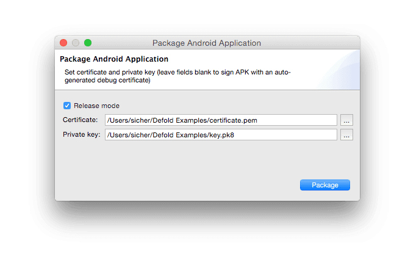

# Android development
이 문서는 Android 장치에서 Defold 어플리케이션을 빌드하고 실행하는 방법에 대해 설명합니다.

Android 개발은 컨텐츠를 자유롭게 장치에 업로드 하고 액세스 할 수 있다는 점에서 iOS 개발과 다르며 아주 쉽게 게임의 버전을 빌드하고 Android 장치에 복사할 수 있습니다. 또한 와이파이를 통해 장치에서 반복적인 개발을 위한 개발용 엔진(development engine)도 쉽게 추가할 수 있습니다.

## Android and Google Play signing process
Android는 앱을 설치하기 위해 디지털 서명을 필요로 합니다. Apple에서 모든 인증서를 발행하는 iOS와는 달리, Android는 자체 서명된 앱을 허용하므로 앱을 서명하는데 필요한 키나 인증서를 자유롭게 생성할 수 있습니다.

인증서나 키를 생성하는 과정은 복잡해 보일 수 있지만, 개발단계에서는 Defold가 이 과정을 완전히 자동화 합니다. 에디터에서 Android 어플리케이션 번들을 만들 때, 당신은 특정 인증서와 키를 제공할 수 있지만, 제공하지 않더라도 Defold가 무작위로 인증서와 키를 생성하고 **.apk**(Android Application Package) 파일을 서명합니다.

Google Play에 앱을 릴리즈할 때가 되면 앱을 서명하는데 사용되는 실제 인증서와 키를 생성해야만 합니다. 그 이유는 이 앱의 버전을 배포하고 업데이트 하려 할 때, 엡데이트 된 **.apk** 파일과 현재 버전이 동일한 서명으로 되어있어야 하기 때문입니다. 만약 서로 다른 private key로 서명하면, Google Play는 **.apk** 업데이트를 거부(reject)하게 되고 당신은 이 게임을 완전히 새로운 앱으로 다시 배포해야 합니다.

더 많은 정보는 [Google Play developer console](https://play.google.com/apps/publish/) 에서 찾을 수 있습니다. 나만의 인증서와 키를 생성하는 방법은 아래 정보를 참고 바랍니다.

## Android Debug Bridge
adb 명령 줄 도구는 Android 장치와 상호작용하는데 사용되는 다재다능한 프로그램이며 사용하기도 쉽습니다. Mac, Linux, Windows용으로 Android SDK package 에서 adb를 다운로드하고 설치할 수 있습니다.

http://developer.android.com/sdk/index.html 에서 Android SDK 를 다운로드하세요. <sdk>/platform-tools/ 경로에서 adb 도구를 찾을 수 있습니다. 또는 플랫폼 별 패키지는 각각의 패키지 매니저를 통해서 설치할 수 있습니다.

On Ubuntu Linux:
```
$ sudo apt-get install android-tools-adb
```

On Fedora 18/19:
```
$ sudo yum install android-tools
```

On Mac OS X (Homebrew)
```
$ brew install android-platform-tools
```

adb로 USB를 통해 컴퓨터와 Android 장치가 연결되었는지 확인하려면 아래 커맨드를 입력하십시오.

```
$ adb devices
List of devices attached
31002535c90ef000    device
```

장치(device)가 나타나지 않으면, Android에서 **USB 디버깅(USB debugging)** 이 활성화 되어 있는지 확인하세요. **설정(Settings)** 에서 **개발자 옵션(Developer options)** (또는 **Development**)에서 찾을 수 있습니다.


## development dmengine 설치하고 실행하기
Defold 엔진의 stand-alone 버전은 준비된 **.apk** 파일을 무선으로 장치에 설치하고 반복적인 개발을 가능하게 해 줍니다.

* http://d.defold.com에 방문해서 Defold downloads 항목을 찾습니다.
* 다운로드할 버전을 클릭해서 사용 가능한 엔진 빌드 목록을 펼칩니다.
* Android 플랫폼(Armv7)의 디버그 활성 빌드(debug enabled build)를 위해 "engine/armv7-android/dmengine.apk"를 선택합니다.


이 파일을 다운로드 한 후, **.apk**가 있는 위치에서 아래의 adb 명령을 실행합니다.

```
$ adb install dmengine.apk
4445 KB/s (8706017 bytes in 1.912s)
    pkg: /data/local/tmp/dmengine.apk
Success
```

이제 개발용 "dmengine" 앱이 기기에 설치 되었습니다.


### Launching the game
Android 장치에서 게임을 실행하려면, dmengine 앱과 에디터가 동일한 와이파이 네트워크에 연결되어 있어야 합니다.

1. 에디터가 실행중인지 확인합니다.
2. Android에서 "dmengine" 앱을 실행합니다.
3. 에디터의 **Project > Targets** 에서 당신의 기기를 선택합니다.
4. **Project > Build And Launch**를 선택해서 게임을 실행합니다. 게임 컨텐츠가 네트워크를 통해 장치로 스트림 되므로 게임이 시작되는데 시간이 걸릴 수 있습니다.

게임이 실행되는 동안, 평소처럼 [핫 리로드](/manuals/debugging#hot-reloading)을 사용할 수 있습니다.

## Android 어플리케이션 번들 만들기
에디터는 게임을 위한 standalone 어플리케이션 번들을 쉽게 만들 수 있게 해 줍니다. **Project > Bundle…​ > Android Application…​** 메뉴를 선택해 보세요.


인증서와 비공개 키(Private Key)를 선택하고 **Package** 버튼을 누르면 컴퓨터에서 번들이 생성될 위치를 지정하라는 창이 뜹니다.


에디터는 Android 어플리케이션 번들인 **.apk** 파일을 생성합니다. 이 파일은 adb 도구를 사용해 기기로 복사하거나 [Google Play developer console](https://play.google.com/apps/publish/) 을 통해서 Google Play에도 복사할 수 있습니다.  "game.project" 프로젝트 설정 파일에서 버전 코드나 앱에서 사용할 아이콘 등을 지정할 수 있습니다.

### 어플리케이션 번들 디버깅하기
엔진의 디버그 모드 버전(번들 생성시에 "Release mode"를 체크 해제 했을 경우)으로 빌드된 번들은 모든 콘솔 출력(console output)을 Android 시스템 로그로 보냅니다. 이 로그는 adb 도구에 "logcat" 명령어를 사용해서 액세스 할 수 있으며 태그("-s [tagname]")를 사용해서 출력을 필터링 할 수도 있습니다.

```
$ adb logcat -s "defold"
--------- beginning of /dev/log/system
--------- beginning of /dev/log/main
I/defold  ( 6210): INFO:DLIB: SSDP started (ssdp://192.168.0.97:58089, http://0.0.0.0:38637)
I/defold  ( 6210): INFO:ENGINE: Defold Engine 1.2.50 (8d1b912)
I/defold  ( 6210): INFO:ENGINE: Loading data from:
I/defold  ( 6210): INFO:ENGINE: Initialised sound device 'default'
I/defold  ( 6210):
D/defold  ( 6210): DEBUG:SCRIPT: Hello there, log!
...
```

## 인증서와 키 생성하기
**pem** 포멧의 인증서와 **pk8** 포멧의 키를 생성해야 합니다. 이는 openssl 도구를 사용해 생성할 수 있습니다.

```
$ openssl genrsa -out key.pem 1024
$ openssl req -new -key key.pem -out request.pem
$ openssl x509 -req -days 9999 -in request.pem -signkey key.pem -out certificate.pem
$ openssl pkcs8 -topk8 -outform DER -in key.pem -inform PEM -out key.pk8 -nocrypt
```

이렇게 해서 어플리케이션 번들을 서명하는데 사용되는 "certificate.pem" 및 "key.pk8" 파일이 생성됩니다.



> 인증서와 키가 안전하게 저장되었는지 확인하십시오. 만약 이 파일들을 잃어버리면 Google Play에 **.apk** 업데이트 버전의 파일을 다신 업로드 할 수 없게 됩니다.

## Troubleshooting
### 장치가 Targets 메뉴에 나타나지 않을 경우
장치와 컴퓨터가 동일한 와이파이 네트워크에 있는지 확인합니다. 또한 "dmengine" 앱이 에디터와 동일한 버전인지도 확인합니다. 만약 에디터가 업그레이드 되었다면, "dmengine.apk"도 새로 다운로드해서 장치에 설치해야 합니다.

### 설치시 "Failure [INSTALL_PARSE_FAILED_INCONSISTENT_CERTIFICATES]" 오류가 발생할 경우
Android는 새 인증서로 앱을 설치하려는 것을 감지합니다. 디버그용 빌드로 번들을 생성할 때, 각 빌드는 임시 인증서로 서명됩니다. 새 버전을 설치하기 전에 기존 앱을 제거 하십시오.

```
$ adb uninstall com.defold.examples
Success
$ adb install Defold\ examples.apk
4826 KB/s (18774344 bytes in 3.798s)
    pkg: /data/local/tmp/Defold examples.apk
Success
```
