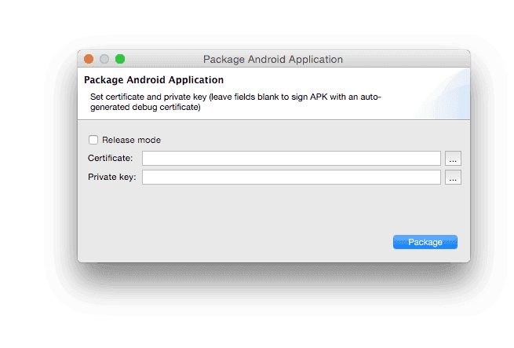
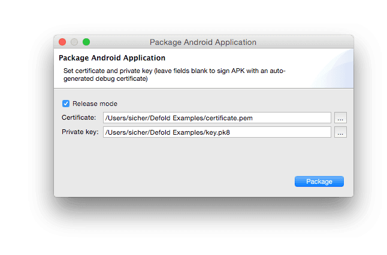

# Android 개발

Android 기기에서는 직접 만든 앱을 자유롭게 실행할 수 있습니다. 게임 버전을 빌드해서 Android 기기에 복사하는 과정도 매우 간단합니다. 이 매뉴얼은 게임을 Android용으로 번들링하는 데 필요한 단계를 설명합니다. 개발 중에는 컨텐츠와 코드를 기기에 직접 핫 리로드할 수 있으므로 [development app](/manuals/dev-app)을 통해 게임을 실행하는 방식을 선호하는 경우가 많습니다.

## Android 및 Google Play 서명 프로세스

Android는 모든 APK가 기기에 설치되거나 업데이트되기 전에 인증서로 디지털 서명되어 있어야 합니다. Android App Bundles를 사용하는 경우 Play Console에 업로드하기 전에 앱 번들만 서명하면 되며, 나머지는 [Play App Signing](https://developer.android.com/studio/publish/app-signing#app-signing-google-play)이 처리합니다. 하지만 Google Play, 다른 앱 스토어 또는 스토어 외부 배포를 위해 앱을 수동으로 서명할 수도 있습니다.

Defold 에디터나 [커맨드 라인 도구](/manuals/bob)에서 Android 어플리케이션 번들을 만들 때, 어플리케이션 서명에 사용할 keystore(인증서와 키가 들어 있음)와 keystore password를 제공할 수 있습니다. 제공하지 않으면 Defold가 debug keystore를 생성하고 이를 사용해 어플리케이션 번들을 서명합니다.

::: important
debug keystore로 서명된 어플리케이션은 **절대로** Google Play에 업로드하면 안 됩니다. 항상 직접 만든 전용 keystore를 사용하세요.
:::

## keystore 만들기

::: sidenote
Defold는 Android 서명 프로세스에 keystore를 사용합니다. [자세한 정보는 이 포럼 게시물에서 확인할 수 있습니다](https://forum.defold.com/t/upcoming-change-to-the-android-build-pipeline/66084).
:::

[Android Studio를 사용해](https://developer.android.com/studio/publish/app-signing#generate-key) keystore를 만들거나 터미널/명령 프롬프트에서 만들 수 있습니다.

```bash
keytool -genkey -v -noprompt -dname "CN=John Smith, OU=Area 51, O=US Air Force, L=Unknown, ST=Nevada, C=US" -keystore mykeystore.keystore -storepass 5Up3r_53cR3t -alias myAlias -keyalg RSA -validity 9125
```

이 명령은 키와 인증서가 들어 있는 `mykeystore.keystore`라는 keystore 파일을 만듭니다. 키와 인증서에 대한 액세스는 암호 `5Up3r_53cR3t`로 보호됩니다. 키와 인증서는 25년(9125일) 동안 유효합니다. 생성된 키와 인증서는 alias `myAlias`로 식별됩니다.

::: important
keystore와 관련 암호를 안전한 위치에 보관하세요. 어플리케이션을 직접 서명해서 Google Play에 업로드한 뒤 keystore나 keystore password를 잃어버리면 Google Play의 어플리케이션을 업데이트할 방법이 없습니다. Google Play App Signing을 사용하고 Google이 어플리케이션을 대신 서명하게 하면 이 문제를 피할 수 있습니다.
:::


## Android 어플리케이션 번들 만들기

에디터를 사용하면 게임용 독립 어플리케이션 번들을 쉽게 만들 수 있습니다. 번들링하기 전에 *game.project* [프로젝트 설정 파일](/manuals/project-settings/#android)에서 앱에 사용할 아이콘, version code 등을 지정할 수 있습니다.

번들링하려면 메뉴에서 <kbd>Project ▸ Bundle... ▸ Android Application...</kbd>을 선택합니다.

에디터가 무작위 디버그 인증서를 자동으로 만들게 하려면 *Keystore* 및 *Keystore password* 필드를 비워 둡니다.



특정 keystore로 번들을 서명하려면 *Keystore*와 *Keystore password*를 지정합니다. *Keystore*는 `.keystore` 파일 확장자를 가진 파일이어야 하며, 암호는 `.txt` 확장자를 가진 텍스트 파일에 저장되어 있어야 합니다. keystore 안의 키가 keystore 자체와 다른 암호를 사용하는 경우 *Key password*를 지정할 수도 있습니다.



Defold는 APK와 AAB 파일 생성을 모두 지원합니다. Bundle Format 드롭다운에서 APK 또는 AAB를 선택합니다.

어플리케이션 번들 설정을 구성했으면 <kbd>Create Bundle</kbd>을 누릅니다. 그러면 컴퓨터에서 번들을 만들 위치를 지정하라는 메시지가 표시됩니다.


:[Build Variants](../shared/build-variants.md)

### Android 어플리케이션 번들 설치하기

#### APK 설치하기

*`.apk`* 파일은 `adb` 도구를 사용해 기기에 복사하거나 [Google Play developer console](https://play.google.com/apps/publish/)을 통해 Google Play에 업로드할 수 있습니다.

:[Android ADB](../shared/android-adb.md)

```
$ adb install Defold\ examples.apk
4826 KB/s (18774344 bytes in 3.798s)
  pkg: /data/local/tmp/my_app.apk
Success
```

#### 에디터를 사용해 APK 설치하기

Bundle 대화상자의 "Install on connected device" 및 "Launch installed app" 체크박스를 사용해 *`.apk`* 파일을 설치하고 실행할 수 있습니다.


이 기능이 작동하려면 ADB가 설치되어 있고 연결된 기기에서 *USB debugging*이 활성화되어 있어야 합니다. 에디터가 ADB 커맨드 라인 도구의 설치 위치를 감지하지 못하면 [Preferences](/manuals/editor-preferences/#tools)에서 위치를 지정해야 합니다.

#### AAB 설치하기

*.aab* 파일은 [Google Play developer console](https://play.google.com/apps/publish/)을 통해 Google Play에 업로드할 수 있습니다. 또한 [Android bundletool](https://developer.android.com/studio/command-line/bundletool)을 사용해 *.aab* 파일에서 *`.apk`* 파일을 생성하고 로컬에 설치할 수도 있습니다.

## 권한

Defold 엔진의 모든 기능이 작동하려면 여러 권한이 필요합니다. 권한은 *game.project* [프로젝트 설정 파일](/manuals/project-settings/#android)에 지정된 `AndroidManifest.xml`에 정의됩니다. Android 권한에 대한 자세한 내용은 [공식 문서](https://developer.android.com/guide/topics/permissions/overview)에서 확인할 수 있습니다. 기본 메니페스트에서는 다음 권한을 요청합니다.

### android.permission.INTERNET and android.permission.ACCESS_NETWORK_STATE (Protection level: normal)
어플리케이션이 네트워크 소켓을 열고 네트워크에 대한 정보에 액세스할 수 있게 합니다. 이 권한은 인터넷 액세스에 필요합니다. ([Android 공식 문서](https://developer.android.com/reference/android/Manifest.permission#INTERNET)) 및 ([Android 공식 문서](https://developer.android.com/reference/android/Manifest.permission#ACCESS_NETWORK_STATE)).

### android.permission.WAKE_LOCK (Protection level: normal)
PowerManager WakeLocks를 사용해 프로세서가 sleep 상태가 되거나 화면이 어두워지는 것을 막을 수 있게 합니다. 이 권한은 푸시 알림을 받는 동안 기기가 잠시 sleep 상태가 되지 않도록 하는 데 필요합니다. ([Android 공식 문서](https://developer.android.com/reference/android/Manifest.permission#WAKE_LOCK))


## AndroidX 사용하기
AndroidX는 더 이상 유지보수되지 않는 기존 Android Support Library를 크게 개선한 것입니다. AndroidX 패키지는 기능 동등성과 새 라이브러리를 제공하여 Support Library를 완전히 대체합니다. [Asset Portal](/assets)의 Android 익스텐션 대부분은 AndroidX를 지원합니다. AndroidX를 사용하지 않으려면 [어플리케이션 메니페스트](https://defold.com/manuals/app-manifest/)에서 `Use Android Support Lib`를 체크해 기존 Android Support Library를 명시적으로 활성화할 수 있습니다.


## FAQ
:[Android FAQ](../shared/android-faq.md)
