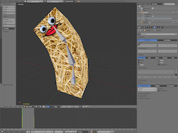
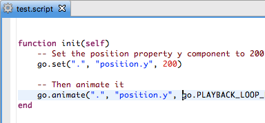
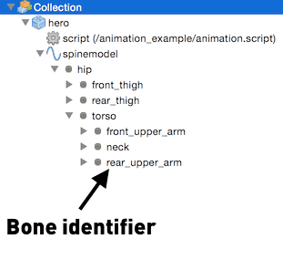
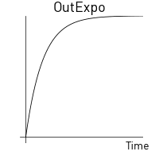

# Animation
Defold는 오브젝트 컴포넌트의 그래픽 소스로 사용할 수 있는 다양한 종류의 애니메이션을 지원합니다.

#### Flip-book animation
플립북 애니메이션은 연속적으로 표시되는 일련의 스틸컷 이미지들로 구성됩니다. 이 기술은 전통적인 셀 에니메이션과 매우 비슷합니다(http://en.wikipedia.org/wiki/Traditional_animation 참고). 이 방식은 각각의 프레임을 개별적으로 조작하므로 무한한 가능성이 있습니다. 하지만 프레임 마다 고유한 이미지로 저장해야 하므로 메모리 공간이 많이 필요할 수 있습니다. 또한 애니메이션을 부드럽게 표현하려면 매 초마다 나타나는 이미지의 수를 늘리는데 의존해야 하므로 그만큼 작업량 또한 증가하게 됩니다. Defold의 플립북 애니메이션은 개별 이미지를 아틀라스에 추가하여 저장하거나 모든 프레임이 수평적으로 배치된 타일 소스에 저장됩니다.

 

#### Spine animation
스파인 애니메이션은 2D 스켈레톤 애니메이션을 제공합니다 (http://en.wikipedia.org/wiki/Skeletal_animation 참고). 이는 컷아웃 애니메이션과는 근본적으로 다른 기술입니다.  컷아웃 애니메이션에서는 애니메이션 오브젝트의 개별 조각들(예를 들어 몸체, 눈, 입 등)이 각 프레임간 개별적으로 움직입니다. 스파인 애니메이션은 서로 연결된 뼈대 구조로 구성된 보이지 않는 가상의 골격을 만듭니다. 개별 이미지를 각 뼈대에 붙이고 이 골격(skeleton) 혹은 릭(rig)을 애니메이션 처리 할 수 있습니다. Defold는 [스파인 JSON 포멧](http://ko.esotericsoftware.com/spine-json-format)으로 애니메이션을 생성하거나 익스포트 하는 것을 지원합니다. 스켈레톤 애니메이션은 엔진이 매 프레임마다 각 뼈대의 위치를 보간(interpolate)해 주기 때문에 매우 부드럽게 움직입니다.

스파인 데이터를 어떻게 임포트 하는지 자세히 보려면 [Spine](/manuals/spine) 문서를 참고 바랍니다.

 

#### 3D skinned animation
3D 모델의 스켈레톤 애니메이션은 스파인 애니메이션과 비슷하지만 2D가 아니라 3D로 동작합니다. 3D 모델은 별도의 파트로 잘리지 않고 컷아웃 애니메이션 처럼 뼈대로 묶입니다. 대신 이 뼈대들은 모델의 버텍스(vertex)에 변형(deformation)을 적용할 수 있으며, 뼈대가 버텍스에 영향을 미치는 정도를 제어할 수 있습니다.

3D 데이터를 애니메이션 모델로 임포트 하는 자세한 방법은 [3D graphics](/manuals/3dgraphics) 문서를 참고 바랍니다.

 

#### Property animation
숫자로 된 모든 속성(숫자, vector3, vector4, 쿼터니온(quaterion))은 내장된 애니메이션 시스템에서 go.animate() 함수를 사용해서 애니메이션 효과를 줄 수 있으며 셋팅한 플레이백 모드(playback mode)나 이징(easing) 함수에 따라 엔진이 자동적으로 속성값들을 트위닝(tween) 합니다. 또한 이징 함수를 커스텀하게 변경할 수도 있습니다.

 

## Playing flip-book animations
스프라이트와 GUI 박스 노드는 플립북 애니메이션을 재생할 수 있으며 런타임시 이를 제어할 수 있습니다.

#### Sprites
스프라이트를 런타임시 애니메이션을 하기 위해서는 play_animation 메세지를 텍스쳐를 애니메이션 하길 원하는 스프라이트 컴포넌트에 보내야 합니다. 애니메이션이 플레이를 끝내자 마자, 엔진은 play_animation 메세지를 보냈던 스크립트로 animation_done 메세지를 돌려 줍니다.

#### GUI box nodes
GUI 박스 노드를 런타임시 애니메이션을 하기 위해서는 gui.play_flipbook() 함수를 사용해야 합니다. 아래 예제를 살펴보기 바랍니다.

### Sprite example
당신의 게임에 "dodge"라는 기능이 있다고 가정해 봅시다. 이는 특정 버튼을 누르면 플레이어가 회피 동작을 하게 됩니다. 당신은 4 종류의 애니메이션을 만들어서 시각적인 피드백을 주는 기능을 지원합니다:

#### "idle"
플레이어 캐릭터가 대기하고 있는 반복 애니메이션.
#### "dodge_idle"
A looping animation of the player character idling while being in the dodging stance.
플레이어 캐릭터가 회피동작을 지속하고 있는 반복 애니메이션.
#### "start_dodge"
플레이어 캐릭터가 회피를 시작하는 일회성(play-once)의 과도기(transition) 애니메이션.
#### "stop_dodge"
플레이어 캐릭터가 회피를 끝내는 일회성(play-once)의 과도기(transition) 애니메이션.

이 로직은 아래 스크립트 처럼 구현할 수 있습니다:

```lua
function on_input(self, action_id, action)
    -- 버튼입력시 "dodge" 동작을 시작함
    if action_id == hash("dodge") then
        if action.pressed then
            msg.post("#sprite", "play_animation", {id = hash("start_dodge")})
            -- 회피동작 상태인지 기억하기
            self.dodge = true
        elseif action.released then
            msg.post("#sprite", "play_animation", {id = hash("stop_dodge")})
            -- 회피동작을 끝냄
            self.dodge = false
        end
    end
end

function on_message(self, message_id, message, sender)
    if message_id == hash("animation_done") then
        -- 애니메이션의 트랜지션이 끝나고 반복 애니메이션을 시작함
        if self.dodge then
            msg.post("#sprite", "play_animation", {id = hash("dodge_idle")})
        else
            msg.post("#sprite", "play_animation", {id = hash("idle")})
        end
    end
end
```

### GUI box node example
노드의 애니메이션이나 이미지를 선택하는 중에도, 이미지 소스(아틀라스나 타일소스)와 기본 애니메이션을 한방에 할당 할 수 있습니다. 이미지 소스는 노드에 정적으로 셋팅되지만 현재 애니메이션의 플레이를 런타임시에도 변경할 수 있습니다. 스틸컷 이미지들은 한 프레임짜리 애니메이션 처럼 다뤄지므로 런타임시 이미지를 바꾼다는 것은 노드에서 각기 다른 플립북 애니메이션을 플레이 하는것과 완전히 동일합니다:

```lua
local function flipbook_done(self)
    msg.post("#", "jump_completed")
end

function init(self)
    local character_node = gui.get_node("character")
    -- 노드가 이 작업을 수행하려면 재생중인 새 애니메이션/이미지와 동일한 아틀라스 또는 타일소스에 기본 애니메이션을 가지고 있어야 합니다.
    gui.play_flipbook(character_node, "jump_left", flipbook_done)
end
```

완료시 호출되는 선택적(optional) 함수가 제공될 수 있습니다(위 예제의 flipbook_done 함수처럼). 이는 ONCE__* 모드에서 재생되는 애니메이션으로부터 호출됩니다.

## Animating Spine models
스파인 모델에 애니메이션을 적용하려면, 간단히 spine.play_anim() 함수를 호출하면 됩니다:

```lua
local function anim_done(self)
    -- 애니메이션이 종료되고, 뭔가 유용한 일을 합니다...
end

function init(self)
    -- "spinemodel" 컴포넌트의 "walk" 애니메이션을 플레이하고 첫 0.1초 동안 이전 애니메이션과 블랜딩한 후 콜백을 호출합니다.
    local anim_props = { blend_duration = 0.1 }
    spine.play_anim("#spinemodel", "walk", go.PLAYBACK_LOOP_FORWARD, anim_props, anim_done)
end
```


애니메이션이 **go.PLAYBACK_ONCE_** 모드로 플레이되고 spine.play_anim() 함수에 콜백 함수를 넘기면 애니메이션 완료시 이 콜백 함수가 실행됩니다. 아래의 콜백(callback) 정보를 참고바랍니다.

### Cursor animation
spine.play_anim() 를 사용해서 스파인 애니메이션을 진행하는 것 외에도, **Spine Model** 컴포넌트는 go.animate() 으로 다룰 수 있는 "cursor" 속성을 제공합니다.

```lua
-- 스파인 모델에 애니메이션을 설정하고 재생은 안함
spine.play_anim("#spinemodel", "run_right", go.PLAYBACK_NONE)

-- 커서 위치를 0으로 설정함
go.set("#spinemodel", "cursor", 0)

-- 커서를 느리게 트위닝 시키고 in-out quad 이징(easing) 효과를 주고 핑퐁 애니메이션 처리함
go.animate("#spinemodel", "cursor", go.PLAYBACK_LOOP_PINGPONG, 1, go.EASING_INOUTQUAD, 6)
```

> 커서가 트위닝(tween)되거나 셋팅되면, 타임라인 이벤트(timeline events)가 예상대로 발생하지 않을 수 있습니다.

### The bone hierarchy
스파인 스켈레톤의 개별 뼈대들은 게임 오브젝트에 내부적으로 나타납니다. 스파인 모델 컴포넌트의 아웃라인 창(**Outline**)에서 전체 계층구조가 표시됩니다. 여기서 스켈레톤 구조의 각 뼈대의 이름과 위치를 볼 수 있습니다.



뼈대의 이름을  사용하여, 런타임시 뼈대의 인스턴스 아이디를 검색할 수 있습니다. spine.get_go() 함수는 특정 뼈대의 아이디를 반환합니다. 예를 들어, 움직이는 게임 오브젝트 아래에 다른 오브젝트를 자식 객체로 넣을 수 있습니다:

```lua
-- heroine의 손에 권총 오브젝트를 갖다 붙임
local hand = spine.get_go("heroine#spinemodel", "front_hand")
msg.post("pistol", "set_parent", { parent_id = hand })
```

### Timeline events
스파인 애니메이션은 정확한 순간에 메세지를 보내서 이벤트를 트리거 할 수 있습니다. 이는 발자국 소리를 재생하거나, 파티클 효과를 스폰하거나, 뼈대 계층구조에 오브젝트를 붙이고 떼거나 하는 등등의 이벤트를 애니메이션과 동기화 되어 배치 해야만 하는 경우에 매우 유용합니다.

이벤트들은 스파인 소프트웨어에서 추가할 수 있으며 플레이백 타임라인(playback timeline)에서 시각화 됩니다:


각 이벤트는 이름 식별자(name identifier: 위 예제에서 "bump")로 참조되며 타임라인의 각 이벤트 인스턴스는 추가 정보를 포함할 수 있습니다:

#### Integer
정수형 숫자값
#### Float
부동소수점 숫자값
#### String
문자열 값

애니메이션이 플레이되고 타임라인 이벤트가 발생하면, spine_event 메세지가 spine.play()를 호출했던 스크립트 컴포넌트로 전송됩니다. 이 메세지 데이터에는 이벤트에 내장된 커스텀 숫자나 문자열 뿐만 아니라 때로는 유용한 추가적인 필드도 포함하고 있습니다:

#### t
애니메이션의 첫 번째 프레임 이후 경과된 시간(초)
#### animation_id
애니메이션 이름, 해쉬(hash)됨
#### string
제공된 문자열 값, 해쉬(hash)됨
#### float
제공된 부동 소수점 숫자값
#### integer
제공된 정수형 숫자값
#### event_id
이벤트 식별자, 해쉬(hash)됨
#### blend_weight
애니메이션이 얼마나 블렌드(blend) 되었는지에 대한 값. 0은 현재 애니메이션이 아직 블렌드의 일부분이 아님을 의미하며, 1은 현재 애니메이션이 100%로 구성된 블렌드 라는것을 의미함.

```lua
-- 스파인 애니메이션이 애니메이션과 동기화된 사운드를 플레이하기 위해 이벤트를 포함하고 있음.
-- 여기로 메세지가 도착함.
function on_message(self, message_id, message, sender)
  if message_id == hash("spine_event") and message.event_id == hash("play_sound") then
    -- 애니메이션 사운드 플레이하기. 커스텀 이벤트 데이터에 사운드 컴포넌트 이름과 출력값(gain)이 들어 있음
    local url = msg.url("sounds")
    url.fragment = message.string
    msg.post(url, "play_sound", { gain = message.float })
  end
end
```

## 3D Model animation
모델은 model.play_anim() 함수를 사용해서 애니메이션 됩니다:

```lua
function init(self)
    -- #model에서 앞뒤로 움직이는 "wiggle" 애니메이션 시작
    model.play_anim("#model", "wiggle", go.PLAYBACK_LOOP_PINGPONG)
end
```
> Defold는 현재 현재 베이크 애니메이션(baked animations)만 지원합니다. 애니메이션은 키프레임마다 각각의 애니메이션 본(animated bone)을 위한 메트릭스를 가져야 하며 위치, 회전, 스케일은 별도의 키로 가지지 말아야 합니다.

> 또한 애니메이션은 선형적으로 보간(linearly interpolated)됩니다. 고급 곡선 보간(curve interpolation)을 하려면 애니메이션을 익스포터(exporter)에서 미리 구워(prebake)야 합니다.

> Collada의 애니메이션 클립(Animation clip)은 지원하지 않습니다. 모델별로 다수의 애니메이션을 사용하기 위해서는 각각 별도의 **.dae** 파일로 익스포트 하고 Defold의 **.animationset** 파일로 합쳐야 합니다.

### The bone hierarchy
모델 스켈레톤의 뼈대들은 게임 오브젝트에 내부적으로 나타납니다. 모델 컴포넌트의 아웃라인 창(**Outline**)에서 뼈대의 계층구조와 각 뼈대의 이름을 볼 수 있습니다.


런타임시 뼈대 게임오브젝트의 인스턴스 아이디를 탐색할 수 있습니다. model.get_go() 함수는 특정 뼈대의 아이디를 반환합니다.

```lua
-- wiggler 모델의 중간 뼈를 가져옴
local bone_go = model.get_go("#wiggler", "Bone_002")

-- 이제 게임 오브젝트로 뭔가 유용한 작업을 해볼까나...
```

### Cursor animation
스파인 모델과 마찬가지로, 3D 모델은 "cursor" 속성을 조작해서 애니메이션을 처리할 수 있습니다:

```lua
-- #model에 애니메이션을 설정하고 재생은 아직 안함
model.play_anim("#model", "wiggle", go.PLAYBACK_NONE)
-- 애니메이션의 시작점으로 커서를 셋팅함
go.set("#model", "cursor", 0)
-- 0과 1 사이로 커서를 트위닝(Tween)함
go.animate("#model", "cursor", go.PLAYBACK_LOOP_PINGPONG, 1, go.EASING_INOUTQUAD, 3)
```

## Property animation
게임 오브젝트나 컴포넌트의 속성값을 애니메이션 처리하기 위해서는 go.animate() 함수를 사용해야 합니다. GUI 노드 속성을 위해서는 gui.animate() 를 사용하면 됩니다.

```lua
-- 컴포넌트의 position의 y 속성값을 200으로 설정
go.set(".", "position.y", 200)
-- 그리고 애니메이션 시킴
go.animate(".", "position.y", go.PLAYBACK_LOOP_PINGPONG, 100, go.EASING_OUTBOUNCE, 2)
```

주어진 속성의 모든 애니메이션을 중지하려면, go.cancel_animations() 를 호출하거나 GUI 노드에서는 gui.cancel_animation()를 호출하면 됩니다:

```lua
-- 현재 게임오브젝트에서 오일러(euler) z축의 회전 애니메이션을 중지함
go.cancel_animation(".", "euler.z")
```

만약 "position"과 같이 복합적인(composite) 속성의 애니메이션을 취소하면, 하위 요소들("position.x", "position.y", "position.z")의 애니메이션도 함께 취소됩니다.

[Properties](/manuals/properties) 매뉴얼에 게임 오브젝트, 컴포넌트, GUI노드의 모든 속성들에 대한 설명이 있습니다.

### GUI node property animation
대부분의 모든 GUI 노드 속성들은 애니메이션 가능합니다. 예를 들어, "color" 속성을 설정해서 투명값을 조절하여 노드를 보이지 않게 만든 후에, 색상을 하얗게(tint 컬러가 아님) 애니메이션 처리해서 페이드인 효과를 줄 수 있습니다. 

```lua
local node = gui.get_node("button")
local color = gui.get_color(node)
-- 색상을 하얗게 애니메이션 처리하기
gui.animate(node, gui.PROP_COLOR, vmath.vector4(1, 1, 1, 1), gui.EASING_INOUTQUAD, 0.5)
-- 외곽을 붉은색으로 애니메이션 처리하기
gui.animate(node, "outline.x", 1, gui.EASING_INOUTQUAD, 0.5)
-- 그리고 x좌표를 100으로 이동시키기
gui.animate(node, hash("position.x"), 100, gui.EASING_INOUTQUAD, 0.5)
```

## Playback Modes
애니메이션은 한 번 또는 반복적으로 재생될 수 있습니다. 애니메이션 재생 방법은 플레이백 모드(playback mode)에 의해 결정 됩니다:

* go.PLAYBACK_NONE
* go.PLAYBACK_ONCE_FORWARD
* go.PLAYBACK_ONCE_BACKWARD
* go.PLAYBACK_ONCE_PINGPONG
* go.PLAYBACK_LOOP_FORWARD
* go.PLAYBACK_LOOP_BACKWARD
* go.PLAYBACK_LOOP_PINGPONG

핑퐁(pingpong) 모드는 애니메이션을 처음엔 정방향으로 재생하고, 다음엔 역방향으로 재생합니다. GUI 속성을 애니메이션 하기 위한 모드는 아래와 같습니다:

* gui.PLAYBACK_NONE
* gui.PLAYBACK_ONCE_FORWARD
* gui.PLAYBACK_ONCE_BACKWARD
* gui.PLAYBACK_ONCE_PINGPONG
* gui.PLAYBACK_LOOP_FORWARD
* gui.PLAYBACK_LOOP_BACKWARD
* gui.PLAYBACK_LOOP_PINGPONG

## Easing
이징(easing)은 애니메이션 값이 시간에 따라 어떻게 변화하는지를 정의합니다. 아래 이미지들은 이징의 종류별로 시간에 따른 변화를 그래프로 설명하고 있습니다.

go.animate() 를 호출할 때 사용하는 적당한 값은 go.EASING_LINEAR, go.EASING_INBACK, go.EASING_OUTBACK 등이 있습니다.

gui.animate() 를 호출할 때  사용하는 값은 gui.EASING_LINEAR, gui.EASING_INBACK, gui.EASING_OUTBACK 등입니다.

                                        

### Custom easing
값의 모음(set of values)으로 벡터(vector)를 정의해서 위에서 미리 정의된 이징 상수(easing constants) 대신에 이징 커브(easing curve)를 커스텀하게 만들 수 있습니다:

```lua
local values = { 0, 0, 0, 0, 0, 0, 0, 0,
                 1, 1, 1, 1, 1, 1, 1, 1,
                 0, 0, 0, 0, 0, 0, 0, 0,
                 1, 1, 1, 1, 1, 1, 1, 1,
                 0, 0, 0, 0, 0, 0, 0, 0,
                 1, 1, 1, 1, 1, 1, 1, 1,
                 0, 0, 0, 0, 0, 0, 0, 0,
                 1, 1, 1, 1, 1, 1, 1, 1 }
local square_easing = vmath.vector(values)
go.animate("go", "position.y", go.PLAYBACK_LOOP_PINGPONG, 100, square_easing, 2.0)
```

## Completion callbacks
모든 애니메이션 함수(go.animate(), gui.animate(), gui.play_flipbook(), gui.play_spine_anim(), spine.play_anim(), model.play_anim())는 마지막 인자값으로 선택적인 Lua 콜백 함수(optional Lua callback function)를 지원합니다. 이 함수는 애니메이션의 재생이 종료되면 호출됩니다. 이 함수는 루프 애니메이션일 경우이거나 애니메이션이 go.cancel_animations()로 수동적으로 취소 되었을 경우엔 호출되지 않습니다. 콜백은 애니메이션 완료시 이벤트를 트리거하거나 여러 애니메이션을 함께 연결하는데 사용됩니다.

콜백의 정확한 함수 형태(signature)는 애니메이션 함수마다 조금씩 다릅니다. 자세한 것은 API 문서를 참고 바랍니다.

```lua
local function done_bouncing(self, url, property)
    -- 애니메이션을 끝냈다.. 이제 뭔가 해보자...
end

function init(self)
    go.animate(".", "position.y", go.PLAYBACK_ONCE_FORWARD, 100, go.EASING_OUTBOUNCE, 2, 0, done_bouncing)
end
```
