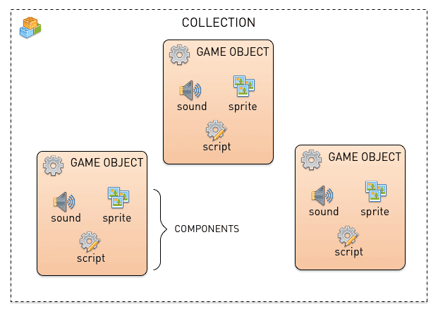

# 빌딩 블록

Defold 설계의 핵심에는 제대로 이해해야 하는 몇 가지 중요한 개념이 있습니다. 이 매뉴얼은 Defold의 빌딩 블록이 무엇으로 구성되는지 설명합니다. 이 매뉴얼을 읽은 뒤에는 [주소 지정 매뉴얼](/manuals/addressing)과 [메세지 전달 매뉴얼](/manuals/message-passing)을 읽어 보세요. 또한 에디터 안에서 바로 이용할 수 있는 [튜토리얼](/tutorials/getting-started)도 있어 빠르게 시작할 수 있습니다.



Defold 게임을 구성할 때 사용하는 기본 빌딩 블록은 세 가지입니다.

컬렉션
: 컬렉션은 게임을 구조화하는 데 사용하는 파일입니다. 컬렉션 안에서는 게임 오브젝트와 다른 컬렉션의 계층구조를 만듭니다. 일반적으로 게임 레벨, 적 그룹, 여러 게임 오브젝트로 구성된 캐릭터를 구조화하는 데 사용합니다.

게임 오브젝트
: 게임 오브젝트는 id, 위치, 회전, 스케일을 가진 컨테이너입니다. 컴포넌트를 담는 데 사용합니다. 일반적으로 플레이어 캐릭터, 탄환, 게임의 규칙 시스템, 레벨 로더를 만드는 데 사용합니다.

컴포넌트
: 컴포넌트는 게임 오브젝트에 배치되어 게임 안에서 시각, 청각 및/또는 로직 표현을 제공하는 엔티티입니다. 일반적으로 캐릭터 스프라이트, 스크립트 파일, 사운드 효과, 파티클 효과를 만드는 데 사용합니다.

## 컬렉션 {#collections}

컬렉션은 게임 오브젝트와 다른 컬렉션을 담는 트리 구조입니다. 컬렉션은 항상 파일에 저장됩니다.

Defold 엔진이 시작되면 *game.project* 설정 파일에 지정된 단일 _부트스트랩(bootstrap) 컬렉션_을 로드합니다. 부트스트랩 컬렉션은 흔히 "main.collection"이라는 이름을 사용하지만, 원하는 이름을 자유롭게 사용할 수 있습니다.

컬렉션은 게임 오브젝트와 다른 컬렉션(서브-컬렉션 파일에 대한 참조)을 임의의 깊이로 중첩해서 포함할 수 있습니다. 다음은 "main.collection"이라는 예제 파일입니다. 여기에는 게임 오브젝트 하나(id는 "can")와 서브-컬렉션 하나(id는 "bean")가 들어 있습니다. 이 서브-컬렉션에는 다시 "bean"과 "shield"라는 두 게임 오브젝트가 들어 있습니다.


id가 "bean"인 서브-컬렉션은 "/main/bean.collection"이라는 자체 파일에 저장되어 있으며, "main.collection"에서는 참조만 한다는 점에 주의하세요.


"main"과 "bean" 컬렉션에 대응하는 런타임 오브젝트가 없으므로 컬렉션 자체를 주소로 지정할 수는 없습니다. 하지만 게임 오브젝트로 가는 _경로_의 일부로 컬렉션의 식별자를 사용해야 할 때가 있습니다. 자세한 내용은 [주소 지정 매뉴얼](/manuals/addressing)을 참고하세요.

```lua
-- file: can.script
-- "bean" 컬렉션에 있는 "bean" 게임 오브젝트의 위치 가져오기
local pos = go.get_position("bean/bean")
```

컬렉션은 항상 컬렉션 파일에 대한 참조로 다른 컬렉션에 추가됩니다.

*Outline* 뷰에서 컬렉션을 <kbd>마우스 오른쪽 클릭</kbd>하고 <kbd>Add Collection File</kbd>을 선택합니다.

## 게임 오브젝트

게임 오브젝트는 게임이 실행되는 동안 각각 별도의 수명을 가지는 단순한 오브젝트입니다. 게임 오브젝트에는 런타임에 조작하고 애니메이션할 수 있는 위치, 회전, 스케일이 있습니다.

```lua
-- "can" 게임 오브젝트의 X 위치 애니메이션
go.animate("can", "position.x", go.PLAYBACK_LOOP_PINGPONG, 100, go.EASING_LINEAR, 1.0)
```

게임 오브젝트는 비어 있는 상태로 사용할 수도 있지만(예: 위치 마커), 보통 스프라이트, 사운드, 스크립트, 모델, 팩토리 같은 다양한 컴포넌트를 장착합니다. 게임 오브젝트는 에디터에서 만들어 컬렉션 파일에 배치하거나, _팩토리_ 컴포넌트를 통해 런타임에 동적으로 스폰할 수 있습니다.

게임 오브젝트는 컬렉션 안에 내장(in-place)으로 추가하거나, 게임 오브젝트 파일에 대한 참조로 컬렉션에 추가합니다.

*Outline* 뷰에서 컬렉션을 <kbd>마우스 오른쪽 클릭</kbd>하고 <kbd>Add Game Object</kbd>(내장으로 추가) 또는 <kbd>Add Game Object File</kbd>(파일 참조로 추가)을 선택합니다.


## 컴포넌트

:[components](../shared/components.md)

사용 가능한 모든 컴포넌트 타입 목록은 [컴포넌트 개요](/manuals/components/)를 참고하세요.

## 내장(in-place) 또는 참조로 추가된 오브젝트

컬렉션, 게임 오브젝트, 컴포넌트 _파일_을 만들면 프로토타입(prototype)을 만드는 것입니다. 다른 엔진에서는 이를 "prefabs" 또는 "blueprints"라고도 부릅니다. 이 작업은 프로젝트 파일 구조에 파일만 추가하며, 실행 중인 게임에는 아무것도 추가하지 않습니다. 프로토타입 파일을 기반으로 컬렉션, 게임 오브젝트, 컴포넌트의 인스턴스를 추가하려면 컬렉션 파일 중 하나에 그 인스턴스를 추가해야 합니다.

오브젝트 인스턴스가 어떤 파일을 기반으로 하는지는 Outline 뷰에서 확인할 수 있습니다. "main.collection" 파일에는 파일을 기반으로 하는 세 인스턴스가 들어 있습니다.

1. "bean" 서브-컬렉션.
2. "bean" 서브-컬렉션의 "bean" 게임 오브젝트에 있는 "bean" 스크립트 컴포넌트.
3. "can" 게임 오브젝트에 있는 "can" 스크립트 컴포넌트.


프로토타입 파일을 만드는 장점은 게임 오브젝트나 컬렉션의 인스턴스가 여러 개 있고 이를 모두 변경하려 할 때 분명해집니다.


프로토타입 파일을 변경하면 그 파일을 사용하는 모든 인스턴스가 즉시 업데이트됩니다.


여기서는 프로토타입 파일의 스프라이트 이미지가 변경되었고, 해당 파일을 사용하는 모든 인스턴스가 즉시 업데이트되었습니다.


## 게임 오브젝트를 자식으로 만들기

컬렉션 파일에서는 하나 이상의 게임 오브젝트가 단일 부모 게임 오브젝트의 자식이 되도록 게임 오브젝트의 계층구조를 만들 수 있습니다. 한 게임 오브젝트를 <kbd>드래그</kbd>해서 다른 게임 오브젝트 위에 <kbd>드롭</kbd>하기만 하면, 드래그한 게임 오브젝트가 대상의 자식이 됩니다.


오브젝트의 부모-자식 계층구조는 오브젝트가 변형에 반응하는 방식에 영향을 주는 동적 관계입니다. 오브젝트에 적용된 모든 변형(이동, 회전, 확대/축소)은 에디터와 런타임 모두에서 그 오브젝트의 자식에도 차례로 적용됩니다.


반대로 자식의 이동은 부모의 로컬 공간에서 이루어집니다. 에디터에서는 <kbd>Edit ▸ World Space</kbd>(기본값) 또는 <kbd>Edit ▸ Local Space</kbd>를 선택해 자식 게임 오브젝트를 로컬 공간이나 월드 공간에서 편집할 수 있습니다.

런타임에 오브젝트로 `set_parent` 메세지를 보내 오브젝트의 부모를 변경하는 것도 가능합니다.

```lua
local parent = go.get_id("bean")
msg.post("child_bean", "set_parent", { parent_id = parent })
```

::: important
게임 오브젝트가 부모-자식 계층구조의 일부가 되면 컬렉션 계층구조 안에서의 위치도 바뀐다고 오해하는 경우가 많습니다. 하지만 이 둘은 완전히 다른 개념입니다. 부모-자식 계층구조는 씬 그래프(scene graph)를 동적으로 변경하여 오브젝트가 서로 시각적으로 연결될 수 있게 합니다. 게임 오브젝트의 주소를 결정하는 유일한 것은 컬렉션 계층구조 안에서의 위치입니다. 이 주소는 오브젝트의 수명 동안 정적으로 유지됩니다.
:::
