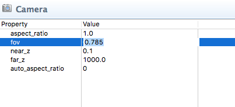

# Cameras
Defold는 기본적인 카메라 컴포넌트(primitive camera component)를 가지고 있습니다. 이 메뉴얼은 이 컴포넌트의 기능과 용도에 대하여 설명합니다.

카메라는 게임 월드의 뷰(view)를 제공하는데 사용하는 컴포넌트입니다. 카메라는 아래 기능을 수행하는 아주 간단한 오브젝트입니다.

1. 2D나 3D 공간에 위치함
2. 게임 오브젝트를 이 공간에서 움직일 수 있음
3. 투영 매트릭스(projection matrix)와 뷰(computed view)를 계산해서 렌더링에 필요한 데이터를 렌더 스크립트에 제공함

OpenGL의 카메라는 viewer, eye, position, near or far clipping plane 를 사용하여 좌표 시스템으로 표현 할 수 있습니다.  near clipping plane은  viewing plane 혹은 화면(screen)과 동일합니다.


보통 3D카메라는 viewing volume, frustum, cut off pyramid 과 같은 모양(shape)을 가지고 있습니다. 이들의 효과로는 카메라로부터 멀리 있는 오브젝트를 작게 렌더링 해서, 시각(perspective)적으로 현실감 있게 보이게 합니다. 시야각(field of view)이 넓을 수록, 카메라로 더 넓은 풍경을 볼 수 있고, 가깝고 먼 오브젝트들을 더욱 드라마틱하게 보여줍니다.


## Creating a camera
카메라를 생성하려면, 게임 오브젝트에 Camera component를 추가하세요.


카메라 컴포넌트는 카메라의 frustum(절두체)를 정의하는 프로퍼티의 모음을 가지고 있습니다.



> 현재 기본 FOV 값은 오해의 소지가 있습니다. 각도(degrees)가 아니라 라디안(radians)으로 표시됩니다.  45 degree FOV를 하려면, 0.785 (PI / 4) 값으로 변경해야 합니다.

#### aspect_ratio
종횡비(aspect_ratio)는 frustum의 넓이와 높이 사이의 비율(ratio)입니다. 1.0은 이차 뷰(quadratic view)로 가정한다는걸 의미하며, 1.33은 1024x768 같은 4:3 비율 화면에서 잘 나오고. 1.78은 16:9 비율에서 잘 나옵니다.
#### fov
라디안(radians)으로 표현되는 카메라의 시야각(field of view)
#### near_z
near clipping plane의 Z-value
#### far_z
far clipping plane의 Z-value
#### auto_aspect_ratio
이 값을 1로 설정하면, 카메라는 게임 화면 설정을 기반으로해서 자동으로 종횡비(aspect ratio)를 셋팅합니다.

## Camera focus
카메라를 활성화하고 view와 projection의 matrix를 보내려면, 카메라 컴포넌트에게 acquire_camera_focus 메세지를 보내야 합니다.

```lua
msg.post("#camera", "acquire_camera_focus")
```

카메라 컴포넌트가 카메라 포커스를 획득하면, 렌더 스크립트 같은 곳의 매 프레임 마다 set_view_projection 메세지를 @render 소켓으로 보냅니다.

```lua
-- example.render_script
--
function update(self)
    ...
    render.set_view(self.view)

    render.set_projection(self.projection)
    ...
end

function on_message(self, message_id, message)
    if message_id == hash("set_view_projection") then
        -- 카메라의 view와 projection이 여기 도착함. 저장해 두자.
        self.view = message.view
        self.projection = message.projection
    end
end
```

만약 렌더 스크립트의 카메라 view와 projection를 둘 다 사용하면, 게임 컨텐츠가 완전히 2D 임에도 불구하고 3D perspective를 사용하여 게임월드의 카메라 view를 얻게 됩니다. 이것은 때때로 유용 하기도 합니다. 예를 들어, 카메라를 뒤로 움직여서 레벨의 전체 모습을 더 드러나게 할 수도 있습니다. 아래는 현재 카메라의 이동 속도를 측정하고 이 속도에 맞춰 카메라를 앞뒤로 땡기는 간단한 스크립트입니다.

```lua
-- camera.script
--
function init(self)
    msg.post("#camera", "acquire_camera_focus")

    -- 현재 위치를 저장하고 "look at" 메세지로 받을 위치값을 받을 변수 셋팅
    self.pos = go.get_world_position()
    self.look_at = self.pos
    -- 측정 속도 저장하기
    self.speed = 0
end

function update(self, dt)
    -- 현재 위치와 목적지 위치를 보간한 값을 기준으로 새 위치를 계산함
    self.pos = vmath.lerp(0.03, self.pos, self.look_at)

    -- 2D 평면(2D plane)에서 속도 측정하기 (Z 는 0)
    local v1 = go.get_world_position()
    v1.z = 0
    local v2 = self.pos
    v2.z = 0
    local speed = vmath.length(v2 - v1)

    -- 플레이어의 이동 속도에 따라서 카메라를 뒤로 땡기든가 앞으로 밀든가 하기
    self.pos.z = 500 + speed * speed * 10
    go.set_position(self.pos)
end

function on_message(self, message_id, message, sender)
    -- 이 카메라는 어느 위치로 이동하든 "look_at" 메세지에 반응함
    if message_id == hash("look_at") then
        self.look_at = message.position
    end
end
```


물론, 우리는 카메라를 움직이는데 제약을 두고 있지 않습니다. 또한 X,Y,Z axis 축을 기반으로 회전할 수도 있습니다.

```lua
-- 0.314 라디안(radians)은 대략 18도(degrees)임...
go.set_rotation(vmath.quat_rotation_z(0.314) * vmath.quat_rotation_y(0.314))
```


## Orthographic projection
많은 2D 게임에서, 앞 뒤로 움직이는 카메라를 사용하는 게임이 픽셀 퍼펙트(pixel perfect)로 렌더링 하려는 컨텐츠가 있다면 문제가 될 수 있습니다. 카메라를 완벽한 Z 거리(perfect Z distance)에 배치해서 원하는 시야(view)를 얻는 대신, 직교 투영(orthographic projection)으로 카메라를 설정하여 대신하는 것이 좋습니다. 즉, 카메라의 시야(view)가 더 이상 절두체(frustum)에 의해 좌우되지 않고, 더욱 간단한 상자(box)에 의해 좌우된다는 것을 의미합니다.


직교 투영(Orthographic projection)은 거리에 따라 오브젝트의 크기를 변경하지 않으므로 비현실적으로 보이게 됩니다. 만약 한 사람이 카메라 10000 미터 멀리 서 있어도 카메라 바로 앞에 서 있는 사람과 동일한 크기로 렌더링 됩니다. 하지만, 이러한 그래픽 투영 방법은 때로 유용하며 2D 게임에서 자주 사용됩니다. 직교 투영(orthographic projection)을 사용하려면 렌더 스크립트를 수정해야 합니다.

```lua
-- example.render_script
--
function update(self)
    ...
    render.set_view(self.view)
    -- 게임창의 넓이와 높이를 기반으로 직교 투영(orthographic projection) 설정하기
    local w = render.get_width()
    local h = render.get_height()
    render.set_projection(vmath.matrix4_orthographic(- w / 2, w / 2, -h / 2, h / 2, -1000, 1000))
    ...
end

function on_message(self, message_id, message)
    if message_id == hash("set_view_projection") then
        -- 카메라 view와 projection이 여기 도착함. 우린 view만 있으면 됨
        self.view = message.view
    end
end
```

위의 예제는 화면을 카메라 위치의 중심에 맞추는 것을 제외하고는 기본 렌더 스크립트가 하는 것과 거의 같습니다.

(몇몇 그래픽 에셋은 Kenney: http://kenney.nl/assets 에 의해 제작되었습니다.)
