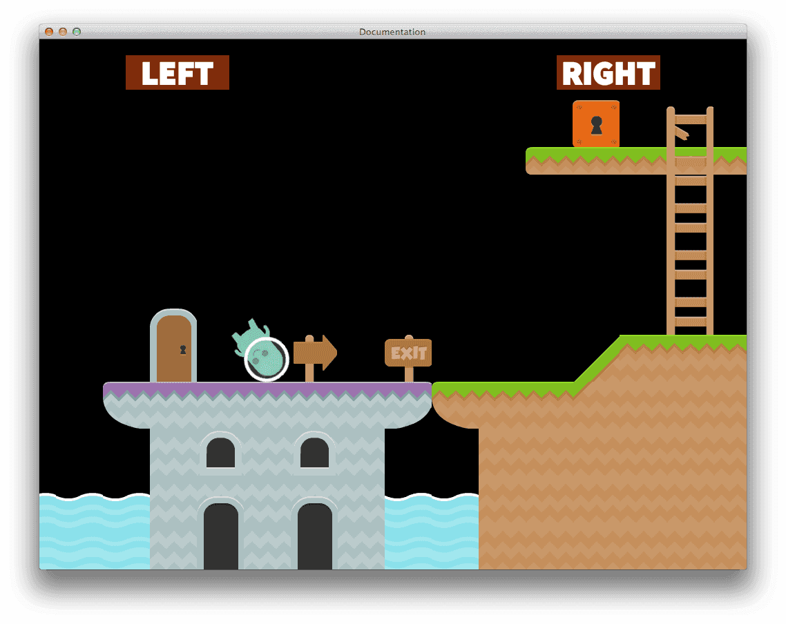

# Collection Proxies
Defold는 컬렉션에 모든 게임 오브젝트를 구성합니다. 이 매뉴얼은 게임 실행중에 동적으로 컬렉션을 로드하고 언로드하는 방법에 대해 설명합니다.

컬렉션에는 게임 오브젝트를 추가할 수 있으며, 심지어 다른 컬렉션을 추가 할 수도 있습니다(예: 서브-컬렉션). Defold가 실행되면 project settings에 정의된 최상위 컬렉션(top level collection)이 로드(loads), 개시(initiates), 활성화(enables) 되며, 대부분 프로젝트 생성시 게임 실행 즉시 처음으로 실행되는 "main.collection"도 함께 생성됩니다.

대다수 프로젝트에서는, 최상위 컬렉션에만 전체 앱을 포함하는 것으로 충분하지만, 프로젝트를 구성하기 위해 더 강력한 방법으로 여러 최상위 컬렉션들을 동적으로 로딩하고 언로딩 하는 여러 예제(아래 참고)가 있습니다.

컬렉션 프록시(Collection proxy)는 컬렉션 파일 대신 사용되는 창구 역할을 하며, 이 프록시를 이용하여 아직 로드되지 않은 컬렉션 파일과 load, initialize, enable, disable, finalize, unload의 커뮤니케이션을 할 수 있습니다.

로딩과 언로딩에 관련된 컬렉션 프록시를 사용하는 모든 커뮤니케이션은 비동기적(asynchronously)으로 수행되지만, 실제로 로딩과 언로등이 백그라운드 프로세스에서 구현되는 것은 아닙니다. 그러므로 엔진이 실제 로딩이나 언로딩을 발생하면 짧게 중지(pause)될 것입니다.

## Typical use cases
많은 게임들은 난이도 순서대로 플레이 할 수 있게 여러 레벨로 나누어져 있습니다. 만약 레벨 컨텐츠가 그냥 에디터상에서 수동으로 구성된 경우, 레벨 안의 요소들(타일맵, 스프라이트 등)은 그저 컬렉션 모음으로 끝나버릴 것입니다. 컬렉션 프록시는 이 컨텐츠들을 분리하고 스크립트를 통해 동적으로 관리할 수 있게 해 줍니다.

아래는 컬렉션 프록시(collection proxy)의 예시입니다.

* 게임 레벨의 Loading/unloading
* GUI 프론트엔드의 Loading/unloading
* 게임 레벨의 스토리 같은걸 보여주는 씬(scene)의 Loading/unloading
* 미니게임의 Loading/unloading
* 사용자가 선택한 컨텐츠(음악, 배경이미지 등)의 Loading/unloading

> 큰 심리스 월드에서 "streaming" 지역을 로딩/언로딩 하는 것은 컬렉션 프록시를 활용하여 구현 가능합니다. 하지만 실제 로딩은 동기식(백그라운드에서 동작하지 않고, 로딩이 완료될 때까지 게임을 중단하는것을 의미함)으로 수행되며 로딩 시간에 여러 프레임이 걸릴 수 있습니다. 그러므로 월드의 조각을 작게 유지하거나 로딩으로 인한 멈춤을 어떻게든 숨기는 방법을 찾아야 합니다.

## Worlds
컬렉션 프록시를 통하면 최상위 컬렉션을 전환하거나 한 개 이상의 최상위 컬렉션을 게임 엔진에 로드하는 것이 가능합니다. 단, 각 최상위 컬렉션은 분리된 물리 월드이며 물리 상호작용(Physics interactions: collisions, triggers, ray-casts)은 동일한 컬렉션에 소속된 오브젝트 끼리만 발생한다는 것을 알아 둬야 합니다. 즉, 각기 다른 최상위 컬렉션에 소속된 오브젝트들 사이에서는 물리 상호작용이 발생하지 않습니다.

아래 예제에서는 게임 월드를 컬렉션 프록시를 통해 동적으로 로드되는 두 개의 컬렉션으로 분할했습니다. 두 컬렉션의 로드 및 언로드는 "loader"라는 게임 오브젝트에 의해 제어되며 이 오브젝트는 메인 컬렉션인 "worlds"에 들어 있습니다. 게임이 시작될때  "worlds.collection" 파일을 자동으로 로드하도록 구성([Project settings](/manuals/project-settings) 참고)합니다. "world" 컬렉션은 "loader" 오브젝트 뿐만아니라 우리가 캐릭터를 움직일 수 있게 해주는 GUI 요소도 포함하고 있습니다.


첫번째 컬렉션 "world1"은 왼편에 보라색 바닥의 타일이 있습니다. 오른편의 "exit" 표지판과 녹색 바닥 타일은 "world2" 컬렉션입니다.



우리의 플레이어 캐릭터는 레벨의 모든 바닥 타일에 대해 물리 충돌이 셋팅되어 있으며 플레이어가 바닥 위의 캐릭터를 데굴데굴 굴릴 수 있게 해 줍니다. 하지만 플레이어가 "world1" 컬렉션의 끝에 닿으면 어떤 일이 일어나는지 봅시다.


"world2"의 타일은 "world1"과 완전히 동일하게 충돌 셋팅이 되어 있지만, "world1" 에 소속된 플레이어 캐릭터 게임 오브젝트는 충돌이 발생하지 않고 캐릭터가 그냥 아래로 뚝 떨어져 버립니다.

만약 모든 레벨들이 한 컬렉션 내에 전부 포함되어 있고, 플레이어가 이들 레벨 사이를 원활하게(seamlessly) 이동하지 못할 것으로 예상되는 게임에서는, 이러한 컬렉션의 특성 때문에 월드를 분리하는데 사용되기 어렵습니다.

나중에 이 예제를 자세히 살펴보고 게임이 물리 충돌, 트리거를 어떻게 사용하는지, 플레이어가 이동할 수 있는 게임월드 조각을 동적으로 어떻게 로드하는지도 살펴 보도록 하겠습니다. 하지만 우선 컬렉션 프록시의 기초부터 살펴 보도록 합시다.

## Editing
컬렉션 프록시를 설정하기 위해서는, 게임 오브젝트에 컬렉션 프록시 컴포넌트를 추가하고 프록시의 이름을 정하고(id 지정) 어떤 컬렉션 파일이 이를 대신하여 작동할지 지정하면 됩니다.


## Naming collections
컬렉션 프록시와 커뮤니케이션을 시작하기 전에, 각 컬렉션들의 이름을 확인 해야 합니다. 에디터에서 생성한 각 컬렉션은 "default"라는 이름으로 자동 할당 됩니다. 프록시를 통해 컬렉션을 동적으로 로드하지 않는 한, 이 이름을 유지할 수 있습니다.


하지만 컬렉션 프록시를 통해 두 개 이상의 최상위 레벨 컬렉션을 로드하는 경우, 각 컬렉션은 URL의 소켓 부분을 통해 주소가 지정되어야 하고, 이 소켓 이름은 반드시 유니크해야만 합니다.

```lua
msg.post("world1:manager#script", "remove_player")
msg.post("world2:manager#script", "spawn_player")
```

그러므로 프록시를 통해 로드하려는 컬렉션은 유니크한 이름으로 수정하는것이 좋습니다. 만약 유니크한 이름을 지정하지 않으면 엔진은 이름 충돌 에러를 발생합니다.

```
ERROR:GAMEOBJECT: The collection 'default' could not be created since there is already a socket with the same name.
WARNING:RESOURCE: Unable to create resource: build/default/worlds/world1.collectionc
ERROR:GAMESYS: The collection /worlds/world1.collectionc could not be loaded.
```

## Loading
프록시를 통해 컬렉션을 로드하려면 "load" 메세지를 게임 오브젝트의 프록시 컴포넌트에게 전송하면 됩니다.

```lua
-- "world1" 프록시에게 로딩 시작하라고 알려줌
msg.post("loader#world1", "load")
```

프록시가 로딩을 끝내면 "proxy_loaded" 메세지를 되돌려 줍니다. 이 메세지를 받아서 컬렉션을 초기화(initialize) 하고 활성화(enable) 할 수 있습니다.

```lua
function on_message(self, message_id, message, sender)
        if message_id == hash("proxy_loaded") then
                -- 뉴 월드가 로드되었다. Init과 enable 하자
                msg.post(sender, "init")
                msg.post(sender, "enable")
                ...
```

아니면 메세지의 출처를 체크해서 그에 맞는 처리를 하게 하는 것도 가능합니다. "proxy_loaded" 를 보낸 컬렉션 프록시는 sender URL의 프래그먼트 부분(fragment part)에 표시됩니다.

```lua
function on_message(self, message_id, message, sender)
        if message_id == hash("proxy_loaded") and sender.fragment == hash("myproxy1") then
                -- "myproxy1"가 로드되면 init 하고 enable 하자...
                ...
```

"init" 메세지로 프록시를 통해 컬렉션을 초기화(Initializing) 하는 것은 컬렉션에 포함된 모든 오브젝트들을 재귀적으로(recursively) 초기화 합니다. "enable" 메세지로 프록시를 통해 컬렉션을 활성화(Enabling)하는 것도 컬렉션에 포함된 모든 오브젝트들을 재귀적으로 활성화 하게 됩니다.

(오브젝트의 생명주기에 대해 자세히 보고 싶다면 [Application lifecycle](/manuals/application-lifecycle) 참고)

"enable"을 로드된 프록시에게 보내면 enable을 수행하기 전에 컬렉션을 자동으로 초기화(init) 합니다. 그러므로 초기화와 활성화 단계 별로 세분화 된 제어가 필요한게 아니라면 그냥 아래처럼 써도 됩니다.

```lua
-- 뉴 월드가 로드되었다. Init과 enable 하자
msg.post(sender, "enable")
```

다시 플랫포머 예제로 돌아와서, "world1" 컬렉션에 트리거를 하나 넣고 "world2"를 로드할 위치에 배치 하도록 합니다.


우리는 "worldswitch"라는 게임 오브젝트에 전환 로직(switching logic)이 포함된 트리거를 만들고, 오브젝트를 재사용 할 수 있게 해 주는 두 프로퍼티를 묶습니다. 이 프로퍼티는 해쉬 형식이므로 프록시들이 커뮤니케이션 할 수 있도록 URL을 구성해야 합니다. 우리는 "loader" 게임 오브젝트가 추가된 "worlds" 컬렉션에 이 메세지들를 보낼 계획입니다.

```lua
go.property("selfworld", hash(""))
go.property("otherworld", hash(""))

function init(self)
        -- 프록시들을 위한 url 구성하기... 나중에 사용할 예정임
        self.selfurl = msg.url()
        self.selfurl.socket = "worlds"
        self.selfurl.path = hash("/loader")
        self.selfurl.fragment = self.selfworld
        self.otherurl = msg.url()
        self.otherurl.socket = "worlds"
        self.otherurl.path = hash("/loader")
        self.otherurl.fragment = self.otherworld
end
```

여기서는 "world2" 컬렉션을 셋팅합니다.


"exit" 표지판을 두 컬렉션에서 완전히 동일한 좌표에 배치해서 하나의 타일로 겹쳐 보이게 합니다.
또한 "world1" 뿐만 아니라 "world2" 에도 "player" 오브젝트가 필요 합니다. 각 컬렉션은 각자 자체의 물리 세계(physics world)를 가지고 있기 때문에 플레이어 또한 별도로 있어야 하며 월드 사이를 넘어 갈 때  입력 제어(input control)와 포지션을 한 쪽 플레이어에서 다른 쪽 플레이어로 넘길 것입니다.

그러므로 플레이어가 "world1"의 트리거와 충돌하면, 우리는 "world2" 로딩을 시작하면 됩니다.

```lua
function on_message(self, message_id, message, sender)
        if message_id == hash("trigger_response") and message.enter then
                -- 플레이어가 월드 전환 트리거와 충돌함
                -- 예전에 구성해 놓은 url을 통해 참조된 다음 월드 불러오기
                msg.post(self.url, "load")
                ...
```

다음으로는, 로드 작업이 완료되면 컬렉션을 활성화 합니다.

```lua
        elseif message_id == hash("proxy_loaded") then
                -- 새 월드가 로드 되었으니 Enable 하자
                msg.post(sender, "enable")
```

이제는 플레이어 오브젝트를 전환 시킬 때입니다. 우리는 현재 플레이어에게 현재 포지션 등등의 필요한 데이터를 요구하는 메세지를 전송해서 플레이어 전환 작업을 시작합니다.

```lua
                -- 플레이어의 위치를 다른 월드의 플레이어에게 전송해야함
                local currentsocket = ""
                -- 해쉬된 프로퍼티는 문자열로 만들 수 없으므로 이렇게 해야함
                if self.selfworld == hash("world1") then
                        currentsocket = "world1"
                elseif self.selfworld == hash("world2") then
                        currentsocket = "world2"
                end
                msg.post(currentsocket .. ":" .. "/player#script", "request_player")
```

여기서는 "player_response" 메세지를 받아서 새로 로드된 컬렉션의 플레이어에게 데이터를 보내 줍니다.

```lua
        elseif message_id == hash("player_response") then
                -- 플레어어 포지션 값을 돌려 받아서..
                -- 다른 월드의 플레이어에게 반영해야 함
                local othersocket = ""
                if self.otherworld == hash("world1") then
                        othersocket = "world1"
                elseif self.otherworld == hash("world2") then
                        othersocket = "world2"
                end
                -- 받은 메세지를 걍 넘김
                msg.post(othersocket .. ":" .. "/player#script", "inherit_player", message)
        end
```

"inherit_player" 메세지는 전송한 포지션을 상속하므로 새 플레이어는 이전 플레이어와 동일한 위치로 재배치 됩니다. (여기서, 서로 다른 컬렉션에 있고 물리 세계도 구분되므로 새 플레이어는 트리거 충돌이 감지되지 않습니다.)

이제 게임을 실행하면 "world1"에서 "world2"로 이동할 수 있지만 "world1"의 플레이어 오브젝트가 아직도 존재하고 있고 "world2"의 월드로 넘어가면 뚝 떨어지게 됩니다.


그러나 이제 우리는 "world2"의 플레이어를 제어할 수 있고 새 레벨로 캐릭터를 굴릴 수 있습니다.


## Unloading
이제 우리는 월드 전환 로직을 조금 정리하기만 하면 됩니다. 설명을 위해서 우리가 남겨둔 컬렉션을 간단하게 언로드 해보겠습니다. 하지만 우선, 언로드가 어떻게 동작하는지 부터 살펴봅시다.

언로딩은 로딩때와는 반대 순서로 처리합니다.

```lua
msg.post("loader#world1", "disable")
msg.post("loader#world1", "final")
msg.post("loader#world1", "unload")
```

"disable" 메세지로 프록시를 통해 컬렉션을 비활성화(Disabling) 하는 것은 컬렉션에 포함된 모든 오브젝트들을 재귀적으로(recursively) 비활성화 합니다. "final" 메세지로 프록시를 통해 컬렉션을 마무리(Finalizing)하는 것도 컬렉션에 포함된 모든 오브젝트들을 재귀적으로 마무리 하게 됩니다. 그리고 "unload" 메세지는 컬렉션을 메모리에서 삭제합니다.

프록시가 컬렉션을 언로드하면 "proxy_unloaded" 메세지를 보내줍니다.

```lua
if message_id == hash("unload_level") then
    local proxy = msg.url("#proxy")
    msg.post(proxy, "disable")
    msg.post(proxy, "final")
    msg.post(proxy, "unload")
elseif message_id == hash("proxy_unloaded") then
    -- Ok, 레벨이 언로드 되었구만
    ...
```

세세한 컨트롤이 필요한게 아니라면, 컬렉션을 disable, final 하지 않고 그냥 "unload" 메세지를 보내도 됩니다. 프록시가 unload 되기 전에 컬렉션을 자동적으로 disable하고 finalize 합니다.

이제 다시 우리의 플랫포머 예제로 돌아와서, 우리가 해야 할 남은 일은 올바른 프록시로 이 메세지들을 보내는 것 뿐입니다. 우리는 데이터 요청을 위한 "request_player" 메세지를 새 플레이어 오브젝트에게 보낸 이후에 언로드 작업을 수행합니다.

```lua
...
msg.post(currentsocket .. ":" .. "/player#script", "request_player")

-- 이제 남겨진 월드를 버릴 때가 되었음
-- 화면에 다 보이는데서 삭제해버리는게 이상하게 보이지만, 작동 원리 이해를 위해 걍 삭제함
msg.post(self.selfurl, "disable")
msg.post(self.selfurl, "final")
msg.post(self.selfurl, "unload")
```

이제 왼쪽의 컬렉션은 플레이어를 뒤로 하고 언로드 되게 됩니다.


실제 게임에서라면 화면에 보이는 상태에서는 컬렉션을 언로드하지 않는게 좋습니다. 만약 플레이어의 전환(switching)을 더욱 부드럽게 만들고 싶다면, 플레이어 컨트롤에 따른 가속도(momentum)와 플레이어의 애니메이션 상태(animation state)를 상속 받아 처리하거나 전환 지점을 특정 효과 같은거로 가려 버리는 것도 좋은 방법입니다. 이 심플한 예제는 단지 이전 플레이어의 포지션만 상속할 뿐이라 각도(angular)와 선형 속도(linear velocity)가 0으로 설정됩니다.

## Input
만약 로드된 컬렉션에서 인풋 액션(input action)이 필요한 오브젝트가 있다면, 컬렉션 프록시를 포함하고 있는 게임 오브젝트가 입력을 획득(acquire)하는지 확인할 필요가 있습니다. 게임 오브젝트가 입력 메세지를 수신하면, 이들은 오브젝트의 컴포넌트, 즉 컬렉션 프록시들에게 전파(propagated)됩니다. 인풋 액션은 로드된 컬렉션에게 프록시를 통해서 전달되게 됩니다.


"world1"이나 "world2"에 소속된 오브젝트에서 인풋액션을 받기 원한다면, 간단하게 "loader" 게임오브젝트의 스크립트에서 인풋 포커스(input focus)를 획득하면 됩니다.

```lua
function init(self)
        -- 입력을 획득해서 컬렉션 오브젝트들이 입력을 받을거임
        msg.post(".", "acquire_input_focus")
        ...
```

이제 "world1" 또는 "world2"의 오브젝트가 "acquire_input_focus" 메세지를 보내서 인풋 액션을 받을 수 있습니다. (입력에 대한 자세한 정보는 [Input](/manuals/input)을 참고하세요.)


## Time step
각 컬렉션 프록시는 어플리케이션의 업데이트 주기와 관련된 타임스텝(time step)을 업데이트 하는것을 개별적으로 제어할 수 있습니다. 글로벌 업데이트 주기(global update frequency)는 어플리케이션 프로젝트 셋팅(초당 60 프레임 업데이트를 기본값으로 함)에서 설정하거나 @system 소켓으로 메세지를 보내서 설정할 수도 있습니다.

```lua
msg.post("@system:", "set_update_frequency", { frequency = 60 } )
```

컬렉션 프록시의 업데이트는 time step을 변경해서 스케일(scale) 할 수 있습니다. 즉 게임 틱(tick)이 꾸준하게 60FPS 라도, 프록시는 더 높거나 더 낮은 페이스(pace)로 업데이트 할 수 있으며, 물리 시스템과 update() 함수에 넘겨주는 "dt" 변수에 영향을 미치게 됩니다. 또한 업데이트 모드(update mode)를 설정하여 스케일링이 불연속적으로(discretely) 수행되어야 하는지(1.0 이하의 스케일 펙터(scale factor)에서만 의미가 있음) 연속적으로(continuously) 수행되어야 하는지를 제어할 수 있게 해 줍니다.

프록시에 "set_time_step" 메세지를 보내서 스케일 펙터(scale factor)와 스케일링 모드(scaling mode)를 제어할 수 있습니다.

```lua
-- 프록시 컬렉션을 1/5 속도로 업데이트 함
msg.post("#proxy", "set_time_step", {factor = 0.2, mode = 1}
```

time step을 변경하면 무슨 일이 발생하는지 보려면, 오브젝트를 만들어 스크립트 컴포넌트에 아래 코드를 추가하고 timestep을 변경하려는 컬렉션에 넣으면 됩니다.

```lua
function update(self, dt)
        print("update() with timestep (dt) " .. dt)
end
```

time step을 0.2로 설정했기 때문에, 콘솔창에서 아래와 같은 결과가 출력됩니다.

```
INFO:DLIB: SSDP started (ssdp://192.168.0.102:54967, http://0.0.0.0:62162)
INFO:ENGINE: Defold Engine 1.2.37 (6b3ae27)
INFO:ENGINE: Loading data from: build/default
DEBUG:SCRIPT: update() with timestep (dt) 0
DEBUG:SCRIPT: update() with timestep (dt) 0
DEBUG:SCRIPT: update() with timestep (dt) 0
DEBUG:SCRIPT: update() with timestep (dt) 0
DEBUG:SCRIPT: update() with timestep (dt) 0.016666667535901
DEBUG:SCRIPT: update() with timestep (dt) 0
DEBUG:SCRIPT: update() with timestep (dt) 0
DEBUG:SCRIPT: update() with timestep (dt) 0
DEBUG:SCRIPT: update() with timestep (dt) 0
DEBUG:SCRIPT: update() with timestep (dt) 0.016666667535901
```

update() 는 여전히 초당 60번 호출 되지만 "dt"값은 바뀌게 됩니다. update()를 호출하는 1/5 (0.2) 만이 1/60 (60fps)에 해당하는 "dt"를 가지게 되며, 나머지는 0이 됩니다. 또한 모든 물리 시뮬레이션은 dt에 따라 업데이트 되며 오직 프레임 당 1/5만 진행됩니다.

자세한 내용은 [set_time_step](http://www.defold.com/ref/collectionproxy/#set_time_step) 를 참고 바랍니다.

(일부 그래픽 에셋은 Kenney에 의해 제작되었습니다 : http://kenney.nl/assets)
