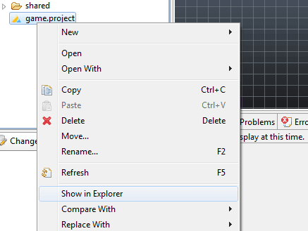
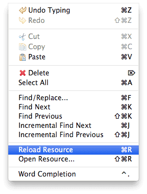
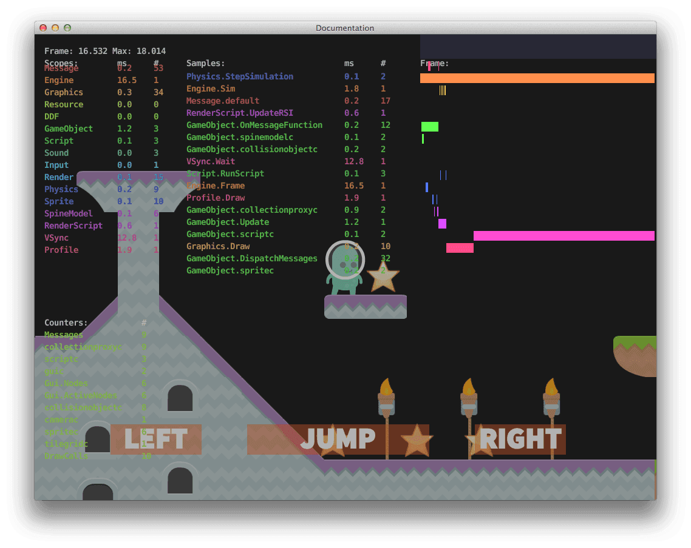
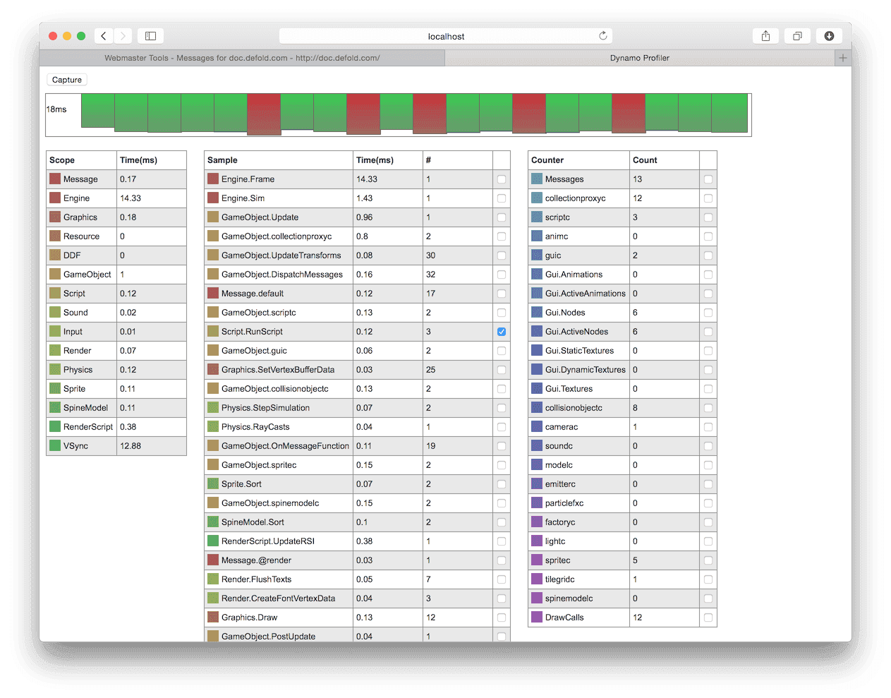

# Debugging
이 매뉴얼은 Defold에 있는 디버깅 기능에 대해 설명합니다.

Defold에서 게임을 디버그하는 가장 간단한 방법은 [출력 디버깅(print debugging)](http://en.wikipedia.org/wiki/Debugging#Techniques)을 사용하는 것입니다. 이 기술은 그냥 print()나 [pprint()](http://www.defold.com/ref/builtins#pprint) 함수를 사용해서 변수의 값을 살펴보고 실행 흐름을 추적하는 방법입니다. 만약 스크립트가 없는 게임 오브젝트가 이상하게 동작한다면, 디버깅 용도의 스크립트를 추가하면 됩니다.

출력 함수를 사용하면 Editor의 Console 창에 값이 출력됩니다. 또한 draw_text 메세지를 @render 소켓으로 보내서 화면에 텍스트를 그릴 수도 있습니다.

```lua
msg.post("@render:", "draw_text", {text = "My value: " .. my_val, position = vmath.vector3(200, 200, 0)})
```

물리 움직임을 계산하는데 문제가 생겼다면, 화면에 선(line)을 그려서 계산을 시각적으로 표현하는 것이 도움이 되기도 합니다. 이 방법은 draw_line 메세지를 @render 소켓으로 보내서 그릴 수 있습니다.

```lua
msg.post("@render:", "draw_line", {start_point = my_start, end_point = my_end, color = my_color})
```

Lua는 몇몇 상황에서 유용한 디버깅 라이브러리를 제공합니다. 특히 Lua 환경의 내부를 조사해야 하는 경우 필요할 수도 있습니다. 더 많은 정보는 http://www.lua.org/pil/contents.html#23 를 참고 바랍니다.

## Debugging Lua scripts with ZeroBrane
Defold 엔진은 Lua IDE ZeroBrane Studio 라는 무료 오픈소스를 통해 Lua 스크립트를 디버깅하기 위한 기능을 내장하고 있습니다. 디버깅 기능을 위해서는 ZeroBrane Studio를 설치해야 합니다. 이 프로그램은 macOS와 Windows에서 실행 가능합니다.

http://studio.zerobrane.com 에서 "ZeroBrane Studio"를 다운로드 하세요.

### ZeroBrane configuration
ZeroBrane이 프로젝트의 파일들을 찾으려면, Defold 프로젝트 디렉토리의 위치를 알려줘야 합니다. 간단한 방법으로는 Defold project에서 **Show in Finder/Explorer** 메뉴로 찾을 수 있습니다.

1. *game.project* 에서 마우스 오른쪽 클릭
2. macOS에서 **Show in Finder** 선택, Windows에서 **Show in Explorer** 선택

macOS:


Windows:


### To set up ZeroBrane
ZeroBrane을 설정하기 위해 **Project ▸ Project Directory ▸ Choose…​** 를 선택하세요.


이렇게 현재 Defold 프로젝트 디렉토리와 일치하게 설정하면, ZeroBrane에서 Defold 프로젝트의 디렉토리 트리 구조가 보이게 되며 이 파일들을 열거나 다룰 수 있게 됩니다.

추천하는 다른 구성 방법은 아래 문서에서 자세히 설명하도록 하겠습니다.

### Starting the debugging server
디버깅 세션을 시작하기 전에, ZeroBrane에 내장된 디버깅 서버가 실행되어야 합니다. 이 메뉴는 **Project** 메뉴에서 찾을 수 있으며 **menu:Project ▸ Start Debugger Server**를 선택하면 됩니다.


### Connecting your application to the debugger
디버깅은 Defold 어플리케이션의 생명주기의 어느 지점에서든 시작할 수 있지만, Lua 스크립트에서 우선적으로 시작되어야 합니다. 디버깅 세션을 시작하기 위한 Lua 코드는 아래처럼 작성할 수 있습니다.

```lua
local dbg = require "builtins.scripts.mobdebug"
dbg.start()
```

위 코드를 어플리케이션에 추가해서, ZeroBrane의 디버깅 서버와 연결(기본값으로 "localhost"로 연결됨)되고 다음 구문이 실행되기 전에 중지(pause) 됩니다.

> dbg.start()가 호출되었을 때 게임이 종료되어 버린다면, ZeroBrane이 문제를 감지하여 게임으로 종료 커맨드(exit command)를 전송했기 때문일 수도 있습니다. 몇 가지 이유로 인해, ZeroBrane은 디버깅 세션을 시작하기 위해 어떤 파일을 열어야 할 필요도 있을 수 있습니다. 만약 ZeroBrane에서 "Can’t start debugging without an opened file or with the current file not being saved (untitled.lua)."(번역: 열린 파일이나 현재 파일이 저장되지 않은 상태에서 디버깅을 시작할 수 없습니다.) 에러가 발생하면 dbg.start() 가 추가된 해당 파일을 열어 이 에러를 수정하십시오.

> 디버깅은 디버깅이 시작된 위치에서만 lua 컨텍스트를 활성화 할 수 있습니다. game.project에서 "shared_state"를 활성화 하면 디버깅이 시작된 위치와 상관없이 모든 어플리케이션을 디버깅 할 수 있습니다.

Debugging session started in "<defold-dir>/branches/1610/1159/Main/".
(디버깅 세션이 "<defold-dir>/branches/1610/1159/Main/" 에서 시작되었습니다.)

라는 메세지가 나타나면 이제 ZeroBrane에서 디버깅 기능을 사용할 수 있게 되어 중단점(breakpoint)를 추가 삭제해서 단계별로 검사할 수 있습니다.


연결 시도가 실패했다면(디버깅 서버를 실행하지 않았거나 해서), 연결 시도 후에 정상적으로 어플리케이션을 계속 실행합니다.

### Remote debugging
디버기깅은 일반 네트워크 커넥션 (TCP)에서 발생하므로 원격으로 디버깅이 가능합니다. 즉 모바일 장치가 실행되는 동안 어플리케이션을 디버그 하는것도 가능합니다.

디버깅을 시작하기 위해선 기본적으로 start() 를 호출해 localhost로 연결을 시도할 수 있지만 아래처럼 ZeroBrane의 디버깅 서버에 접속하기 위해 특정 주소를 직접 수정할 수도 있습니다.

```lua
local dbg = require "builtins.scripts.mobdebug"
dbg.start("192.168.5.101")
```

또한 이 기능은 8172 포트를 통해 TCP 연결되므로 방화벽 등의 소프트웨어가 원격 장치와의 연결을 막고 있지 않은지 체크하는 것이 중요합니다. 그렇지 않으면 어플리케이션이 디버깅 서버에 연결하려고 시도할 때 중단될 수 있습니다.

### Other recommended ZeroBrane setting
디버깅 하는 동안 ZeroBrane이 자동으로 Lua 스크립트 파일을 열도록 할 수도 있습니다. 이 기능은 수동으로 파일을 열지 않아도 다른 소스 파일의 함수 정보를 단계적으로 열 수 있습니다.

우선 에디터의 configuration 파일을 열어서 사용자용 버전으로 수정해야 합니다.

1. **Edit ▸ Preferences ▸ Settings: User** 메뉴 선택
2. configuration 파일에 아래 항목을 추가함
    ```
    - 디버깅하는 동안 요구되는 파일을 자동으로 염
    editor.autoactivate = true
    ```
3. ZeroBrane을 재시작


## Hot reloading
Defold는 리소스들을 핫리로드 할 수 있습니다. 게임을 개발중일 때 이 기능은 특정 작업을 대단히 빠르게 할 수 있게 도움을 줍니다. 게임이 라이브 상태로 실행중인 동안에도 스크립트를 변경 할 수 있게 해 줍니다. 일반적인 사용 사례로는 게임플레이 매개변수들을 조정하거나 게임 실행중에 디버깅을 수행하는 사례 등이 있습니다.

변경된 리소스를 리로드하려면,  **Edit ▸ Reload Resource** 메뉴를 선택하거나 해당 단축키를 누르면 됩니다.



모든 스크립트 컴포넌트는 on_reload() 함수를 정의할 수 있습니다. 이 함수를 정의하면 스크립트가 에디터에서 게임으로 리로드 될 때 언제든지 호출 됩니다.

```lua
function on_reload(self)
    -- 현재 속도 출력
    print(self.velocity)

    -- 속도를 0으로 설정
    self.velocity = vmath.vector3()
end
```

## Visual profiler
Defold 엔진은 프로파일링 정보를 게임 실행중에 표시할 수도 있습니다. 이 기능은 디버깅이나 최적화를 할 때 큰 도움이 됩니다.

```lua
function on_reload(self)
    -- 핫리로드 될 때 프로파일러를 켬
    msg.post("@system:", "toggle_profile")
end
```

프로파일러는 어플리케이션이 실행중일 때 실시간 정보를 표시합니다.



## Web profiler
게임이 실행되는 동안, 자세한 프로파일링 정보를 제공하는 웹기반 프로파일러에도 접속 할 수 있습니다. 이 기능은 데이터 지점들을 샘플링하여 더 자세히 분석할 수 있게 해 줍니다.

프로파일러에 접속하기 위해서는:

1. 대상 장치(target device)에서 게임을 시작함
2. 웹브라우저를 열어 http://<장치의 IP address>:8002 로 접속함

게임이 데스크탑 컴퓨터에서 실행중이라면, http://localhost:8002 주소로 프로파일러에 접속 할 수 있습니다. 대상 장치의 IP 주소는 **Project ▸ Target** 메뉴에서도 찾을 수 있습니다.



이 프로파일러는 4개의 섹션으로 나누어져 있으며 현재 샘플 데이터의 4가지 뷰로 각각 다르게 보여줍니다. 샘플 데이터를 업데이트 하려면, 상단에 **Capture** 버튼을 누르면 됩니다.

### Frames overview
프레임 오버뷰는 현재 샘플링된 20 프레임을 나란히 표시합니다. 각 바(bar)의 높이는 프레임에 소요된 시간을 나타냅니다. 왼쪽의 숫자는 현재 샘플 데이터의 한 프레임에서 보낸 최대 시간을 나타냅니다.


아래의 프레임 오버뷰는 프레임 데이터를 자세하게 보여줍니다. 오버뷰의 프레임 바를 클릭해서 데이터뷰에서 특정 프레임의 데이터를 나타낼 수 있습니다. 또한 클릭된 프레임 데이터의 프레임 타임차트(timechart)도 페이지 하단에 보여줍니다.

### Frame data
프레임 데이터 뷰는 현재 선택된 프레임을 자세히 세분화한 데이터의 테이블입니다. 이 뷰에서 각 엔진 스코프(scope)가 얼마나 많은 밀리초(milliseconds)를 소모했는지를 알 수 있으며(왼쪽) 스코프 내에 있는 샘플 지점(sample points)도 볼 수 있습니다(가운데). 오른편엔 카운터(counter) 테이블이 있는데, 샘플 데이터의 각 프레임마다 요청된 드로우 콜(draw calls) 수를 추적하기가 쉽습니다.


샘플 포인트 또는 카운터와 관련된 체크박스를 클릭하면 데이터를 아래 플롯에 추가할 수 있습니다.

### Frames plot
프레임 플롯 뷰는 X 축에는 프레임 수, Y 축에는 시간(밀리초)으로 된 프레임 데이터 테이블을 사용하여 모든 샘플링된 프레임의 플롯을 보여줍니다. 각 선택된 데이터 포인트는 프레임 데이터 테이블에 지정된 특정 색상으로 그려집니다.


### Frame time chart
프레임 타임 차트는 선택된 프레임 동안 엔진이 소모한 시간을 아주 쉽게 조사할 수 있게 시각적으로 보여줍니다.


(일부 그래픽 에셋은 Kenney가 제작했습니다 : http://kenney.nl/assets)
