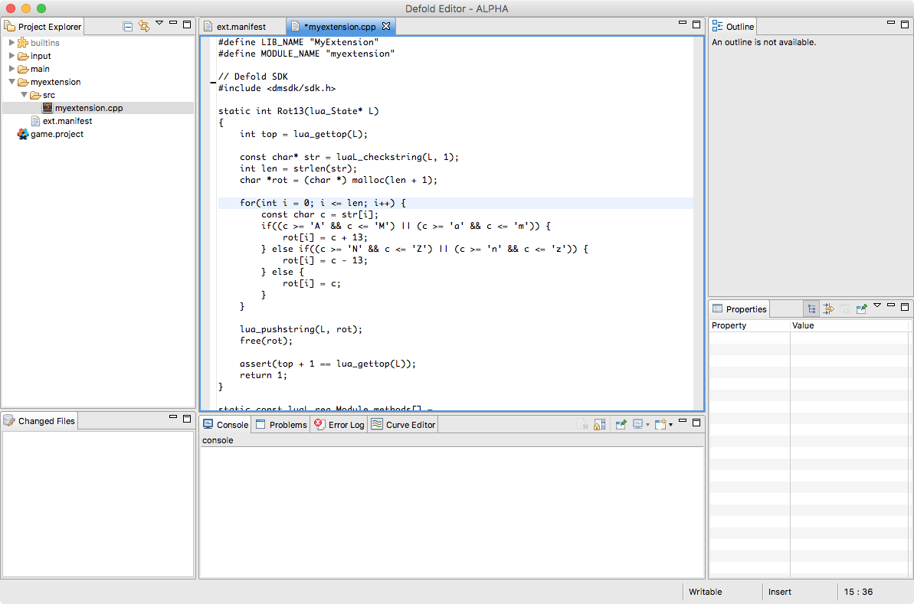

# Native extensions
만약 Lua로는 충분하지 못한 외부 소프트웨어나 하드웨어와 로우 레벨로 커스텀 상호작용이 필요한 경우에는, Defold SDK는 C++로 익스텐션을 만들 수 있습니다. 네이티브 익스텐션의 일반적인 사용 사례로는 다음과 같습니다.

* 예를 들면 모바일 카메라 같은 특정 하드웨어와 상호작용 하기
* 광고 네트워크 API나 Luasocket을 사용할 수 있는 네트워크 API 같은 외부 로우 레벨 API와 상호작용 하기
* 고성능 계산

## The build platform
Defold는 클라우드 기반 빌드 솔루션을 사용하여 네이티브 익스텐션에 대한 무설정 진입 지점(zero setup entry point)을 제공합니다. 게임 프로젝트에 추가된 네이티브 익스텐션은 일반적인 프로젝트 컨텐츠의 일부가 됩니다. 엔진의 특정 버전으로 빌드하거나 팀원에게 배포할 필요도 없으며 이 작업들은 자동으로 이루어집니다. 프로젝트를 빌드하거나 실행하려는 모든 팀원들은 모든 네이티브 익스텐션과 함께 특정 프로젝트 엔진 실행파일을 받을 수 있습니다.


## Project layout
새 익스텐션을 만들기 위해서는 프로젝트 루트에 폴더를 하나 만들어야 합니다. 이 폴더에는 익스텐션과 관계된 모든 셋팅, 소스코드, 라이브러리, 리소스들을 포함시켜야 합니다. 이 익스텐션 빌더는 폴더 구조를 인식하고 모든 소스파일과 라이브러리를 수집합니다.


#### "ext.manifest"
익스텐션 폴더에는 "ext.manifest" 파일이 있어야 합니다. 이 파일은 익스텐션 빌더에 의해 선택되는 YAML 형식의 파일입니다. 메니페스트 파일에는 최소한 익스텐션의 이름이 포함되어 있어야 합니다.
#### src
이 폴더에는 모든 소스코드 파일들이 있어야 합니다.
#### include
이 선택적(optional) 폴더에는 다른 포함 파일(include files)들이 있어야 합니다.
#### lib
이 선택적 폴더에는 익스텐션이 의존하는 모든 컴파일된 라이브러리들이 있어야 합니다. 라이브러리 파일들은 라이브러리가 지원하는 아키텍쳐가 무엇인지에 따라 플랫폼 또는 아키텍쳐-플랫폼 이름의 하위 폴더에 있어야 합니다. 지원되는 플랫폼은 ios, android, osx 이며 지원되는 아키텍쳐-플랫폼 쌍(arc-platform pairs)은 armv7-ios, arm64-ios, armv7-android, x86_64-osx 입니다.
#### res
이 선택적 폴더에는 익스텐션이 의존하는 모든 추가 리소스들이 있어야 합니다. 리소스 파일들은 "lib" 하위 폴더처럼 플랫폼 또는 아키텍쳐-플랫폼 이름의 하위 폴더에 있어야 합니다. common 이름의 하위폴더에는 모든 플랫폼에 공통적인 리소스 파일들을 포함시킬 수 있습니다.

## A simple example extension
아주 간단한 익스텐션을 개발해 봅시다. 우선, "myextension" 이라는 새 루트 폴더를 만들고 익스텐션의 이름이 있는 "ext.manifest" 파일을 추가해 봅시다.


*ext.manifest*
```yaml
name: "MyExtension"
```

익스텐션을 구성하는 C++ 파일 한 개를 "myextension.cpp" 라는 이름으로 "src" 폴더에 생성합니다.

Defold 에디터는 기본적으로 .cpp 파일을 열 수 없으므로 파일을 더블 클릭해서 해당 파일 타입에 사용되는 시스템 에디터를 사용합니다. 물론 해당 파일에 마우스 오른쪽 클릭해서  **Open With ▸ Text Editor** 메뉴를 선택해 내장된 텍스트 에디터를 사용해도 되지만, Defold는 C++ 파일을 지원하지 않으므로 최소한의 편집 기능만 사용 가능합니다.



익스텐션 소스 파일은 아래 코드를 포함합니다.

*myextension.cpp*
```cpp
// Extension lib defines
#define LIB_NAME "MyExtension"
#define MODULE_NAME "myextension"

// include the Defold SDK
#include <dmsdk/sdk.h>
#include <malloc.h>

static int Rot13(lua_State* L)
{
    int top = lua_gettop(L);

    // 스택에서 문자열 파라미터 체크하고 가져오기
    const char* str = luaL_checkstring(L, 1);

    // 새 문자열 할당
    int len = strlen(str);
    char *rot = (char *) malloc(len + 1);

    // 파라미터 문자열을 반복해서 rot13 문자열 생성하기
    for(int i = 0; i <= len; i++) {
        const char c = str[i];
        if((c >= 'A' && c <= 'M') || (c >= 'a' && c <= 'm')) {
            // A~M 사이의 char에 13 더하기
            rot[i] = c + 13;
        } else if((c >= 'N' && c <= 'Z') || (c >= 'n' && c <= 'z')) {
            // N~Z 사이의 char에 13을 빼기
            rot[i] = c - 13;
        } else {
            // 문자를 그대로 유지함
            rot[i] = c;
        }
    }

    // 회전된 문자열을 스택에 넣음
    lua_pushstring(L, rot);

    // 문자열 메모리 해제. Lua는 지금 복제본을 가지고 있음
    free(rot);

    // 스택에 하나의 아이템이 있음을 assert 함
    assert(top + 1 == lua_gettop(L));

    // 1 아이템 반환
    return 1;
}

// Lua에 노출된 함수
static const luaL_reg Module_methods[] =
{
    {"rot13", Rot13},
    {0, 0}
};

static void LuaInit(lua_State* L)
{
    int top = lua_gettop(L);

    // lua 이름을 등록하기
    luaL_register(L, MODULE_NAME, Module_methods);

    lua_pop(L, 1);
    assert(top == lua_gettop(L));
}

dmExtension::Result AppInitializeMyExtension(dmExtension::AppParams* params)
{
    return dmExtension::RESULT_OK;
}

dmExtension::Result InitializeMyExtension(dmExtension::Params* params)
{
    // Init Lua
    LuaInit(params->m_L);
    printf("Registered %s Extension\n", MODULE_NAME);
    return dmExtension::RESULT_OK;
}

dmExtension::Result AppFinalizeMyExtension(dmExtension::AppParams* params)
{
    return dmExtension::RESULT_OK;
}

dmExtension::Result FinalizeMyExtension(dmExtension::Params* params)
{
    return dmExtension::RESULT_OK;
}


// Defold SDK는 익스텐션 진입점을 셋팅하기 위해 매크로를 사용함
//
// DM_DECLARE_EXTENSION(symbol, name, app_init, app_final, init, update, on_event, final)

DM_DECLARE_EXTENSION(MyExtension, LIB_NAME, AppInitializeMyExtension, AppFinalizeMyExtension, InitializeMyExtension, 0, 0, FinalizeMyExtension)
```

DM_DECLARE_EXTENSION 매크로는 익스텐션 코드에 다양한 진입점(entry points)을 선언하는데 사용됩니다. 이 간단한 예제에서는, "update"나 "on_event" 진입점이 필요하지 않으므로 대신 0 값을 매크로 인자값으로 보냅니다.

이제 프로젝트를 빌드(**Project ▸ Build and Launch**)할 차례입니다. 이것은 익스텐션을 익스텐션 빌더에 업로드해서 새 익스텐션이 포함된 커스텀 엔진을 생성합니다. 만약 빌더에 에러가 발생하면 빌드 에러가 있는 대화창을 표시합니다.

익스텐션을 테스트하려면, 게임 오브젝트를 생성해서 아래와 같은 테스트 코드가 있는 스크립트 컴포넌트를 추가해야 합니다.

```lua
local s = "abcdefghijklmnopqrstuvwxyzABCDEFGHIJKLMNOPQRSTUVWXYZ"
local rot_s = myextension.rot13(s)
print(rot_s) --> nopqrstuvwxyzabcdefghijklmNOPQRSTUVWXYZABCDEFGHIJKLM
```

이제 끝입니다! 우리는 완전히 잘 동작하는 네이티브 익스텐션을 만들었습니다.

## The ext.manifest file
메니페스트 파일에는 익스텐션의 이름 외에도 특정 플랫폼의 compile flags, link flags, libs, frameworks 를 추가할 수 있습니다. 아래에 예제가 있습니다.

*ext.manifest*
```yaml
name: "AdExtension"

platforms:
    arm64-ios:
        context:
            frameworks: ["CoreGraphics", "CFNetwork", "GLKit", "CoreMotion", "MessageUI", "MediaPlayer", "StoreKit", "MobileCoreServices", "AdSupport", "AudioToolbox", "AVFoundation", "CoreGraphics", "CoreMedia", "CoreMotion", "CoreTelephony", "CoreVideo", "Foundation", "GLKit", "JavaScriptCore", "MediaPlayer", "MessageUI", "MobileCoreServices", "OpenGLES", "SafariServices", "StoreKit", "SystemConfiguration", "UIKit", "WebKit"]
            flags:      ["-stdlib=libc++"]
            linkFlags:  ["-ObjC"]
            libs:       ["z", "c++", "sqlite3"]

    armv7-ios:
        context:
            frameworks: ["CoreGraphics", "CFNetwork", "GLKit", "CoreMotion", "MessageUI", "MediaPlayer", "StoreKit", "MobileCoreServices", "AdSupport", "AudioToolbox", "AVFoundation", "CoreGraphics", "CoreMedia", "CoreMotion", "CoreTelephony", "CoreVideo", "Foundation", "GLKit", "JavaScriptCore", "MediaPlayer", "MessageUI", "MobileCoreServices", "OpenGLES", "SafariServices", "StoreKit", "SystemConfiguration", "UIKit", "WebKit"]
            flags:      ["-stdlib=libc++"]
            linkFlags:  ["-ObjC"]
            libs:       ["z", "c++", "sqlite3"]
```

## Known issues
네이티브 익스텐션 기능은 알파(alpha) 상태이므로, 아직 모든 기능이 준비되지는 않았습니다.

* Platforms: 현재는 macOS, iOS, Android 익스텐션 빌드만 지원합니다.
* Android 는 .java 와 .jar archives 에 대한 지원이 부족합니다.
* Editor: 에디터 통합(editor integration). 빌드 프로세스가 표시되지 않고 에러 리포팅 기능도 아직 몇몇 기능만 지원됩니다.
* Debugging: 현재, iOS에서 빌드하는 경우, .dSYM 파일이 결과 빌드에 포함되고 있지 않습니다.
