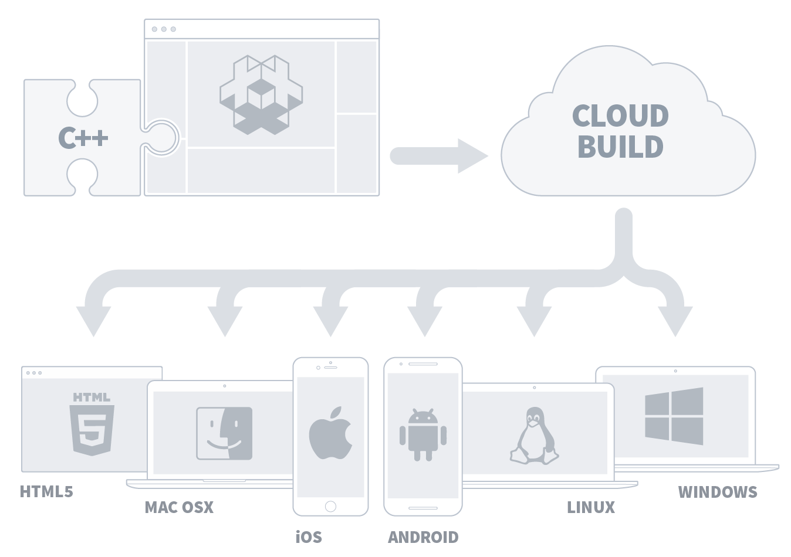
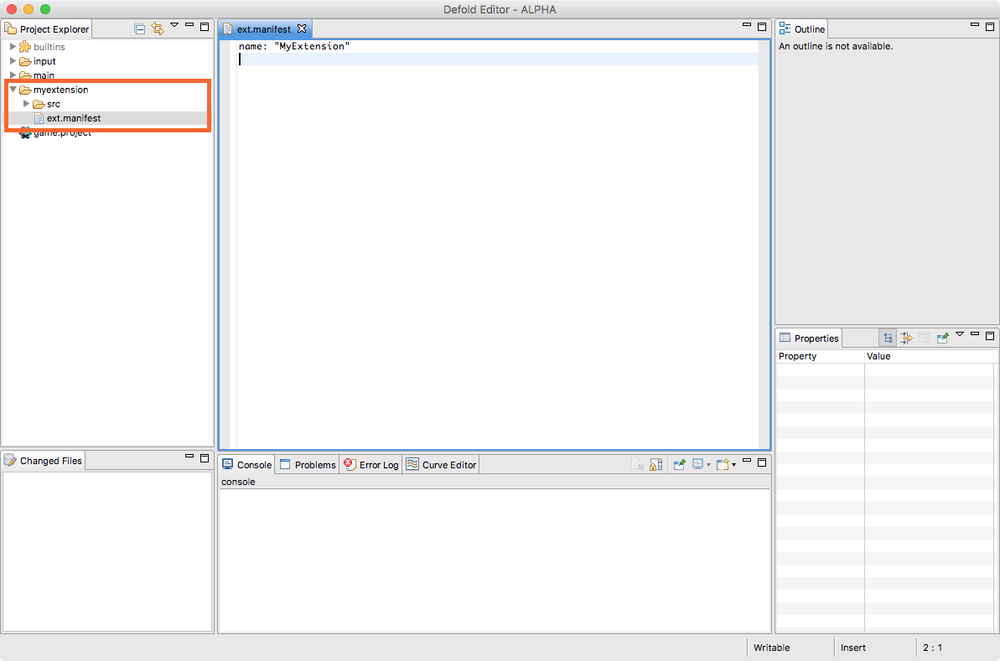
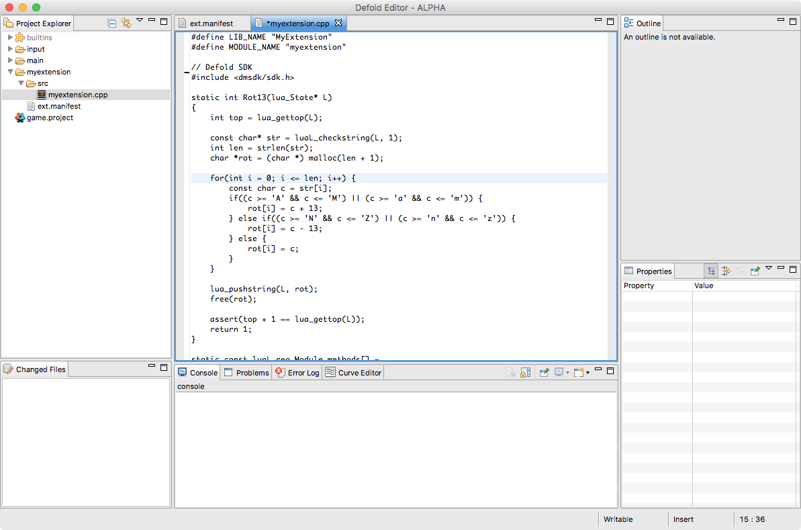

# 네이티브 익스텐션

Lua만으로는 충분하지 않은 낮은 수준에서 외부 소프트웨어나 하드웨어와 커스텀 상호작용이 필요한 경우, Defold SDK를 사용해 타겟 플랫폼에 따라 C, C++, Objective C, Java 또는 JavaScript로 엔진 익스텐션을 작성할 수 있습니다. 네이티브 익스텐션의 일반적인 사용 사례는 다음과 같습니다.

- 모바일 폰의 카메라처럼 특정 하드웨어와 상호작용합니다.
- Luasocket을 사용할 수 있는 네트워크 API를 통한 상호작용을 허용하지 않는 광고 네트워크 API처럼 외부 저수준 API와 상호작용합니다.
- 고성능 계산과 데이터 처리를 수행합니다.

## 빌드 서버

Defold는 클라우드 기반 빌드 솔루션으로 네이티브 익스텐션에 대한 zero setup 진입점을 제공합니다. 직접 또는 [라이브러리 프로젝트](/manuals/libraries/)를 통해 개발되어 게임 프로젝트에 추가된 모든 네이티브 익스텐션은 일반 프로젝트 컨텐츠의 일부가 됩니다. 엔진의 특수 버전을 빌드해서 팀원들에게 배포할 필요가 없습니다. 이 작업은 자동으로 처리되며, 프로젝트를 빌드하고 실행하는 모든 팀원은 모든 네이티브 익스텐션이 포함된 프로젝트별 엔진 실행 파일을 받게 됩니다.



Defold는 사용 제한 없이 클라우드 빌드 서버를 무료로 제공합니다. 서버는 유럽에서 호스팅되며, 네이티브 코드가 전송되는 URL은 [Editor Preferences 창](/manuals/editor-preferences/#extensions)에서 설정하거나 [bob](/manuals/bob/#usage)의 `--build-server` 커맨드 라인 옵션으로 설정합니다. 자체 서버를 설정하려면 [이 지침](/manuals/extender-local-setup)을 따르세요.

## 프로젝트 레이아웃

새 익스텐션을 만들려면 프로젝트 루트에 폴더를 만듭니다. 이 폴더에는 익스텐션과 관련된 모든 설정, 소스 코드, 라이브러리, 리소스가 들어갑니다. 익스텐션 빌더는 폴더 구조를 인식하고 모든 소스 파일과 라이브러리를 수집합니다.

```
 myextension/
 │
 ├── ext.manifest
 │
 ├── src/
 │
 ├── include/
 │
 ├── lib/
 │   └──[platforms]
 │
 ├── manifests/
 │   └──[platforms]
 │
 └── res/
     └──[platforms]

```
*ext.manifest*
: 익스텐션 폴더에는 *ext.manifest* 파일이 반드시 있어야 합니다. 이 파일은 단일 익스텐션을 빌드할 때 사용되는 flags와 defines가 들어 있는 설정 파일입니다. 파일 포멧 정의는 [Extension Manifest 매뉴얼](https://defold.com/manuals/extensions-ext-manifests/)에서 확인할 수 있습니다.

*src*
: 이 폴더에는 모든 소스 코드 파일이 들어갑니다.

*include*
: 이 선택적 폴더에는 include 파일이 들어갑니다.

*lib*
: 이 선택적 폴더에는 익스텐션이 의존하는 컴파일된 라이브러리가 들어갑니다. 라이브러리 파일은 라이브러리가 지원하는 아키텍처에 따라 `platform` 또는 `architecture-platform` 이름의 하위 폴더에 배치해야 합니다.

  :[platforms](../shared/platforms.md)

*manifests*
: 이 선택적 폴더에는 빌드 또는 번들링 과정에서 사용되는 추가 파일이 들어갑니다. 자세한 내용은 아래를 참조하세요.

*res*
: 이 선택적 폴더에는 익스텐션이 의존하는 추가 리소스가 들어갑니다. 리소스 파일은 "lib" 하위 폴더와 마찬가지로 `platform` 또는 `architecture-platform` 이름의 하위 폴더에 배치해야 합니다. 모든 플랫폼에 공통으로 사용되는 리소스 파일을 담는 `common` 하위 폴더도 허용됩니다.

### 메니페스트 파일

익스텐션의 선택적 *manifests* 폴더에는 빌드 및 번들링 과정에서 사용되는 추가 파일이 들어갑니다. 파일은 `platform` 이름의 하위 폴더에 배치해야 합니다.

* `android` - 이 폴더에는 메인 어플리케이션에 병합될 메니페스트 스텁 파일을 넣을 수 있습니다([여기에 설명된 대로](/manuals/extensions-manifest-merge-tool)).
  * 이 폴더에는 [Gradle로 해결되는](/manuals/extensions-gradle) 종속성이 들어 있는 `build.gradle` 파일도 넣을 수 있습니다.
  * 마지막으로 이 폴더에는 ProGuard 파일을 0개 이상 넣을 수도 있습니다(실험적).
* `ios` - 이 폴더에는 메인 어플리케이션에 병합될 메니페스트 스텁 파일을 넣을 수 있습니다([여기에 설명된 대로](/manuals/extensions-manifest-merge-tool)).
  * 이 폴더에는 [Cocoapods로 해결되는](/manuals/extensions-cocoapods) 종속성이 들어 있는 `Podfile` 파일도 넣을 수 있습니다.
* `osx` - 이 폴더에는 메인 어플리케이션에 병합될 메니페스트 스텁 파일을 넣을 수 있습니다([여기에 설명된 대로](/manuals/extensions-manifest-merge-tool)).
* `web` - 이 폴더에는 메인 어플리케이션에 병합될 메니페스트 스텁 파일을 넣을 수 있습니다([여기에 설명된 대로](/manuals/extensions-manifest-merge-tool)).


## 익스텐션 공유하기

익스텐션은 프로젝트의 다른 에셋과 동일하게 취급되며 같은 방식으로 공유할 수 있습니다. 네이티브 익스텐션 폴더를 라이브러리 폴더로 추가하면 프로젝트 종속성으로 공유하고 다른 사람이 사용할 수 있습니다. 자세한 내용은 [라이브러리 프로젝트 매뉴얼](/manuals/libraries/)을 참조하세요.


## 간단한 예제 익스텐션

아주 간단한 익스텐션을 만들어 보겠습니다. 먼저 *`myextension`*이라는 새 루트 폴더를 만들고 익스텐션 이름 "`MyExtension`"이 들어 있는 *`ext.manifest`* 파일을 추가합니다. 이 이름은 C++ 심볼이며 `DM_DECLARE_EXTENSION`의 첫 번째 인자와 일치해야 합니다(아래 참조).



```yaml
# 익스텐션의 C++ 심볼
name: "MyExtension"
```

익스텐션은 "`src`" 폴더에 생성한 *`myextension.cpp`*라는 단일 C++ 파일로 구성됩니다.



익스텐션 소스 파일에는 다음 코드가 들어갑니다.

```cpp
// myextension.cpp
// 익스텐션 lib 정의
#define LIB_NAME "MyExtension"
#define MODULE_NAME "myextension"

// Defold SDK 포함
#include <dmsdk/sdk.h>

static int Reverse(lua_State* L)
{
    // 이 struct가 범위를 벗어났을 때
    // Lua 스택에 있어야 하는 예상 아이템 수
    DM_LUA_STACK_CHECK(L, 1);

    // 스택에서 문자열 파라미터를 확인하고 가져오기
    char* str = (char*)luaL_checkstring(L, 1);

    // 문자열 뒤집기
    int len = strlen(str);
    for(int i = 0; i < len / 2; i++) {
        const char a = str[i];
        const char b = str[len - i - 1];
        str[i] = b;
        str[len - i - 1] = a;
    }

    // 뒤집힌 문자열을 스택에 넣기
    lua_pushstring(L, str);

    // 아이템 1개 반환
    return 1;
}

// Lua에 노출되는 함수
static const luaL_reg Module_methods[] =
{
    {"reverse", Reverse},
    {0, 0}
};

static void LuaInit(lua_State* L)
{
    int top = lua_gettop(L);

    // Lua 이름 등록
    luaL_register(L, MODULE_NAME, Module_methods);

    lua_pop(L, 1);
    assert(top == lua_gettop(L));
}

dmExtension::Result AppInitializeMyExtension(dmExtension::AppParams* params)
{
    return dmExtension::RESULT_OK;
}

dmExtension::Result InitializeMyExtension(dmExtension::Params* params)
{
    // Lua 초기화
    LuaInit(params->m_L);
    printf("Registered %s Extension\n", MODULE_NAME);
    return dmExtension::RESULT_OK;
}

dmExtension::Result AppFinalizeMyExtension(dmExtension::AppParams* params)
{
    return dmExtension::RESULT_OK;
}

dmExtension::Result FinalizeMyExtension(dmExtension::Params* params)
{
    return dmExtension::RESULT_OK;
}


// Defold SDK는 익스텐션 진입점을 설정하기 위해 매크로를 사용합니다.
//
// DM_DECLARE_EXTENSION(symbol, name, app_init, app_final, init, update, on_event, final)

// MyExtension은 관련된 모든 익스텐션 데이터를 보관하는 C++ 심볼입니다.
// `ext.manifest`의 name 필드와 일치해야 합니다.
DM_DECLARE_EXTENSION(MyExtension, LIB_NAME, AppInitializeMyExtension, AppFinalizeMyExtension, InitializeMyExtension, 0, 0, FinalizeMyExtension)
```

익스텐션 코드의 다양한 진입점을 선언하는 데 사용되는 `DM_DECLARE_EXTENSION` 매크로를 확인하세요. 첫 번째 인자 `symbol`은 *ext.manifest*에 지정된 이름과 일치해야 합니다. 이 간단한 예제에서는 "update" 또는 "on_event" 진입점이 필요하지 않으므로 매크로의 해당 위치에 `0`을 제공합니다.

이제 프로젝트를 빌드하기만 하면 됩니다(<kbd>Project ▸ Build</kbd>). 그러면 익스텐션이 익스텐션 빌더에 업로드되고, 빌더는 새 익스텐션이 포함된 커스텀 엔진을 생성합니다. 빌더에서 오류가 발생하면 빌드 오류가 포함된 대화 상자가 표시됩니다.

익스텐션을 테스트하려면 게임 오브젝트를 만들고 테스트 코드가 있는 스크립트 컴포넌트를 추가합니다.

```lua
local s = "abcdefghijklmnopqrstuvwxyzABCDEFGHIJKLMNOPQRSTUVWXYZ"
local reverse_s = myextension.reverse(s)
print(reverse_s) --> ZYXWVUTSRQPONMLKJIHGFEDCBAzyxwvutsrqponmlkjihgfedcba
```

이제 완료되었습니다. 완전히 동작하는 네이티브 익스텐션을 만들었습니다.


## 익스텐션 라이프사이클

위에서 본 것처럼 `DM_DECLARE_EXTENSION` 매크로는 익스텐션 코드의 다양한 진입점을 선언하는 데 사용됩니다.

`DM_DECLARE_EXTENSION(symbol, name, app_init, app_final, init, update, on_event, final)`

진입점을 통해 익스텐션 라이프사이클의 여러 시점에서 코드를 실행할 수 있습니다.

* 엔진 시작
  * 엔진 시스템 시작
  * 익스텐션 `app_init`
  * 익스텐션 `init` - 모든 Defold API가 초기화되었습니다. 익스텐션 코드에 대한 Lua 바인딩을 생성하기에 권장되는 익스텐션 라이프사이클 시점입니다.
  * 스크립트 init - 스크립트 파일의 `init()` 함수가 호출됩니다.
* 엔진 루프
  * 엔진 update
    * 익스텐션 `update`
    * 스크립트 update - 스크립트 파일의 `update()` 함수가 호출됩니다.
  * 엔진 이벤트(창 최소화/최대화 등)
    * 익스텐션 `on_event`
* 엔진 종료(또는 재부팅)
  * 스크립트 final - 스크립트 파일의 `final()` 함수가 호출됩니다.
  * 익스텐션 `final`
  * 익스텐션 `app_final`

## 정의된 플랫폼 식별자

빌더는 각 플랫폼에서 다음 식별자를 정의합니다.

* `DM_PLATFORM_WINDOWS`
* `DM_PLATFORM_OSX`
* `DM_PLATFORM_IOS`
* `DM_PLATFORM_ANDROID`
* `DM_PLATFORM_LINUX`
* `DM_PLATFORM_HTML5`

## 빌드 서버 로그 {#build-server-logs}

프로젝트에서 네이티브 익스텐션을 사용할 때 빌드 서버 로그를 확인할 수 있습니다. 빌드 서버 로그(`log.txt`)는 프로젝트를 빌드할 때 커스텀 엔진과 함께 다운로드되며, `.internal/%platform%/build.zip` 파일 안에 저장되고 프로젝트의 빌드 폴더에도 압축 해제됩니다.

## 예제 익스텐션

* [기본 익스텐션 예제](https://github.com/defold/template-native-extension)(이 매뉴얼의 익스텐션)
* [Android 익스텐션 예제](https://github.com/defold/extension-android)
* [HTML5 익스텐션 예제](https://github.com/defold/extension-html5)
* [macOS, iOS 및 Android 비디오 플레이어 익스텐션](https://github.com/defold/extension-videoplayer)
* [macOS 및 iOS 카메라 익스텐션](https://github.com/defold/extension-camera)
* [iOS 및 Android In-app Purchase 익스텐션](https://github.com/defold/extension-iap)
* [iOS 및 Android Firebase Analytics 익스텐션](https://github.com/defold/extension-firebase-analytics)

[Defold 에셋 포털](https://www.defold.com/assets/)에도 여러 네이티브 익스텐션이 있습니다.
