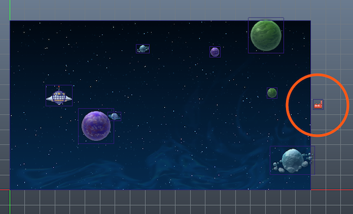

# Factory components
팩토리 컴포넌트는 오브젝트 풀(pool of objects)에서 실행중인 게임으로 게임오브젝트를 동적으로 스폰하는데 사용됩니다. 펙토리 컴포넌트를 게임 오브젝트에 추가하고, **Prototype** 속성에 특정 게임 오브젝트 파일을 지정하면 설계도면 찍어내듯이 새 게임 오브젝트를 찍어낼 수 있습니다.




게임 오브젝트 생성을 트리거 하기 위해서는 factory.create()를 호출하면 됩니다.

*factory.script*
```lua
local p = go.get_position()
p.y = vmath.lerp(math.random(), min_y, max_y)
local component = "#star_factory"
factory.create(component, p)
```


factory.create() 함수는 5개의 파라메터를 가집니다.

#### url
새 게임오브젝트를 스폰하는 펙토리 컴포넌트의 아이디
#### [position]
(선택) 새 게임 오브젝트의 월드 포지션(world position). vector3 형식이며, 포지션을 정하지 않으면 게임오브젝트가 펙토리 컴포넌트의 위치에 스폰됨
#### [rotation]
새 게임 오브젝트의 월드 로테이션(world rotation). quat(쿼터니온) 형식임
#### [properties]
게임 오브젝트와 초기화 되는 스크립트 속성값의 Lua 테이블. 자세한 내용은 [Script properties](/manuals/script-properties) 매뉴얼 참고
#### [scale]
스폰된 게임오브젝트의 스케일(scale). 0보다 큰 숫자로 입력하면 모든 축(axis)에 동일한 사이즈로 변경되며, vector3로 입력하면 축마다 다른 크기로 스케일링 할 수 있음

예제:

*factory.script*
```lua
local p = go.get_position()
p.y = vmath.lerp(math.random(), min_y, max_y)
local component = "#star_factory"
-- 회전 없이 두배의 스케일로 스폰함. star의 score를 10으로 설정함
factory.create(component, p, nil, { score = 10 }, 2.0)                           [1]
```
**[1].** star 게임 오브젝트의 "score" 속성을 설정함

*star.script*
```lua
go.property("score", 1)                                                                         [1]

local speed = -240

function update(self, dt)
    local p = go.get_position()
    p.x = p.x + speed * dt
    if p.x < -32 then
        go.delete()
    end
    go.set_position(p)
end

function on_message(self, message_id, message, sender)
    if message_id == hash("collision_response") then
        msg.post("main#gui", "add_score", {amount = self.score})         [2]
        go.delete()
    end
end
```

**[1].** "score" 스크립트 속성이 기본값과 함께 정의됨

**[2].** "score" 스크립트 속성을 "self"에 저장된 값처럼 참조함


> 현재 Defold는 충돌 모양(collision shape)의 비규격 스케일링(non uniform scaling)을 지원하지 않습니다. vmath.vector3(1.0, 2.0, 1.0) 와 같은 비규격 스케일링 값을 넘기면 스프라이트는 제대로 변형되지만 충돌 모양은 제대로 변형되지 않습니다.

## Instance limits
**Project Settings**에 있는 **max_instances** 속성은 게임 월드(게임 시작시 로드된 main.collection을 비롯해 collection proxy를 통해 로드된 모든 월드)에 존재할 수 있는 게임 오브젝트 인스턴스의 총 수량을 제한합니다. 게임 월드에 존재하는 모든 게임 오브젝트는 에디터에서 직접 배치하던지 스크립트로 스폰하던지와 상관없이 제한된 수량 만큼 카운트 됩니다.


그러므로 만약 **max_instances**를 1024로 설정하고 메인 컬렉션에 24개의 게임오브젝트를 수동으로 배치했다면, 1000개의 게임오브젝트를 추가로 스폰할 수 있게 됩니다. 그리고 게임오브젝트를 삭제하면, 삭제한 만큼의 인스턴스를 추가 생성할 수 있습니다.

## Pooling of game objects
스폰한 게임 오브젝트를 풀(pool)에 저장했다가 재사용하는 것은 좋은 방법인 듯 하지만 성능상의 이유로 이를 자제 하는것이 좋습니다. 게임오브젝트를 삭제하고 새로 스폰하는 것이 풀링을 하는 것보다 더 빠릅니다(때로는 더 깔끔함).
