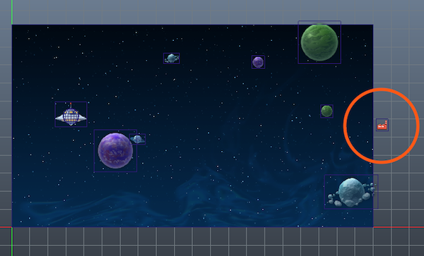
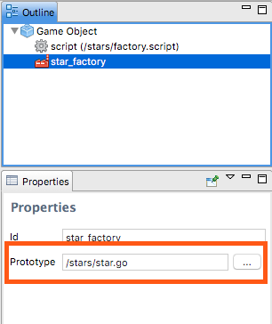
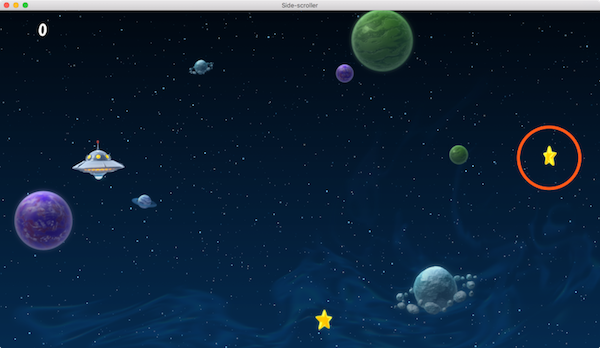
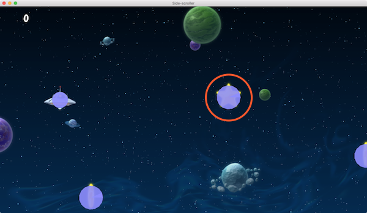
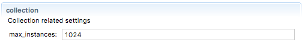

# 팩토리 컴포넌트

팩토리 컴포넌트는 오브젝트 풀에서 실행 중인 게임으로 게임 오브젝트를 동적으로 스폰하는 데 사용됩니다.

게임 오브젝트에 팩토리 컴포넌트를 추가할 때 *Prototype* 프로퍼티에서 팩토리가 새로 생성하는 모든 게임 오브젝트의 프로토타입(prototype)으로 사용할 게임 오브젝트 파일을 지정합니다. 다른 엔진에서는 이를 프리팹(prefabs) 또는 설계도(blueprints)라고도 부릅니다.





게임 오브젝트 생성을 트리거하려면 `factory.create()`를 호출합니다.

```lua
-- factory.script
local p = go.get_position()
p.y = vmath.lerp(math.random(), min_y, max_y)
local component = "#star_factory"
factory.create(component, p)
```



`factory.create()`는 5개의 파라미터를 받습니다.

`url`
: 새 게임 오브젝트를 스폰할 팩토리 컴포넌트의 id입니다.

`[position]`
: (선택 사항) 새 게임 오브젝트의 월드 위치입니다. `vector3`여야 합니다. 위치를 지정하지 않으면 `factory.create()`를 호출한 게임 오브젝트의 위치에 게임 오브젝트가 스폰됩니다.

`[rotation]`
: (선택 사항) 새 게임 오브젝트의 월드 회전입니다. `quat`여야 합니다.

`[properties]`
: (선택 사항) 게임 오브젝트를 초기화할 때 사용할 스크립트 프로퍼티 값이 담긴 Lua 테이블입니다. 스크립트 프로퍼티에 대한 자세한 내용은 [스크립트 프로퍼티 매뉴얼](/manuals/script-properties)을 참고하세요.

`[scale]`
: (선택 사항) 스폰된 게임 오브젝트의 스케일입니다. 스케일은 모든 축에 균일한 스케일을 지정하는 `number`(0보다 큼)로 표현할 수 있습니다. 각 컴포넌트가 해당 축의 스케일을 지정하는 `vector3`도 제공할 수 있습니다.

예:

```lua
-- factory.script
local p = go.get_position()
p.y = vmath.lerp(math.random(), min_y, max_y)
local component = "#star_factory"
-- 회전 없이 두 배 스케일로 스폰합니다.
-- star의 score를 10으로 설정합니다.
factory.create(component, p, nil, { score = 10 }, 2.0) -- <1>
```
1. star 게임 오브젝트의 "score" 프로퍼티를 설정합니다.

```lua
-- star.script
go.property("score", 1) -- <1>

local speed = -240

function update(self, dt)
    local p = go.get_position()
    p.x = p.x + speed * dt
    if p.x < -32 then
        go.delete()
    end
    go.set_position(p)
end

function on_message(self, message_id, message, sender)
    if message_id == hash("collision_response") then
        msg.post("main#gui", "add_score", {amount = self.score}) -- <2>
        go.delete()
    end
end
```
1. "score" 스크립트 프로퍼티가 기본값과 함께 정의됩니다.
2. "score" 스크립트 프로퍼티를 "self"에 저장된 값으로 참조합니다.



::: sidenote
Defold는 현재 충돌 모양의 비균일 스케일링(non uniform scaling)을 지원하지 않습니다. 예를 들어 `vmath.vector3(1.0, 2.0, 1.0)` 같은 비균일 스케일 값을 제공하면 스프라이트는 올바르게 스케일되지만 충돌 모양은 그렇지 않습니다.
:::


## 팩토리로 생성한 오브젝트의 주소 지정

Defold의 주소 지정(addressing) 메커니즘을 사용하면 실행 중인 게임의 모든 오브젝트와 컴포넌트에 액세스할 수 있습니다. [주소 지정 매뉴얼](/manuals/addressing/)에서는 이 시스템이 동작하는 방식을 자세히 설명합니다. 스폰된 게임 오브젝트와 그 컴포넌트에도 같은 주소 지정 메커니즘을 사용할 수 있습니다. 예를 들어 메세지를 보낼 때는 스폰된 오브젝트의 id만 사용해도 충분한 경우가 많습니다.

```lua
local function create_hunter(target_id)
    local id = factory.create("#hunterfactory")
    msg.post(id, "hunt", { target = target_id })
    return id
end
```

::: sidenote
특정 컴포넌트가 아니라 게임 오브젝트 자체에 메세지를 보내면 실제로는 모든 컴포넌트에 메세지가 전송됩니다. 보통은 문제가 되지 않지만, 오브젝트에 컴포넌트가 많다면 기억해 두는 것이 좋습니다.
:::

하지만 스폰된 게임 오브젝트의 특정 컴포넌트에 액세스해야 한다면 어떻게 해야 할까요? 예를 들어 충돌 오브젝트를 비활성화하거나 스프라이트 이미지를 변경해야 할 수 있습니다. 해결 방법은 게임 오브젝트 id와 컴포넌트 id로 URL을 구성하는 것입니다.

```lua
local function create_guard(unarmed)
    local id = factory.create("#guardfactory")
    if unarmed then
        local weapon_sprite_url = msg.url(nil, id, "weapon")
        msg.post(weapon_sprite_url, "disable")

        local body_sprite_url = msg.url(nil, id, "body")
        sprite.play_flipbook(body_sprite_url, hash("red_guard"))
    end
end
```


## 스폰된 오브젝트와 부모 오브젝트 추적

`factory.create()`를 호출하면 새 게임 오브젝트의 id가 반환되므로, 나중에 참조할 수 있도록 id를 저장할 수 있습니다. 일반적인 사용 사례 중 하나는 오브젝트를 스폰하고 그 id를 테이블에 추가해 두었다가, 예를 들어 레벨 레이아웃을 리셋할 때 나중에 모두 삭제하는 것입니다.

```lua
-- spawner.script
self.spawned_coins = {}

...

-- coin을 스폰하고 "coins" 테이블에 저장합니다.
local id = factory.create("#coinfactory", coin_position)
table.insert(self.spawned_coins, id)
```

그리고 나중에 다음과 같이 처리합니다.

```lua
-- spawner.script
-- 스폰된 coin을 모두 삭제합니다.
for _, coin_id in ipairs(self.spawned_coins) do
    go.delete(coin_id)
end

-- 또는 다른 방법으로
go.delete(self.spawned_coins)
```

스폰된 오브젝트가 자신을 스폰한 게임 오브젝트를 알아야 하는 경우도 흔합니다. 예를 들어 한 번에 하나만 스폰될 수 있는 자율 오브젝트가 있을 수 있습니다. 이 경우 스폰된 오브젝트는 삭제되거나 비활성화될 때 스포너에게 알려서 다른 오브젝트를 스폰할 수 있게 해야 합니다.

```lua
-- spawner.script
-- drone을 스폰하고 부모를 이 스크립트 컴포넌트의 url로 설정합니다.
self.spawned_drone = factory.create("#dronefactory", drone_position, nil, { parent = msg.url() })

...

function on_message(self, message_id, message, sender)
    if message_id == hash("drone_dead") then
        self.spawned_drone = nil
    end
end
```

그리고 스폰된 오브젝트의 로직은 다음과 같습니다.

```lua
-- drone.script
go.property("parent", msg.url())

...

function final(self)
    -- 죽었습니다.
    msg.post(self.parent, "drone_dead")
end
```

## 팩토리 리소스의 동적 로딩 {#dynamic-loading-of-factory-resources}

팩토리 프로퍼티에서 *Load Dynamically* 체크박스를 선택하면 엔진은 팩토리와 연결된 리소스 로딩을 뒤로 미룹니다.


체크박스를 선택하지 않으면 엔진은 팩토리 컴포넌트가 로드될 때 프로토타입 리소스를 로드하므로 즉시 스폰할 준비가 됩니다.

체크박스를 선택하면 두 가지 사용 방법이 있습니다.

동기 로딩
: 오브젝트를 스폰하려는 시점에 [`factory.create()`](/ref/factory/#factory.create)를 호출합니다. 그러면 리소스를 동기적으로 로드하므로 순간적인 끊김이 발생할 수 있으며, 그 다음 새 인스턴스를 스폰합니다.

  ```lua
  function init(self)
      -- 팩토리의 부모 컬렉션이 로드될 때는 팩토리 리소스가
      -- 로드되지 않습니다. load를 호출하지 않은 상태에서 create를
      -- 호출하면 리소스가 동기적으로 생성됩니다.
      self.go_id = factory.create("#factory")
  end

  function final(self)
      -- 게임 오브젝트를 삭제합니다. 리소스의 참조 수를 감소시킵니다.
      -- 이 경우 팩토리 컴포넌트가 참조를 보유하지 않으므로
      -- 리소스가 삭제됩니다.
      go.delete(self.go_id)

      -- 팩토리가 참조를 보유하지 않으므로 unload를 호출해도 아무 작업도 하지 않습니다.
      factory.unload("#factory")
  end
  ```

비동기 로딩
: [`factory.load()`](/ref/factory/#factory.load)를 호출해 명시적으로 리소스를 비동기 로드합니다. 리소스를 스폰할 준비가 되면 콜백을 받습니다.

  ```lua
  function load_complete(self, url, result)
      -- 로딩이 완료되어 리소스를 스폰할 준비가 되었습니다.
      self.go_id = factory.create(url)
  end

  function init(self)
      -- 팩토리의 부모 컬렉션이 로드될 때는 팩토리 리소스가
      -- 로드되지 않습니다. load를 호출하면 리소스가 로드됩니다.
      factory.load("#factory", load_complete)
  end

  function final(self)
      -- 게임 오브젝트를 삭제합니다. 리소스의 참조 수를 감소시킵니다.
      -- 이 경우 팩토리 컴포넌트가 여전히 참조를 보유하므로
      -- 리소스는 삭제되지 않습니다.
      go.delete(self.go_id)

      -- unload를 호출하면 팩토리 컴포넌트가 보유한 리소스의 참조 수가 감소하고,
      -- 그 결과 리소스가 제거됩니다.
      factory.unload("#factory")
  end
  ```

## 동적 프로토타입

팩토리 프로퍼티에서 *Dynamic Prototype* 체크박스를 선택하면 팩토리가 생성할 수 있는 *Prototype*을 변경할 수 있습니다.


*Dynamic Prototype* 옵션을 선택하면 팩토리 컴포넌트는 `factory.set_prototype()` 함수를 사용해 프로토타입을 변경할 수 있습니다. 예:

```lua
factory.unload("#factory") -- 이전 리소스를 언로드합니다.
factory.set_prototype("#factory", "/main/levels/enemyA.goc")
local enemy_id = factory.create("#factory")
```

::: important
*Dynamic Prototype* 옵션을 설정하면 컬렉션 컴포넌트 수를 최적화할 수 없으며, 소유 컬렉션은 *game.project* 파일의 기본 컴포넌트 수를 사용합니다.
:::


## 인스턴스 제한

*Collection related settings*의 프로젝트 설정 *max_instances*는 월드(시작 시 로드되는 main.collection 또는 컬렉션 프록시를 통해 로드되는 모든 월드)에 존재할 수 있는 게임 오브젝트 인스턴스의 총수를 제한합니다. 월드에 존재하는 모든 게임 오브젝트는 이 제한에 포함되며, 에디터에서 직접 배치했는지 스크립트를 통해 런타임에 스폰했는지는 상관없습니다.



*max_instances*를 1024로 설정하고 main 컬렉션에 수동으로 배치한 게임 오브젝트가 24개 있다면, 게임 오브젝트를 1000개 더 스폰할 수 있습니다. 게임 오브젝트를 삭제하는 즉시 다른 인스턴스를 다시 스폰할 수 있습니다.

## 게임 오브젝트 풀링

스폰된 게임 오브젝트를 풀에 저장했다가 재사용하는 것이 좋아 보일 수 있습니다. 하지만 엔진이 내부적으로 이미 오브젝트 풀링을 수행하므로 추가 오버헤드는 성능을 늦출 뿐입니다. 게임 오브젝트를 삭제하고 새로 스폰하는 편이 더 빠르고 깔끔합니다.
